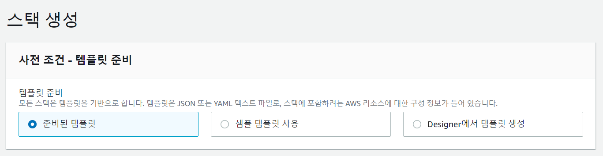
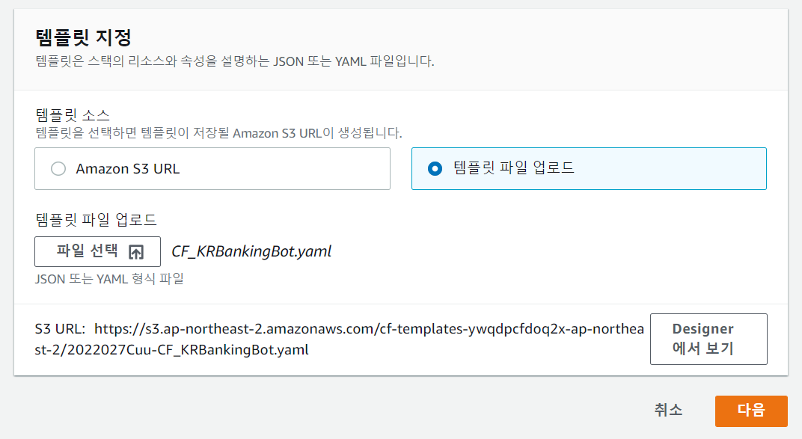
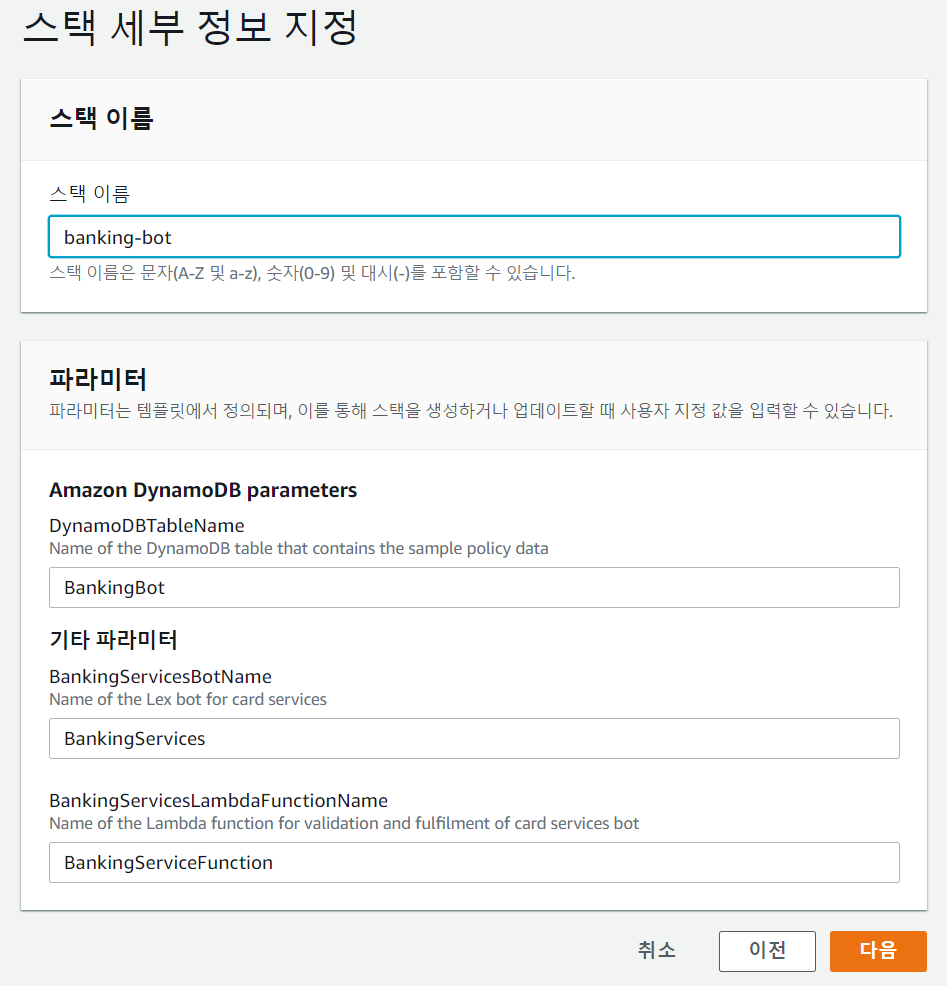
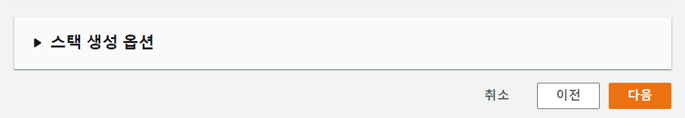
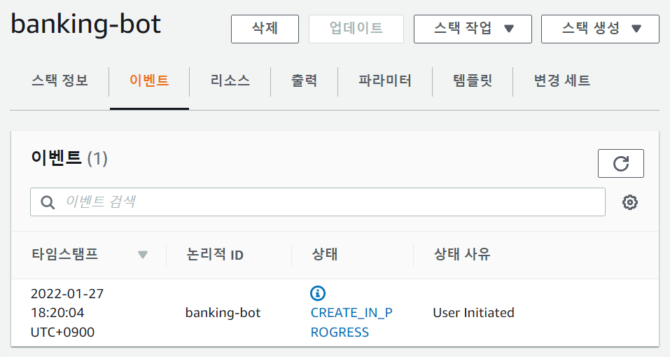
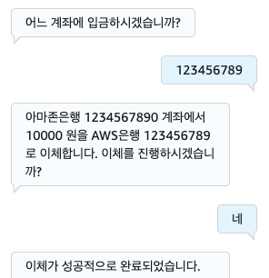
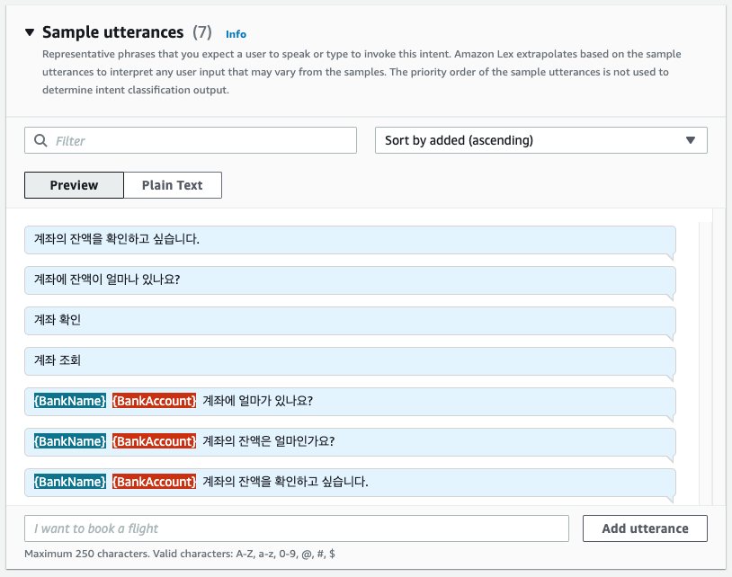
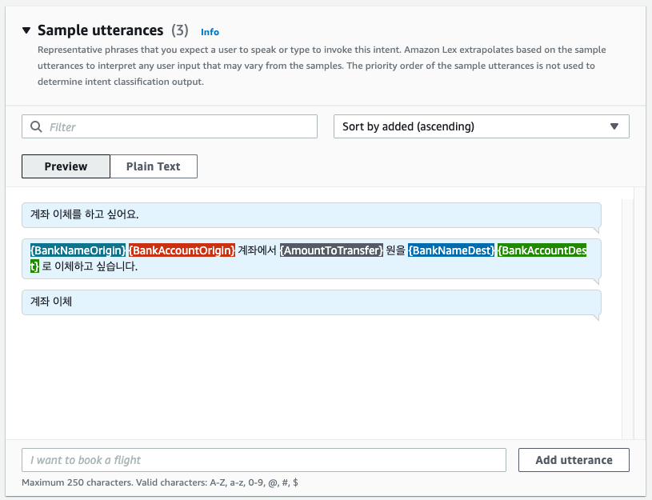
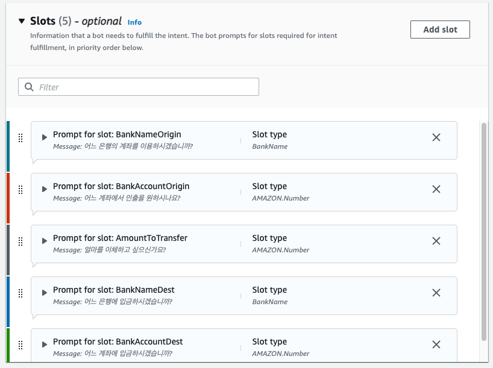
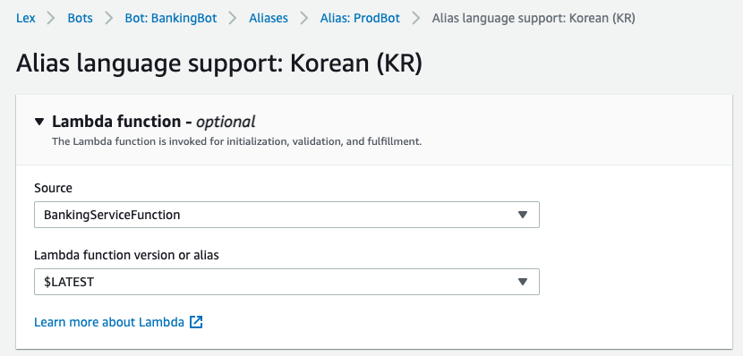

# 뱅킹 봇 만들기

## 개요

앞서서는 Amazon Lex 콘솔만을 사용하여 간단한 [HelloWorldBot](HelloWorldBot.md)을 만들어 보았습니다. 이번에는 AWS Lambda를 이용해 인터넷 뱅킹을 수행하는 좀 더 복잡한 작업을 하는 봇을 구현해 보겠습니다. 이번 섹션에서는 AWS CloudFormation을 사용하여 봇의 생성 및 구성을 자동화 하는 방법도 함께 살펴 보겠습니다.

## CloudFormation

AWS CloudFormation은 AWS 리소스 모음을 손쉽게 생성할 수 있는 클라우드 배포 자동화 서비스 입니다. CloudFormation을 사용하면 다음과 같은 이점이 있습니다.

- 인프라 관리 간소화: 리소스를 개별적으로 관리하는 대신 템플릿을 사용하여 필요할때마다 전체 스택을 한번에 생성, 업데이트, 삭제 할 수 있습니다.

- 신속한 인프라 복제: 애플리케이션의 가용성을 확보하기 위해서나 다양한 테스트를 위해서 환경을 복제하거나 여러 리전에 배포해야 하는경우 템플릿을 이용해 일관되고 반복적으로 리소스를 생성할 수 있습니다.

- 손쉬운 인프라 변경 사항 제어 및 추적: CloudFormation 템플릿을 AWS CodeCommit과 같은 버전관리 시스템을 이용해 관리할 수 있습니다. 이를 통해 과거로부터의 이력관리나 코드리뷰와 같은 작업들을 인프라에 대해서도 수행할 수 있습니다. 만약 업데이트한 새로운 버전의 환경에 문제가 있을경우 이전버전으로 되돌리는 작업도 간단하게 수행할 수 있습니다.

- 인프라 문서화 작업 간소화: CloudFormation 템플릿은 그 자체로 인프라 구성을 설명하고 있기 때문에 별도의 문서화 작업을 수행할 필요 없이 CloudFormation Designer와 같은 도구를 이용해 빠르고 정확하게 인프라의 구성을 살펴볼 수 있습니다. 또한 기존에 [만들어져 있는 리소스로부터 템플릿을 생성](https://docs.aws.amazon.com/AWSCloudFormation/latest/UserGuide/resource-import-new-stack.html)하거나 환경에 수동 변경등과 같은 작업으로 인해 [템플릿과 실제 환경에 차이가 생겼을 경우 이를 감지](https://docs.aws.amazon.com/ko_kr/AWSCloudFormation/latest/UserGuide/detect-drift-stack.html)하는 것과 같은 편리한 기능들을 제공합니다.

## CloudFormation 템플릿

이 워크샵에서는 미리 만들어진 CloudFormation 템플릿을 사용합니다. 아래 링크를 클릭하여 템플릿을 다운로드 하세요.

<a href="https://ee-assets-prod-us-east-1.s3.us-east-1.amazonaws.com/modules/c16b965656fb4eba8676d6f0ac759300/v1/Lex-KR_BankingBot/CF-YAML-File/CF_KRBankingBot.yaml" download>CloudFormation 템플릿 다운로드</a>

다운로드한 파일을 손에 익은 텍스트 에디터로 열어서 내용을 살펴봅시다.

> CloudFormation 템플릿 구조에 익숙하지 않으신 분은 먼저 [사용 설명서](https://docs.aws.amazon.com/ko_kr/AWSCloudFormation/latest/UserGuide/template-anatomy.html)를 읽어 보시기 바랍니다.

이 템플릿은 Lambda 함수를 포함하여 Banking Bot을 프로비저닝하기 위한 내용이 기술되어 있습니다. 프로비저닝 되는 리소스들에 대한 설명은 뒤에 이어지는 **Banking Bot 아키텍처 설명** 섹션에서 하겠습니다.

## 배포

이제 AWS CloudFormation 콘솔을 사용해서 Banking Bot을 배포해 봅시다.

- 먼저 AWS 콘솔 검색 표시줄에 CloudFormation을 입력하여 AWS Cloudformation 서비스로 이동합시다.


### 스택 생성

- 우측 상단의 **스택 생성** 버튼을 누른 후 **새 리소스 사용(표준)** 을 클릭합니다.


- 스택 생성 화면의 **사전 조건 - 템플릿 준비** 섹션에서 **템플릿 준비**는 준비된 템플릿을 선택합니다.



### 템플릿 지정

- **템플릿 지정** 섹션에서 **템플릿 소스**는 **템플릿 파일 업로드**를 선택한 후에 **템플릿 파일 업로드**에서는 **파일 선택** 버튼을 클릭합니다. 파일 선택 다이얼로그 창이 뜨면 위에서 다운로드한 `CF_KRBankingBot.yaml`파일을 선택한 다음 **다음** 버튼을 클릭합니다.



### 스택 세부 정보 지정

- **스택 세부 정보 지정** 화면에서 **스택 이름**에 `banking-bot`을 입력하고 나머지는 초기 설정 그대로 둔 채로 **다음** 버튼을 누릅니다.

### 스택 옵션 구성



- **스택 옵션 구성**화면에서는 맨 아래로 내려가 **다음** 버튼을 클릭합니다.



### 스택 생성

- banking-bot 검토 화면에서 맨 아래로 이동한 다음 **AWS CloudFormation에서 IAM 리소스를 생성할 수 있음을 승인합니다.** 앞의 체크 박스를 체크한 후에 **스택 생성** 버튼을 클릭합니다.


- banking-bot 스택이 생성되고 있는 모습을 확인할 수 있습니다. 이 작업은 수 분이 소요됩니다. **상태**가 CREATE_COMPLETE



## Banking Bot 구조 설명

Banking Bot은 잔고 확인(CheckBalance)과 송금(Transfer) 두 개의 의도(Intent)와 각각의 의도의 내용을 처리하기 위한 두 개의 람다 함수로 구성되어 있습니다.

전체적인 처리의 흐름은 아래 다이어그램을 참고해 주세요.


### 대화 예제

Banking Bot의 전체 대화 흐름 예제 입니다.




### 의도: CheckBalance

### 대화 흐름

앞에서도 언급했듯이 한 개의 챗봇은 여러개의 의도(Intents)를 가질 수 있습니다. 이 Banking Bot은 잔고확인을 위한 CheckBalance와 송금을 위한 Transfer 두 개의 의도를 가지고 있습니다.

### 의도 : CheckBalance

- 대화 흐름



- 슬롯: CheckBalance에서는 다음 두 개의 값을 슬롯으로 입력받습니다.


### 의도 : Transfer

- 대화 흐름



- 슬롯
  - Transfer에서는 다음 다섯개의 값을 슬롯으로 입력받습니다.



### Slot Type : BankName

은행명을 입력받기위한 슬롯 타입입니다. 여러 슬롯에서 공통으로 사용됩니다.


# 참고사항

## Alias와 Version Mapping

- Alias는 버전과 연결되고, 버전내 각각의 언어 별로 Lambda를 Mapping 할수 있습니다.

- 하나의 언어의 의도가 validation/initialization과 Fulfillment에 사용되는 Lambda를 하나로 공유하며,

  Version 1가 다르게 의도 별로 Lambda를 매핑하지 않습니다.



## 의도 내에서 Lambda 호출 시점 설정

의도 내에서 Lambda가 호출되는 시점은

- Initialization (의도가 파악되고 첫번째 슬롯을 위한 질문하기 전)와 Validation(각 슬롯에 대한 응답이 왔을때)
- Fulfillment : 모든슬롯이 채워졌을때

이며, 아래와 같이 각 의도에서 Checkbox를 활성화 해야지만 트리거 됩니다.

- Initialization와 Validation


- Fulfillment


# Lambda 구조 설명

- Function Name : BankingServiceFunction

- Language : Node.js 14.x

## 코드 설명

- **Index.js :** Lambda의 진입점(index.handler)으로, Lex에서 해석된 Intent 정보에 따라 각각 아래의 파일로 분기합니다.

  - CheckBalance : check_balance.js
  - Transfer : transfer.js
  - FallbackIntent (Built-in Intent) : fallback.js

- **banking_service.js :** DynamoDB에 저장된 계정 정보를 바탕으로 하는 간단한 은행 서비스 API 예제입니다.

  - 기존에 존재하는 Application의 API 연결을 보여주는 예시입니다.

  - DynamoDB는 다음과 같이 구성되어있습니다

    - Table : BankingBot

    

- **utils.js :** Lex로 부터 전달받는 이벤트 데이터를 편리하게 사용하기 위해 만든 Utility입니다.

  주요 함수는 다음과 같습니다.

  - Dialog.elicit_slot : 특정 슬롯을 채우기 위한 질문을 합니다. 주로 슬롯에 유효하지 않아 다시 명시적으로 채우도록 할때 사용합니다. 이때 Lex에서 설정한 각 슬롯의 Prompt가 아니라 동적으로 생성이 가능합니다.

  - Dialog.delegate : Lex에서 정의한 원래 다음 행동을 합니다. 검증이 성공했거나 검증하고자 하는 항목이 아닐때 주로 호출합니다.

  - Dialog.get_slot, Dialog.set_slot : Lex에서 채운 슬롯을 검증하고, 필요한 경우 수정하기 위해 사용됩니다.

## 세션 전환 구현

이 예제에서는 계좌 조회 후 이체를 진행하면 직전에 조회한 계좌번호를 이체에 사용할지 여부를 확인하고 활용하도록 구현되어있습니다.

session_attributes를 활용하여, 이전 의도의 결과를 전달하고, 이를 다른 의도에서 활용할 수 있습니다.

- **CheckBalance** 의도의 Fulfillment 시점에 Session Attribute로 저장

```js
  ...
  else if (intent['state'] == 'ReadyForFulfillment')
  {
    var balance = await BankingService.check_balance (userId, bankName,  bankAccount );
    var messages = balance?[{'contentType': 'PlainText', 'content': `${bankName} ${bankAccount} 계좌의 출금 가능금액은 ${balance}원입니다.`}]:[{'contentType': 'PlainText', 'content': `계좌가 존재하지 않습니다.`}]
    var session_attributes={bankName,bankAccount};

    return Dialog.close(
      active_contexts, session_attributes, intent, messages
    );
  }
```

- Transfer 초기화 시점에 이 정보를 확인하여 슬롯을 미리 채움

```js
const savedBankName = Dialog.get_session_attribute(intent_request, 'bankName');
const savedBankAccount = Dialog.get_session_attribute(intent_request, 'bankAccount');
...
if (savedBankName && savedBankAccount)
{
    prompt = `계좌이체를 진행합니다. 출금계좌로 ${savedBankName} ${savedBankAccount}를 이용하시겠습니까?`;
    console.log(prompt);
    session_attributes.bankName =null;
    session_attributes.bankAccount =null;
    Dialog.set_slot('BankNameOrigin',savedBankName, intent);
    Dialog.set_slot('BankAccountOrigin',savedBankAccount, intent);

    return Dialog.confirm_intent(
                active_contexts, session_attributes, intent,
                [{'contentType': 'SSML','content': prompt}],null );

}
```

## 봇 테스트

- 이제 **테스트** 버튼을 눌러 봇의 테스트를 진행해 봅시다.

축하합니다! 이것으로 여러분은 뱅킹 봇 을 성공적으로 만들었습니다.
