# BlazingText 한국어 학습 Hands-on-Lab; AWS Lambda와 AWS API Gateway로 영화 리뷰 긍정/부정 분류 웹서비스 생성하기

이 모듈에서는 SageMaker Endpoint로 호스팅된 모델을 인터넷을 통해 활용할 수 있는 방법에 대해 실습해 보겠습니다.

본 Hands-on에서는 SageMaker에서 생성한 Endpoint inference service를 웹 상에서 호출하기 위해 AWS Lambda와 AWS API Gateway를 아래 Figure와 같은 데모를 만들어 보겠습니다.


**<center>Figure. SageMaker App Data Flow.</center>**    


## Lambda 함수 개발
----

방금 생성한 SageMaker의 Inference service를 호출하는 Lambda 함수를 개발해 보겠습니다.

### Step 1. Lambda 함수 생성하기 

1. AWS 콘솔에서 Lambda를 선택 (<https://console.aws.amazon.com/lambda>)

1. `Create function` 선택 (Figure 1 참조)

    
    **<center>Figure 1. Lambda 함수 생성 화면.</center>**    

1. Lambda 생성화면에서 Figure 1.과 같이 Lambda 함수 이름과 Runtime
    (Python 3.7) 그리고 Role을 생성합니다. (Figure 2 참조)

    * Function name : `myTextClassificationInference` 입력

    * Runtime: `Python 3.7` 지정

    

    **<center>Figure 2. Lambda 함수 생성 화면.</center>**
        
    * Permissions 항목의 Choose or create an execution role 클릭 후 `Create a new role from AWS policy templates`을 선택합니다. <br>
     Role name: `myTextClassificationLambdaRole-hol` 으로 입력 후,
     `Create function` 버튼을 클릭합니다. (Figure 3 참조)

    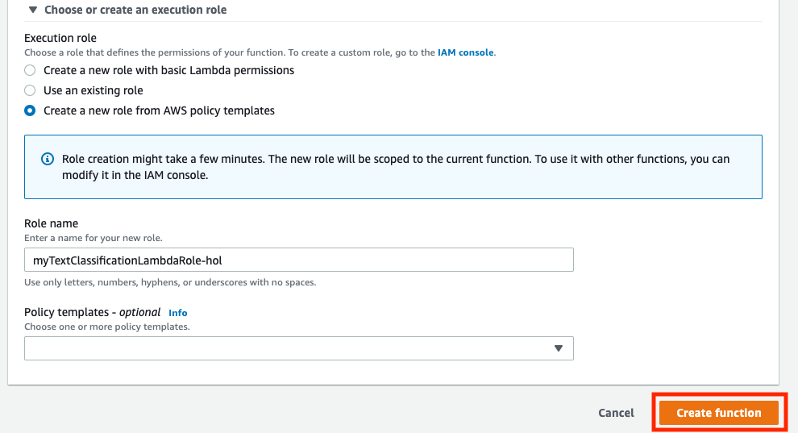

    **<center>Figure 3. AWS Lambda 접근 허락 화면.</center>**

### Step 2. Lambda 함수에 Role을 추가하기 

방금 생성한 Lambda 함수에 새롭게 추가된 Role에 SageMaker와 API Gateway를
사용할 수 있는 정책(Policy)을 추가해 보겠습니다.

1. AWS 콘솔에서 IAM 서비스를 선택하세요.

1. 왼편의 메뉴에서 `Roles`를 클릭하세요.

1. 방금 생성하신 Lambda에 사용되는 Role을 선택하세요. (Figure 4 참조)

    

   **<center>Figure 4. Lambda 함수 선택.</center>**

1. `Add inline policy`를 선택하세요 (Figure 5 참조).

    

    **<center>Figure 5. IAM Role에 정책을 추가하는 화면.</center>**

1. 다음 화면의 검색창에 `SageMaker` 를 입력 하세요 (Figure 6 참조).

    

   **<center>Figure 6. AmazonSageMakerFullAccess 정책 추가 화면.</center>**

1. Access level at Actions에 있는 모든 `DescribeEndpoint` and
    `InvokeEndpoint` 를 선택하세요 (Figure 7 참조).

    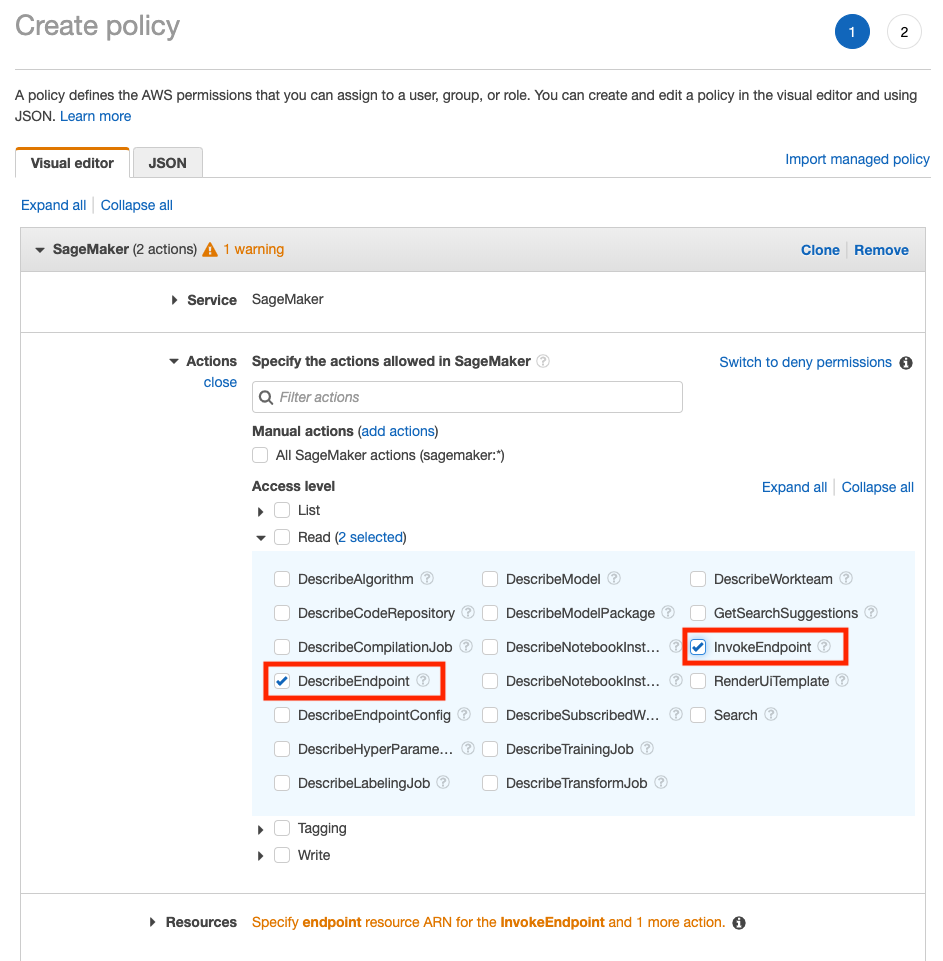
    
    **<center>Figure 7. Select DescribeEndpoint and InvokeEndpoint in the Access level.</center>**

1. 화면 하단의 Resources에 있는 노란색의 `You chose actions that
    require the endpoint-config resource type` 문장을 선택하신 후
    Figure 22 화면과 같이 Resources 섹션에 있는 `Any` 를 선택합니다.
    이후 화면 하단에 있는 `Review policy`를 선택하세요 (Figure 8 참조).

    
    
    **<center>Figure 8. Select endpoint resource type.</center>**

1. `Review policy` 다이얼로그에서 새로운 policy 이름을 입력하신 후 화면
    하단의 Create policy버튼을 선택하세요 (Figure 9 참조).

    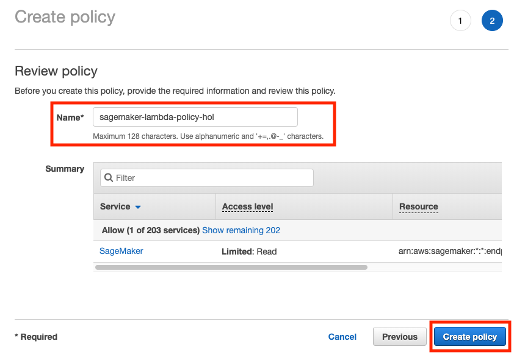

    **<center>Figure 9. Create policy screen.</center>**

1. 최종 추가된 Policy가 Figure 10과 동일한지 확인해 주세요.

    

    **<center>Figure 10. 최종 Role의 정책들 화면.</center>**

### Step 3. Lambda 함수 코딩하기

다시 AWS 콘솔의 Lambda 서비스 화면으로 이동하신 후 윗 단계에서 생성하신
Lambda를 선택합니다. Figure 11 과 같이 추가된 Role의 Policy들을 확인하실
수 있습니다.

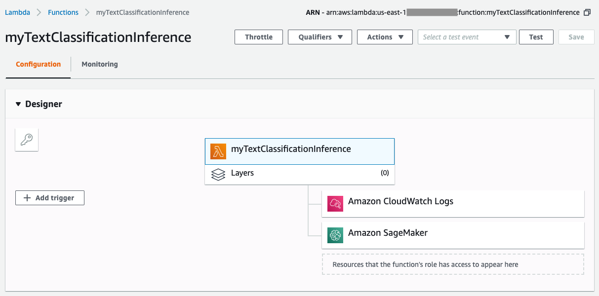

**<center>Figure 11. Lambda 선택 화면.</center>**

현 페이지에서 마우스를 스크롤해서 하단으로 이동하면 Figure 12와 같이
Lambda의 내장 코드들을 직접 수정할 수 있는 인터페이스가 제공이 됩니다.


**<center>Figure 12. Lamba 코드 개발 화면.</center>**

AWS Lambda는 AWS 콘솔 상에서 바로 코딩할 수 있게 Cloud9 에디터가 내장되어
있습니다. 아래의 순서에 따라 Lambda 함수를 만들어 보겠습니다.

1. 다음 페이지의 Python 샘플 코드를 `Copy` 후 `Paste` 로 Lambda의 online
    editor에 입력합니다. Python 코드를 복사 및 붙여넣기를 할때는 원
    코드의 indent를 그대로 지키는 것이 중요합니다.

    ```python
    import boto3
    import json
        
    def lambda_handler(event, context):
        
        sagemaker = boto3.client('runtime.sagemaker')
        endpoint_name = '[YOUR-SAGEMAKER-ENDPOINT]'
        
        sentences = event["sentences"]

        payload = {"instances" : []}
        for sent in sentences:
            payload["instances"].append(sent["query"])
        
        response = sagemaker.invoke_endpoint(EndpointName=endpoint_name, 
                                        ContentType='application/json', 
                                        Body=json.dumps(payload))
        
        response = response["Body"].read().decode("utf-8")
        response = json.loads(response)
        
        return response
    ```


1. 붙여넣기 하신 소스코드 상의 `endpoint_name` 을 본 실습 동안 생성한 Seq2Seq endpoint 서버 주소로 변경하십시요 (Figure 13 참조).

    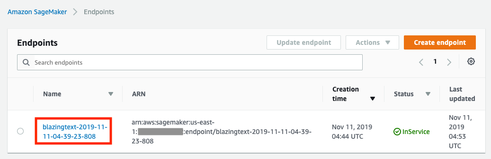
    **<center>Figure 13. SageMaker EndPoint 이름 확인 방법.</center>**

**Labmda Python sample Code**

1.  Endpoint용으로 선택하신 서버의 Instance Type, 입력 데이터 및 네트워크 상황에 따라 추론(Inference)에 몇 초 이상이 소요될 수도 있습니다. 이
    시간동안 Lambda 함수 호출이 Timeout 되는 것을 방지하기 위해 Figure
    14와 같이 Lambda의 Timeout 시간을 10초로 늘입니다.

1.  상단의 `Save` 버튼을 눌러 저장합니다.

    

    **<center>Figure 14. Lambda 함수 Timeout 값 조정.</center>**

새로 만든 Lambda 함수의 동작을 바로 확인할 수 있습니다.

1. Figure 15와 같이 `Configure test events`를 선택합니다.

    

    **<center>Figure 15. Lambda 테스트 데이터 구성 화면.</center>**<

1. Event name을 입력합니다 (예: myTestEvent)

1. 하단의 테스트 이벤트 입력화면에서 Figure 16과 같이 아래의 샘플 영어
    문장을 입력합니다.

    ```    
    {
        "sentences": [
            {
                "query": "재미있게 봤습니다. 제 점수는요 100점 만점에 80점 드리겠습니다."
            },
            {
                "query": "스토리가 너무 단방향이라 재미가 없고 성우 더빙도 그닥이네요..."
            }
        ]
    }
    ```
    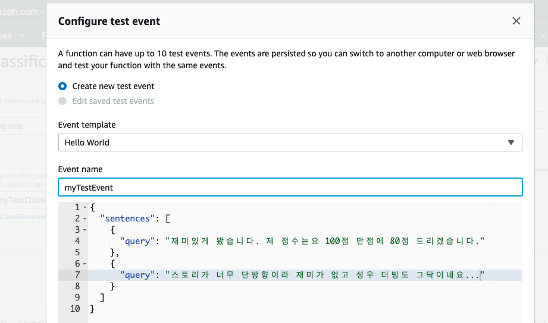

    **<center>Figure 16. Test 이벤트 생성.</center>**

    이 때 주의하실 점은, JSON 형식의 `sentences`와 `query`는 미리 약속된 key
    값이므로 변경을 하시면 안됩니다.

1. Create 버튼을 선택합니다.

1. 입력이 완료 된 후 상단의 `Test` 버튼을 클릭하시면 Figure 17과 같은
    화면이 보이면 정상적으로 작동하는 것을 확인하실 수 있습니다. 하단의
    Cloud9에서도 결과를 확인하실 수 있습니다.

    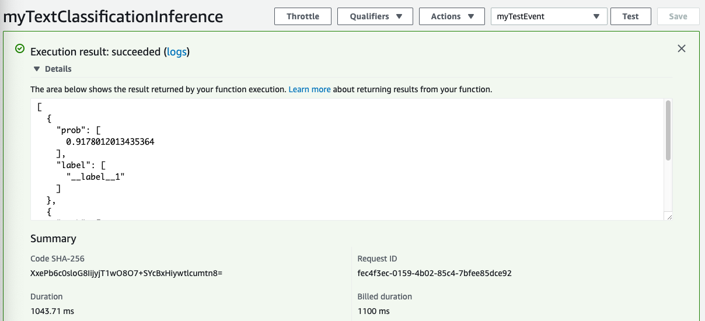

    **<center>Figure 17. Lambda 함수 테스트 결과 화면.</center>**

<br>

## AWS API Gateway S3 Static Web Server룰 이용한 웹서비스 연결하기
----
이제 API Gateway로 웹서비스를 생성해 보겠습니다.

### Step 1. API Gateway 생성 및 Lambda 함수 연결하기

1. Amazon API Gateway 콘솔에 접속합니다.
    (<https://console.aws.amazon.com/apigateway/> )

1.  "Create API" -> "New API"를 선택합니다.

1.  셋팅에서 새로운 API name를 입력합니다. (ex.
    `SageMakerTextClassificationLambdaGateway`)후 `Endpoint Type`을 `Regional` 로 선택합니다 (Figure 18 참조).

    

    **<center>Figure 18. Amazon API Gateway 생성 화면.</center>**

1.  바뀐 화면에서 `Actions` -> `Create Method`를 선택합니다.

1.  하단의 콤보 박스에서 `POST`를 선택하고 체크(`V`) 버튼을 클릭해서 적용합니다. (Figure 19 참조)

    

    **<center>Figure 19. POST method 추가 화면.</center>**

1.  오른편의 셋업에서 아래와 같이 입력 진행합니다 (Figure 20 참조).

    * Integration type: `Lambda function`
    * Lambda region: Labmda를 생성하신 Region (`us-east-1`) 입력
    * Lambda function: Lambda 함수 이름 입력
    * `Save` 선택

    

    **<center>Figure 20. Lambda 함수를 호출하기 위한 Gateway POST method 셋팅 화면.</center>**

### Step 2. API Gateway Test 및 Deployment
API Gateway가 생성이 된 이후에는 Figure 21와 같이 Test를 진행하여 제대로
Lambda를 호출하는지 확인하실 수 있습니다.

1.  `Test`를 선택하셔서 API Gateway의 testing interface를 확인합니다.

1.  Request body에 Lambda 호출에 사용되었던 아래의 예제 데이터를
    입력하신 후 `Test`를 선택합니다.

    

    **<center>Figure 21. API Gateway Test 화면.</center>**

    테스트 결과가 Figure 22 같이 보이면 정상적으로 동작하는 것으로
    확인하실 수 있습니다.

    

    **<center>Figure 22. API Gateway 테스트 결과.</center>**

1.  `Enable CORS: S3 Static Web Server`를 이용해서 API Gateway를 호출하면
    origin이 다르기 때문에 반드시
    [CORS](https://en.wikipedia.org/wiki/Cross-origin_resource_sharing)
    (Cross-Origin Resource Sharing)를 Enable 해야만 외부 싸이트에서 이
    REST 서비스를 이용할 수 있게 됩니다.

    * `Actions` -> `Enable CORS` 선택 (Figure 23 참조)

    

    **<center>Figure 23. API Gateway API Enable CORS 화면.</center>**

    *  `Enable CORS and replace existing CORS headers` 선택

    *  `Yes, replace existing values` 선택 (Figure 24 참조)

    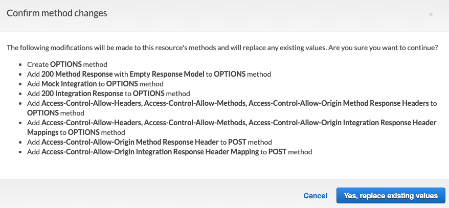

    **<center>Figure 24. CORS replace existing values 화면.</center>**

1.  정상적으로 동작이 되면 `Actions`->`Deploy API` 선택 (Figure 25 참조)
    합니다. API Deploy를 반드시 하셔야 실제 외부 (Public Internet)에서
    호출을 할 수 있습니다.

1. 현재 생성한 Gateway의 stage 이름을 부여합니다. 예제에서는 "prod"라는
    약어로 stage 이름을 정의하였습니다. 개발 단계에 따라 `test` 나
    `prod` 등 의미 있는 키워드를 부여하시면 됩니다.

    

    **<center>Figure 25. API deploy 화면.</center>**

1. Deploy가 된 이후 Stage Editor에서 invoke URL을 (Figure 26 참조)
    메모장에 따로 기록해 두시고 `SDK Generation` -> `Platform
    (JavaScript)` -> `Generate SDK` 를 선택합니다. 이 JavaScript 라이브러리는 API
    Gateway 서비스에 대해
    [CORS](https://en.wikipedia.org/wiki/Cross-origin_resource_sharing)
    (Cross-Origin Resource Sharing)을 지원해주는 기능을 포함하고
    있습니다.

    

    **<center>Figure 26. API Gateway 접속 SDK 다운로드 화면.</center>**

1. (Optional) 웹페이지 생성 및 static web server 설정 이전에 API Gateway가 정상적으로 동작하는지 확인해 봅니다. 참고로, 본 핸즈온랩에서는 [Postman](https://www.getpostman.com/)을 사용하는 예시를 보여줍니다.
    <details>
    <summary><strong>펼치기</strong></summary><p>

    - POST 선택 후, 앞에서 복사한 invoke URL을 붙여넣기 합니다.
    - Body-raw 라디오버튼 클릭 후, 본문에 테스트 json을 입력한 다음, Send 버튼을 클릭합니다.
        ```    
        {
            "sentences": [
                {
                    "query": "재미있게 봤습니다. 제 점수는요 100점 만점에 80점 드리겠습니다."
                },
                {
                    "query": "스토리가 너무 단방향이라 재미가 없고 성우 더빙도 그닥이네요..."
                }
            ]
        }
        ```       
    - 에러 발생 없이 하단에 Figure 26-1와 같은 결과가 나오는지 확인합니다. 
        

    **<center>Figure 26-1. Postman 테스트 화면.</center>**

    </p></details>


### Step 3. S3 Static Web Server 생성하기

이제 S3를 이용해서 static web server를 설정하기 위한 파일들을
준비하겠습니다.

* 상기 API Gateway SDK 생성으로 다운 받은 압축 화일을 임의의 디렉토리에 푸세요 (unzip).

*  S3 Static 웹 서버에 사용될 `index.html` 과 `error.html` 파일을 다음의 S3
버켓에서 다운로드 하여 상기 단계에서 사용된 디렉토리에 동일하게
저장합니다:
<https://raw.githubusercontent.com/daekeun-ml/blazingtext-workshop-korean/master/data/text-classification-html.zip>

*  최종 파일들이 Figure 27과 같이 구성되어 있으면 됩니다. 이 파일들은
다음 단계에서 만들 S3 버킷에 업로드 되게 됩니다.

    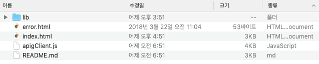

    **<center>Figure 27. 웹서버 구성 화일 리스트 화면.</center>**

*  (Optional) S3 버킷 업로드 없이 로컬 컴퓨터에서 테스트가 가능합니다. 테스트를 위해 `index.html` 웹페이지를 열어봅니다 (반드시 Chrome이나 Firefox를 사용하세요). 입력 가이드에 따라 영화 리뷰 문장을 입력하고 엔터 키를 눌러서 결과를 확인해 보세요 (Figure 27-1 참조).
    

    **<center>Figure 27-1. 로컬 컴퓨터 API Gateway 테스트.</center>**

이제 S3에서 static web server를 설정하겠습니다.

1.  Amazon S3 콘솔 접속 (<https://s3.console.aws.amazon.com> )

1.  `Create bucket` 선택

1.  새로운 버킷 이름 입력 (ex. `text-classification-webservice-[YOUR-NAME]-hol`) -> `Next` -> `Next` 선택

1.  Block all public access 버튼을 해제 후, Next 버튼을 클릭합니다 (Figure 28 참조).

    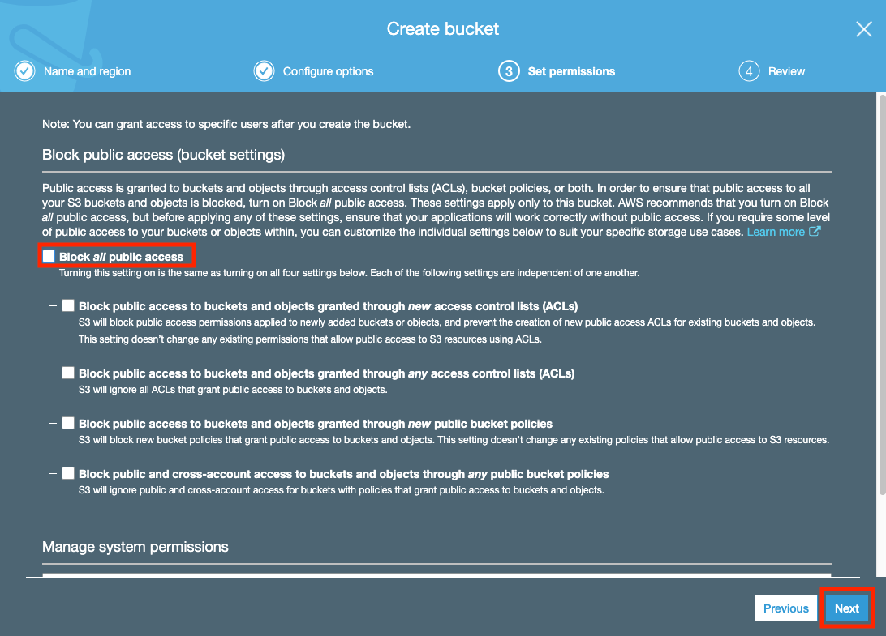
    **<center>Figure 28. S3 Public 접속 허용 화면.</center>**

1.  `Create bucket` 을 클릭해 S3 bucket을 생성합니다.

1.  생성된 S3 bucket 선택

1.  `Properties` -> `Static website hosting` -> `Use this bucket to
    host a website` 선택 후 `Index document : index.html`, `Error document
    : error.html` 를 입력합니다.

1.  `Save` 선택 (Figure 29 참조)

1.  이 단계 까지 마치신 후 상단의 URL 형식의 S3 Endpoint URL 주소를 기록해
    둡니다. 이 URL 주소를 이용해서 S3 웹 서버에 접속하게 됩니다.

    

    **<center>Figure 29. S3 static 웹서버 설정 화면.</center>**

1. `Overview` 탭 선택 -> `Upload` 선택 (Figure 30 참조)

    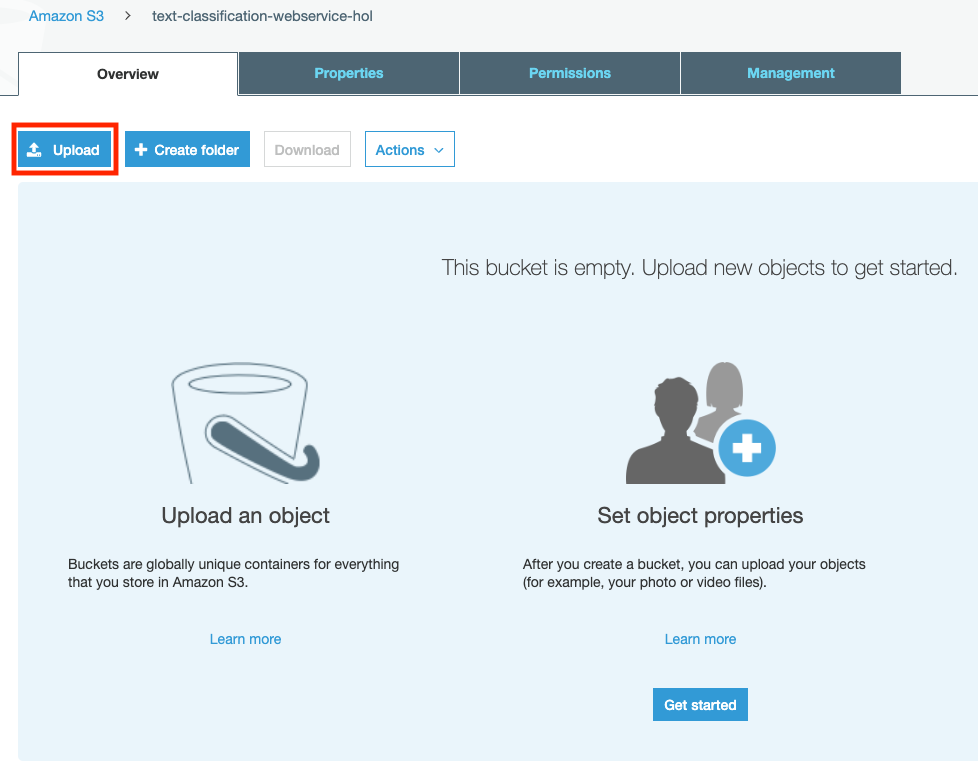

    **<center>Figure 30. Overview 탭에서 Upload 선택.</center>**

1. 생성된 S3 Bucket에 API Gateway SDK에서 생성한 파일들과 `index.html`, `error.html`을 Drag & Drop후, `Upload` 버튼을 클릭합니다.

    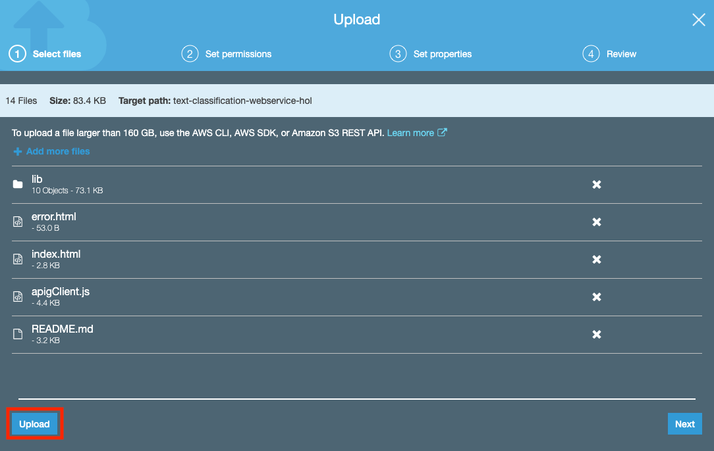

    **<center>Figure 31. 파일 업로드.</center>**    

1. 업로드한 모든 파일(디렉토리 포함)들을 선택 후, `Actions` - `Make public`을 클릭하여 S3 파일들에(object)에 public 권한을 부여합니다.

    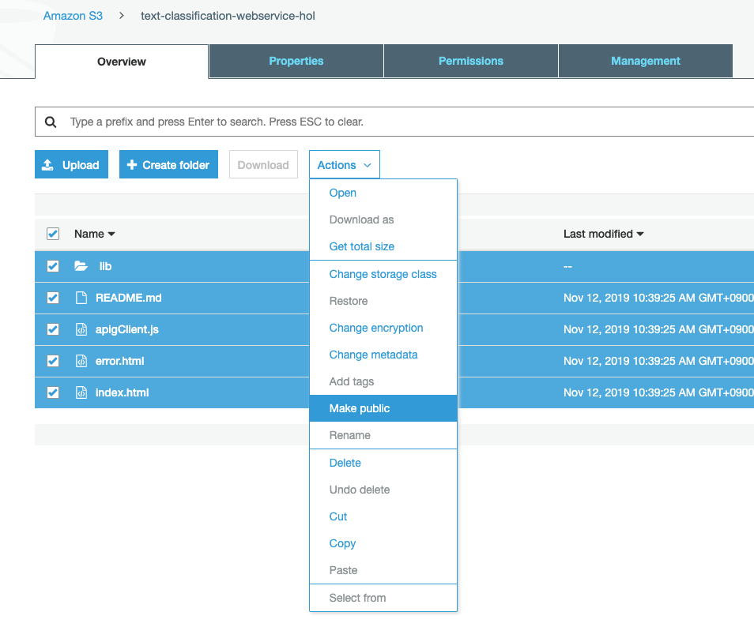

    **<center>Figure 32. S3 파일들에 대한 Make public 설정 화면.</center>**

### Step 4. 최종 서비스 테스트하기

1.  웹브라우저를 구동하시고(Chrome이나 Firefox 권장) S3 Endpoint URL에 접속합니다 

1.  입력 가이드에 따라 영화 리뷰 문장을 입력하고 엔터(Enter) 키를 누릅니다.

1.  몇 초 정도 기다리시면 하단에 추론(inference) 결과가 보여집니다 (Figure 33 참조).

    

    **<center>Figure 33. 웹기반 Text classification 서비스 테스트 화면.</center>**

이상으로 본 모듈의 실습 과정을 마무리 하셨습니다. 워크샵 이후 발생되는
비용을 방지하기 위해 서비스 종료 가이드를 통해 사용하신 리소스들을 모두 종료/삭제 해주십시오.    
