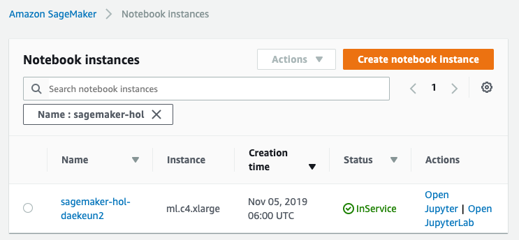
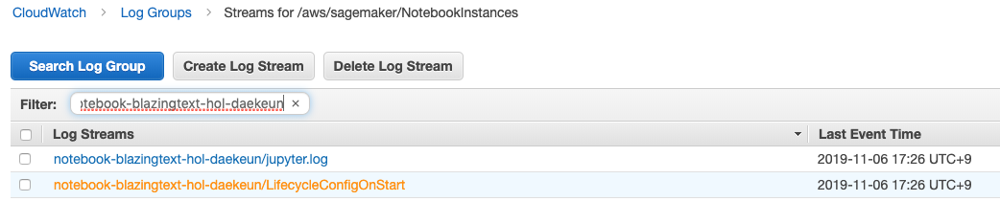
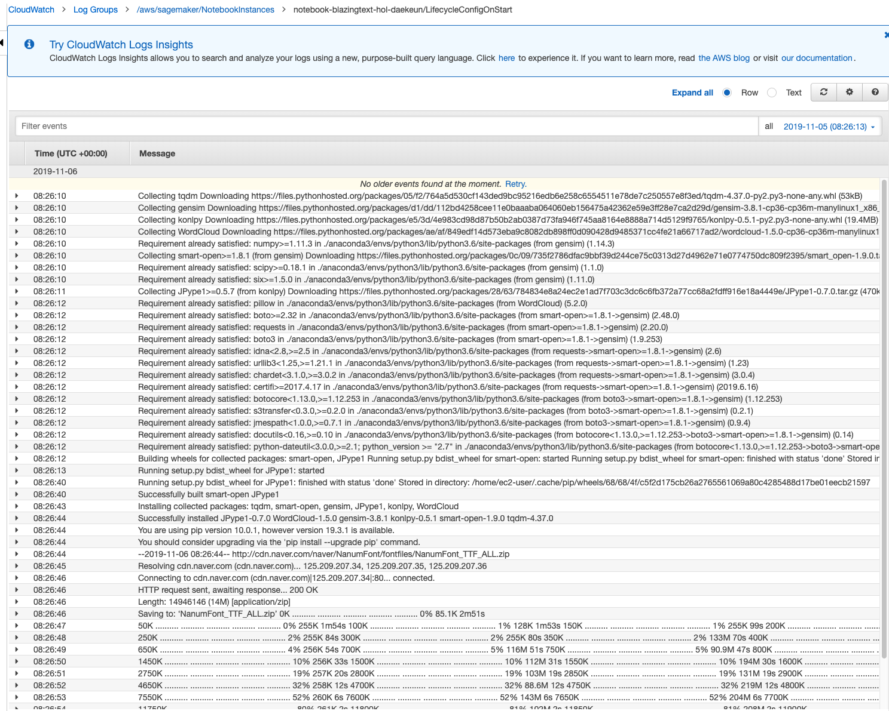
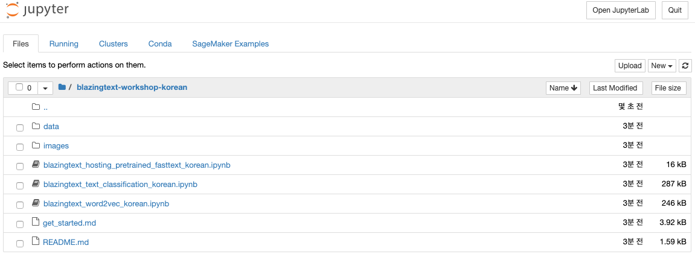

# 사전 준비

## S3 Bucket 생성하기 

SageMaker는 S3를 데이터와 모델 저장소로 사용합니다. 여기서는 해당 목적으로 S3 Bucket을 생성합니다. 오늘 실습에서는 `N. Virginia (us-east-1)` 리전을 사용합니다. 
**[주의] 단, 앞 세션 시간에 Seoul 리전에서 실습하고 계셨다면, `Seoul (ap-northeast-2)` 리전을 사용해 주세요.**

1. [AWS 관리 콘솔](https://console.aws.amazon.com/)에 Sign in 합니다.  
    만약 AWS 측에서 Event Engine을 사용하여 임시 아이디를 생성한 경우 제공받으신 URL을 여시고 team hash code를 입력하시면 됩니다.

1. AWS Services 리스트에서 S3 로 이동합니다.
1. `"+ Create Bucket"` 버튼을 선택합니다.
1. 아래 내용 설정 후 화면 왼쪽 아래 Create 클릭합니다.

* Bucket name: blazingtext-hol-{userid}  [반드시 고유한 값 설정] 
* Region : US East (N. Virginia) (단, 앞 세션 시간에 Asia Pacific (Seoul)을 사용하고 있었다면 Asia Pacific (Seoul)으로 지정) 

## Lifecycle Configuration 생성
1. AWS 관리 콘솔에서 오른쪽 상단에서 Region선택 후 AWS Services 리스트에서 Amazon SageMaker 서비스를 선택합니다.
    

1. Lifecycle Configuration를 생성하기 위해 왼쪽 패널 메뉴 중 `Lifecycle configurations` 을 선택 후, 오른쪽 상단의 `Create configuration` 버튼을 클릭 합니다.

    

1. Name 항목에 `lifecycle-blazingtext-hol`를 입력하고 [Lifecycle Configuration Script](https://raw.githubusercontent.com/daekeun-ml/aws-ai-ml-workshop-kr/master/contribution/daekeun-ml/blazingtext-korean-workshop/data/lifecycle-config.txt) 를 클릭하여 다운로드합니다. 
다운로드가 완료되었으면 `lifecycle-config.txt`의 내용을 복사하여 Script 항목에 붙여넣기한 후, 오른쪽 하단의 `Create configuration` 버튼을 클릭 합니다. 
    

## Notebook instance 생성

1. 새로운 Notebook instance를 생성하기 위해 왼쪽 패널 메뉴 중 Notebook Instances 선택 후 오른쪽 상단의 `Create notebook instance` 버튼을 클릭 합니다.

    

1. Notebook instance 이름으로 `notebook-blazingtext-hol-[YOUR-NAME]` 으로 넣은 뒤 `ml.c4.xlarge` 인스턴스 타입을 선택 합니다. 그런 다음, Additional configuration을 클릭하여 Lifecycle configuration - optional 항목에 `lifecycle-blzaingtext-hol`을 입력 합니다.
(만약 Event Engine을 신청하지 않았다면 ml.m2.medium)

    

1. IAM role은 `Create a new role` 을 선택하고, 생성된 팝업 창에서는 `S3 buckets you specify – optional` 밑에 `Specific S3 Bucket` 을 선택 합니다. 그리고 텍스트 필드에 위에서 만든 S3 bucket 이름(예: sagemaker-xxxxx)을 선택 합니다. 이후 `Create role` 을 클릭합니다.

    

1. 다시 Create Notebook instance 페이지로 돌아온 뒤 `Create notebook instance` 를 클릭합니다.

## Notebook Instance 접근하기

1. 서버 상태가 `InService` 로 바뀔 때까지 기다립니다. 보통 5분정도의 시간이 소요 됩니다. 

        

1. (Optional) 노트북 인스턴스가 생성되는 동안 Lifecycle configuration이 정상적으로 동작하는지 CloudWatch로 확인해 봅니다. 이 과정은 필수가 아니기에 선택적으로 수행하시면 됩니다.
    

    
<strong>펼치기</strong>

    1. 현재 생성중인 노트북 인스턴스를 클릭한 후, Lifecycle configuration 항목의 `View logs`를 클릭합니다.

            

    1. `LifecycleConfigOnStart`로 끝나는 Log Stream을 클릭합니다.

            

    1. CloudWatch 로그를 확인합니다.

            

    

1. `Open Jupyter`를 클릭하면 방금 생성한 notebook instance의 Jupyter 홈페이지로 이동하게 됩니다.

        

1. `blazingtext-workshop-korean` 폴더로 이동해서 아래 그림처럼 파일들이 정상적으로 복사되었는지 확인합니다.

        

수고하셨습니다. 모듈 1을 완료하였습니다.