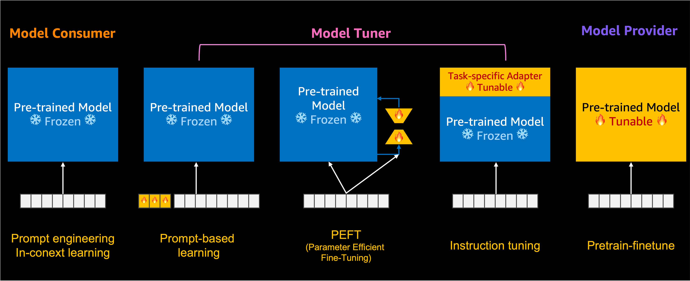

# Generative AI Workshop

AWS Generative AI 및 Foundation 모델에 대한 한글 워크샵 & 예제 모음입니다.

---

## 디렉토리 구조

본 리포지토리의 예제 코드는 아래 2가지 카테고리로 나뉘어 있습니다. 

- jumpstart : SageMaker JumpStart와 관련된 예제로서 Model Tuner 또는 Model Consumer로서의 역할자로서 활용할 수 있는 예제를 제공합니다.
    - text-to-image
        - [[model_consumer]stable_diffusion_inference.ipynb](./jumpstart/text_to_image/[model_consumer]stable_diffusion_inference.ipynb)
        - [[model_tuner]stable_diffusion_finetune.ipynb](./jumpstart/text_to_image/[model_tuner]stable_diffusion_finetune.ipynb)
    - text-to-text : 
        - [[model_consumer]flan_t5_xl_in_context_learning_ml_p3_2xl.ipynb](./jumpstart/text_to_text/[model_consumer]flan_t5_xl_in_context_learning_ml_p3_2xl.ipynb) : Flan-t5-xl 을 이용한 n-shot learning 수행
        - [[model_consumer]kullm_polyglot_12_8b_in_context_learning_ml_g5_12xl.ipynb](./jumpstart/text_to_text/[model_consumer]kullm_polyglot_12_8b_in_context_learning_ml_g5_12xl.ipynb) : 한국어 모델 polyglot-12.8B 모델을 이용한 n-shot learning 수행 (text-generation-inference 이용)
        - [[model_consumer]flan_t5_xl_cot_prompting.ipynb](./jumpstart/text_to_text/[model_consumer]flan_t5_xl_cot_prompting.ipynb) : Flan-t5-xl 을 이용한 COT 수행
        - [[model_tuner]flan_t5_xl_instruction_ml_p3_16xl.ipynb](./jumpstart/text_to_text/[model_tuner]flan_t5_xl_instruction_ml_p3_16xl.ipynb) : flan-t5-xl을 이용한 instruction fine-tuning 수행
        - [[model_tuner]flan_t5_xl_with_LoRA_ml_g5_2xl.ipynb](./jumpstart/text_to_text/[model_tuner]flan_t5_xl_with_LoRA_ml_g5_2xl.ipynb) : flan-t5-xl을 이용한 PEFT fine-tuning 수행
- bedrock : WIP

---

## Generative AI 관련 Blog

- [Train a Large Language Model on a single Amazon SageMaker GPU with Hugging Face and LoRA](https://aws.amazon.com/blogs/machine-learning/train-a-large-language-model-on-a-single-amazon-sagemaker-gpu-with-hugging-face-and-lora/)
- [Announcing the launch of new Hugging Face LLM Inference containers on Amazon SageMaker](https://aws.amazon.com/blogs/machine-learning/announcing-the-launch-of-new-hugging-face-llm-inference-containers-on-amazon-sagemaker/)
- [High-quality human feedback for your generative AI applications from Amazon SageMaker Ground Truth Plus](https://aws.amazon.com/blogs/machine-learning/high-quality-human-feedback-for-your-generative-ai-applications-from-amazon-sagemaker-ground-truth-plus/)
- [Deploy generative AI models from Amazon SageMaker JumpStart using the AWS CDK](https://aws.amazon.com/blogs/machine-learning/deploy-generative-ai-models-from-amazon-sagemaker-jumpstart-using-the-aws-cdk/)
- [Instruction fine-tuning for FLAN T5 XL with Amazon SageMaker Jumpstart](https://aws.amazon.com/blogs/machine-learning/instruction-fine-tuning-for-flan-t5-xl-with-amazon-sagemaker-jumpstart/)
- [Introducing an image-to-speech Generative AI application using Amazon SageMaker and Hugging Face](https://aws.amazon.com/blogs/machine-learning/introducing-an-image-to-speech-generative-ai-application-using-amazon-sagemaker-and-hugging-face/)

---

## Generative AI 관련 workshop 및 예제 원본
- [Generative AI on Amazon SageMaker - Workshop](https://catalog.us-east-1.prod.workshops.aws/workshops/972fd252-36e5-4eed-8608-743e84957f8e/en-US)
- [Generative AI Large Language Model Workshop for Financial Services](https://catalog.us-east-1.prod.workshops.aws/workshops/c8e0f5d8-0658-4345-8b1d-cc637cbdd671/en-US)
- [introduction_to_amazon_algorithms/jumpstart_inpainting](https://github.com/aws/amazon-sagemaker-examples/tree/main/introduction_to_amazon_algorithms/jumpstart_inpainting)
- [introduction_to_amazon_algorithms/jumpstart-foundation-models](https://github.com/aws/amazon-sagemaker-examples/tree/main/introduction_to_amazon_algorithms/jumpstart-foundation-models)
- [introduction_to_amazon_algorithms/jumpstart_alexatm20b](https://github.com/aws/amazon-sagemaker-examples/tree/main/introduction_to_amazon_algorithms/jumpstart_alexatm20b)
- [introduction_to_amazon_algorithms/jumpstart_text_embedding](https://github.com/aws/amazon-sagemaker-examples/tree/main/introduction_to_amazon_algorithms/jumpstart_text_embedding)
- [inference/generativeai/llm-workshop](https://github.com/aws/amazon-sagemaker-examples/tree/main/inference/generativeai/llm-workshop)

위 자료들 중 일부를 이용하여 아래와 같은 playground를 구성할 수 있습니다.

---