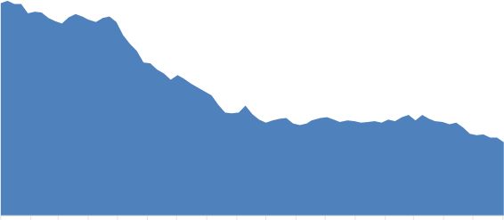
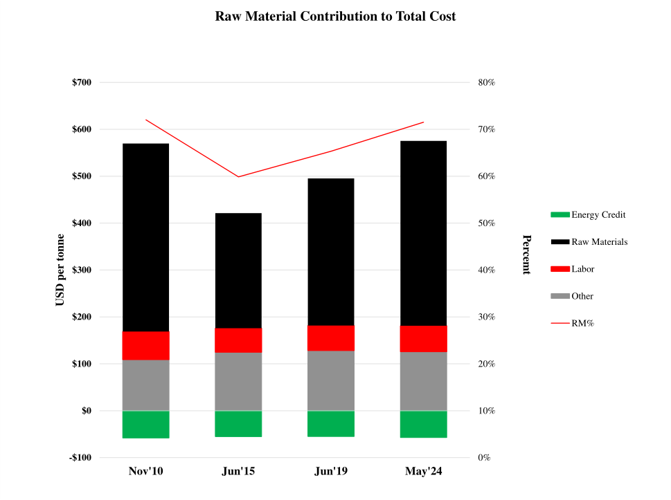
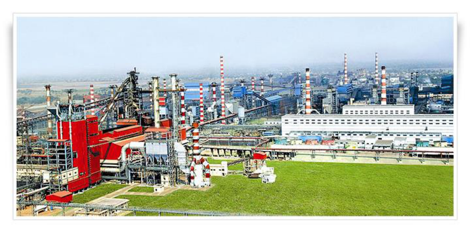

### WORLD
## STEEL
#### DYNAMICS

**Inside Track #209**

**Global steel awakens from “Ambien**

**Dream” to face reality**

**Prozac is not enough, will Chinese**

**Traditional Medicine work?**

**Early Warning System**

**Chinese steel exporting armada returns as an incredible threat to its offshore competitors**

Since 2018, briefly interrupted during 2020 by the onset of the Covid pandemic, the global steel
industry has been living out a “dream” scenario of high steel prices and unprecedented
profitability. Over the past twelve months, and the last nine months especially, it has become
apparent that the “dream-like” conditions were in fact a temporary artificially-fueled aberration.
The global steel industry’s structure is once again in the midst of profound change as Chinese
domestic steel demand has entered a significant downward phase, this time seemingly for good.

Just as it became evident to the Chinese mills in early-2015 that they were probably facing years
of significant oversupply, they launched a steel product export offensive that lasted more than
two years. At that time, unwittingly, they drove their hot-rolled band export price to a level
well below the marginal cost of the median-cost producer. In fact, by December 2015 the
Chinese export price at about $265 per tonne, FOB the port of export, was about $70 per tonne,
or 15%, below the median mill’s marginal cost when taking into account the cost of delivering
the steel to the port of export. Reflecting their aggressive posture, exports in the latter months
of 2015 rose to a 120 million tonne annual rate versus only about 50-60 million tonnes a few
years earlier.

The Chinese “steel exporting armada,” as it was then called by WSD, became an unprecedented
threat to steel mills in virtually all countries outside of China – that is, except those with only
minor steel production and steel-using entities that benefit greatly from the low Chinese prices.
In response to this threat, a number of the non-Chinese steel mills dramatically cut their prices
to compete directly with the Chinese in order to prevent a further loss of market share. These
price cuts led to a condition of “financial calamity” for many steel mills in China and elsewhere.
Consequently, because they were being destroyed by the Chinese mills (they claimed the
Chinese mills were “not playing by the rules”), many steel mills rushed to their governments to
set in place import constraints on offshore steel entering their home markets. Based on an array
of trade actions in key importing markets the world over, plus eventual actions to “rationalize
capacity” in China, the industry found its footing by 2017-2018 as the world export price
rebounded to an average figure of $558 per tonne from $376 per tonne during 2015-16.

Following a year of relative stability in 2019, in mid-2020 China introduced a series of policies
aimed at reducing activity in the property sector and, in effect, signaled the end of its steel
demand growth era by announcing formal production “limits.” The subsequent reckoning, from
the viewpoint of the non-Chinese steel mills, was merely postponed by the Covid and

**_June 14, 2024_** **_Philipp G. Englin (201) 503-0908_**

**_Adam P. Green (201) 503-0916_**

**_J h_** **_M Vill (201) 503 0911_**

-----

WORLDSTEELDYNAMICS

Russia/Ukraine war-induced dislocations in global supply chains that led to an unprecedented
boom in global steel prices from late-2020 through mid-2023.

As of late-2023 and to date in 2024, a new reality has beset the steel marketplace characterized
by a toxic combination of a) ultra-high Chinese steel growth exports as domestic demand
declines and steel output remains elevated; b) poor steel demand in the world ex-China/India
amidst rising inflation and reduced Fixed Asset Investment spending; and c) correspondingly
lower global steel prices and razor-thin margins, especially for export-oriented mills. As a
result, many in the steel industry are feeling depressed about the months and possibly years that
lie ahead. In fact, from the viewpoint of profitability, the conditions in the past twelve months
have actually been as bad, if not worse than 2015-2016. Consider:

**HRB World Export Price versus Iron Ore/Coal Index and Spread**

**$1,300** **$650**

**$1,200** **$600**

**$1,100** **$550**

**$1,000** **$500**

**$900** **$450**

**$800** **$400**

**$700** **$350**

**$ per tonne**

**$600** **$300** **$ per tonne**

**$500** **$250**

**$400** **$200**

**$300** **$150**

**$200** **$100**

**$100** **$50**

**$0** **$0**

**Jan-10** **Jun-10** **Nov-10** **Apr-11** **Sep-11** **Feb-12** **Jul-12** **Dec-12** **May-13** **Oct-13** **Mar-14** **Aug-14** **Jan-15** **Jun-15** **Nov-15** **Apr-16** **Sep-16** **Feb-17** **Jul-17** **Dec-17** **May-18** **Oct-18** **Mar-19** **Aug-19** **Jan-20** **Jun-20** **Nov-20** **Apr-21** **Sep-21** **Feb-22** **Jul-22** **Dec-22** **May-23** **Oct-23** **Mar-24**

**Spread: W. Export HRB v. Iron Ore/Coal (RHS)** **Iron Ore/Coal Index**

**HRB World Export Price** **W.E. HRB Spread Avg. (pre-Covid RHS)**

_Source: WSD Estimates, Steelbenchmarker, SBB_

-  During 2015-16, the World Export price of HRB averaged about $376 per tonne, with

the prices of iron ore (62% Fe Del’d to China), coking coal (FOB Australia) and steel
scrap (80/20HM Del’d to Turkey) averaging $56, $115 and $236 per tonne, respectively.
On this basis, the “Spread” between the price and key steelmaker’s raw materials
averaged $146 per tonne.

-  During 2018-19, the World Export price of HRB averaged about $539 per tonne, with

the prices of iron ore (62% Fe Del’d to China), coking coal (FOB Australia) and steel
scrap (80/20HM Del’d to Turkey) averaging $81, $192 and $311 per tonne, respectively.
On this basis, the “Spread” between the price and key steelmaker’s raw materials
averaged $201 per tonne.

-----

WORLDSTEELDYNAMICS

-  During 2021-22, the World Export price of HRB averaged about $847 per tonne, with

the prices of iron ore (62% Fe Del’d to China), coking coal (FOB Australia) and steel
scrap (80/20HM Del’d to Turkey) averaging $139, $293 and $448 per tonne,
respectively. On this basis, the “Spread” between the price and key steelmaker’s raw
materials averaged $324 per tonne.

-  From mid-2023 to June-2024, the World Export price of HRB averaged about $571 per

tonne, with the prices of iron ore (62% Fe Del’d to China), coking coal (FOB Australia)
and steel scrap (80/20HM Del’d to Turkey) averaging $118, $288 and $385 per tonne,
respectively. On this basis, the “Spread” between the price and key steelmaker’s raw
materials averaged $87 per tonne.

About the only good news from this perspective, despite nearly 40% lower profits on average,
on the World Export market the past twelve months compared to 2015-16, is that the “Age of
Protectionism” that was borne out of the prior calamity appears to be working reasonably well
in favor of mills with home markets where pricing is well above international levels. Looking
ahead, there is no doubt something has to give as the current price/cost condition is likely
unsustainable for those heavily reliant on export sales – in other words, a new wave of trade
protectionism is likely to kick in, with early evidence of this already observed in Brazil, Turkey,
the EU and other regions.

Adding fuel to the fire, an all-out “trade war” appears to be brewing between China and the
major Advanced World economies over EVs (electric vehicles) and other high-end
manufactured goods exports from China that threaten to undermine manufacturing and other
sectors in the USA, EU, Japan, S. Korea and elsewhere. Within the span of a few weeks, both
the USA and the EU announced massive import tariffs on Chinese EVs amounting to 100% and
10-48%, respectively.

While antidepressants, such as Prozac, may help one cope with these newfound realities, any
improvement in the medium and long-term pricing and profitability situation on the
international steel market will require some form of “traditional Chinese medicine” that will
need to include one or more of these “drugs”: a) further supply-side restructuring; b) some form
of new export controls; and c) additional stimulus to prop up demand, at least in the short term.

On this basis, WSD sees two diverging scenarios for the World Export price through the end of
2024 and for 2025, predicated on several key factors:

**Scenario I: “China Administers [Some] Medicine” – Odds 55%**

The hot-rolled band export price, FOB the port of export, at about $540 per tonne (~$520-530
per tonne for the Chinese steel mills and $530-550 per tonne for a number of the larger
international steelmakers) in early-June bottoms out in the $500-520 per tonne range by earlyJuly. Assuming the international price of iron ore comes down to about $95 per tonne or lower
by then (from ~$105 at present), and the price of coking coal, FOB Australian ports, remains
near current levels of about $260 per tonne, this HRB price would barely avoid “Death Spiral”
territory, reflecting a “Bad Times” environment instead. The latter largely describes the
situation at present from the viewpoint of the median-cost producers outside of China, whose

-----

WORLDSTEELDYNAMICS

production cost of hot-rolled band at about $605 per tonne as of May, including overhead and
about $25 per tonne in freight expense to deliver and load the product at a nearby port, is about
$55 per tonne below the prevailing price.
7

Having bottomed-out by mid-summer, the HRB price in this scenario rallies to about $570-590
per tonne by September to early-October assuming the following:

-  Chinese authorities announce concrete and specific measures with respect to crude steel

production limits for 2024 sometime in July/August or sooner. To date, the late-May
announcement of the “Action Plan for Energy Conservation and Carbon Reduction for
_2024-2025" by the State Council and the subsequent “Special Action Plan for Energy_
_Conservation and Carbon Reduction in the Steel Industry” that followed on June 7 by_
the NDRC have provided little in the way of specific clarity for production reduction
targets and implementation thereof.

The most common interpretation of these recent announcements among WSD contacts
in China has been an expectation that crude steel output this year will perhaps be
_“limited to about 20 million tonnes below 2023 levels, with further specific guidance to_
_come.”_

-  Chinese steel exports, up about 25% through the first five months of 2024 to an

annualized rate of 107 million tonnes (with the May figure at 113 million), gradually
decline to about 90-95 million tonnes by late-summer. In part, this reduction may be
facilitated by an increasing "vigilance" on the part of Chinese authorities to reduce VAT
payment avoidance that has been prevalent for some time among the smaller/privatelyheld Chinese mills. WSD contacts report that, in the past two weeks, they have

-----

WORLDSTEELDYNAMICS

observed a substantial reduction in offerings of this type of material for export, albeit the
“jury is still out” as to whether this condition will take hold on a more permanent basis.

➢ Another potential driver for a reduction in Chinese steel exports would be a

combination of concrete and effective output cuts and some modest improvement
in Chinese domestic steel demand come the “busy” fall construction season
during September-October.

WSD estimates Chinese apparent steel consumption is down about 8.5% through
the first five months of 2024 compared to the same period last year; a production
“cap” at 20 million tonnes below 2023 levels combined with net exports of about
99 million tonnes would result in a ~2.0% ASC decline for the year, implying a
significant sequential improvement in steel demand going forward. (Note: more
_on the Chinese steel demand outlook in the China section of this report)_

**China Monthly Steel Exports**

**_(Annualized Rate)_**

**140**

**120**

**100**

**80**

**60**

**Million Tonnes**

**40**

**20**

**0**

**Jan-01Sep-01May-02Jan-03Sep-03May-04Jan-05Sep-05May-06Jan-07Sep-07May-08Jan-09Sep-09May-10Jan-11Sep-11May-12Jan-13Sep-13May-14Jan-15Sep-15May-16Jan-17Sep-17May-18Jan-19Sep-19May-20Jan-21Sep-21May-22Jan-23Sep-23May-24**

_Source: IISB, SteelHome, WSD estimates_

-  Steel demand in the World Ex-China improves during the second half of this year,

especially as the Indian economy “Takes off” now that the election is over and a new
government has been formed with incumbent Prime Minister Modi still at the helm:

➢ WSD estimates that apparent steel consumption ex-China was up about 5.1% or

48 million tonnes annualized during the first calendar quarter of this year
compared to the same period last year, with the growth rate slowing to about
2.1% or 29 million tonnes annualized during the second quarter on an estimated
basis.

-----

WORLDSTEELDYNAMICS

Excluding India, the growth figures are 3.9% and 0.3%, respectively, during the
first two calendar quarters. Slowing demand in the world ex-China/India during
the second quarter – one that traditionally represents “peak” industrial,
construction and other steel-intensive activity – is especially troubling and likely
reflects the impact of persistent inflation on a number of economies, among other
factors.

➢ Apparent steel demand in India is estimated to have risen 12.9% and 13.9%

during the first two calendar quarters of this year, respectively, despite the
broader perception that economic and steel-related activity was slowed,
especially during April-May as the election took place over a 6-week period and
government spending was greatly reduced (as is mandatory by election law in the
country).

While some view the recent election results, whereby Mr. Modi’s party (the BJP)
lost its majority in the parliament, as a sign of potential weakening of India’s
economic outlook (on the belief that a coalition government, rather than an
outright majority, will slow reforms and reduce funding for infrastructure – the
key upside driver for steel demand the past few years), WSD is of the opinion
that this will not have a significant impact on steel demand during the second
half of this year and next, with steel demand likely rising another 8-10% or more.

-  The prices of key steelmakers’ raw materials increase or remain flat to slightly down in

some cases, on balance adding to the cost pressure for the typical export-oriented
producer of hot-rolled band thereby pushing-up the cost “floor” and supporting higher
prices:

➢ The price of premium coking coal, FOB Australian ports, rises to about $275 per

tonne or more by late-summer from about $260 per tonne at present (having
already risen about $17 per tonne since the end of May) as Indian producers seek
to add to their inventories and steel output in the world ex-China as a whole
remains on a modest upward y/y growth trajectory.

▪ A key reason why coking coal prices may be relatively “capped” on the upside

this year compared to prior years (when prices surged to $350 per tonne or
higher) is the significant increase in ultra-low-priced exports of coke from China
and Indonesia, with the latter set to rise by as much as 5 million tonnes this year
and perhaps another 5 million tonnes in 2025 based on expected capacity
additions. China’s coke exports are up about 25% to 3.3 million tonnes year to
date through April, including an 84% increase in exports to Japan, a 167%
increase to Vietnam and a 27% increase to Malaysia, among others. This surge
in coke exports comes at the expense of coke production (and corresponding
coking coal demand) in a number of countries ex-China according to WSD
contacts.

-----

WORLDSTEELDYNAMICS

**China Coke Export by Country in April 2024**

_(metric tonnes)_

**Accumulative** **Accumulative**

**Quantity for** **Quantity for** **Y/Y** **Y/Y**
**Country** **Volume in Jan-** **Volume in Jan-**

**Apr 2024** **Apr 2023** **%Change** **%Change**

**Apr 2024** **Apr 2023**

Total **929,002** **719,105** **29.19%** **3,334,666** **2,684,254** **24.23%**

Indonesia 180,941 91,897 96.90% 918,039 783,981 17.10%

India 116,978 164,701 -28.98% 407,767 420,585 -3.05%

Malaysia 56,525 137,171 -58.79% 400,685 315,301 27.08%

Japan 79,890 63,604 25.61% 322,110 175,525 83.51%

Brazil 110,112 0 -  197,980 175,525 - 

Vietnam 53,509 18,967 182.12% 164,464 61,703 166.54%

Mexico 49,600 124,353 -60.11% 157,271 124,353 26.47%

Belgium 88,000 0 -  143,000 54,789 - 

Australia 72,770 16,829 332.41% 111,448 59,393 87.65%

Oman 47,800 112 42578.57% 74,145 8,996 724.20%

_Source: SteelHome, WSD Estimates_

**Australian Coking Coal FOB vs China Coke FOB**

**800** **350**

**China Coke (FOB)**

**700** **300**

**600** **250**

**500** **200**

**Spread China Coke vs**
**Australian Premium Coking**
**Coal**

**400** **150**

**USD per tonne**

**USD per tonne**

**300** **100**

**200** **50**

**100** **0**

**Australian Premium Low Vol Coking Coal**

**0** **-50**

**Jan-14** **May-14** **Sep-14** **Jan-15** **May-15** **Sep-15** **Jan-16** **May-16** **Sep-16** **Jan-17** **May-17** **Sep-17** **Jan-18** **May-18** **Sep-18** **Jan-19** **May-19** **Sep-19** **Jan-20** **May-20** **Sep-20** **Jan-21** **May-21** **Sep-21** **Jan-22** **May-22** **Sep-22** **Jan-23** **May-23** **Sep-23** **Jan-24** **May-24**

_Source: S&P Global, Steelhome, Thomson Reuters,_
_Metal Experts, WSD Estimates_

-----

WORLDSTEELDYNAMICS

➢ The price of 80/20 steel scrap delivered to Turkey, always a “wild card,” could

rise once Turkey’s sheet mills begin receiving more orders from European
buyers for their products – a phenomenon largely expected to unfold now that the
EU has modified its quota system for imports of HRC and other products from
“other countries.” This new system has effectively cut the ability of Vietnamese,
Japanese and Taiwanese mills to supply the EU market by 50% or more on a
volume basis, creating a huge opportunity for Turkey’s producers to capture
market share, albeit at prices that are likely to be higher on average (more on this
_topic in the EU section of this report)._

**Turkey Rebar Export Price vs Turkey 80/20 Scrap**

**and Spread**

**1,000** **450**

**900** **400**

**800** **350**

**700** **300**

**600** **250**

**500** **200**

**USD per tonne** **400** **150**

**300** **100**

**200** **50**

**100** **0**

**Apr-10Aug-10Dec-10Apr-11Aug-11Dec-11Apr-12Aug-12Dec-12Apr-13Aug-13Dec-13Apr-14Aug-14Dec-14Apr-15Aug-15Dec-15Apr-16Aug-16Dec-16Apr-17Aug-17Dec-17Apr-18Aug-18Dec-18Apr-19Aug-19Dec-19Apr-20Aug-20Dec-20Apr-21Aug-21Dec-21Apr-22Aug-22Dec-22Apr-23Aug-23Dec-23Apr-24**

**Spread RHS** **TSI Import HMS 1&2 80:20 CFR Turkey** **Turkey Rebar Export**

_Source: SBB, WSD Estimates_

➢ The price of 62% sinter feed iron ore, delivered to Northern China ports, remains

in the $100-105 per tonne range from July through October before rising to
perhaps $110-115 per tonne during late-2024 on seasonal restocking demand in
China. The price has fallen from about $120 per tonne during the last week of
May to $104 per tonne at present and could go lower yet in the weeks ahead to
perhaps $90-100 per tonne.

The recent decline has been driven by a combination of factors, including: a)
rising inventories at Chinese ports, up about 16.6% to 146.6 million tonnes
during the second week of June from a low of 104.9 million tonnes in October
2023 (China’s imports of iron ore have risen 7.2% y/y through April, meanwhile
_pig iron output has declined 4.3% during the same period); b) still lower crude_
steel output on a y/y basis and increasingly disappointing steel demand
conditions as the peak spring/summer construction season winds down; and c)
the aforementioned recent announcements about potential steel production curbs

-----

WORLDSTEELDYNAMICS

that emphasized “Vigorously promoting the recycling of scrap steel and
_supporting the development of electric furnace steelmaking.” The latter has_
especially impacted sentiment with respect to the future prices of iron ore,
granted the tangible impact on iron ore demand as a result of these policies may
not be felt for many months and likely years in WSD’s opinion.

**Imported Iron Ore CIF Price and Imported Ore Inventory at Main Chinese Ports**

**250** **200**

**225** **180**

**Imported Iron Ore Inventory at the Ports**
_(right axis)_

**200** **160**

**175** **140**

**150** **120**

**Million Tonnes**

**125** **100**

**100** **80**

**$ Per Tonne, CIF, Chinese Port**

**75** **60**

**Price of Imported**

**Iron Ore CIF, Chinese Port**

_(left axis)_

**50** **40**

**25** **20**

**Jan-15** **May-15** **Sep-15** **Jan-16** **May-16** **Sep-16** **Jan-17** **May-17** **Sep-17** **Jan-18** **May-18** **Sep-18** **Jan-19** **May-19** **Sep-19** **Jan-20** **May-20** **Sep-20** **Jan-21** **May-21** **Sep-21** **Jan-22** **May-22** **Sep-22** **Jan-23** **May-23** **Sep-23** **Jan-24** **May-24**

_Source: SteelHome, MySteel, TSI, Reuters_

On balance, granted at least one – the productions cuts – or several of these factors materialize,
WSD remains somewhat optimistic regarding the outlook for the export price of hot-rolled band
through the end of this year. On the same basis, the outlook for 2025 remains “up in the air”
pending the outcome of the ongoing battle against inflation that has been prolonged well into
2024, delaying widely-anticipated interest rate cuts by major western Central Banks (although
the EU recently announced its first reduction of 0.25%, only a few days later it reported higher
than expected inflation figures, suggesting future cuts could be postponed or their scale
reduced). In the U.S., the Federal Reserve has indicated that there will be at most one rate cut in
2024, and that the policy would get more aggressive in 2025 with the expectation of at least
three rate cuts. As WSD sees it, the outlook for 2025 is eerily similar to this year:

-----

WORLDSTEELDYNAMICS

-  Steel demand ex-China will continue its gradual recovery, with India, Southeast Asia,

the Middle East and the EU poised to see robust to moderate growth, while Developed
Asia and the USA could remain relatively stagnant as inflationary pressure for the latter
and increased competition from China for the former cap steel demand growth at low
levels.

**Numerical Realities: World ex-China**

**Net Trade Production Production %** **ASC** **ASC %**

**mt** **mt** **y/y** **mt** **y/y**

**2014** -86.3 847 933

**2015** -108.3 816 -3.7% 924 -1.0%

**2016** -105.2 819 0.4% 924 0.0%

**2017** -67.7 857 4.6% 925 0.1%

**2018** -61.2 877 2.3% 938 1.5%

**2019** -56.6 870 -0.8% 927 -1.2%

**2020** -36.4 795 -8.6% 832 -10.3%

**2021** -44.6 908 14.2% 953 14.5%

**2022** -55.2 847 -6.7% 902 -5.3%

**2023** -88.6 855 1.0% 944 4.6%

**2024F** -96.5 890 4.1% 987 4.5%

**_2023Q1_** _-75.4_ _857_ _-4.7%_ _933_ -0.2%

**_2023Q2_** _-96.5_ _876_ _0.4%_ _973_ 3.0%

**_2023Q3_** _-91.8_ _840_ _3.0%_ _932_ 6.5%

**_2023Q4_** _-90.5_ _848_ _5.6%_ _938_ 0.5%

**_2024Q1_** _-101.6_ _879_ _2.5%_ _981_ 5.1%

**_2024Q2_** _-107.2_ _894_ _2.1%_ _1002_ 2.9%

**_2024Q3_** _-91.8_ _886_ _5.4%_ _978_ 4.9%

**_2024Q4_** _-84.6_ _892_ _5.3%_ _977_ 4.1%

**_2024 Forecast Scenarios_**

**_Low_** **_-83.0_** **_870_** _1.7%_ _953_ _1.0%_

**_Mid_** **_-96.3_** **_890_** _4.1%_ _987_ _4.5%_

**_High_** **_-93.0_** **_900_** _5.2%_ _993_ _5.2%_

_*Change in apparent steel consumption and change in net exports from China._

_Source: WSA, Steelhome, WSD Estimates, Steelbenchmarker_

-----

WORLDSTEELDYNAMICS

-  Chinese steel demand is likely to continue its slow downward trajectory, declining

perhaps another 1-3% in 2025 versus 2024. The sentiment of gradual decline in demand
now permeates mainstream thinking in China based on WSD’s recent visit to the
country. Chinese policymakers appear content to “under-stimulate” any recovery in the
critical-for-steel property sector, so long as overall GDP growth targets are met via the
relatively new (since 2021) policy emphasis on export-oriented high-end manufacturing
growth.

Some economists believe that China will have no choice but to implement policies that
boost domestic consumption and “reflate” the property sector once the manufacturing
export-oriented growth model runs out of steam, perhaps by the end of 2025. Increasing
pressure on consumers ex-China due to persistently high inflation, rising unemployment,
and increased trade protectionism (in the USA and the EU, with others following) could
force Chinese policymakers to pivot in the not-so-distant future.

Should the latter begin to unfold over the course of 2025, WSD is not convinced that Chinese
steel demand (and corresponding overproduction / high export dynamics) would meaningfully
subside as any improvement is steel demand via the property sector is likely to be offset by
lower steel demand from manufacturing investment. Furthermore, should Chinese
policymakers decide to turn to household consumption as a means of achieving GDP growth
targets, a reduced emphasis on both infrastructure and manufacturing investment could actually
heap downside pressure on steel demand further exacerbating current dynamics.

**World Steel Dynamics' Crude Steel Forecast**

_(million metric tonnes)_

**2010** **2015** **2019** **2020** **2021** **2022** **2023**

**Year** **Q1** **Q2** **Q3** **Q4** **Year**

**Advanced Countries** **452** **448** **447** **392** **442** **411** **100** **102** **99** **98** **399**

Japan 109.6 105.1 99.3 83.2 96.3 89.2 21.6 22.2 21.6 21.6 87.0

South Korea 58.9 69.7 71.4 66.8 70.4 65.8 16.7 17.0 16.8 16.3 66.7

Western Europe 144.3 137.8 130.6 114.3 132.4 119.7 29.1 29.3 26.5 26.4 111.3

United States 80.5 78.8 87.9 72.7 85.8 80.6 19.48 20.41 20.70 20.10 80.7

Small Cap. Adv. 58.9 56.8 57.8 55.1 56.8 54.7 13.4 13.2 13.2 13.5 53.3

**China*** **660** **869** **993** **1,054** **1,031** **1016** **257** **274** **259** **231** **1,021**

**Developing World ex-China** **340** **368** **2139** **399** **466** **437** **111** **116** **113** **116** **456**

Africa 7.8 6.6 5.9 4.1 5.2 5.2 1.3 1.5 1.5 1.3 5.6

Brazil 32.9 33.3 32.2 31.0 36.2 34.0 7.8 8.2 8.1 7.9 31.9

CIS 108.5 101.6 100.6 102.0 105.6 85.8 21.5 22.5 22.6 22.1 88.7

Eastern Europe 14.4 15.0 16.1 14.0 18.3 17.1 4.0 4.0 4.0 3.5 15.5

Developing Asia 21.2 23.8 46.7 38.6 57.5 50.3 13.4 12.5 11.4 11.3 48.6

India 68.3 89.0 111.2 99.6 118.2 125.4 34.0 35.0 35.2 36.0 140.3

Latin America 28.8 30.3 28.6 25.0 29.0 28.4 6.9 6.6 7.3 6.6 27.4

Turkey 29.1 31.5 33.8 35.8 40.4 35.1 7.4 8.5 8.5 9.2 33.6

MENA 28.8 36.5 53.9 48.9 55.7 61.6 14.8 17.6 14.5 18.0 64.8

**World Total** **1,452** **1,685** **5,664** **1,845** **1,939** **1,856** **469** **492** **471** **444** **1,876**

World Ex-China 792 816 **2586** **791** **908** **847** 211 218 212 214 855

World ex-China and India 724 727 2475 691 790 722 177 183 177 178 715

-----

WORLDSTEELDYNAMICS

**World Steel Dynamics' Crude Steel Forecast - continued**

_(million metric tonnes)_

**2024 v** **2025 v**

**2024e** **2025** **2030** **2035e**

**2023** **2024**

**Q1** **Q2** **Q3** **Q4** **Year**

**Advanced Countries** **100** **101** **100** **101** **402** **409** **408** **398** **0.7%** **1.8%**

Japan 21.4 21.9 21.9 21.8 87.0 87.5 78.1 75.7 0.0% 0.5%

South Korea 16.1 16.2 16.1 16.7 65.1 65.8 60.3 56.5 -2.4% 1.0%

Western Europe 29.0 29.6 28.7 28.5 115.7 118.6 123.9 120.4 4.0% 2.5%

United States 19.9 19.9 20.1 20.6 80.6 83.4 84.1 85.3 -0.1% 3.5%

Small Cap. Adv. 13.4 13.2 13.2 13.5 53.5 53.7 61.4 60.3 0.3% 0.5%

**China*** **243** **260** **257** **240** **1,001** **986** **899** **872** **-2.0%** **-1.5%**

**Developing World ex-China** **119** **120** **119** **121** **479** **498** **605** **713** **5.0%** **4.0%**

Africa 1.4 1.5 1.5 1.3 5.8 6.2 7.6 10.4 2.7% 6.5%

Brazil 8.3 7.9 8.1 8.0 32.3 32.8 36.8 38.9 1.4% 1.6%

CIS 21.9 22.2 22.5 22.1 88.7 87.4 80.2 77.3 0.0% -1.5%

Eastern Europe 4.1 4.1 4.1 3.6 15.7 15.8 19.1 18.1 1.5% 0.6%

Developing Asia 14.0 13.0 12.2 12.3 51.4 54.9 92.0 121.5 5.9% 6.8%

India 37.2 37.3 38.0 39.3 151.7 163.1 196.3 256.9 8.2% 7.5%

Latin America 6.6 6.7 7.4 6.7 27.4 27.9 36.6 38.5 -0.1% 2.0%

Turkey 9.5 9.2 9.1 9.6 37.4 38.5 48.7 54.4 11.2% 3.0%

MENA 16.3 18.1 15.8 18.5 68.7 71.8 88.0 97.2 6.0% 4.5%

**World Total** **462** **481** **476** **463** **1,882** **1,893** **1,913** **1,983** **0.3%** **0.6%**

World Ex-China 219 221 219 223 881 907 1013 1111 3.0% 3.0%

World ex-China and India 182 183 181 183 729 744 817 854 2.0% 2.0%

_Source: WSD Estimates, WSA_
_*Includes WSD's estimates for induction furnace production_

**Daily Benchmark Prices *, China**

_(dollars per metric tonne)_

|Ex-works|May-24|Jun-24|Col4|
|---|---|---|---|
|28th 29th 30th 31st Hot-rolled band 446 445 447 445 (5mm thick x 1200-1500mm wide) Cold-rolled coil 514 513 514 513 (0.7mm x 1200-1500mm wide) Rebar #5 * * 435 433 435 432 (16mm in diameter) St andard plate 453 453 454 453 (24mm x 2400mm x 6000mm) Sc rap (incl VAT) 402 401 402 401 (6 - 10mm thickness)|28th 29th 30th 31st|3rd 4th 5th 6th 7th|11th 12th|
|||442 441 440 440 441 511 510 509 509 509 428 426 424 423 423 451 450 449 449 449 400 398 397 395 395|438 438 506 507 419 418 447 447 395 393|
|Exchange rate (RMB per US $) 7.2451 7.2489 7.2318 7.2415 7.2458 7.2457 7.2476 7.2441 7.2475 7.2530 7.2380||||

_* Ex-works (the same as FOB mill), $ per metric tonne. Hot-rolled band is the first product off the hot strip mill._
**_Source: www.steelhome.cn_**

-----

WORLDSTEELDYNAMICS

**WSD Steel Price Rollercoaster**

|Forecast|Apr May Jun 2025 2016 2017 2018 2019 2020 2021 2022 2023 2024 2015 Product/Price 2024 2024 2024|Q4 Q1 Q2 Q3 Fair Times Good Times Bad Times Bad Times 45% 45% 40% 35% Hot-rolled band (mt)|595 610 370 382 530 580 498 487 905 788 616 555 550 550 552 545 World export market (FOB)* 575 585 302 344 506 563 489 490 855 676 582 519 530 528 526 535 China export (FOB)** 948 924 512 580 685 916 677 647 1,740 1,150 978 920 855 805 860 863 USA (ex-works)* 686 720 775 790 527 527 1,140 951 752 690 680 689 419 460 603 659 European Union (ex-works)* 442 455 480 500 465 468 698 564 485 442 446 438 301 353 474 523 China (ex-works)**|480 457 655 551 469 423 434 419 425 445 465 480 297 313 479 528 China REBAR (ex-works)** 582 580 625 630 450 448 685 724 622 588 585 573 406 391 472 533 Turkey export REBAR median-cost mill HRB Operating Cost|- - - - 374 398 456 484 494 502 502 649 600 544 576 - China (ex-works) - - - - 384 404 472 490 490 478 478 652 592 585 580 - All but China (ex-works) Steel Production (mt) / (annualized)|996 1,053 1,032 1,018 1019 1045 - - - - - - 804 808 832 927 China 816 819 860 880 871 776 879 832 831 849 - - - - - - All but China Products Semi-Finished|448 530 433 438 821 664 651 615 610 590 605 575 610 600 326 303 Slab (FOB Brazil) Raw materials|100 110 115 69 68 93 111 156 121 119 117 114 109 113 55 57 Iron Ore sinter feed (to China)** 94 95 109 119 180 140 138 126 133 129 129 115 130 140 76 86 Chinese iron ore (Hebei province) 35 29 60 72 45 43 43 43 43 35 35 31 31 45 58 29 Pellet premium** 125 234 352 300 252 237 256 248 275 300 275 87 142 189 205 178 Coking coal spot (FOB Australia)** 265 285 260 93 128 182 208 198 156 320 345 269 218 252 243 238 Coking coal (Shanxi province)# 465 480 253 358 385 332 332 528 605 462 453 463 463 460 315 256 Pig Iron N. Brazil FOB## 465 478 345 275 313 300 296 325 350 325 144 193 303 350 323 289 Met. Coke (FOB China)##|
|---|---|---|---|---|---|---|---|---|
|(as of June 13, 2024) (USD per tonne)|||||||||

**2025** **Q1** **45%** 610585 924 790 500 480 630 -  -  -  -  600 115 140 35 275 260 480 325

**Q4** **45%** 595575 948 775 480 465 625 -  -  -  -  610 110 130 35 300 285 465 350

**Q3** **35%** 545535 863 720 455 445 580 -  -  -  -  575 100 115 35 275 265 315 325

**2024**

**Bad Times Fair Times Good Times**

**Q2** **40%** 552526 860 686 442 425 582 -  -  -  -  605 113 129 43 248 238 460 296

**Bad Times**

**Jun 2024** 550528 805 689 438 419 573 -  -  -  -  590 109 129 43 256 243 463 300

**May 2024** 550530 855 680 446 434 585 576 580 -  -  610 114 133 43 237 252 463 313

**Apr 2024** 555519 920 690 442 423 588 544 585 1045 849 615 117 126 43 252 218 453 275
**2023** 616582 978 752 485 469 622 600 592 1019 831 651 119 138 45 300 269 462 345

**2022** 788676 951 564 551 724 649 652 832 664 121 140 72 352 345 605 478

905855 1,740 1,150 1,140 698 655 685 502 478 879 821 156 180 60 234 320 528 465
487490 647 527 468 457 448 502 478 1,053 1,032 1,018 776 438 111 119 29 125 156 332 289

498489 677 527 465 480 450 494 490 996 871 433 93 109 29 178 198 332 323

580563 916 659 523 528 533 484 490 927 880 530 68 95 58 205 208 385 350

530506 685 603 474 479 472 456 472 832 860 448 69 94 45 189 182 358 303

**2016 2017 2018 2019 2020 2021** 382344 580 460 353 313 391 398 404 808 819 303 57 86 31 142 128 253 193
**2015** 370302 512 419 301 297 406 374 384 804 816 326 55 76 31 87 93 256 144
**Product/Price** **Hot-rolled band (mt)World export market (FOB)*China export (FOB)**USA (ex-works)*European Union (ex-works)*China (ex-works)**China REBAR (ex-works)**Turkey export REBAR** **HRB Operating Cost median-cost millChina (ex-works)All but China (ex-works)** **Steel Production (mt) / (annualized)China All but China** **Semi-Finished ProductsSlab (FOB Brazil)** **Raw materialsIron Ore sinter feed (to China)**Chinese iron ore (Hebei province)Pellet premium**Coking coal spot (FOB Australia)**Coking coal (Shanxi province)#Pig Iron N. Brazil FOB##Met. Coke (FOB China)##**

-----

|Col1|Col2|Col3|WOR|RLDSTEELDYN|NAM|MIC|
|---|---|---|---|---|---|---|
|Forecast|Apr May Jun 2025 2016 2017 2018 2019 2020 2021 2022 2023 2024 2015 Product/Price 2024 2024 2024|Q4 Q1 Q2 Q3 Fair Times Good Times Bad Times Bad Times Steel scrap (lt)|375 385 204 273 325 254 242 433 374 354 325 315 305 315 308 212 USA #1 HM (to mill)* 435 430 229 296 354 282 277 473 467 434 415 405 385 402 365 236 USA shredded (to mill)* 445 475 238 358 396 303 302 590 524 472 420 420 380 407 395 239 USA prime (to mill)* 425 425 236 301 336 286 293 459 437 395 382 383 384 383 385 236 80/20 HM to Turkey** 483 469 256 318 331 346 327 497 548 498 451 433 442 442 445 204 iron ore + coking coal cost (ex-China) 364 355 575 541 470 421 446 430 432 436 470 455 209 243 311 333 cost (China) iron ore + coking coal -60 -34 -38 -111 -103 -69 -50 -58 -59 -60 -58 -44 32 -20 -17 6 vs IO + CC cost 80/20 premium (discount) Spreads|152 160 408 240 118 104 117 108 110 100 112 141 Ore/Coal Cost 166 126 212 250 World export HRB less Iron 8 10 19 10 45 101 113 123 23 15 21 0 China HRB (ex-works) less Iron Ore/Coal Cost 92 110 163 190 125 135 280 135 112 98 84 98 93 99 105 130 Ore/Coal Cost 93 101 195 230 China HRB (export) less Iron Scrap 276 351 389 562 395 370 1,267 683 544 505 450 420 458 498 513 494 USA HRB vs USA Shredded 179 160 835 362 362 365 305 255 308 318 353 314 HRB 142 198 155 336 USA HRB vs World Export Cost 215 204 285 329 181 200 643 404 254 239 247 247 244 275 292 321 EU HRB less Iron Ore/Coal 29 40 235 163 136 135 130 139 135 175 180 180 HRB 49 78 73 79 EU HRB less World Export 80/20 HM to Turkey 170 155 171 197 164 155 226 287 227 206 202 189 199 195 200 205 Turkey Export REBAR less 255 288 338 324 USA HRB less Slab (FOB) 186 277 237 386 244 209 919 486 327 305 245 215 408 468 424 China HRB 211 227 211 393 212 179 1,042 586 493 478 409 367 418 USA HRB vs 143 173 134 Europe HRB 93 120 82 257 150 120 600 199 226 230 175 116 174 USA HRB vs -80 20 5 0 -11 29 30 -62 81 -10 33 43 83 53 Brazilian Pig Iron vs Prime Scrap 17 15 38 63 74 114 137 -15 -75 -78 -19 -58 -52 -60 -70 -60 Met Coke vs Coking Coal FOB Australia 22 -6 Other|- - - - 0.83 1.43 3.05 3.97 4.64 4.46 4.33 10 year Treasury Note interest rate 2.09 2.43 2.33 2.92 2.08 - - - - 6.89 6.45 6.76 7.05 7.24 7.22 7.24 RMB per U.S. dollar 6.29 6.65 6.73 6.64 6.90 - - - - 1.103 1.103 1.139 1.178 1.117 1.148 1.188 1.051 1.081 1.065 1.08 1.09 U.S. Dollar per Euro - - - - 84 78 barrel 54 57 56 65 65 43 71 97 84 87 Brent Crude oil price per|Sources: and are not to be used for transactions *Steelbenchmarker **S&P Global #SteelHome ##Metal NEoxtpee:rTt; hese forecasts are speculative|
|(as of June 13, 2024) (USD per tonne)|||||||

-----

WORLDSTEELDYNAMICS

**Scenario II: “Prozac Is Not Enough” – Odds 45%**

In this scenario, an altogether depressing one in WSD’s view, factors supporting the hot-rolled
band export price at or near current levels, as well as those that could push the price up as
forecast in the first Scenario, do not come to pass. In fact, a confluence of largely negative
developments takes hold, pushing down the price into “Death Spiral” territory of $470-500 per
tonne by summer’s end. Granted “Death Spirals” typically last only a few months, the repeat of
a prolonged condition akin to 2015-16 cannot be ruled out assuming:

-  Chinese steel demand continues to languish through the remainder of the year with little

or no additional policy support to boost infrastructure or property-related activity. While
this would be a hugely negative outcome for the export price of HRB – on the
assumption that stagnant demand would continue to incentivize high exports – this
scenario could turn catastrophic in the absence of concrete policy aimed at reducing steel
output. In other words, a “No Action” stance on the part of Chinese policymakers with
respect to steel demand, production and exports could spell doom for the global steel
sector by effectively replicating the 2015-16-like downward spiral via a surge in Chinese
export of steel products priced $50-100+ per tonne below marginal production cost.

-  Steel demand in India disappoints during the second half of this year, perhaps rising only

about 6-8% versus the 12%+ growth seen during the past two years and up until the
recent election. The impact of this on global HRB prices would be two-fold:

➢ One: India could temporarily become a significant next exporter given the

substantial capacity additions underway. A competition between India and
China to simultaneously export their way out of excess supply would no doubt be
catastrophic for international steel markets.

➢ Two: Given its role in setting the international price of coking coal,

disappointing steel demand and lower than expected production could
temporarily depress coking coal prices, perhaps to a figure in the $180-220 per
tonne range. Many in the coking coal business believe that to be near the
production cost of the marginal high-cost producers in the market, with a
sustained decline in the price below this range likely to induce a significant
reduction in supply.

-  Surging energy prices, with some early signs recently emerging, dampen any potential

upside for economic and steel demand recovery in the EU come this fall. Recent
increases in the futures prices of electricity and natural gas reflect concerns about future
supply of piped natural gas that continues to flow to the EU from Russia (granted it’s a
small fraction of the pre-war volume), interruptions in supply between Norway and the
UK, and reduced supply and higher prices of imported LNG. Any further instability in
the Middle East that causes a spike in global oil prices would have massive negative
repercussions for steel demand in most markets, especially India, the EU and Asia exChina.

-----

WORLDSTEELDYNAMICS

-  High inflation finally “catches up” to the seemingly invincible economy of the USA,

pushing economic activity and unemployment into negative territory by the end of the
year. Higher for longer benchmark interest rates would dampen steel demand in one of
the largest and most attractive steel import markets globally. The knock-on effects of
this condition on Developing World growth would likely be significant via financial
market instability, among other factors.

**USA Annual Inflation Rates**

**9.0**

**(CPI Index all items)**

**yearly average** **8**

**8.0**

**7.0**

**6.0**

**Percent**

**5.0** **4.7**

**4.1**

**4.0**

**3.2** **3.3**

**3.0**

**2.4**

**2.1** **2.1**

**2.0** **1.8**

**1.6** **1.5** **1.6**

**1.3** **1.2**

**1.0**

**0.1**

**0.0**

**2010** **2011** **2012** **2013** **2014** **2015** **2016** **2017** **2018** **2019** **2020** **2021** **2022** **2023** **2024***

_Source: U.S. Labor Department Data_
_*For 2024, the most recent monthly inflation data is displayed_

Under this scenario, the prices of steelmakers raw materials could reach lows not seen since the
initial onset of the Covid pandemic:

-  The price of iron ore, delivered to China, could decline to $80-90 per tonne by late
summer and remain in the $90-100 per tonne range through the remainder of the year

-  Coking coal prices could test the limits of marginal-cost supply, as already mentioned,

perhaps falling sustainably below $200 per tonne for the first time since mid-2021.

-  Scrap prices, which have not breached the $300 per tonne threshold for 80/20 Heavy

Melting grades, delivered to Turkey, since 2020 could potentially test this “floor” once
again.

The good news with respect to this Scenario, as WSD sees it, and the reason we do not place
greater than 50% odds on it is that all or even several of these factors are unlikely to transpire at

-----

WORLDSTEELDYNAMICS

once. Nevertheless, it is not until 2026-27 that we would expect good news and improved
profitability for the steel industry should a number of these factors come to pass. Much like
2015-2016, export-oriented steel companies’ financial stress in many cases will be so
substantial in 2025 that a sizable number of steel plants will be downsized and/or eliminated.
Most steel companies won’t be able to sustain excess capacity on a ready-to-operate basis
because of the shortage of capital. Already on the way oncoming HRB capacity in Algeria,
Malaysia, Vietnam and elsewhere will further exacerbate these stresses (and is likely to do so
under either scenario we’ve laid out). On the flip side, steel companies paying market prices for
steelmakers’ raw materials will be cost competitive perhaps well into 2027 because the sizable
oversupply of these materials will be so extended. Global demand for steelmakers’ raw
materials will be lackluster in the years ahead if Chinese steel demand falls back even further
than we expect.

Looking ahead beyond the near-term one to two years, WSD sees a number of factors
continuing to impact steelmakers’ viability and profitability in the decade ahead:

-  Steel’s Technological Revolution will likely accelerate in the next five years. New

technologies will be needed to address the decarbonization goals set forth by the
industry, especially in the Advanced Economies where explicit regulation and policy
frameworks are being actively put in place. The consequence of this will be both a
blessing and a curse from the point of steelmakers in these markets.

➢ A “blessing” because the installed capacity could in many cases provide cost

savings (such as DRI replacing BF in locations with relatively cheap natural gas,
such as the USA and Canada) and permit product quality enhancements. We
expect investments in new technologies that: use non-coking coal intensive
processes to support directly-reduced iron and/or steelmaking operations; permit
better and thinner flat products to be produced via the thin-slab casting route;
enable continued huge strides in the development of advanced/ultra-high strength
steels for automotive and other applications; and permit low capacity steel mills
to produce rebar and other commodity long products.

➢ The Technological Revolution is not working to the favor of two groups:

1) Workers. The ongoing technological revolution, spurred by the information

revolution, is dramatically reducing the manhour content needed to provide
services and manufacturing products, including the cost of delivering
manufactured products in the marketplace. Hence, gains in employment are
well lagging compared to the rise in output. This phenomenon will continue
to pose challenges for both Developed economies looking to sustain
employment – granted the reality of shrinking demographics could make this
more of a “blessing” there – and Developing ones seeking to boost
employment, such as India and Vietnam, among others.

2) Developing World countries. It has become more attractive to build a new

factory in Advanced Countries, especially the United States, than in the
Developing World due to reduced country risk, increasing government
subsidies, favorable trade policies, the fewer manhours needed to produce the

-----

WORLDSTEELDYNAMICS

manufactured product, localized sourcing, low energy prices (especially in
the United States) and the huge size of the market for both commodity-type
and high-end products.

-  Another “curse” has to do with the massive CAPEX requirement for “decarbonizing”

existing steel plants, especially in the Advanced World. In many cases, these
investments come with little immediate economic payback, or ROI, when viewed
through the lens of shareholders and investors. Escalating construction and equipment
costs, combined with little observed price “premium” to date for producing green[er]
steel products – the latter concept yet to be well defined and agreed globally – leaves
many steel companies between a proverbial “rock and a hard place.” Should global steel
markets get mired in a “Bad” to “Fair Times” profitability environment in the next few
years, it would not surprise WSD to see a broader policy rollback or delay with respect
to decarbonization in the EU and other leading markets. The latest European
Commission election results could perhaps be viewed as an early-warning sign of these
developments.

**Chinese Steel Situation – “Living on a Prayer”**

For those not familiar with the mid-1980’s iconic ballad by the American rock band Bon Jovi,
its lyrics start out as follows:

_“Once upon a time, not so long ago_

_Tommy used to work on the docks, union's been on strike_

_He's down on his luck, it's tough, so tough_

_Gina works the diner all day, working for her man_

_She brings home her pay, for love, mmm, for love_

_She says, "We've gotta hold on to what we've got_

_It doesn't make a difference if we make it or not_

_We've got each other and that's a lot for love_

_We'll give it a shot_

_Whoa, we're half way there_
_Whoa oh, livin' on a prayer_

_Take my hand, we'll make it, I swear_

_Whoa oh, livin' on a prayer”_

While the analogy may not be perfect, WSD believes it’s good enough to describe the overall
sentiment of the Chinese steel market at present. Whilst everyone is “working hard,” “it’s
tough, so tough” given the weak demand environment and simultaneous pressure to maintain
steel output and corresponding employment. And while Chinese steel mills certainly “got each
other” the reality of the dynamic is that of cut-throat competition, not “for love,” prioritizing
market share over profits in the short term. So, the market carries on, “living on a prayer” that
some combination of improving demand, lower costs and government policy support will bailout the industry from what appear to be years of future oversupply and poor profitability
conditions that threaten to spill over into the rest of the world.

-----

WORLDSTEELDYNAMICS

These feelings of despair have been recently exacerbated as the domestic price of hot-rolled
band declined to about $438 per tonne, excluding VAT, from a recent high of $453 per tonne in
mid-May. From an overall demand and production perspective, the following statistics
illustrate the broadly challenging environment year to date in 2024:

-  Crude steel output in the first four months is down about 3% on an official basis HRB

**China Benchmark Ex-Works Prices of HRB**

_($ per tonne )_

**900**

**800**

**700**

**600**

**500**

**400**

**300**

**200**

**100**

**Jan-08Apr-08Aug-08Dec-08Apr-09Jul-09Nov-09Mar-10Jul-10Nov-10Mar-11Jun-11Oct-11Feb-12Jun-12Sep-12Jan-13May-13Sep-13Jan-14Apr-14Aug-14Dec-14Apr-15Jul-15Nov-15Mar-16Jul-16Nov-16Feb-17Jun-17Oct-17Jan-18May-18Sep-18Jan-19May-19Aug-19Dec-19Apr-20Jul-20Nov-20Mar-21Jul-21Oct-21Feb-22Jun-22Sep-22Jan-23May-23Sep-23Dec-23Apr-24**

_Source: SteelHome_

(assuming the Jan-Feb reported figures, and the re-stated “base” figures from early-2023
are accurate). Taking into account the presumed over-reporting of steel output in early2024 (and corresponding under-reporting during late-2023), WSD estimates crude steel
output to be down about 6.1% during the first four months. Based on 10-day reported
statistics, crude steel output is down about 5.6% during the last 10-day period of May on
a year to year basis.

-  Steel exports, on a crude steel-adjusted basis, are up about 29.8% year to year during the

first four months of 2024 to 38.4 million tonnes, and up about 25.4% through May to
48.8 million tonnes based on preliminary data

➢ Steel imports are up about 21% through April to 3.71 million tonnes and up

~12% through May to 4.40 million tonnes

-  Hence, China’s apparent steel consumption is down about 9.4% during the first four

months of this year (assuming “adjusted” crude steel output for late-’23 to early-’24) and
down ~8.6% through May based on estimated production/trade data and the same crude
steel output adjustments.

-----

WORLDSTEELDYNAMICS

On an immediate basis, the market doldrums are further corroborated by a variety of highfrequency indicators:

-  The daily trading volume of rebar – perhaps the best proxy for real-time demand trends

in the construction sector – was about 20% lower during the first week of June versus
the corresponding week one year prior. On a trend basis, the past four weeks have been
down about 12%, on average, versus the prior year.

China Weekly Average DailyTrading Volume of

Rebar

**90**

**80**

**70**

**60**

**50**

**40**

Thousand tonnes

**30**

**20**

**10**

**0**

**1/5/231/19/232/2/232/16/233/2/233/16/233/30/234/13/234/27/235/11/235/25/236/8/236/22/237/6/237/20/238/3/238/17/238/31/239/14/239/28/2310/12/2310/26/2311/9/2311/23/2312/7/2312/21/231/4/241/18/242/1/242/15/242/29/243/14/243/28/244/11/244/25/245/9/245/23/246/6/24**

_Source: SteelHome,_

-  The daily trading volume of HRC was about 5.5% lower during the first week of June

versus the corresponding week one year prior. On a trend basis, HRC trading volumes
were actually up about 6%, on average, during the prior eight consecutive weeks. Given
the greater tie-in for flat-rolled products, with HRC as a proxy, to manufacturing
activity, it is interesting to observe that the most recent down week of trading coincided
with the surprising first sub-50 reading of the NBS manufacturing PMI – reported at
49.5 for May.

China Weekly Average DailyTrading Volume of

HRC

**30**

**25**

**20**

**15**

**10**

_Source: SteelHome,_

-----

WORLDSTEELDYNAMICS

From a profitability perspective, Chinese HRC producers continue to post losses based on our

**USA vs. China Manufacturing PMI**

70

65

China Manufacturing PMI USA Manufacturing PMI

60

55

Inde 50

45

40

35

30

Jan-05Apr-05Jul-05Oct-05Jan-06Apr-06Jul-06Oct-06Jan-07Apr-07Jul-07Oct-07Jan-08Apr-08Jul-08Oct-08Jan-09Apr-09Jul-09Oct-09Jan-10Apr-10Jul-10Oct-10Jan-11Apr-11Jul-11Oct-11Jan-12Apr-12Jul-12Oct-12Jan-13Apr-13Jul-13Oct-13Jan-14Apr-14Jul-14Oct-14Jan-15Apr-15Jul-15Oct-15Jan-16Apr-16Jul-16Oct-16Jan-17Apr-17Jul-17Oct-17Jan-18Apr-18Jul-18Oct-18Jan-19Apr-19Jul-19Oct-19Jan-20Apr-20Jul-20Oct-20Jan-21Apr-21Jul-21Oct-21Jan-22Apr-22Jul-22Oct-22Jan-23Apr-23Jul-23Oct-23Jan-24Apr-24

_Source: ISM, Reuters_

World Cost Curve data, with the marginal cost, including overhead, of the median-cost producer
in May at about $514 per tonne, roughly $67 per tonne higher than the average price of $447 per
tonne, excluding VAT. Granted the prices of iron ore and Chinese domestic coking coal have
come down about $10 and $12 per tonne, respectively in early-June compared to May, the
corresponding reduction in cost of about $26 per tonne to $488 per tonne still represents a loss
of about $50 per tonne compared to the current HRB price of $438 per tonne.

1300

1200

1100

1000

900

800

700

600

500

400

300

200

100

180
170
160
150
140
130
120
110
100
90
80
70
60
50
40
30
20
10
0
-10
-20
-30
-40
-50
-60
-70
-80
-90
-100
-110
-120

|Median Chinese Mill HRB Marginal Cost versus Chinese Domestic Spot Price|Col2|
|---|---|
|||
|Spread: Chinese Domestic HRB Price vs. Median Chinese Mill Marginal Cost (Right Scale)||
|||
|||
|Chinese Domestic (ex-works) HRB Price (Left Scale)||
|||
|||
|||
|||
|||
|Median Chinese Mill Marginal Cost (Left Scale)||
|||
|||

**Spread: Chinese Domestic HRB Price vs. Median**

**Chinese Mill Marginal Cost (Right Scale)**

**Chinese Domestic (ex-works)**

**HRB Price (Left Scale)**

**Median Chinese Mill Marginal Cost**

**(Left Scale)**

-----

WORLDSTEELDYNAMICS

The brutal reality from the Chinese steel demand perspective is that measures aimed at relieving
the stress in the property market, namely the recently announced program whereby local
governments and SOEs will be purchasing unsold homes and land from distressed property
developers – effectively making the government a “buyer of last resort” – are simply not enough
to boost steel demand, with the latter mostly a function of new starts rather than sales of existing
homes and apartments.

-  Interestingly, even this radical action appears to have been met with a lukewarm

response as new home sales declined 35% y/y from mid-May through early-June
compared to a 41% y/y decline during the first half of May.

On the flip side, it is equally apparent that the substantial growth in manufacturing investment
and activity cannot replicate the steel intensity of construction and, therefore, may never be able
to fully offset the decline in steel demand. Consider:

-  Manufacturing investment grew 9.3% y/y in April and 10.3% in March. This compares

to overall FAI growth of only 3.6% in April and 4.7% in March. To suggest that
manufacturing is leading the charge in Chinese economic growth would be an
understatement at present

➢ Industrial production is especially robust, up nearly 7% y/y in April, with

automobile production up 15% (+39%y/y for EVs) and automobile exports up
32% y/y.

-----

WORLDSTEELDYNAMICS

-----

WORLDSTEELDYNAMICS

_Source: SteelHome_

|Col1|Col2|SteelHom|me Forecast of|Steel Consum|mption in China|a's Major Down|nstream Indust|tries for 2024-2|2025 (MT)|Col11|Col12|
|---|---|---|---|---|---|---|---|---|---|---|---|
|Year|Real Estate|Infrastructure|Machinery|Automobiles|Shipbuilding|Home Appliances|Hardware|Containers|Energy|Others|Total|
|202 2|261|187|246|57|20|17|19|6|52|96|960|
|2023|222|198|229|62|25|20|22|4|58|96|936|
|2024e|200|190|232|64|25|20|23|5|61|96|916|
|2025e|190|185|233|65|26|21|23|5|62|96|906|

Looking ahead in the immediate term 4-8 weeks, WSD does not anticipate a reversal in the
overall negative steel demand trend considering the seasonal demand “peak” is already in the
rearview mirror with little to show for it. Hence, we anticipate the combination of negative
sentiment and lower iron ore prices to drag down the price of domestic HRC by at least another
$10-20 per tonne by late-summer.

That being said, WSD is moderately optimistic that some combination of steel output cuts,
additional stimulus measures – perhaps as soon as the 3rd Plenum economic policy meeting in
early-July – and the lagging effect of increased long-term bond issuance during mid-May (when
a 1 trillion RMB program was announced in an effort to support infrastructure spending and
overall credit growth) will improve the supply/demand balance in the Chinese domestic market
come early-fall “peak” construction season through year-end. If so, the domestic HRC price
will rebound from a summer low of about $420 per tonne to perhaps $450-470 per tonne,
depending on the voracity of the demand improvement and the clarity of the production
restrictions, if any, with a corresponding positive impact on steel exports – from the viewpoint
of non-Chinese steel mills. (Please see accompanying exhibit)

-----

WORLDSTEELDYNAMICS

**Numerical Realities: China**

**Net Trade Production Production %** **ASC** **ASC %**

**mt** **mt** **y/y** **y/y**

**2014** 86.3 883 796

**2015** 108.3 869 -1.6% 761 -4.5%

**2016** 105.2 873 0.4% 767 0.9%

**2017** 67.7 862 -1.2% 794 3.5%

**2018** 61.2 928 7.6% 866 9.1%

**2019** 56.6 993 7.0% 936 8.1%

**2020** 36.4 1,054 6.2% 1,018 8.7%

**2021** 44.6 1,031 -2.2% 986 -3.1%

**2022** 55.2 1,016 -1.4% 961 -2.6%

**2023** 88.6 1,021 0.4% 932 -3.0%

**2024F** 96.5 1,010 -1.1% 914 -2.0%

**_2023Q1_** _75.4_ _1,043_ _3.2%_ _968_ _-0.9%_

**_2023Q2_** _96.5_ _1,098_ _-2.9%_ _1,002_ _-5.5%_

**_2023Q3_** _91.8_ _1,029_ _2.8%_ _937_ _-0.4%_

**_2023Q4_** _90.5_ _915_ _-1.0%_ _824_ _4.0%_

**_2024Q1_** _101.6_ _973_ _-6.7%_ _872_ _-9.9%_

**_2024Q2_** _107.2_ _1,052_ _-4.3%_ _944_ _-5.7%_

**_2024Q3_** _91.8_ _1,048_ _1.9%_ _957_ _2.1%_

**_2024Q4_** _84.6_ _957_ _4.6%_ _872_ _5.8%_

**_2024 Forecast Scenarios_**

**_Low_** **_83.0_** _1,000_ _-2.1%_ _917_ _-1.7%_

**_Mid_** **_96.3_** _1,010_ _-1.1%_ _914_ _-2.0%_

**_High_** **_93.0_** _1,020_ _-0.1%_ _927_ _-0.6%_

-----

WORLDSTEELDYNAMICS

**Status of Ultra-Low Emission Transformation in China's Steel Industry**

**Total Process Ultra-Low** **Partial Process Ultra-Low**

**Total**

**Emission** **Emission**

|Province/City|Emis Number of Steel Mills|ssion Production Capacity (MT)|Emis Number of Steel Mills|ssion Production Capacity (MT)|Number of Steel Mills|Production Capacity (MT)|
|---|---|---|---|---|---|---|
|Tianjin|4|14.65|-|-|4|14.65|
|Hebei|37|149|6|15.24|43|164.24|
|Shanxi|5|28.75|-|-|5|28.75|
|Inner Mongolia|-|-|1|17.5|1|17.5|
|Liaoning|-|-|3|15.2|3|15.2|
|Shanghai|1|17.72|-|-|1|17.72|
|Jiangsu|19|93.2|10|19.54|29|112.74|
|Zhejiang|-|-|7|12.95|7|12.95|
|Anhui|2|20.1|4|7.93|6|28.03|
|Fujian|-|-|3|11.5|3|11.5|
|Jiangxi|-|-|1|3.2|1|3.2|
|Shandong|14|65.94|-|-|14|65.94|
|Henan|3|3.5|3|8.4|6|11.9|
|Hubei|2|19.91|1|3.58|3|23.49|
|Guangdong|2|18.73|1|2.4|3|21.13|
|Guangxi|-|-|2|16.08|2|16.08|
|Chongqing|-|-|1|8.4|1|8.4|
|Sichuan|1|4|-|-|1|4|
|Shaanxi|2|8.2|1|3|3|11.2|
|Xinjiang|-|-|1|6.3|1|6.3|
|Total|92|443.69|45|151.22|137|594.9|

_Source: SteelHome_

**China's Efficiency Standards and 2025 Capacity Targets for**

**Iron and Steel Processes**

|Process|Standard|Energy Consumption (Standard Coal KG per Ton of Steel)|Capacity Ratio for 2020|Capacity Ratio Target for 2025|
|---|---|---|---|---|
|Blast Furnace|Standard|≤361|4%|30%|
||Benchmark|≤435|66%|70%|
|Converter|Standard|≤-30|6%|30%|
||Benchmark|≤-10|64%|70%|
|Electric Furnace, 30t-50t|Standard|67||30%|
||Benchmark|86||70%|
|Electric Furnace, >50t|Standard|61||30%|
||Benchmark|72||70%|

_Source from CISA, SteelHome_

-----

WORLDSTEELDYNAMICS

**European Market – A Prayer Answered**

On May 31[st] the EU extended safeguard measures on steel imports for another two years, until
the end of June 2026, that included two key new features:

-  A decrease in the annual “liberalization rate” from 4% to 1% - this represents the annual

percentage increase in the quota volume, to be adjusted in July. At present, the Q1
2024 quota for HRC under “Other Countries” amounts to ~923K tonnes; therefore,
come July of this year the figure will rise by 1% (instead of 4% under the prior system)
to ~932K tonnes.

-  A new limit on the share of single country imports within “other countries” quotas to

15% for HRC and Wire Rod. In other words, going forward no individual country can
be responsible for importing more than 15% of the 932K tonnes total.

The real-world impact of this change is significant, in WSD’s view, but perhaps not as positive
as some are hoping. Taking Q1 of this year as an example:

-  Total HRC imports into the EU amounted to ~2.3 million tonnes (nearly 10 million

tonnes annualized).

**EU HRC Imports**

**2,500**

**2,000**

**1,500**

**1,000**

**500**

**0**

**1,090**

**1,099**

**980**

**541**
**761**

**1,233**

**1,160**

**1,100**

**933** **923**

**2Q 23** **3Q 23** **4Q 23** **1Q 24** **2Q 24(f)**

**"Other Countries" qouta** **Country-based quotas**

-----

WORLDSTEELDYNAMICS

**EU HRC Imports**

**1200**

**1000**

**800**

**600**

**400**

**200**

**2Q 23** **3Q 23** **4Q 23** **1Q 24** **2Q 24(f)**

**Turkiye** **India** **UK** **Korea** **Serbia**

_Source: ISSB, WSD Estimates_

➢ Of this amount, approximately 1.2 million tonnes were imported by “other

countries” that were subject to the ~923K tonne quota. Since the quota was
exceeded by nearly 30%, an ~8% duty was therefore imposed on the entire 1.2
million tonnes.

**Q1 2024 EU Imports of HR Coil and Plate**

**under the “other countries” quota**

**Indonesia, 7%**

**Taiwan, 25%**

**Egypt, 17%**

**Vietnam, 21%**

**1.2 M**

**Japan, 30%**

_Source: WSD Estimates_

-----

WORLDSTEELDYNAMICS

➢ The remaining ~1.1 million tonnes were imported from countries subject to

individual country-level quotas, such as Turkey, UK, India, S. Korea and Serbia.
Many of these quotas were not fully utilized and many were fractionally utilized.
Little to no duties were paid on these volumes.

-  Looking ahead, the impact of the new rules from a volume perspective can be estimated

as follows:

➢ Taking Japan as an example, 30% share of the “old” 926K tonne quota (which

was actually exceeded) would have amounted to about 277K tonnes. Under the
new rules, this figure would be cut in half to 15% of 932K tonnes, or 140K
tonnes.

➢ Assuming actual shares for each of the five countries responsible for “other

countries” imports during Q1 2024 against the quota of 923K tonnes (and not the
1.2 million tonnes that well exceeded the quota), the new limits would “free up”
about 224k tonnes per quarter – or about 900k tonnes annualized – in market
share for some combination of domestic EU mills and imports from Turkey and
others under the individual country quotas. Considering the actual level of
imports from these countries well exceeded the existing quota, the market share
“gain” potential goes up to 2.1 million tonnes annualized.

**EU "Other Countries" HRC Quota System Impact**

**Q1 Volume**

**Q1 Actual** **Q1 Actual** **Capped** **Capped**

**Up to** **C - A** **C - B**

**Share** **Volume (A)** **Share** **Volume (C)**

**Quota (B)**

Japan 30% 370 277 15% 140 -230 -137

Taiwan 25% 308 231 15% 140 -168 -91

Vietnam 21% 259 194 15% 140 -119 -54

Egypt 17% 210 157 15% 140 -70 -17

Indonesia 7% 86 65 15% 140 53 75

**Total** **923** **1233** **923** **932** **699** **-534** **-224**

_Source: ISSB, WSD Estimates_

On balance, WSD believes the new system is a mild positive from the perspective of EU mills,
but it’s far from panacea:

-  On the one hand, imports from Taiwan, Japan, Vietnam and Egypt may be reduced.

Granted Vietnamese, Japanese and Taiwanese producers have been ultra-competitive as
of late (often matching ultra-low Chinese FOB prices), and Egyptian mills often possess
a cost advantage via energy and labor, a reduction in these volumes could be beneficial.

➢ A further positive presumes that the bulk of decline in imports from the above

group is replaced with imports from Turkey, whose steelmakers have higher
costs and have been quoting relatively higher prices the past few years.

-----

WORLDSTEELDYNAMICS

-  On the flip side, a major shift in volumes toward the individual country importers, with a

huge surge in imports from India, for example, cannot be ruled out. The good news is
that Indian producers tend to export at higher prices given the relatively healthy pricing
environment in their rapidly growing domestic market. As such, any export surge may
be a temporary aberration – the Indian domestic market was slower than usual during Q2
of this year during the election season – there is no guarantee that future Indian offers
will be greatly reduced. Indian producers tend to be low-cost, Chinese exports to India
continue to pressure the domestic market, and oncoming capacity could exceed demand
growth at times going forward.

**India, World Export Hot-Rolled Band Spot Prices and Spread**

**1,400** **300**

**Spread: India HRB vs World Export Price**

**1,200** **200**

**India HRB Spot Price**

**1,000** **100**

**800** **0**

**600** **-100**

**$ per Tonne**

**400** **-200**

**World HRB Export Price**

**200** **-300**

**0** **-400**

**Jan-15** **Jul-15** **Jan-16** **Jul-16** **Jan-17** **Jul-17** **Jan-18** **Jul-18** **Jan-19** **Jul-19** **Jan-20** **Jul-20** **Jan-21** **Jul-21** **Jan-22** **Jul-22** **Jan-23** **Jul-23** **Jan-24**

_Source: WSD PriceTracker, SBB & SteelBenchmarkerTM_

-  Other lower-cost suppliers from the Middle East, including the oncoming Tosyali ultra
low-cost 2 million tonnes per year HRC facility as well as oncoming capacity in
Malaysia and elsewhere could bring newfound and highly competitive offers to EU
buyers.

For the time being, the announcement has already brought a positive turn for EU domestic
prices, with the recent low price of about €620-630 per tonne seeing a modest uptick with offers
at €630-650 per tonne (Note: The Southern and Northern EU prices have essentially converged
_at present, a sign of ultra-competitive conditions). Nevertheless, the current price range is well_
down from the recent brief peak of about €780 per tonne in February of this year. The good
news, from the mills’ point of view, is that profitability at current prices has remained adequate
when compared to the recent highs and lows, with the “spread” of about $272 per tonne over
raw materials and energy in line with the pre-Covid average figure of $262 per tonne.

-----

WORLDSTEELDYNAMICS

**EU Price Waterfall Analysis**

_$/Metric Tonne_

**2018-2019** **2021** **Dec** **Q1** **Q2** **Q3** **Q4** **Q1** **Apr** **May** **June**

**Avg** **Peak*** **2022** **2023** **2023** **2023** **2023** **2024** **2024** **2024** **2024**

$82 $233 $113 $126 $115 $111 $128 $123 $106 $114 $105

$192 $125 $258 $352 $255 $273 $334 $309 $252 $237 $256

$312 $525 $387 $430 $398 $366 $389 $407 $382 $383 $384

"Blended" RM Cost $292 $488 $386 $468 $388 $390 $456 $435 $371 $373 $372

_RM Cost Impact_ _$197_ _$94_ _$176_ _$96_ _$98_ _$164_ _$143_ _$80_ _$82_ _$81_

**$588** $1,450 $704 $850 $818 $687 $687 $802 _$690_ _$680_ _$689_

$63 $42 $39 $48 $33 $35 $37 $41

$23 $17 $17 $15 $14 $11 $12 $13

_$26_ _$12_ _$11_ _$14_ _$6_ _$5_ _$7_ _$10_

_Spread: HRB Price less RM/Energy_ $262 $914 $210 $322 $384 $251 $183 $327 _$279_ _$265_ _$272_

_* Re fle c ts roughly simultane ous pe ak pric e pe riods for iron ore, sc rap and HR Pric e s; not e ne rgy c osts_

_** The displaye d value s for NG and Ele c tric ity are at "full value " assuming c hange in re spe c tive spot pric e s_

The decline in prices dating back to the turn of the year is largely attributable to two factors:

-  Underlying demand continued to weaken especially during Q1, down about 4% year to

+-year. While WSD estimates Q2 real demand improved, to perhaps flat on a year to
year basis, the second factor came into play by then, specifically…

**EU Activity in Steel Consuming Sectors**

_(March ‘24 % seasonally and calendar adjusted)_

|Col1|to Feb 2024|to Mar 2023|to Mar 2022|to Mar 2021|
|---|---|---|---|---|
|Fabricated metal products|-0.7%|-3.8%|-5.9%|-4.3%|
|Electrical equipment|-0.7%|-9.6%|-4.4%|-3.9%|
|Domestic appliances|0.2%|-3.9%|-13.5%|-17.5%|
|Machinery and equipment|-1.6%|-6.3%|-2.9%|0.5%|
|Automotive|-0.5%|-6.4%|24.8%|-0.7%|
|Other transport|1.4%|6.6%|17.1%|25.4%|
|Construction of buildings|-2.6%|-5.4%|-7.3%|-2.1%|
|Civil engineering works|-0.8%|3.1%|4.7%|8.6%|
|Total|-1.4%|-4.5%|0.7%|-0.5%|

_Source: Eurostat_

-  …Imports spiked dramatically and predictably, especially during the second calendar

quarter, as the spread between domestic EU and import prices surged during Q1 2024
incentivizing increased offshore purchases that ultimately arrived en masse during Q2

-----

WORLDSTEELDYNAMICS

**EU Flat-rolled Import “Arbitrage”**

**6.0**

**5.0**

**450**

**400**

**350**

**300**

**250**

**200**

**150**

**100**

**50**

**0**

**-50**

**4.0**

**3.0**

**2.0**

**1.0**

**0.0**

**Import, mln ton** **Import discount, € per ton**

**2021-01** **2021-03** **2021-05** **2021-07**

_Source: WSD Estimates_

Looking ahead, WSD expects a number of factors, besides the modest upside from the updated
TRQ system, to work mostly in favor of improving EU domestic prices:

-  Underlying steel demand is expected to improve going forward, as evidenced by a slew

of indicators, including:

➢ GDP and industrial output are forecast, both in the near-term quarters and in the

next few years, to be broadly positive. Of particular note are expectations of
industrial production growth exceeding the overall pace of GDP growth –
something that has not been the case in the EU for many years preceding Covid.

-----

WORLDSTEELDYNAMICS

**Eurozone real GDP growth % q/q**

**0.8**

**Revised-Up from 0.2%**

**0.6**

**0.4** **0.4** **0.4** **0.4** **0.4** **0.4**

**0.3** **0.3** **0.3**

**0.1**

**0.0** **0.0**

**-0.1** **-0.1**

**1Q 22** **2Q 22** **3Q 22** **4Q 22** **1Q 23** **2Q 23** **3Q 23** **4Q 23** **1Q 24** **2Q 24** **3Q 24** **4Q 24** **1Q 25** **2Q 25** **3Q 25** **4Q 25**

|GDP - % Industrial prod’n % HICP - %|2022 3.4 2.3 8.4|2023 0.4 -2.4 5.5|2024 0.7 -0.8 2.4|2025 1.3 2.5 2.0|2026 1.5 2.3 2.0|
|---|---|---|---|---|---|

_Source: Eurostat, EIKON_

➢ Eurozone PMIs show gradual sentiment improvement, with the manufacturing

PMI rising sharply in May by 1.6 points to 47.3 – the highest figure since
February of 2023. The output subcomponent of PMI is particularly encouraging,
rising 2.0 points to 49.3, which is on the verge of expansionary territory.

➢ Germany, whose highly steel-intensive economy has been particularly weak

since early-2022, is showing signs of coming out of its slump, with sentiment
indicators for both Construction and Mechanical Engineering entering positive
territory and even surpassing recent 7-yr averages (the latter including the “ups
and downs” of pre and post-Covid dynamics).

-----

WORLDSTEELDYNAMICS

**70**

**60**

**50**

**40**

**30**

**20**

**10**

**Construction PMI** **Manufacturing PMI**

**0**

**2017-01** **2017-04**

_Source: S&P_

**Economic expectations in German steel consuming industries**

80

60

40

20

0

-20

**6.3 points**
**5.5 points**

**AVG – 1.2 points**

**AVG – 5.6 points**

2019-04 2019-07 2019-10 2020-01 2020-04 2020-07 2020-10 2021-01 2021-04 2021-07 2021-10 2022-01 2022-04 2022-07 2022-10 2023-01 2023-04 2023-07 2023-10

Construction Mechanical engineering

-40

-60

-80

-100

_Source: ZEW_

-----

WORLDSTEELDYNAMICS

➢ Housing new starts are on the rise in a slew of major EU markets, including an

11% rise during the first four months of 2024 in Poland; 135% y/y increase
during Q1 in Czech Republic; and a surge in new residential orders in Germany +18% m/m in February and another +23% m/m in March.

Not all the news is positive on the housing front, however, as multi-family new
starts, the most steel intensive segment of residential construction, declined 19%
in France y/y in Q1 of this year on the heels of a 17% decline y/y in 2023.

**New starts in multi-flat buildings in France, sq meters** **New starts in multi-dwellings in Poland, units**

**New starts in multi-dwellings in Czechia, sq meters** **New construction orders index in Germany**

2,000,000 35,000

1,800,000 2021 2021 2022 2023 2024

2022 30,000

1,600,000

2023

1,400,000 25,000

2024

1,200,000 20,000

1,000,000

800,000 15,000

600,000 10,000

400,000

5,000

200,000

0 0

1 2 3 4 5 6 7 8 9 10 11 12 1 2 3 4 5 6 7 8 9 10 11 12

4,000

3,500

3,000

2,500

2,000

1,500

1,000

500

2021

2022

2023

2024

**1.8**

**1.6**

**1.4**

**1.2**

**1**

**0.8**

**0.6**

|onstruction orders index in Germany|Col2|Col3|Col4|Col5|Col6|Col7|Col8|Col9|Col10|Col11|Col12|Col13|
|---|---|---|---|---|---|---|---|---|---|---|---|---|
|Residential Commercial|||||||||||||
|Civil engineering excl. roads|||||||||||||
||||||||||||||
||||||||||||||
||||||||||||||
||||||||||||||
||||||||||||||

3 4 5 6 7 8 9 10 11 12

➢ EU automobile output, previously expected to be flat year over year in 2024, is

on track for about 2.5-3% growth according to industry experts. The first four
months of the year posted roughly 3.1% growth. Consumer appetite remains
robust, with new orders for automobiles rising by 6% in Germany during the first
four months of this year.

-----

WORLDSTEELDYNAMICS

**EU Passenger Vehicle production**

**900,000** **+25% y/y**

**800,000**

**700,000**

**600,000**

**500,000**

**400,000**

**300,000**

**200,000**

**100,000**

**0**

**Czechia** **Germany** **Spain** **Italy** **in April**

**2022-012022-022022-032022-042022-052022-062022-072022-082022-092022-102022-112022-122023-012023-022023-032023-042023-052023-062023-072023-082023-092023-102023-112023-122024-012024-022024-032024-04**

_Source: VDA, Autosap, ANFAC, Anfia_

-  On the downside, several factors could undermine the recovery in EU underlying steel

demand, including:

➢ Inflation is far from “defeated” in the EU, with a recent resurgence in Energy and

Services (labor) components responsible for a surprising increase in overall
inflation to 2.6% y/y in May versus an expected decline to 2.5%. This figure
was reported just days after the ECB announced its first long-anticipated interest
rate cut, raising questions about the voracity of future ones.

**ECB interest rate median forecast**

**4.50** **4.50**

**4.25** **4.25** **4.25**

**3.65** **3.65** **3.65**

**3.40** **3.40** **3.40**

**3.15**

**2.90**

**2.65**

**Apr 24 May 24June 24 July 24 Aug 24 Sep 24 Oct 24 Nov 24 Dec 24 Jan 25 Feb 25 Mar 25 2Q 25** **3Q 25**

_Source: ECB professional forecaster survey, April 2024_

-----

WORLDSTEELDYNAMICS

➢ Energy price uncertainty is back in the fore, with multiple concerns about

possible sanctions against LNG supply from Russia, a potential stoppage of
pipeline supplies from Russia beginning later this year, risks of disruptions in
Norway gas fields, and Russian attacks on Ukrainian gas storage facilities.

Should energy prices surge in earnest, it may not necessarily spell doom for EU
mills as the rising costs should translate into higher prices, especially assuming
the new import quotas are favorable to them all other factors equal.

Germany Italy Poland

-----

WORLDSTEELDYNAMICS

➢ Although it is not necessarily a negative, the price of carbon permits increased by

10% in May, given its high correlation with natural gas prices and the fact that
the price of permits equalizes the competitiveness of coal and gas power
generation. However, WSD contacts report that while low margins on steel sales
and expensive permits encourage steelmakers to reduce output, a higher price of
CO2 likely allows mills to make good profits on the sale of permits – with the
price at €75 per ton of CO2, steelmakers can earn upwards of €140 per tonne of
unproduced steel, as some plants cover 100% of their emissions with free
allocations.

**Carbon permits prices**

_(€ per ton of CO2)_

**TTF natural gas day-ahead prices**

_(€ per MWh)_

**100**

**90**

**80**

**70**

**60**

**50**

**40**

**30**

**20**

**250**

**200**

**150**

**100**

**50**

**10**

**€74.5 as of 31[st]**

**Futures:**

**3Q – €35.2**

**4Q – €39.2**

**€35.2 as of 31[th]**

**0** **0**

**2021-01** **2021-03** **2021-05** **2021-07** **2021-09** **2021-11** **2022-01** **2022-03** **2022-05** **2022-07** **2022-09** **2022-11** **2023-01** **2023-03** **2023-05** **2023-07** **2023-09** **2023-11** **2024-01** **2024-03** **2024-05** **2021-01** **2021-03** **2021-05** **2021-07** **2021-09** **2021-11** **2022-01** **2022-03** **2022-05** **2022-07** **2022-09** **2022-11** **2023-01** **2023-03** **2023-05** **2023-07** **2023-09** **2023-11** **2024-01** **2024-03** **2024-05**

As WSD sees it, the outlook for EU HRC prices is largely to the upside with the key matter of
timing; specifically, whether sufficient time remains in the weeks ahead for the mills to push
through €20-40 per tonne in price increases before the July/August holiday season disrupts
demand and slows order intake.

Given the prevailing weak sentiment on the export markets at present and likely sufficient
inventories given the surge in Q2 imports, WSD thinks a meaningful price rally is likely to be
postponed until late-summer to early-September. By then, additional production cutbacks by
EU mills and a reduction in inventories would lay the groundwork for the EU price to rise an
additional €40-60 per tonne granted demand conditions are no worse than at present and
international steel prices avoid the “Prozac” scenario outlined earlier in the report.

**EU Apparent v. Real Steel Consumption and Inventory Change**

**Q1** **Q2** **Q3** **Q4** **Q1** **Q2** **Q3** **Q4**

**2018** **2019** **2020** **2021** **2022** **2023** **2023** **2023** **2023** **2023** **2024** **2024** **2024** **2024** **2024**

**Real consumption (mln tonnes)** 159.5 158.4 143.9 149.7 156.9 40.4 40.2 38.3 40.7 159.5 38.4 40.2 37.8 40.4 156.8

**_Real consumpion, % y/y unadjusted_** _4.8%_ _7.2%_ _2.2%_ _-1.1%_ _-1.3%_ _1.7%_ _-4.9%_ _0.0%_ _-1.2%_ _-0.7%_ _-1.7%_

**Crude Steel Production (mln tonnes)** 160.4 152.2 132.2 152.8 136.7 33.2 33.2 29.7 30.0 126.2 33.3 34.2 34.9 35.5 138.0

**_Crude Steel Production, y/y_** _-0.5%_ _-5.1%_ _-13.2%_ _15.6%_ _-10.5%_ _-9.7%_ _-11.6%_ _-5.0%_ _-3.3%_ _-7.7%_ _0.3%_ _3.0%_ _17.5% 18.3%_ _9.4%_

**Apparent seel consumtpion (mln tonnes)** 164.4 151.7 133.8 162.5 145.8 34.0 36.1 31.8 31.5 133.5 35.9 37.7 36.9 37.5 148.0

**_Apparent Consumption, y/y_** _2.8%_ _-7.7%_ _-11.8%_ _21.5%_ _-10.3%_ _-14.6%_ _-12.4%_ _-4.2%_ _0.0%_ _-8.5%_ _5.5%_ _4.3%_ _16.2% 18.9%_ _10.9%_

**- Production (finished)** 149.2 141.5 122.9 142.1 127.1 30.9 30.9 27.7 27.9 117.3 31.0 31.8 32.5 33.0 128.3

**- Rerolling (finished)** 7.4 7.3 5.6 6.3 6.1 1.3 1.6 1.6 1.3 5.8 1.5 1.5 1.5 1.3 5.8

**- Export (excl. semis)** 22.4 23.7 17.5 16.4 14.8 3.8 4.0 3.6 3.6 15.0 3.0 3.4 3.4 3.5 13.3

**- Import (excl. semis)** 30.3 26.6 22.7 30.5 27.4 5.7 7.6 6.1 6.0 25.4 6.4 7.8 6.3 6.7 27.2

**Apparent Consumption, q/q** 7.8% 6.2% -12.1% -0.7% 13.8% 5.0% -2.1% 1.6%

**Implied Inventory Change** 4.9 -6.6 -10.1 12.8 -11.1 -6.4 -4.0 -6.5 -9.1 -26.0 -2.5 -2.5 -0.9 -2.9 -8.8

**_Import share, %_** _22.9%_ _22.3%_ _21.2%_ _22.7%_ _23.0%_ _20.4%_ _25.5%_ _24.3%_ _23.0%_ _23.3%_ _22.0%_ _24.7% 21.1% 21.3%_ _22.3%_

Crude steel output (Monthly) 13.4 12.7 11.0 12.7 11.4 11.1 11.1 9.9 10.0 10.5 11.1 11.4 11.6 11.8 11.5

_Source: WSA Eurostat ISSB WSD Estimates_

-----

WORLDSTEELDYNAMICS

**USA Situation – Entering the Summer at a Crossroad**

The pricing situation and overall market condition in the USA continued to deteriorate the past
month since the price of HRB peaked-out at about $1,150 per tonne ($1,050 per net ton) in
January, with the current price at about $800 per tonne ($725 per net ton) and declining. A
variety of factors have conspired to drive down the price the past few months, and new factors
are emerging that point to additional downside in the near term, to perhaps as low as $715 per
tonne (~$650 per net ton) in the weeks ahead.

The reasons for the recent decline are fairly obvious to WSD upon examination of market
fundamentals to date:

Underlying demand indicators year-to-date have been reasonably strong; hence, demand
cannot be entirely blamed for the deterioration in pricing when looking back, granted
signs of weakness are emerging in several sectors:

➢ Construction activity, easily the biggest single contributor to WSD’s proprietary

system, remains relatively healthy, up about 11% overall during Q1 despite a
slowdown in the multi-family segment.

However, warning signs are emerging in construction when looking ahead, with
increased delinquencies and still-high interest rates potentially dragging down
demand in the remainder of 2024.

**Dodge Construction Starts by Sector**
**Starts were down 1% in March, but lack of seasonal bounce points to larger issues**

**1,600,000**

**1,400,000**

**1,200,000**

**1,000,000**

**800,000**

**600,000**

**400,000**

**200,000**

**Non Residential** **Residential** **Non Building**

➢ Automotive tells a similar story of robust YTD growth with assemblies coming

in about 7% higher during the first four months of 2024 (with the auto
component of industrial output up 4.7% on the same basis, inclusive of the entire
supply chain) compared to the same period last year; however, anecdotal
evidence suggests that consumer appetite is slowing as dealers report higher
inventories and thinner margins on sales. The automotive industrial subcomponent was merely flat y/y in April.

-----

WORLDSTEELDYNAMICS

➢ Oil and gas related steel activity has largely disappointed. USA rig counts held

**Automotive's Strong Start is Cooling**

**13.0**

**12.3**

**11.8**

**12.0**

**11.2**

**11.0**

**10.3** **10.4**

**9.8**

**10.0**

**9.0**

**8.0**

**7.0**

**MV Assembly (Annualized, Sadj.)**

**6.0**

**5.0**

**Jan-23** **Feb-23** **Mar-23** **Apr-23** **May-23** **Jun-23** **Jul-23** **Aug-23** **Sep-23** **Oct-23** **Nov-23** **Dec-23** **Jan-24** **Feb-24** **Mar-24** **Apr-24**

steady from October 2023 through April 2024; however, in recent weeks, rig
counts have fallen off to 594 from an average of 620 during the prior 7 months.
Current rig count is down 14% versus the first week of June 2024, and the
average rig count this year is down 17% versus the same period in 2023.

**Baker Hughes US Rig Count**

**800**

**USA Oil Extraction v. Drilling**
Indexed (2017=100) Activity

**165**

**145**

**125**

**105**

**85**

**65**

**45**

**25**

**750**

**700**

**650**

**600**

**550**

**500**

**Extraction** **Drilling**

➢ The overall durable goods segment is mixed, with emerging signs of weakness.

During the first quarter of 2024, consumption of durable goods was down 4.1%.
Based on the Federal Reserve’s industrial production figures, production of
durable goods remained up 2.0% during the first 4 months and was down 0.1%
in April. Similarly, the durable manufacturing segment, which was up 0.2%
during the first 4 months of the year, was down 0.6% in April. In WSD’s view,
this negative trend is a sign that manufacturers are adjusting to a lower demand
environment in the coming quarters. In part driven by strong single family home
build rates, steel demand for appliances rose in late 2023. In recent months, as

-----

WORLDSTEELDYNAMICS

consumer demand for durable goods has waned, production of appliances has
declined 3% y/y.

**U.S. Consumption of Durable Goods**
Billion Dollars, Quarterly Annualized Data

**Industrial Production Activity: Appliances**

**115**

**110**

**105**

**100**

**2,070**

**2,049**

**2,100**

**2,000**

**1,900**

**1,800**

**1,700**

**1,600**

**1,500**

**Sep-21** **Jan-22** **May-22** **Sep-22** **Jan-23** **May-23** **Sep-23** **Jan-24** **Jan-20** **Mar-20** **May-20** **Jul-20** **Sep-20** **Nov-20** **Jan-21** **Mar-21** **May-21** **Jul-21**

**USA Steel Demand Indicator Monitor System**

**95**

**90**

**85**

**80**

**May 2024 Report Momentum Overview**

Change Year
Over-Year

Near Term

Momentum

Year/Year

Momentum

Index April 2024 April 2023

**CES: Short Lead Time Capital Goods**
Defense 1.0% 128 115 11.1% 0.4% 11.1%

Rail Infrastructure 2.0% 68 69 -0.7% 0.0% -2.5%

Business Equment 4.0% 96 96 -0.4% 0.0% -1.0%

Heavy Truck 5.0% 118 104 13.0% 3.1% 9.4%

Drilling and Oil Wells 5.5% 92 104 -11.2% -1.5% -10.7%

Durable Manufacturing 10.0% 101 101 0.5% 0.1% 0.5%

Fabricated Metals 11.0% 99 100 -0.1% 0.2% -0.6%

Machinery 11.0% 99 103 -4.5% -0.3% -4.5%

_Total_ _49.5%_ _49.3_ _49.7_ -0.4% 0.1% -1.2%

**CEL: Long Lead Time Capital Goods**
Ship Building 0.5% 105 112 -5.7% -0.2% -8.2%

Electric and Gas Utilities 4.0% 104 104 0.3% -0.1% 1.0%

Non Residential Construction 23.0% 161 143 12.9% 0.1% 16.7%

_Total_ _27.5%_ _41.8_ _37.6_ 3.0% 0.1% 14.0%

**CDIDX: Consumer Goods**
Appliances 3.0% 99 103 -3.3% 0.0% 2.0%

Residential Construction 4.0% 164 156 5.7% -0.1% 4.6%

Total Motor Vehicles Assembly 16.0% 103 96 6.9% 3.4% 5.6%

_Total_ _23.0%_ _26.0_ _24.7_ 1.2% 2.3% 5.0%

**Total** **117.2** **112.0** 3.8% 0.6% 4.4%

_Source: Federal Reserve Economic Data, WSD Estimates_

-----

WORLDSTEELDYNAMICS

-  The bigger issue when it comes to pricing, however, has been the supply side of the

equation:

➢ A company-by-company breakdown of USA steel shipments shows that

shipments were down 0.6% during Q1 2024. Steel sheet imports increased 8.5%,
and net sheet imports were up 9.9% versus a year prior. Apparent Steel
Consumption was estimated at 57.5 million tons, up 0.1% versus Q1 2023.
Entering the year, steel inventories were seemingly sufficient; inventories were
likely boosted in March amid the brief bottoming of HRC prices.

➢ Reflecting weak global steel demand outside of the USA and a substantial spread

between USA HRC prices and the World Export price, sheet imports have risen
significantly in Q2 2024. WSD expects sheet imports to be up 15.5% q/q.

Meanwhile, based on weekly crude steel indicators through the first two months
of the quarter, WSD modeled mill shipments up 0.6% q/q in Q2 2024.

Given flat (at best) underlying steel demand during Q2 2024, the USA market
entered a period of oversupply with the market surplus increasing to 2.7 million
tons annualized versus 0.6 million tons during Q1 2024.

**USA Sheet Market Supply-Demand Balance**

|Q1 2023|Q1 2024|Q2 2024|
|---|---|---|
|Shipments Annualized U.S. Steel Integrated 2,278 9,137 Big River 659 2,643 Steel Dynamics 1,930 7,740 Cleveland Cliffs 3,268 13,108 Nucor 2,384 9,562 AMNS Calvert 1,200 4,813 SSAB 525 2,105 JSW- Ohio Operation 198 796 NSBS* 600 2,407|Shipments Annualized Change Y/Y %|Shipments Annualized Change q/q %|
||2,049 8,219 -10.1% 568 2,278 -13.8% 1,993 7,994 3.3% 3,152 12,643 -3.5% 2,517 10,096 5.6% 1,200 4,813 0.0% 482 1,932 -8.2% 276 1,105 38.9% 733 2,940 22.1%|2,061 8,268 571 2,292 2,005 8,042 3,171 12,718 2,532 10,156 1,207 4,842 485 1,944 277 1,112 737 2,958|
|Total 13,042 52,312 Estimated Total USA Sheet** 13,377 53,653|12,969 52,020 -0.6% 13,302 53,354 -0.6%|13,047 52,332 13,382 53,674 0.6%|
|Imports Sheet 2,392 9,596 2,596 10,414 8.5% Slab Imports 1,154 4,629 1,128 4,525 -2.2% Exports Sheet 1,447 5,805 1,557 6,247 7.6% Net Sheet Imports 3,791 4,167 9.9% Apparent Consumption 57,444 57,521 0.1% Yielded Apparent Consumption*** 54,572 54,645 Avg HRC Lead Time 6.50 5.90 Implied Demand Tons Annualized Tons Annualized Change Y/Y % Auto 2,982 11,959 3,149 12,632 5.6% Construction 4,697 18,839 4,728 18,965 0.7% Oil and Gas 1,212 4,862 1,110 4,452 -8.4% Appliance & Manufactured Goods 2,034 8,157 2,013 8,075 -1.0% Other 2,503 10,039 2,475 9,929 -1.1% Total 13,427 53,857 13,476 54,054 0.4%||3,000 12,033 15.5% 1,128 4,525 0.0% 1,557 6,247 0.0% 5,786 38.9% 59,460 56,487 3.4% 4.75 Tons Annualized Change Y/Y %|
||3,149 12,632 5.6% 4,728 18,965 0.7% 1,110 4,452 -8.4% 2,013 8,075 -1.0% 2,475 9,929 -1.1% 13,476 54,054 0.4%|3,209 12,869 1.9% 4,743 19,025 0.3% 1,082 4,341 -2.5% 1,931 7,745 -4.1% 2,457 9,855 -0.8% 10,965 53,835 -0.4%|
|Apparent vs. Real Demand 714|591|2,651|

*NSBS Figures are approximated based on half yearly operational results.
**Companies above account for +98% of USA HSM Capacity
*** Yielded figure reflects further processing at service centers

➢ As import volumes have increased, mill lead times have fallen to an average of

4.5 weeks in late May. Lead times are currently at their lowest levels since
November 2022. It is likely not a coincidence that sheet imports are also at their
highest levels since November 2022

-----

WORLDSTEELDYNAMICS

**USA HRC Lead Times: Weeks**
**Stuck at multi-year low**

**12**

**10**

**8**

**6**

**4**

**2**

**0**

**Jan-17** **Apr-17** **Jul-17** **Oct-17** **Jan-18** **Apr-18** **Jul-18** **Oct-18** **Jan-19** **Apr-19** **Jul-19** **Oct-19** **Jan-20** **Apr-20** **Jul-20** **Oct-20** **Jan-21** **Apr-21** **Jul-21** **Oct-21** **Jan-22** **Apr-22** **Jul-22** **Oct-22** **Jan-23** **Apr-23** **Jul-23** **Oct-23** **Jan-24** **Apr-24**

WSD’s contacts indicate that, while there have been no major announcements of significant mill
cutbacks, there are early signs of reduced utilization rates. Looking ahead to Q3 2024, WSD has
depicted a potential 2.0% decline in mill sheet shipments.

**USA Sheet Market Supply-Demand Balance**

|Q2 2024|Q3 2024|
|---|---|
|Shipments Annualized Shipm U.S. Steel Integrated 2,061 8,268 2,0 Big River 571 2,292 56 Steel Dynamics 2,005 8,042 1,9 Cleveland Cliffs 3,171 12,718 3,1 Nucor 2,532 10,156 2,4 AMNS Calvert 1,207 4,842 1,1 SSAB 485 1,944 47 JSW- Ohio Operation 277 1,112 27 NSBS* 737 2,958 72|ents Annualized Chang|
||20 8,102 0 2,246 65 7,881 07 12,464 81 9,953 83 4,745 5 1,905 2 1,090 3 2,899|
|Total 13,047 52,332 12,7 Estimated Total USA Sheet* 13,382 53,674 13,1|86 51,285 14 52,600 -2|
|Imports Sheet 3,000 12,033 2,1 Slab Imports 1,128 4,525 1,1 Exports Sheet 1,557 6,247 1,5 Net Sheet Imports 5,786 Apparent Consumption 59,460 Yielded Apparent Consumption** 56,487 Avg HRC Lead Time 4.75 Implied Demand Tons Annualized To Auto 3,209 12,869 3,0 Construction 4,743 19,025 5,0 Oil and Gas 1,082 4,341 1,0 Appliance & Manufactured Goods 1,931 7,745 1,8 Other 2,457 9,855 2,4 Total 10,965 53,835 10,9|50 8,530 -2 00 4,364 -3 00 5,951 -4 2,579 -5 55,179 52,420 -7 ns Annualized Chan|
||07 12,062 -6 25 20,156 5. 86 4,356 0. 61 7,466 -3 38 9,781 -0 80 53,821 0.|
|Apparent vs. Real Demand 2,651|-1,401|

*NSBS Figures are approximated based on half yearly operational results.
**Companies above account for +98% of USA HSM Capacity
*** Yielded figure reflects further processing at service centers

-----

WORLDSTEELDYNAMICS

Looking ahead, the current state of excess supply, ample inventories, and a reduced spread
versus the World Export price are expected to diminish import volumes in the coming months.

-  The spread between USA HRC and World Export HRC has declined from an average of

$450/ton from November-February to $280/ton in March-May. On that basis, WSD
estimates a decline in steel imports of 29% q/q based on a combination of spread
dynamics and historic trends.

Based on the scenario outlined above, WSD estimates that the sheet market could be
undersupplied by 1.4 million tons annualized during 3Q 2024, assuming no further deterioration
in underlying demand. The latter, unfortunately, is looking more and more like a risk going
forward. Nevertheless, WSD expects that inventories will be pared back over the course of Q3.
Depending on the scale of mill utilization cutbacks, lead times can begin to extend rapidly as
buyers return to the market late-summer to early-fall whilst import volumes are more limited.
Granted Big River Steel-II is expected to begin operations during 2H 2024, adding ~3mtpy of
capacity into the market; however, given current market conditions, the ramp-up will likely be
slow.

USA HRC prices are clearly on the verge of taking another loop on the pricing rollercoaster.
Absent a decline in demand conditions, prices could rebound to $850 per ton by midSeptember. A positive change in economic sentiment (i.e. solid evidence of an interest rate cut)
could add an additional upside of $50-75 per ton later this summer. However, should a fullblown buyers’ “chill” beset the market as demand decelerates in the next two months, the price
could bottom-out in the $630-670 per net ton range in late-July to early-August. Thereafter, a
more modest rally is likely to still unfold to perhaps $725-750 per ton assuming mills cut back
output sufficiently during the summer months and buyers begin to perceive that the price has
reached “bargain basement” levels still seek to replenish inventories in September-October,
albeit to a modest degree.

As things stand at present, domestic sheet mill profits are well down from recent highs:

-  Production costs for Integrated producers have been relatively stable; however, as the

price has declined from peak levels in December-January, margins have declined by
~$270/t versus January.

-  Based on WSD World Cost Curve estimates, the cost to produce HRC via the EAF has

declined by $60/t. Mini mill margins have declined by $270/t since January. With spot
prices in June down another $50/t versus May, the decline in price has outpaced the
reduction in cost via a $15-30/ton decline in scrap prices, i.e. further margin
compression.

-----

WORLDSTEELDYNAMICS

**USA Metal Margin ($USD, net ton)**
**Margin improvement has quickly retreated as HRC prices have fallen**
**back quicker than raw material costs**

**1,600**

**Oct-21, $1,470**

**1,400**

**1,200**

**1,000**

**800**

**May-23, $597**

**Jan-24, $600**

**600**

**400**

**Jun-24, $325**

**200**

**0**

**Jan-17** **Jul-17** **Jan-18** **Jul-18** **Jan-19** **Jul-19** **Jan-20** **Jul-20** **Jan-21** **Jul-21** **Jan-22** **Jul-22** **Jan-23** **Jul-23** **Jan-24**

-----

WORLDSTEELDYNAMICS

**Indian Steel: The Tigers are Out of the Cage**

_(Note: WSD does not seek to offer any judgment on the attractiveness of Indian steel_
_equities, either collectively or individually.)_

The re-election of Narendra Modi, India’s enigmatic Prime Minister, may have come with a
disappointingly-thin margin of victory from the viewpoint of investors hoping to see the
economy maintain and accelerate its rapid growth of the post-Covid era. However, as WSD
sees it, this “disappointment” is unlikely to dampen the enthusiasm of India’s “Steel Tigers”
whose appetite for growth has been as voracious as ever in the past decade and appears poised
to remain so at least through the remainder of this one.

More than twelve years ago, as WSD conducted its last “tour” of India, we posed the question:
“Is India the next China?” when it comes to prodigious steel demand growth. In response, we
stated that:

_“We think that the answer is both a “No” and a “Yes” for reasons as complex as the country_
_itself:_

-  _Among the key reasons why the answer may be “No” is WSD’s expectation that steel_

_demand growth in India in the next decade may be far slower than that of China during_
_the past decade, although steel demand on an absolute basis will no doubt be far above_
_the level at present._

-  _The answer is perhaps “Yes” because developments in India will ultimately have a_

_huge impact on steel producers in the region and globally.”_

On balance, WSD is now more optimistic when it comes to India’s steel demand growth, partly
because it is poised to be higher, and partly because the basis of comparison – China – has seen
its steel demand growth slow from ~16% per annum during the first decade of the 2000s to
~4.7% during the second decade. In fact, our current projection for India’s steel demand
growth to 2030 is about 6.7% per annum – well above the Chinese figure from 2010-2020.
There’s no doubt the importance of India’s steel sector from a global perspective is on the rise
as China’s steel demand growth has peaked and has entered a contraction phase.

India remains an ideal place to build a steel plant, in WSD’s opinion, for a variety of reasons,
the foremost being the availability of high-grade iron ore. Other benefits for new Indian steel
plants include:

-  Skilled and low-cost workers.

-  Massive improvements to the country’ infrastructure to move bulk materials. For

example, massive new ports and rail lines are being built and more are in the works.
_(This, of course, is also hugely beneficial to steel demand growth.)_

-  Steel demand growth of 6-8% (with upside potential in the 10% range) is a good news

story from the mills point of view.

-----

WORLDSTEELDYNAMICS

That being said, the increasing pressure to produce steel with lower CO2 emissions presents a
massive challenge given the combination of competing factors Indian steelmakers face:

-  On the one hand, cheap and readily-available (granted the process of obtaining mining

rights remains arduous and complex) iron ore makes the Blast Furnace/BOF route the
logical choice, especially given its efficiencies of scale during a period of rapid growth
and relatively low CAPEX on a per tonne basis

-  On the other hand, the BF/BOF route is among the most CO2-intensive; with only the

Indian “informal” sector that utilizes coal-based sponge iron (produced in rotary kilns)
worse from an emissions viewpoint (estimated by WSD as high as 3TCO2/TDRI)

➢ Furthermore, India remains heavily dependent on imported high-quality coking

coal for its blast furnaces, with the vast majority coming from Australia; as
such, WSD estimates that Indian coking coal imports in the next 10-15 years
will single-handedly maintain the upward trajectory for the seaborne
metallurgical coal market.

**India Metallurgical Coal and Coke Imports**

**80** **5**

**4.5**

**70**

**4**

**60**

**3.5**

**50**

**3**

**40** **2.5**

**Million Tonnes**

**2**

**30**

**1.5**

**20**

**1**

**10**

**0.5**

**0** **0**

**2014** **2015** **2016** **2017** **2019** **2020** **2021** **2022** **2023**

_Source: TEX Report_ **Coal Imports** **Coke Imports (RHS)**

-----

WORLDSTEELDYNAMICS

These developments theoretically raise an obvious dilemma for a group seeking to invest in
greenfield or brownfield capacity in India – should one be building a blast furnace (BF/BOF)
based plant or an electric arc furnace (EAF) facility instead? In practice, the decision appears
to be an easy one in the near term as the vast majority of planned capacity investment over the
next 3-10 years is BF/BOF-based. Beyond the near-term horizon, the decision is complicated
by the uncertainty surrounding a myriad of factors, including: a) concern about rising imports
of ultra-low-priced Chinese steel products; b) future government policy around carbon
emissions standards (not likely to impact the steel sector significantly for at least another 10
_years, in WSD’s view); and c) the sustainability of recent demand growth in the long run. Such_
a decision-making morass could, in theory, result in a lag of investment in new capacity and
perhaps sharply dampens the potential for growth later in the next decade. In practice, WSD
observed little in the way of hesitation to boost capacity investment to meet growing demand
on the part of India’s major steelmakers.

One reason this is the case has been the relatively robust profitability condition in the domestic
market from the viewpoint of major Indian producers the past few years. Consider:

-  During 2015-16 at the height of the “Chise Export Armada,” the average domestic price

of hot-rolled coil, excluding VAT, was about $416 per tonne, with an average spread
over the world export price of about $41 per tonne. During that period, the average
operating cost of the Indian integrated steelmaker was about $361 per tonne, including
overhead, for a theoretical profit of $55 per tonne.

-  During 2017-19, preceding Covid, the average domestic price of hot-rolled coil,

excluding VAT, was about $598 per tonne, with an average spread over the world
export price of about $59 per tonne. During that period, the average operating cost of
the Indian integrated steelmaker was about $405 per tonne, including overhead, for a
theoretical profit of $193 per tonne.

-  From 2021 through mid-2024, the average domestic price of hot-rolled coil, excluding

VAT, was about $767 per tonne, with an average spread over the world export price of
only $20 per tonne (largely because the domestic price lagged international prices
during the peak periods in 2021-2022; hence, the rise in Indian exports during that
time). During that period, the average operating cost of the Indian integrated
steelmaker was about $430 per tonne, including overhead, for a theoretical profit of
$337 per tonne.

The latter figure of $337 per tonne profit, granted theoretical and not inclusive of profits on
downstream value-added products such as cold-rolled and galvanized, translates to about $20
Billion in profits on an annualized basis given a roughly 60 million tonne flat-rolled market.
Assuming a cost of about $1,000 per tonne for greenfield capacity, the $20B figure would
allow for 20 million tonnes of new capacity investment per year should the producers
generating these profits choose to reinvest them entirely in expansion. Although this is likely
to be far from reality, many of the major producers headlining India’s large-scale capacity
expansion plans tell WSD they plan to re-invest their profits aggressively in support of their
projects.

-----

WORLDSTEELDYNAMICS

India will probably sustain a major cost advantage versus almost all its competitors on the
export market for hot-rolled band, and it’s likely to be the lowest-cost producer, on average, in
the Pacific Basin for years to come. Government policies to restrict the exports of iron ore are
often rumored, as is the case at present, when exports of the product surge, pushing up prices
and reducing supply for domestic steel mills. The country will continually benefit from
improving infrastructure and skilled and relatively low-paid workers.

**Y/Y %** **Y/Y %**

**2024** **2023** **2022** **24/23** **23/22**

**Jan to Mar** 14,190 11,666 6,684 21.64% 74.54%

**FY** -  43,845 16,185 -  170.90%

**_Indian Steel Demand_**

Steel demand in India at present is about 140 million tonnes (on a finished steel basis) versus
about 890 million tonnes in China, if Indian steel demand grows about 5.4% per annum
through the end of this decade and the Chinese figure declines about 1.8%, the consumption
numbers in 2030 would be 192 million tonnes and 797 million tonnes, respectively. WSD is of
the opinion that Fixed Asset Investment (FAI), and more precisely Gross Fixed Capital
Formation (GFCF) act as the dominant drivers of steel demand growth. Since the onset of
Covid in 2020, several factors have contributed to pushing up the rate of steel demand growth
from only about 4.7% per annum during the prior decade (2010-2019) to more than 10% since
2020:

**$1,000**

**$900**

**$800**

**$700**

**$600**

**$500**

**$400**

**$300**

**$200**

**$100**

**30%**

**25%**

**20%**

**15%**

**10%**

**5%**

**0%**

**-5%**

**-10%**

**-15%**

**$0**

|India Gross fixed capital formation (constant 2015 US$) ($ billion dollars)|Col2|Col3|Col4|Col5|Col6|Col7|Col8|Col9|Col10|Col11|Col12|Col13|Col14|Col15|Col16|Col17|Col18|Col19|Col20|Col21|Col22|Col23|Col24|Col25|Col26|Col27|Col28|Col29|Col30|Col31|Col32|Col33|Col34|Col35|Col36|Col37|Col38|Col39|
|---|---|---|---|---|---|---|---|---|---|---|---|---|---|---|---|---|---|---|---|---|---|---|---|---|---|---|---|---|---|---|---|---|---|---|---|---|---|---|
||||||||||||||||||||||||||||||||||||||||
||||||||||||||||||||||||||||||||||||||||
||||||||||||||||||||||||||||||||||||||||
||||||||||||||||||||||||||||||||||||||||
||||||||||||||||||||||||||||||||||||||||
||||||||||||||||||||||||||||||||||||||||
||||||||||||||||||||||||||||||||||||||||
||||||||||||||||||||||||||||||||||||||||
||||||||||||||||||||||||||||||||||||||||
||||||||||||||||||||||||||||||||||||||||
||||||||||||||||||||||||||||||||||||||||
||||||||||||||||||||||||||||||||||||||||
||||||||||||||||||||||||||||||||||||||||
||||||||||||||||||||||||||||||||||||||||
||||||||||||||||||||||||||||||||||||||||
||||||||||||||||||||||||||||||||||||||||
||||||||||||||||||||||||||||||||||||||||
||||||||||||||||||+||||||||||||||||||||||
||||||||||||||||||||||||||||||||||||||||

**2010**

_Source: World Bank, WSD Estimates_

**-20%**

**2013** **2014** **2015** **2016** **2017** **2018** **2019** **2020** **2021** **2022**

**Gross fixed capital formation (constant 2015 US$)** **Y/Y % Change (RHS)**

-----

WORLDSTEELDYNAMICS

The most important factor has been a massive surge in government-incentivized infrastructure
spending, pushing up construction growth from an average of about 4.9% per annum during
the prior decade to 13.5% in the past three years. GFCF has surged about 26% in the past few
years compared to the five-year period preceding Covid (2021-2022 versus 2015-2019 in
constant dollar terms).

➢ The implementation of certain policies, such as electronic tax collection for

individuals and businesses – both small and large – has simultaneously kept the
central government debt in check; in fact, it has declined as a percentage of
GDP from about 90% in 2020 to about 87% in 2023 while boosting government
spending, from an average of 13.6% of GDP from 2010-2019 (and 12.8% from
2015-2019) to 16% from 2020-2023

➢ India has benefited from the relatively low price of imported energy, especially

crude oil from Russia at a steep discount to global benchmarks, thus keeping
inflation largely in check at about 4.75% in May of this year compared to about
8% at its peak in 2022 and ~4.2% from 2015-2019. India imports more than
80% of its domestic crude oil consumption; hence, its inflation an GDP growth
is highly sensitive to global crude oil prices.

**India Gov't Spending to GDP**

**20**

**18**

**16**

**14**

**12**

**10**

**% GDP**

**8**

**6**

**4**

**2**

**0**

**2005** **2006** **2007** **2008** **2009** **2010** **2011** **2012** **2013** **2014** **2015** **2016** **2017** **2018** **2019** **2020** **2021** **2022** **2023**

-----

WORLDSTEELDYNAMICS

The outlook for Indian steel demand growth appeared relatively assured for the next three to
five years, in WSD’s opinion; however, the surprising “fragility” of the Modi regime could
undermine this outlook. In WSD’s view, many of the factors that caused the surge in the
growth rate of steel consumption the past few years may not be sustained for much longer,
especially if the recent election outcome results in a weakening of confidence in Modi and his
ability to continue his reform policies around land rights and other factors critical to
maintaining the recent pace of infrastructure investment. Furthermore, many remain skeptical
that the still largely agrarian economy will successfully transition to a manufacturing-based
one, despite the tailwinds that are favorable at present given the trade friction between China
and the USA (as well as the EU and other Developed Economies seeking to relocate their
manufacturing).

-  Manufacturing as a share of GDP has been largely stagnant during the recent three-year

steel boom at about 15.7% versus 15.2% during the prior decade, further emphasizing
the lack of progress in establishing India as a manufacturing powerhouse.

**India Manufacturing v. GDP**

**500** **0.165**

**450**

**0.16**

**400**

**350**

**0.155**

**300**

**250** **0.15**

**200**

**0.145**

**150**

**100**

**0.14**

**50**

**0** **0.135**

**2010** **2011** **2012** **2013** **2014** **2015** **2016** **2017** **2018** **2019** **2020** **2021** **2022**

**Manufacturing, value added (constant 2015 US$B)** **% GDP**

-  Additional “rigidities” related to political and gubernatorial structure in India further

dampen the potentially stratospheric upside for steel demand growth in the country.
Corruption, political favoritism and the overall inefficiency and ineffectiveness of
various sectors within the Indian political bureaucracy are likely to impede overall
economic progress in the country for the foreseeable future – all of these phenomena
are not new, granted the situation has improved somewhat in the past few years.

-----

WORLDSTEELDYNAMICS

➢ States remain a powerful player in both the politics and implementation of

policies in India – as such, the recent election results whereby a number of
states that have seen an erosion of support for the Modi government may be
signaling their unwillingness to cooperate with his reform policies in the next
few years.

Many groups in India are optimistic that the recent positive trajectory of the Indian economy,
fueled by massive growth in government-promoted infrastructure spending, will retain its
upward trajectory and continue to grow at about a 10%+ rate per annum – a figure that is
similar to the recent growth rate from 2021-2024 of about 10.4% per annum compared to an
average rate of 4.7% during the prior decade (from 2010-2019).

WSD is skeptical that such a high growth figure is sustainable over the next decade-plus.
Instead, a figure closer to 6% is more likely, in WSD’s opinion, based on a number of factors
including: a) the rate of GFCF and its impact on steel demand growth; b) the rate of investment
in industrial and manufacturing activity; and c) population trends. On this basis, we project the
following for Indian steel demand (finished steel basis):

-  The figure rises to about 192 million tonnes by 2030 compared to about 140 million

tonnes in 2024 (and about 135 million tonnes on a fiscal-year basis).

-  WSD forecasts an average growth rate of about 5.4% per annum from 2030-2040. As a

result, steel demand would be as much as 250 million tonnes by 2035, for an increase
of 120 million versus calendar 2024.

➢ Maintaining this growth rate through the end of the decade puts steel demand at

about 326 million tonnes by 2040, bringing the overall increase to nearly 200
million tonnes in the next ~15 years.

As of August 2022, India’s Ministry of Steel has laid out its own scenario for steel demand
growth based on a series of expected GDP growth rates and other factors. Based on these
projections, the outlook for steel demand is as follows:

-  For the fiscal year 2030, steel demand is forecast to be 230 million tonnes at a per

capita consumption of 160 kg

-  For the fiscal year 2040, steel demand is forecast to be 330 million tonnes at a per

capita consumption of 210 kg

-  For the fiscal year 2047, steel demand is forecast to be 400 million tonnes at a per

capita consumption of 245 kg (Note: WSD preliminarily forecasts a ~3.0% per annum
_growth rate for Indian steel demand during the 2040-2050 decade, which yields nearly_
_the same 401 million tonnes figure for 2047)_

The implied growth rates of steel demand corresponding to these figures are surprisingly
conservative from WSD’s viewpoint given the propensity of India’s policymakers to take an
excessively optimistic view in the past. Nevertheless, the difference in the near-term view is
not insignificant perhaps reflecting some of that traditional “optimism” with the Ministry of

-----

WORLDSTEELDYNAMICS

Steel growth rate of about 10.2% per annum from 2022-2030, well above WSD’s projection of
7.0% on average.

**Indian Steel Demand Forecast**

_(million tonnes)_

**450**

**400**

**350**

**300**

**250**

**Million Tonnes** **200**

**150**

**100**

**50**

**0**

**2022** **2030** **2040** **2047**

**WSD Forecast** **Ministry of Steel Forecast**

_Source: Ministry of Steel, WSD Estimates_

**India GDP Contribution by Component**

**100**

**90**

**80**

**70**

**60**

**50**

**% GDP**

**40**

**30**

**20**

**10**

**0**

**1960** **1962** **1964** **1966** **1968** **1970** **1972** **1974** **1976** **1978** **1980** **1982** **1984** **1986** **1988** **1990** **1992** **1994** **1996** **1998** **2000** **2002** **2004** **2006** **2008** **2010** **2012** **2014** **2016** **2018** **2020** **2022**

**Services, value added (% of GDP)**
_Source: Worldbank_ **Gross fixed capital formation (% of GDP)**

-----

WORLDSTEELDYNAMICS

**_Capacity & Production Outlook_**

Indian steel companies tend to have strong leaders at the helm, whose ambitious growth plans
for their companies are well positioned to materialize, in WSD’s opinion. Based on WSD’s
company visits during a recent trip to India, already announced expansion plans amount to
nearly 115 million tonnes with an expected completion of FY 2031 or earlier – a figure we are
optimistic will be achieved more or less on schedule. Of this figure, about 100 million tonnes
are expected to come via the leading companies, including JSW, Tata, AMNS, JSPL, SAIL,
and others, with the remaining ~15 million from the “informal” or “Secondary” sector made up
of producers that utilize induction furnaces and/or sponge-iron (kiln) based steelmaking on a
relatively small scale.

Indian steel production growth averaged about 5.6% per annum from 2010 to 2019 – above the
domestic demand growth figure of 4.7% per annum during that period. Consequently, net steel
trade went from a net import figure of 3.1 million tonnes in 2010 and a peak of 6.1 million
tonnes of net imports in 2015 during the height of the Chinese “Export Armada” to a net export
figure of 7.1 million tonnes by 2017. From 2019-2023 India has been a net exporter of about
5.7 million tonnes, on average. Regarding the specifics of production and trade:

-  Crude steel production amounted to 68.3 million tonnes in 2010 and increased to 111.3

million tonnes by 2019; crude steel output reached 140 million tonnes in 2023.

-  Imports of finished and semi-finished steel products amounted to 9.3 million tonnes in

2010 and declined slightly to 7.2 million tonnes by 2019. In 2020-21, imports declined
to about 5 million tonnes, and rose again to ~9.7 million tonnes in 2023.

-  Exports of finished and semi-finished steel products amounted to 6.2 million tonnes in

2010 and increased to 9.6 million tonnes by 2019.  Exports experienced a massive
surge to an average figure of ~15 million tonnes during 2020-2022 driven by surging
global steel prices and supply/demand dislocation in the international steel markets due
to the Russia/Ukraine war. By 2023 the export figure was back down to about 8
million tonnes as Chinese exports skyrocketed and international steel prices cooled (all
the while Indian domestic demand was surging).

Looking ahead, WSD sees a relatively balanced situation, assuming our demand forecast is
correct; WSD estimates India will be largely in balance through the end of this decade and
could become a slight net exporter of steel products:

-  Crude steel production might grow at an average rate of 6.9% per annum from 2024 to

2030 and 4.8% in the subsequent decade from 2030 to 2040. This implies steel output
of 210 million tonnes by 2030 and 345 million tonnes by 2040.

-  Apparent consumption of finished steel products is forecast to grow to 192 million

tonnes by 2030 and 326 million tonnes by 2040. On a crude steel equivalent basis,
these figures amount to 209 million and 355 million tonnes, respectively.

-  Therefore, the Indian steel market would be essentially trade-balanced by the end of

this decade and could actually see a deficit of about 10 million tonnes by 2040

-----

WORLDSTEELDYNAMICS

That being said, the projected outlook for trade on the basis of oncoming capacity and steel
demand implies a slightly different story, at least with respect to 2030 with an implied surplus
of about 10 million tonnes. This, of course, is predicated on the assumption that the average
capacity utilization rate is about 85% - in other words, near full capacity utilization and,
therefore, a relatively small excess would need to be exported. In effect, WSD is forecasting
that actual production will in fact reflect domestic requirements.

**Indian Steel Supply Balance**

_(Million tonnes)_

**CAGR**

**2015** **2019** **2020** **2021** **2022** **2023** **2024** **2025** **2030** **('21-'30)**

Capacity 109.9 142.2 142.3 143.9 154.3 161.3 175.6 198.1 264.5

Effective Capacity (85%) 93.4 120.9 121.0 122.3 131.1 137.1 149.3 168.4 224.8 7.0%

Demand (FP Basis) 88.43 100.33 89.71 107.16 114.01 125.2 133.1 141.5 192.3

Demand (Crude Basis) 98.3 111.5 99.7 119.1 126.7 139.1 147.9 157.3 213.7 6.7%

Surplus (Deficit) -4.9 9.4 21.3 3.3 4.5 -2.0 1.3 11.1 11.2

_Source: WSD Estimates_

Regarding steelmaking capacity expansion, there is no shortage of ambition permeating the
landscape in India. However, two key components remain among the foremost challenges for
those wishing to invest in steel related projects in the country: land rights and acquisition; and
iron ore property rights and/or mining leases. The latter has become somewhat of a less
controversial subject in recent years as the various state and local governments have
streamlined the process for obtaining mining licenses.

Various discussions with WSD contacts in India during the recent trip provided a first-hand
insight into the informal expectations regarding capacity expansion plans by 2030. Combining
those insights and a slew of capacity announcements made by the major producers in India
yields ~116 million tonnes of capacity slated to come online by the end of this decade:

-  By 2030, crude steel capacity is expected to increase by 116 million tonnes to about

291 million tonnes.

➢ About 200 million tonnes, or roughly 69% of the total, comes via the “formal”

sector comprised of the major large-scale producers employing the BF/BOF
process and other technologies.

➢ The remaining ~91 million tonnes is comprised of the “secondary” sector

utilizing small-scale induction furnaces and/or sponge-iron produced via coalbased kilns that utilize EAFs to produce low-quality billet primarily for rebar
and other commodity long products. An induction furnace uses high amounts of
electricity – about 750 kWh per tonne – to melt steel scrap and high-iron
materials to steel. A growing number of these plants receive feedstock from
their own coal-based sponge iron units (kilns), with the extra heat energy used
to generate low-cost power for the induction furnace. This sector has been
growing rapidly from perhaps only about 20 million tonnes in 2010 to about 67
million at present. With many of the producers struggling to gain access to
additional iron ore, coking coal and electricity, WSD expects a dramatic
reduction in capacity growth from this sector going forward. (Note: Apparently,

-----

WORLDSTEELDYNAMICS

_these producers are so flexible in operating their kilns that, depending on_
_market conditions, they can quickly shift from producing sponge iron to_
_cement.)_

-  JSW leads the way on capacity expansion, adding about 27 million tonnes of capacity,

of which as much as 12 million tonnes is likely to come via expansion of its flagship
integrated steelworks in Vijayanagar, Karnataka. Assuming this expansion unfolds as
planned, this plant could be the largest single steel production site in the world. The
recently expanded Dolvi steelworks in Maharashtra is now a 10 million tonnes facility,
and could see another 5 million tonnes added by 2026-2027. Additional expansion is
underway at the former Bhushan Steel and Power works acquired in 2021 which would
bring that plant to ~5 million tonnes per annum. Based on these projections, JSW
would become the largest producer in India by the end of this decade or early next with
about 55 million tonnes of capacity.

-  Tata steel would follow at about 42 million tonnes of capacity at decade’s end, with an

additional 21 million tonnes during this period. Significant capacity expansion is
unlikely at the existing Tata flagship plant in Jamshedpur given its location near the
center of the city. The bulk of the expansion plans are focused on the recently
completed greenfield site in Kalinganagar, Orissa which will expand from 3 to 8
million tonnes, with a further 8 million likely bringing the ultimate scale of that site to
about 16 million tonnes. The former Bhushan Steel facility in Orissa – acquired by
Tata during the massive restructuring spree of highly-indebted upstart India steelmakers
in the 2014-2018 period – could see its capacity grow from about 5.2 million tonnes at
present to perhaps 8 million tonnes or more.

-  The former Essar Hazira complex, now a joint venture between ArcelorMittal and

Nippon Steel known as AMNS, is expected to grow from about 7.5 million tonnes at
present (which includes about 5 million tonnes of DRI capacity that has previously
operated on a limited basis due to natural gas shortages) to about 15 million tonnes by
2026. Ultimately, there are plans to expand the operation to about 24 million tonnes
with upside to 28 million by the end of the decade.

-  The government companies – SAIL and RINL, are expected to aggressively increase

capacities. SAIL could go from roughly 21 million tonnes per year to 36 million
tonnes.  Vizag (RNIL), having already expanded from about 3 million tonnes per year
to 7 million tonnes may not see much additional growth given the company’s recent
financial struggles; however, the oncoming 3.0 million tonne NMDC plant in
Chhattisgarh state will boost the overall capacity of the “government owned” producers
to 46 million tonnes by the end of the decade from 28 million at present.

-----

WORLDSTEELDYNAMICS

**Indian Steel Capacity Forecast**

_(Million Tonnes)_

**FY'31-**

**Producer** **FY'23** **FY'24** **FY'25** **FY'26** **FY'27** **FY'28** **FY'29** **FY'30** **FY'31** **FY'24** **%-CAGR**

27.0 28.2 36.7 36.7 41.7 48.2 50.2 55.2 55.2 27 10%

21.6 21.6 26.6 28.1 34.1 34.1 38.6 38.6 42.1 21 10%

20.7 20.7 20.7 20.7 20.7 20.7 25.2 27.6 35.7 15 8%

7.6 7.6 9.0 15.0 15.0 15.0 20.0 20.0 29.2 22 21%

9.6 9.6 15.9 15.9 19.9 19.9 23.9 23.9 27.9 18 16%

7.3 7.3 7.3 7.3 7.3 7.3 7.3 7.3 7.3 0 0%

0 3.0 3.0 3.0 3.0 3.0 3.0 3.0 3.0 0 0%

Primary 93.8 98 119.2 126.7 148.2 148.2 168.2 175.6 200.4 102 11%

Secondary 67.5 77.6 78.8 80.8 82.8 84.8 86.8 88.8 90.8 13 2%

**Capacity** 161.3 175.6 198.1 207.6 224.6 233.1 255 264.5 291.2 116 7%

_Source: WSD Estimates, vompany reports_

**Indian Steelmakers’ Production Cost**

Based on data from WSD’s World Cost Curve system, the average cost to produce hot-rolled
band in India has risen from about $447 per tonne in 2010 (and $415 per tonne in 2019), to
about $477 per tonne as of May 2024. Although this increase in production cost might appear
minor at first, it is important to note that global costs have risen at a slower pace, on average,
than those for Indian steelmakers. While the average production cost ex-India rose 2.1% per
annum from 2019 to 2024, the figure for India was about 2.8% per annum during the same
period. Globally, the operating cost to produce hot-rolled band, including overhead, has been
highly volatile on an overall rising trend:

-  In November 2010 the average global cost (excluding overhead) was about $512 per

tonne:

➢ Indian steelmakers enjoyed the lowest costs, on average, at an estimated $396

per tonne.

➢ Japanese integrated producers were the highest-cost with an estimated average

figure of $616 per tonne

-  By June 2015, steelmakers’ costs were in decline as global raw material prices

plummeted. Global oversupply driven by a rapid increase in Chinse steel exports
(peaking at 120 million tons annualized), led to lower production rates elsewhere. The
average production cost in June 2015 declined 29% versus the figure in November
2010 to $362 per tonne:

➢ CIS steel producers were lowest cost at an estimated figure of $277 per tonne,

followed closely by Indian producers at $304 per tonne.

➢ USA Integrated producers’ typical iron ore cost advantage, which is derived

from vertically integrated fixed cost iron ore, had diminished amid a global
decline in steelmakers’ raw material costs. U.S. Integrated producers had an
average cost of $453 per ton. USA EAF producers’ costs were nearly as high at
$449 per tonne.

-----

WORLDSTEELDYNAMICS

-  By the end of the decade in mid-2019, the average global operating cost was about

$436 per tonne – rising almost 20% versus 2015:

➢ CIS steelmakers were the lowest cost producers at an average of $329 per tonne.

India remained the second lowest cost producer with an average steelmaking
cost of $359 per tonne.

➢ Reflecting relatively low raw material costs, a balanced value in use cost for

steel scrap and integrated steelmakers’ raw materials (iron ore and coal), and an
historically flat global cost curve, multiple countries’ average steelmaking cost
were within a tight range. USA mini mills’ average cost were $487 per tonne
with USA integrated producers, Japanese and Chinese producers all averaging
$486 per tonne.

-  In May 2024, following years of global cost inflation, the average global operating cost

spiked 15% to about $500 per tonne versus the figure in mid-2019:

➢ CIS producers remained the lowest cost at $307 per tonne, reflecting significant

currency depreciation versus the U.S. dollar and captive sources of low cost
steelmakers raw materials. Indian producers, impacted by significantly higher
global metallurgical coal costs rose to $423 per tonne, which remained well
below the global average.

➢ USA mini-mill producers, dependent to a large degree on steel scrap as the

primary feedstock in their operations, were highest-cost at $612 per tonne.
Japanese steelmakers were second highest at $589 per tonne.

-----

WORLDSTEELDYNAMICS

**WSD June 2019 World Cost Curve Average Cost Comparison**

_($ per metric tonne)_

**South**

**USA** **USA** **Western** **Korea** **Global**

**Integ** **Mini** **Mexico Lat. Am. Europe** **CIS** **India** **(Integ)** **Japan** **China** **Average**

**Coal + Coke** $72 $0 $55 $118 $116 $65 $159 $120 $100 $130 $94

**Iron Ore** $114 $0 $119 $129 $187 $114 $71 $160 $132 $187 $121

**Scrap** $72 $226 $87 $40 $67 $68 $29 $61 $59 $42 $75

**Raw Material (Total)** $307 $346 $261 $287 $381 $251 $264 $340 $337 $364 $314

**Liquid Steel** $277 $327 $222 $268 $360 $227 $246 $326 $321 $341 $292

**Slab** $285 $334 $232 $277 $369 $241 $255 $331 $329 $351 $300

**HRB** $486 $487 $368 $398 $500 $329 $359 $464 $486 $486 $436

**HRB w/ OH** $518 $535 $428 $452 $549 $355 $415 $494 $535 $521 $480

**WSD June 2015 World Cost Curve Average Cost Comparison**

_($ per metric tonne)_

**South**

**USA** **USA** **Western** **Korea** **Global**

**Integ** **Mini** **Mexico Lat. Am. Europe** **CIS** **India** **(Integ)** **Japan** **China** **Average**

**Coal + Coke** $59 $1 $54 $80 $69 $50 $79 $69 $57 $77 $60

**Iron Ore** $117 $2 $124 $101 $127 $93 $54 $120 $100 $135 $97

**Scrap** $67 $218 $63 $30 $65 $49 $42 $49 $48 $26 $66

**Raw Material (Total)** $287 $316 $241 $212 269 195 216 238 240 240 $245

**Liquid Steel** $263 $301 $206 $198 254 176 201 228 229 226 $228

$271 $308 $215 $204 261 187 208 232 234 232 $235

$453 $449 $355 $318 380 277 304 354 369 365 $362

**HRB w/ OH** $487 $490 $417 $372 434 333 359 394 412 399 $410

**WSD November 2010 World Cost Curve Average Cost Comparison**

_($ per metric tonne)_

**South**

**USA** **USA** **Western** **Korea** **Global**

**Integ** **Mini** **Mexico Lat. Am. Europe** **CIS** **India** **(Integ)** **Japan** **China** **Average**

**Coal + Coke** $116 $1 $77 $137 $135 $84 $138 $133 $119 $127 $107

**Iron Ore** $144 $2 $147 $187 $251 $161 $71 $248 $212 $269 $169

**Scrap** $97 $294 $85 $46 $82 $85 $56 $73 $84 $50 $95

**Raw Material (Total)** $411 $410 $309 $371 $480 $335 $306 $454 $469 $463 $401

**Liquid Steel** $379 $389 $264 $349 $454 $303 $285 $437 $448 $436 $374

**Slab** $390 $397 $275 $359 $466 $322 $295 $443 $459 $448 $385

**HRB** $569 $544 $458 $484 $603 $417 $396 $454 $616 $575 $512

**HRB w/ OH** $600 $568 $483 $522 $631 $444 $447 $598 $653 $618 $557

-----

WORLDSTEELDYNAMICS

**World Cost Curve for Hot-rolled Band**

_($ per metric tonne, including overhead)_

**$750**

**May 2024**

**$700**

**June 2019**

**$650**

**June 2015**

**$600**

**November 2010**

**$550**

**$500**

**$450**

**USD per Metric Tonne** **$400**

**$350**

**$300**

**$250**

**$200**

**0** **100** **200** **300** **400** **500** **600**

**Cumulative Capacity (million metric tonnes)**

**Raw Material Contribution to Total Cost**

**$700** 80%

**$600** 70%

**$500** 60%

Energy Credit

**$400** 50%

Raw Materials

**$300** 40% **Percemt** Labor

Other

**USD per tonne**

**$200** 30%

RM%

**$100** 20%

**$0** 10%

**-$100** 0%

**Nov'10** **Jun'15** **Jun'19** **May'24**

-----

WORLDSTEELDYNAMICS

Indian steelmakers’ costs have been impacted to the greatest degree by the changes in the price
of imported coking coal. Unlike iron ore, high quality coking coal is not nearly as abundant in
India. While the smaller DRI-based (via the rotary kiln route) producers are able to utilize
lower-grade coals that are relatively abundant from domestic mines in India, many of the
integrated producers in the country are dependent on imports of high quality coking coal for
their operations. In 2015, Indian imports of coking coal (for coke production) amounted to
about 46 million tonnes and by 2023 the figure rose to about 56.5 million tonnes. Although
this is a substantial increase on an absolute basis, it is important to keep in mind that Indian
steel production, and implicitly coking coal demand, was growing during this period:

-  In 2015, of the ~60 million tonne coking coal requirement, 46.1 million tonnes, or 77%,

was imported. The average spot price of coking coal, FOB Australia, was about $87
per tonne and the average reported price of Indian imported coal was $139 per tonne.

-  In 2019, of the ~85 million tonne coking coal requirement, 51.3 million tonnes, or 60%,

was imported. The average spot price of coking coal, FOB Australia, surged 117%
versus 2015 to about $178 per tonne. Meanwhile, the average reported price of Indian
imported coal was $183 per tonne.

-  In 2023, of the ~110 million tonne coking coal requirement, 56.5 million tonnes, or

51%, was imported. The average price of coking coal, FOB Australia, surged another
66% versus 2019 to about $296 per tonne. Meanwhile, the average reported price of
Indian imported coal was $271 per tonne.

**2022** 33.36 $353 2.55 $384 2.00 $318 2.28

**2023India Coking Coal Imports by Country28.97** $281 2.92 $277 2.07 $262 1.85

**New Zealand** **Russia** **USA**

**Total**

**Tonnes (M)**

**Tonnes** **Avg.** **Tonnes** **Avg.** **Tonnes** **Avg.** **Tonnes (M)**

**(M)** **Price** **(M)** **Price** **(M)** **Price**

**2015** 0.78 $112 0.00 $109 1.30 $122 **46.1**

**2019** 0.51 $161 0.88 $123 4.03 $189 **51.3**

**2021** 0.04 $326 10.67 $198 10.18 $262 **54.6**

**2022** 0.18 $333 3.32 $278 7.27 $376 **57.9**

**2023** 0.29 $220 5.90 $207 7.63 $273 **56.5**

_Source: Tex Report, WSD Estimates_

-----

WORLDSTEELDYNAMICS

**Indian Metallics Balances**

In general, given the abundant domestic supply of high grade iron ore, Indian steel and foundry
producers have naturally oriented their metallics consumption in steelmaking furnaces toward
pig iron and steel-scrap supplements (SSS). At the moment, India is the number one producer
of steel-scrap supplements in the world with an output of about 49 million tonnes in 2023.

In 2023, Indian steelmakers produced 140.3 million tonnes of crude steel of which 64.3 million
tonnes, or 46%, were produced via the basic-oxygen furnace (BOF) route, and 76.0 million
tonnes, or 54% were produced via the electric arc furnace (EAF) route.

**India Metallics Balances**

**2000** **2010** **2015** **2019** **2020** **2021** **2022** **2023** **2030** **2035**

**Steel Production, Consumption, and Trade:**

Apparent Consunption of Finished Steel Products 23.65 66.28 88.43 100.47 83.74 94.00 111.23 131.27 181.79 238.03

per annum change from prior period (%) 8.16% 10.11% 0.69% -16.65% 12.26% 18.32% 18.02% 4.11% 5.52%

Crude Steel Production 26.92 68.32 89.03 111.25 99.49 118.24 125.36 140.25 196.00 256.45

per annum change from prior period (%) 7.55% 1.99% 4.49% -10.57% 18.84% 6.02% 11.88% 4.07% 5.52%

**Ratio: ASC (FP) to Crude Steel Production** 0.88 0.97 0.99 0.90 0.84 0.80 0.89 0.94 0.93 0.93

Crude Steel Production via BOF 14.73 26.01 38.22 48.63 44.30 53.01 57.46 64.29 128.38 185.67

Ratio: BOF Production to Total Crude Steel 0.55 0.38 0.43 0.44 0.45 0.45 0.46 0.46 0.66 0.72

Crude Steel Production via EAF 9.69 41.31 50.81 62.61 55.20 65.23 67.89 75.96 67.62 70.78

**Ratio: EAF Production to Total Crude Steel** 0.36 0.60 0.57 0.56 0.55 0.55 0.54 0.54 0.35 0.28

Crude Steel Production via OH 2.50 1.00 0.00 0.00 0.00 0.00 0.00 0.00 0.00 0.00

**Ratio: OH Production to Total Crude Steel** 0.09 0.01 0.00 0.00 0.00 0.00 0.00 0.00 0.00 0.00

Crude Steel Production via Continuous Casting 16.40 47.50 61.93 77.38 69.21 82.25 87.20 97.56 136.34 178.39

**Ratio: CC Route to Total Crude Steel** 0.61 0.70 0.70 0.70 0.70 0.70 0.70 0.70 0.70 0.70

Crude Steel Production via Ingot Route 10.52 20.82 27.10 33.86 30.28 35.99 38.16 42.69 59.66 78.06

**Ratio: Ingot Route to Total Crude Steel** 0.391 0.305 0.304 0.304 0.304 0.304 0.304 0.304 0.304 0.304

Foundry Production 2.91 5.83 7.78 8.84 7.37 8.27 9.78 11.55 15.99 20.94

**Ratio: Foundry Production to Total Crude Steel** 0.11 0.09 0.09 0.08 0.07 0.07 0.08 0.08 0.08 0.08

Ingot Production 10.52 20.82 27.10 33.86 30.28 35.99 38.16 42.69 59.66 78.06

**Ratio: Ingot Production to Total Crude Steel** 0.39 0.30 0.30 0.30 0.30 0.30 0.30 0.30 0.30 0.30

Production of Finished Products 25.09 63.32 82.32 102.05 89.77 102.83 111.92 130.44 179.75 235.16

Finished Products from Imported Semi-Finished 0.38 0.52 0.71 0.37 0.27 0.16 0.93 1.23 1.16 1.57

Imports of Finished Products 1.53 8.70 12.17 6.77 4.75 4.67 6.02 8.32 9.43 10.52

Share (%) Imports of Finished Products 0.63% 3.09% 2.79% 1.88% 1.33% 1.25% 1.68% 2.30% 2.56% 2.76%

Exports of Finished Products 2.97 5.75 6.05 8.36 10.78 13.49 6.72 7.49 7.39 7.66

Share (%) Exports of Finished Products 1.16% 1.85% 1.55% 2.26% 2.97% 3.57% 1.86% 2.07% 2.00% 2.00%

Imports of Semi Finished Products 0.41 0.56 0.76 0.40 0.29 0.17 1.00 1.33 1.25 1.70

Share (%) Imports of Semi Finished Products 0.74% 1.02% 1.44% 0.57% 0.42% 0.23% 1.44% 1.89% 1.50% 1.50%

Exports of Semi Finished Products 0.21 0.43 0.77 1.23 2.43 6.31 4.71 0.62 2.69 3.60

Share (%) Exports of Semi Finished Products 0.40% 0.71% 1.49% 1.64% 3.26% 8.07% 6.24% 0.81% 3.00% 3.00%

-----

WORLDSTEELDYNAMICS

Pig iron accounted for approximately 90% of the BOF steelmakers’ total metallics requirement
– a figure that is in line with the global average. Globally, steelmakers producing crude steel
via the BOF route consumed about 1.01 billion tonnes of pig iron accounting for 86% of the
1.52 billion tonne metallics requirement for this segment.

WSD’s GMB forecast calls for pig iron production to grow from about 91 million tonnes in
2023 to roughly 195 million tonnes in 2035 – an average annual growth rate of 6.5% per annum.

Based on GMB estimates, one tonne of pig iron produced in India consumes approximately 1.61
tonnes of iron ore. In 2023, pig iron production consumed about 147 million tonnes of iron ore,
of which 7.6 million tonnes were lump iron ore, 21 million tonnes was pelletized and 119
million tonnes were fine ores.

**India Metallics Balances**

**2000** **2010** **2015** **2019** **2020** **2021** **2022** **2023** **2030** **2035**

**Pig Iron**

Pig Iron Production 21.32 38.69 57.21 74.10 67.78 77.85 81.60 91.29 138.65 194.70

**Ratio: Pig Iron Production to BOF Production** 1.45 1.49 1.50 1.5238 1.53 1.47 1.42 1.42 1.08 1.05

**Ratio: Pig Iron Production to Total Crude Steel Production** 0.79 0.57 0.64 0.67 0.68 0.66 0.65 0.65 0.71 0.76

6.5%

Pig Iron Imports 0.00 0.01 0.04 0.02 0.02 0.02 0.02 0.02 0.02 0.02

Share (%) Imports of Global Pig Iron 0.01% 0.11% 0.28% 0.16% 0.17% 0.14% 0.17% 0.16% 0.16% 0.16%

Pig Iron Exports 0.27 0.75 0.54 0.63 0.64 0.64 0.62 0.62 0.58 0.57

Share (%) Exports of Global Pig Iron 2.07% 6.95% 4.43% 4.56% 4.56% 4.56% 4.56% 4.56% 4.56% 4.56%

Total Pig Iron Requirement 21.05 37.95 56.71 73.49 67.17 77.22 81.00 90.70 138.09 194.15

**Ratio: Pig Iron Requirement to Total Fe Metallics Requirement (Crude and Foundry)0.59** 0.43 0.49 0.51 0.53 0.51 0.50 0.50 0.55 0.59

Pig Iron Requirement for BOF Crude 16.57 25.42 40.18 51.16 46.97 55.76 60.68 67.78 127.00 181.28

**Ratio: Pig Iron for BOF to Total Fe Metallics Required BOF** 0.96 0.84 0.90 0.90 0.91 0.90 0.91 0.91 0.85 0.84

Pig Iron Requirement for EAF Crude 1.21 9.62 14.19 19.68 17.99 18.98 17.38 19.45 6.30 6.59

**Ratio: Pig Iron for EAF to Total Fe Metallics Required EAF** 0.11 0.20 0.24 0.27 0.28 0.25 0.22 0.22 0.08 0.08

Pig Iron Requirement for Foundry 1.31 2.19 2.33 2.65 2.21 2.48 2.93 3.46 4.80 6.28

**Ratio: Pig Iron for Foundry to Total Fe Metallics Required Foundry0.3** 0.25 0.2 0.2 0.2 0.2 0.2 0.2 0.2 0.2

**Steel Scrap Supplements**

India is the world’s largest producer of directly reduced iron (sponge iron), at an estimated 48.5
million tonnes of output in 2023, which accounted for 34% of global production. DRI/sponge
iron production has resumed its growth trajectory after declining from about 23 million tonnes
in 2010 to a low of 17 million in 2014 as a significant number of smaller rotary-kiln operators
were essentially forced out of commission. These small, often local, producers relied heavily on
nearby sources of iron ore; production declined as Indian authorities cracked down on a number
of these mines which were deemed “illegal” as a result. Since then, with the streamlining of
iron ore property access via auctions, production has resumed it growth trajectory.

-----

WORLDSTEELDYNAMICS

Indian DRI producers are split among two segments:

-  **Shaft-furnace DRI producers: There are three Indian steelmaking facilities utilizing**

traditional natural gas-based shaft-furnace DRI-making modules: AMNS, Hazira; JSPL
(Angul & Raigargh), JSW Steel (Vijayangar & Raigad). The combined operating
capacity of these facilities is ~11.8 million tonnes per annum. Shaft-furnace DRImaking technology is perhaps limited in its growth outlook at the moment due to the
high price and limited domestic supply of natural gas. This outlook could change
rapidly, in WSD’s opinion, should LNG prices moderate in the years ahead and Indian
steelmakers find this technology to be cost-advantaged as well as lower-CO2-emitting.

-  **Rotary kiln DRI producers: There are as many as 200-300 Indian coal based rotary**

kiln producers. WSD estimates that, in 2023, perhaps 39.4 of the 48.5 million tonnes of
reported Indian DRI production were via rotary kiln production. On average, coal based
DRI producers require approximately 1.68 tonnes of non-metallurgical grade coking
coal per tonne of DRI produced.

Indian DRI production has grown at a rapid 12.1% per annum rate between 2014 and 2023 –
since production bottomed out in the middle of the last decade. WSD believes that this rate of
observed growth is unlikely to be sustained going forward, given limited supplies of low-cost
natural gas, a dwindling supply of lump iron ore, continued crackdown by authorities on the
fringe and highly polluting rotary kiln based sector, and the prodigious pace of capacity
investment by the “formal” sector crowding-out the smaller players. The GMB forecasts DRI
production could grow to a peak of ~53 million tonnes in the next few years and decline
moderately from there at a 2.3% per annum rate to 42.5 million tonnes in 2035.

**Steel Scrap**

The GMB calculates that Indian steelmakers and foundry producers consumed approximately
41.4 million tonnes of steel scrap in 2023, of which:

-  Home scrap consumption accounted for 19.6 million tonnes

-  New scrap consumption accounted for 16.6 million tonnes

-  Obsolete scrap consumption accounted for 5.2 million tonnes

Based on GMB calculations, Indian steelmakers and foundry producers will require record
levels of steel scrap per tonne of crude steel and foundry production in the future. Overall, the
GMB calculates that about 0.23 tonnes of scrap were consumed per tonne of steel and foundry
metal produced in 2023, which compares to an average scrap requirement of 0.28 per tonne of
crude steel and foundry metal between by 2035.

Indian producers, on average, consume significantly less scrap per tonne of steel produced in
the EAF than most EAF-based producers outside of India. Given India’s world leading
production of steel scrap supplements (sponge iron/directly-reduced iron), Indian EAF
producers consume approximately 0.23 tonnes of steel scrap per tonne compared to a global
average of 0.67 tonnes of steels scrap per tonne of steel produced via the EAF.

-----

WORLDSTEELDYNAMICS

**India Metallics Balances**

**2000** **2010** **2015** **2019** **2020** **2021** **2022** **2023** **2030** **2035**

**DRI/HBI/Sponge Iron**

DRI/HBI Production 5.44 23.42 17.68 33.74 32.98 39.11 43.55 48.48 41.67 42.54

**Ratio: DRI/HBI Production to EAF Production** 0.56 0.57 0.35 0.54 0.60 0.60 0.64 0.64 0.62 0.60

Ratio: DRI/HBI Production to Total Crude Steel Production 0.20 0.34 0.20 0.30 0.33 0.33 0.35 0.35 0.21 0.17

12.1% -2.3%

DRI/HBI Imports 0.00 0.06 0.04 0.23 0.22 0.23 0.22 0.22 0.26 0.29

Share (%) Imports of Global DRI/HBI 0.00% 0.84% 0.59% 1.96% 1.97% 1.81% 1.80% 1.80% 1.81% 1.82%

DRI/HBI Exports 0.04 0.08 0.15 0.31 0.18 0.32 0.23 0.23 0.52 0.74

Share (%) Exports of Global DRI/HBI 0.97% 1.06% -1.57% 2.60% 1.56% 2.54% 1.87% 1.86% 3.57% 4.59%

Total DRI/HBI Requirement 5.40 23.40 17.57 33.67 33.03 39.02 43.54 48.47 41.41 42.09

**Ratio: DRI/HBI Requirement to Total Fe Metallics Requirement (Crude/Foundry)** 0.15 0.27 0.15 0.24 0.26 0.26 0.27 0.27 0.16 0.13

**Ratio: DRI/HBI Requirement to Total Fe Metallics Required EAF** 0.48 0.49 0.30 0.46 0.51 0.51 0.55 0.55 0.53 0.51

**Scrap**

Total Scrap Requirement for Steel and Foundry Producion 9.40 26.95 41.00 35.57 26.65 33.78 36.04 41.39 72.60 93.65

**Ratio: Scrap Requirement to Total Fe Metallics Required Steel and Foundry** 0.26 0.31 0.36 0.25 0.21 0.23 0.22 0.23 0.29 0.28

Total Scrap Requirement For Steel Production 6.34 20.40 31.67 24.97 17.81 23.86 24.30 27.53 53.41 68.53

**Ratio: Scrap Requirement toTotal Fe Metallics Required Steel** 0.20 0.26 0.31 0.19 0.15 0.17 0.17 0.17 0.23 0.23

Total Scrap Requirement for BOF Production 0.60 4.85 4.30 5.44 4.59 5.94 6.20 7.05 22.42 34.83

**Ratio: Scrap Requirement toTotal Fe Metallics Required BOF** 0.04 0.16 0.10 0.10 0.09 0.10 0.09 0.09 0.15 0.16

Total Scrap Requirement for EAF Production 4.68 15.06 27.37 19.53 13.23 17.92 18.09 20.49 30.99 33.70

**Ratio: Scrap Requirement to Total Fe Metallics Required EAF** 0.41 0.31 0.46 0.27 0.21 0.24 0.23 0.23 0.39 0.41

Total Scrap Requirement for OH Production 1.06 0.48 0.00 0.00 0.00 0.00 0.00 0.00 0.00 0.00

**Ratio: Scrap Requirement to Total Fe Metallics Required OH** 0.35 0.48 0.00 0.00 0.00 0.00 0.00 0.00 0.00 0.00

Total Scrap Requirement for Foundry Production 3.06 6.56 9.33 10.60 8.84 9.92 11.74 13.85 19.19 25.12

**Ratio: Scrap Requirement to Total Fe Metallics Required Foundry** 0.70 0.75 0.80 0.80 0.80 0.80 0.80 0.80 0.80 0.80

Total Scrap Imports 0.70 4.64 6.71 4.57 3.99 4.64 4.45 4.78 4.92 4.59

Share (%) Imports of Global Scrap 1.10% 4.93% 8.59% 5.86% 5.71% 5.75% 6.00% 6.33% 4.82% 3.98%

Total Scrap Exports 0.00 0.01 0.00 0.00 0.00 0.00 0.00 0.00 0.01 0.01

Share (%) Exports of Global Scrap 0.00% 0.01% 0.01% 0.01% 0.00% 0.00% 0.00% 0.00% 0.01% 0.01%

Total Home Scrap Generation 5.32 11.77 12.63 15.45 13.70 16.29 17.57 19.62 27.44 35.91

Home Scrap from Liquid Steel to Crude Steel 0.58 1.42 1.79 2.24 2.00 2.38 2.52 2.82 3.94 5.16

Home Scrap from Ingots and Molds 0.38 0.75 0.98 1.22 1.09 1.30 1.37 1.54 2.15 2.81

Home Scrap from Finished Steel Production 3.19 7.50 7.07 8.81 7.95 9.64 10.15 11.10 15.59 20.40

Home Scrap from Foundry 1.18 2.10 2.80 3.18 2.65 2.98 3.52 4.16 5.76 7.54

**Ratio: Home Scrap Generation to Crude Steel + Foundry Production** 0.18 0.16 0.13 0.13 0.13 0.13 0.13 0.13 0.13 0.13

Total New Scrap Generation 3.87 9.63 12.26 12.68 10.57 11.86 14.04 16.57 22.94 30.04

New Scrap from Foundry 0.42 0.42 0.42 0.42 0.42 0.42 0.42 0.42 0.42 0.42

New Scrap from Steel Products 3.45 8.86 11.27 11.55 9.63 10.81 12.79 15.10 20.91 27.37

**Ratio: New Scrap Generation to Apparent Consumption of FP** 0.164 0.145 0.139 0.126 0.126 0.126 0.126 0.126 0.126 0.126

Obsolete Scrap Requirement 0.20 5.55 16.11 7.44 2.39 5.63 4.43 5.20 22.22 27.70

per annum change from prior period (%) 203.82% -12.85% -36.76% -67.95% 135.93% -21.26% 17.33% 1.18% 16.03%

Aggregate Obsolete Scrap Reservoir (10-40 year) 129.45 256.59 376.27 537.74 589.63 647.05 702.27 749.85 1205.18 1726.26

per annum change from prior period (%) 8.87% 8.35% 10.51% 9.65% 9.74% 8.53% 6.78% 6.04% 7.83%

**Ratio: Obsolete Scrap Requirement to Aggregate Scrap Reservoir** 0.00 0.02 0.04 0.01 0.00 0.01 0.01 0.01 0.02 0.02

Available Scrap Reservoir Size (10-40 Year) 4.18 8.28 12.14 17.35 19.02 20.87 22.65 24.19 38.88 55.69

per annum change from prior period (%) 8.87% 8.35% 10.51% 9.65% 9.74% 8.53% 6.78% 6.04% 7.83%

**Ratio: Obsolete Scrap Requirement to Average Scrap Reservoir (10-40 year)** 0.05 0.67 1.33 0.43 0.13 0.27 0.20 0.21 0.57 0.50

Annual Addition to the Scrap Reservoir 22.49 56.92 67.84 89.18 78.15 84.78 102.54 121.05 152.61 201.23

Total Low Residual Scrap Generated 3.82 7.15 10.58 10.50 8.63 10.54 11.74 13.41 28.48 40.54

Low Residual Scrap via the BOF 1.93 3.13 3.59 4.56 4.18 5.07 5.47 6.02 12.07 17.46

Low Residual Scrap via New Scrap 1.86 3.19 4.58 4.82 4.09 4.63 5.60 6.61 13.07 18.92

Low Residual Scrap via Obsolete Scrap 0.03 0.83 2.42 1.12 0.36 0.84 0.66 0.78 3.33 4.15

Total Low Residual Scrap Usage 2.25 8.70 12.73 10.87 8.04 10.68 10.94 12.40 27.58 37.83

Low Residual Scrap usage BOF 0.45 3.64 3.22 4.08 3.44 4.45 4.65 5.28 16.81 26.12

Low Residual Scrap usage EAF 1.27 4.82 9.51 6.79 4.60 6.23 6.29 7.12 10.77 11.71

Low Residual Scrap Usage OH 0.53 0.24 0.00 0.00 0.00 0.00 0.00 0.00 0.00 0.00

-----

WORLDSTEELDYNAMICS

As a result, India’s obsolete steel scrap reservoir has been largely untapped:

Pig iron and DRI are the preferred metallics charge given India’s abundant domestic
supply of high-quality iron ore. Although India has relatively poor domestic sources of
high-quality metallurgical coal, producers have been innovative in blending low
volatility coals in their coke batteries and in using non-metallurgical grade coals to
provide reducing gases for their rotary kilns.

-  A slight imbalance in trade of finished steel products implies that India’s generation of

new steel scrap has been slightly lagging the growth of crude steel production. Since
2010, new scrap generation has grown at an average rate of 4.3% per annum compared
to an average growth rate of 5.7% per annum for crude steel.

WSD estimates the average size of India’s obsolete scrap reservoir may grow from about 24.2
million tonnes in 2023 to about 55.7 million tonnes in 2035 – a compounded average growth of
7.2% per annum. Comparatively, India’s obsolete scrap requirement may grow 15.0% per
annum from 5.2 million tonnes in 2023 to about 27.7 million tonnes in 2035; nevertheless, this
results in a surplus of about 28 million tonnes.

Steady growth in India’s obsolete scrap reservoir is a function of apparent consumption of steel
10-40 years prior. The growth rate of new scrap generation may increase to 5.1% per annum
between 2023 and 2035, compared to 4.3% per annum growth between 2010 and 2023; thus,
India’s growing supply of obsolete and new scrap may prevent Indian steelmakers from being
increasingly dependent on foreign scrap imports. The GMB calculates that Indian steel scrap
imports will in effect be stagnant at 4.6 million tonnes in 2035 versus 4.8 million tonnes in
2023.

This report includes forward-looking statements that are based on current expectations about future events and are subject to uncertainties and factors relating to operations and the business
environment, all of which are difficult to predict. Although we believe that the expectations reflected in our forward-looking statements are reasonable, they can be affected by inaccurate
assumptions we might make or by known or unknown risks and uncertainties, including among other things, changes in prices, shifts in demand, variations in supply, movements in
international currency, developments in technology, actions by governments and/or other factors.

The information contained in this report is based upon or derived from sources that are believed to be reliable; however, no representation is made that such information is accurate or complete
in all material respects, and reliance upon such information as the basis for taking any action is neither authorized nor warranted. WSD does not solicit, and avoids receiving, non-public
material information from its clients and contacts in the course of its business. The information that we publish in our reports and communicate to our clients is not based on material nonpublic information.

The officers, directors, employees or stockholders of World Steel Dynamics Inc. do not directly or indirectly hold securities of, or that are related to, one or more of the companies that are
referred to herein. World Steel Dynamics Inc. may act as a consultant to, and/or sell its subscription services to, one or more of the companies mentioned in this report

_Copyright © 2024 by World Steel Dynamics Inc. all rights reserved_

-----

WORLDSTEELDYNAMICS

WSD’s Global Metallics Balance System (GMB) calculates that the total metallics requirement
in 2023 for steelmaking and foundry production was about 180.6 million tonnes. This
requirement was comprised of:

-  Pig iron (inclusive of hot-metal and merchant pig iron) consumption of 90.7 million

tonnes, or 50.2% of the total metallics requirement;

-  Steel scrap supplements (inclusive of sponge iron and merchant HBI) consumption of

48.5 million tonnes, or 26.9% of the total metallics requirement;

-  Steel scrap consumption of 41.4 million tonnes, or 22.9% of the total metallics

requirement.

In the period from 2010 to 2019, Indian crude steel production and the total requirement for
steelmaking metallics rose at an average compounded rate of 5.6% and 5.5% per annum,
respectively. A noticeable shift in steelmaking methodologies could be observed during this
period:

-  BOF production accounted for 38% of total crude steel production in 2010 versus 44%

of the total in 2019.

-  EAF production accounted for 60% of total crude steel production in 2010 versus 56%

of the total in 2019.

WSD expects that the demographics of steelmaking capital investment going forward will
continue to evolve the current balance in the direction of a BOF-dominant sector. In 2035, the
GMB forecast assumes:

-  BOF production will account for about 72% of crude steel production

-  EAF production will account for about 28% of crude steel production

**Pig Iron**

Indian steelmaker’s pig iron requirement has expanded from 38 million tonnes in 2010 to 91
million tonnes in 2023 – a compounded average growth rate of 6.9% per annum. This is roughly
in line with the 7.2% per annum average growth rate of BOF steel output during this time,
which has increased to 64.3 million tonnes in 2023 versus 26.0 million tonnes in 2010.

In 2023, Indian steelmakers and merchant pig iron manufacturers produced 91.3 million tonnes
of pig iron, of which 0.62 million tonnes were exported and the remaining 90.7 million tonnes
were consumed domestically. The GMB calculates that the breakdown of pig iron consumption
was as follows:

-  BOF steelmakers consumed 67.8 million tonnes

-  EAF steelmakers consumed 19.5 million tonnes

-  Foundry producers consumed 3.5 million tonnes

-----

WORLDSTEELDYNAMICS

**Appendix: Commentary by Wu Wenzhang, Chairman of Shanghai SteelHome**

**Future Trends in China's Steel Industry and**

**Market Outlook for 2024 and 2025**

Wu Wenzhang, Shanghai SteelHome

18 June 2024, New York

In 2024-2025, China aims for GDP growth to exceed 5%.

In 2024-2025, China's steel consumption is expected to remain stable or grow slightly in most
industries, except for real estate and infrastructure which may decline.

In 2024-2025, the Chinese government will continue regulating the total crude steel output in
the steel industry, while the demand for iron ore and coking coal in China's steel industry is
expected to decline.

Forecast for steel and iron ore prices in the Chinese market for 2024-2025.

|Year|2000|2010|2015|2016|2017|2018|2019|2020|2021|2022|2023|2027|2035|
|---|---|---|---|---|---|---|---|---|---|---|---|---|---|
|Railways, Ten Thousand KM|6.87|9.12|12.1|12.4|12.7|13.1|13.9|14.63|15|15.5|15.9|17|20|
|Annual Average Increase, Ten Thousand KM|2001-2010: 0.23||2011-2020: 0.55||||||2021-2023: 0.42|||2024-2027: 0.28|2028-2035: 0.38|
|Including: High-speed Rail, KM|0|8358|19000|22000|25000|29000|35000|38000|40000|42000|45000|53000|70000|
|Annual Average Increase, KM|2001-2010: 836||2011-2020: 2964||||||2021-2023: 2333|||2024-2027: 2000|2028-2035: 2125|
|Highways, Ten Thousand KM|1.63|7.41|12.35|13.1|13.64|14.26|14.96|16.1|16.91|17.73|18.4||27|
|Annual Average Increase, Ten Thousand KM|2001-2010: 0.58||2011-2020: 0.87||||||2021-2023: 0.77||||2024-2035: 0.72|
|Civilian Airports|139|175|210|218|229|235|238|241|248|254|259|280|400|
|Annual Average Increase|2001-2010: 3.6||2011-2020: 6.6||||||2021-2023: 6.0|||2024-2027: 5.3|2028-2035: 15|

I. Future Development Trends in China's Steel Industry

**2. China's steel industry is entering the third stage of its lifecycle—maturity.**

2.2 China's real estate sector is in a phase of deep adjustment, while infrastructure development is advancing into a phase of optimization. Steel consumption in China's construction

industry is on a downward trend.

**Table. Changes in China's Transportation Infrastructure Mileage (2000-2023)**

**Year** **2000** **2010** **2015** **2016** **2017** **2018** **2019** **2020** **2021** **2022** **2023** **2027** **2035**

Railways, Ten Thousand KM 6.87 9.12 12.1 12.4 12.7 13.1 13.9 14.63 15 15.5 15.9 17 20

Annual Average Increase, Ten 2024-2027: 2028-2035:
2001-2010: 0.23 2011-2020: 0.55 2021-2023: 0.42
Thousand KM 0.28 0.38

Including: High-speed Rail, KM 0 8358 19000 22000 25000 29000 35000 38000 40000 42000 45000 53000 70000

2024-2027: 2028-2035:

Annual Average Increase, KM 2001-2010: 836 2011-2020: 2964 2021-2023: 2333
2000 2125

Highways, Ten Thousand KM 1.63 7.41 12.35 13.1 13.64 14.26 14.96 16.1 16.91 17.73 18.4 27

Annual Average Increase, Ten 2024-2035:
2001-2010: 0.58 2011-2020: 0.87 2021-2023: 0.77
Thousand KM 0.72

Civilian Airports 139 175 210 218 229 235 238 241 248 254 259 280 400

2024-2027: 2028-2035:

Annual Average Increase 2001-2010: 3.6 2011-2020: 6.6 2021-2023: 6.0
5.3 15

_Source from CNBS, SteelHome_

-----

WORLDSTEELDYNAMICS

|Col1|2000|2005|2010|2015|2016|2017|2018|2019|2020|2021|2022|2023|Jan-Apr, 2024|
|---|---|---|---|---|---|---|---|---|---|---|---|---|---|
|Manufacturing Fixed Asset Investment, Trillion Yuan Growth Rate, % Industrial Value Added, Trillion Yuan Growth Rate, % Manufacturing Value Added, Trillion Yuan|4.0259 9.9|2.6576 35.7 7.7958 11.6|8.8619 25.5 16.5123 12.6|18.0365 8.1 23.6506 6|18.7836 4.2 24.7878 6 21.4289|19.3616 4.8 27.8328 6.3 24.0505|21.201 9.5 30.1089 6.1 26.482|21.8582 3.1 31.1859 4.8 26.4137|21.3773 -2.2 31.2903 2.4 26.6418|24.2632 13.5 37.4546 10.4 31.6581|26.4712 9.1 39.5044 2.7 32.6077|28.1918 6.5 39.9103 4.2 33.0028|6.4174 9.7 9.64 (Q1) 6 (Q1) 8.01 (Q1)|
|Growth Rate, %|||||6.7|7|6.2|4.6|2.5|11.3|1.7|4.4|6.4 (Q1)|

|Year|2005|2010|2015|2016|2017|2018|2019|2020|2021|2022|2023|2035E|
|---|---|---|---|---|---|---|---|---|---|---|---|---|
|Crude Steel Production, MT|353.24|637.23|803.83|807.61|870.74|929.04|996.34|1064.77|1035.24|1017.96|1019.08|950-1000|
|Direct Net Exports, MT|0.25|27.18|105.72|101.59|65.8|58.79|53.01|17.11|41.74|54.76|87.9|45-50|
|Indirect Net Exports, MT|25.81|50.14|60.6|60.48|67.65|74.5|86.38|93.54|118.48|114.3|126.35|150|

I. Future Development Trends in China's Steel Industry

**2. China's steel industry is entering the third stage of its lifecycle—maturity.**

2.3 China is currently undertaking a project to modernize and upgrade its manufacturing sector, promoting its transformation towards high-end, intelligent, and eco-friendly processes.

This indicates that there is still potential for increased steel consumption in China's manufacturing industry.

**Table. China's Manufacturing Fixed Asset Investment and Manufacturing Value Added (2000-2024)**

**Jan-Apr,**

**2000** **2005** **2010** **2015** **2016** **2017** **2018** **2019** **2020** **2021** **2022** **2023**
**2024**

Manufacturing Fixed Asset
2.6576 8.8619 18.0365 18.7836 19.3616 21.201 21.8582 21.3773 24.2632 26.4712 28.1918 6.4174
Investment, Trillion Yuan

Growth Rate, % 35.7 25.5 8.1 4.2 4.8 9.5 3.1 -2.2 13.5 9.1 6.5 9.7

Industrial Value Added, Trillion
4.0259 7.7958 16.5123 23.6506 24.7878 27.8328 30.1089 31.1859 31.2903 37.4546 39.5044 39.9103 9.64 (Q1)
Yuan

Growth Rate, % 9.9 11.6 12.6 6 6 6.3 6.1 4.8 2.4 10.4 2.7 4.2 6 (Q1)

Manufacturing Value Added,
21.4289 24.0505 26.482 26.4137 26.6418 31.6581 32.6077 33.0028 8.01 (Q1)
Trillion Yuan

Growth Rate, % 6.7 7 6.2 4.6 2.5 11.3 1.7 4.4 6.4 (Q1)

_Source from CNBS, SteelHome_

I. Future Development Trends in China's Steel Industry

**2. China's steel industry is entering the third stage of its lifecycle—maturity.**

2.4 The Chinese government will continue to strictly control steel production capacity and output, and impose stringent restrictions on steel exports. In the future, direct exports of steel will

decrease while indirect exports will increase. China's steel industry will continue to strengthen market-driven mergers and restructurings, leading to further increases in industry concentration.

**Table. China's Crude Steel Production and Direct Net Exports, Indirect Net Exports in 2035**

**Year** **2005** **2010** **2015** **2016** **2017** **2018** **2019** **2020** **2021** **2022** **2023** **2035E**

Crude Steel Production, MT 353.24 637.23 803.83 807.61 870.74 929.04 996.34 1064.77 1035.24 1017.96 1019.08 950-1000

Direct Net Exports, MT 0.25 27.18 105.72 101.59 65.8 58.79 53.01 17.11 41.74 54.76 87.9 45-50

Indirect Net Exports, MT 25.81 50.14 60.6 60.48 67.65 74.5 86.38 93.54 118.48 114.3 126.35 150

_Source from CNBS, Customs, SteelHome_

-----

WORLDSTEELDYNAMICS

|Year|2000|2005|2010|2015|2016|2017|2018|2019|2020|2021|2022|2023|2035E|
|---|---|---|---|---|---|---|---|---|---|---|---|---|---|
|Crude Steel Production, MT EAF Steel Production, MT Ratio, %|128.5 20.2 15.7|353.2 41.8 11.8|637.2 66.3 10.4|803.8 47.5 5.9|807.6 50.9 6.3|870.7 80.7 9.3|929 99 10.7|995.4 102.5 10.3|1064.8 98 9.2|1035.2 98.3 9.5|1018 96.7 9.5|1019.1 100 9.8|950~1000 200~300 20~30|
|Depreciated Scrap Steel Reservoir, MT|30|40.9|54.7|84.1|92.7|102.4|112.5|125.6|139.4|153.92|169.29|186.81|407.52|

|Year|2000|2005|2010|2015|2016|2017|2018|2019|2020|2021|2022|2023|Jan-Apr., 2024|2024E|2025E|
|---|---|---|---|---|---|---|---|---|---|---|---|---|---|---|---|
|Gross Domestic Product (GDP), Trillion Yuan|10.03|18.73|41.21|68.89|74.64|83.20|91.93|98.65|101.36|114.92|120.47|126.06|29.63|132.00|138.34|
|Growth Rate, %|8.5|11.4|10.6|7|6.8|6.9|6.7|6|2.2|8.4|3|5.2|5.3 (Q1)|5|5.2|
|Industrial Added Value, Trillion Yuan|4.03|7.80|16.51|23.50|24.54|27.51|30.11|31.19|31.29|37.45|39.50|39.91|9.64|41.30|43.00|
|Growth Rate, %|9.9|11.6|12.6|5.7|5.7|6.2|6.1|4.8|2.4|10.4|2.7|4.2|6.0|6|6|
|Fixed Asset Investment, Trillion Yuan|2.62|6.85|19.00|33.74|36.21|38.54|40.82|43.01|44.28|46.47|48.85|50.30|14.34|52.80|56.00|
|Growth Rate, %|10.5|23.5|21|9|7.3|6.4|5.9|5.4|2.9|4.9|5.1|3|4.2|5|6|
|Real Estate Development Investment, Trillion Yuan|0.50|1.59|4.75|9.05|9.64|10.28|11.20|12.26|13.08|13.63|12.27|11.09|3.09|10.04|10.04|
|Growth Rate, %|21.5|20.9|32.3|0.8|6.7|6.8|9.1|9.7|6.8|4.3|-10|-9.6|-9.8|-9.5|0|
|Infrastructure Construction Investment, Trillion Yuan|0.88|1.59|5.02|10.13|11.89|14.00|14.53|15.08|15.22|15.28|16.72|17.70|4.47|18.76|19.90|
|Growth Rate, %|7.1|24.9|22|17.2|17.4|19|3.8|3.8|0.9|0.4|9.4|5.9|6|6|6|
|Manufacturing Fixed Asset Investment, Trillion Yuan||2.66|8.86|18.04|18.78|19.36|21.20|21.86|21.38|24.26|26.47|28.19|6.42|31.00|34.10|
|Growth Rate, %||35.7|25.5|8.1|4.2|4.8|9.5|3.1|-2.2|13.5|9.1|6.5|9.7|10|10|
|Total Retail Sales of Consumer Goods, Trillion Yuan|3.91|6.84|15.70|30.09|33.23|36.63|38.10|41.16|39.20|44.08|43.97|47.15|15.60|49.50|52.47|
|Growth Rate, %|9.7|14.9|18.3|10.7|10.4|10.2|9|8|-3.9|12.5|-0.2|7.2|4.1|5|6|
|Foreign Trade Export Volume, Trillion Yuan|2.06|6.26|10.70|14.12|13.84|15.33|16.41|17.24|17.93|21.43|23.74|23.77|7.81|24.85|26.00|
|Growth Rate, %|27.7|27.6|30.5|-1.9|-1.9|10.8|7.1|5.0|4.0|19.5|10.8|0.1|4.9|4-5|4-5|

I. Future Development Trends in China's Steel Industry

**3. Four Key Trends in the High-Quality Development of China's Steel Industry.**

3.2 China's steel industry will ramp up the comprehensive utilization of scrap steel. By 2025, EAF steel is set to account for 15% of crude steel production, projected to rise to 20-30%

**by 2035. Approximately 20% of scrap steel will be utilized in BF-BOF processes, leading to a gradual decline in China's demand for iron ore in the future.**

**Table. China's Electric Arc Furnace Steel Ratio and Scrap Steel Reservoir (2000-2023)**

**Year** **2000** **2005** **2010** **2015** **2016** **2017** **2018** **2019** **2020** **2021** **2022** **2023** **2035E**

Crude Steel Production,
128.5 353.2 637.2 803.8 807.6 870.7 929 995.4 1064.8 1035.2 1018 1019.1 950~1000
MT

EAF Steel Production,
20.2 41.8 66.3 47.5 50.9 80.7 99 102.5 98 98.3 96.7 100 200~300
MT

Ratio, % 15.7 11.8 10.4 5.9 6.3 9.3 10.7 10.3 9.2 9.5 9.5 9.8 20~30

Depreciated Scrap
30 40.9 54.7 84.1 92.7 102.4 112.5 125.6 139.4 153.92 169.29 186.81 407.52
Steel Reservoir, MT

_Source from CNBS, SteelHome_

II. Market Outlook for China's Steel Industry in 2024 and 2025

**1. In 2024-2025, China aims for GDP growth to exceed 5%.**

In 2024 and 2025, China's GDP growth rates are expected to be 5% and 5.2%, respectively. Fixed asset investment will rise by 5% in 2024 and 6% in 2025, while foreign trade exports

are projected to grow by 4%-5% annually. Retail sales of consumer goods are forecasted to increase by 5% in 2024 and 6% in 2025. Real estate development investment in 2025 is

anticipated to stabilize.
**Table. Forecast of Key Economic Indicators in China for 2024-2025**

**Jan-Apr.,**

**Year** **2000** **2005** **2010** **2015** **2016** **2017** **2018** **2019** **2020** **2021** **2022** **2023** **2024E** **2025E**
**2024**

Gross Domestic Product
10.03 18.73 41.21 68.89 74.64 83.20 91.93 98.65 101.36 114.92 120.47 126.06 29.63 132.00 138.34
(GDP), Trillion Yuan

Growth Rate, % 8.5 11.4 10.6 7 6.8 6.9 6.7 6 2.2 8.4 3 5.2 5.3 (Q1) 5 5.2

Industrial Added Value,
4.03 7.80 16.51 23.50 24.54 27.51 30.11 31.19 31.29 37.45 39.50 39.91 9.64 41.30 43.00
Trillion Yuan

Growth Rate, % 9.9 11.6 12.6 5.7 5.7 6.2 6.1 4.8 2.4 10.4 2.7 4.2 6.0 6 6

Fixed Asset Investment,
2.62 6.85 19.00 33.74 36.21 38.54 40.82 43.01 44.28 46.47 48.85 50.30 14.34 52.80 56.00
Trillion Yuan

Growth Rate, % 10.5 23.5 21 9 7.3 6.4 5.9 5.4 2.9 4.9 5.1 3 4.2 5 6

Real Estate Development
0.50 1.59 4.75 9.05 9.64 10.28 11.20 12.26 13.08 13.63 12.27 11.09 3.09 10.04 10.04
Investment, Trillion Yuan

Growth Rate, % 21.5 20.9 32.3 0.8 6.7 6.8 9.1 9.7 6.8 4.3 -10 -9.6 -9.8 -9.5 0

Infrastructure Construction
0.88 1.59 5.02 10.13 11.89 14.00 14.53 15.08 15.22 15.28 16.72 17.70 4.47 18.76 19.90
Investment, Trillion Yuan

Growth Rate, % 7.1 24.9 22 17.2 17.4 19 3.8 3.8 0.9 0.4 9.4 5.9 6 6 6

Manufacturing Fixed Asset
2.66 8.86 18.04 18.78 19.36 21.20 21.86 21.38 24.26 26.47 28.19 6.42 31.00 34.10
Investment, Trillion Yuan

Growth Rate, % 35.7 25.5 8.1 4.2 4.8 9.5 3.1 -2.2 13.5 9.1 6.5 9.7 10 10

Total Retail Sales of
Consumer Goods, Trillion 3.91 6.84 15.70 30.09 33.23 36.63 38.10 41.16 39.20 44.08 43.97 47.15 15.60 49.50 52.47
Yuan

Growth Rate, % 9.7 14.9 18.3 10.7 10.4 10.2 9 8 -3.9 12.5 -0.2 7.2 4.1 5 6

Foreign Trade Export
2.06 6.26 10.70 14.12 13.84 15.33 16.41 17.24 17.93 21.43 23.74 23.77 7.81 24.85 26.00
Volume, Trillion Yuan

Growth Rate, % 27.7 27.6 30.5 -1.9 -1.9 10.8 7.1 5.0 4.0 19.5 10.8 0.1 4.9 4-5 4-5

_Source from CNBS, Customs, SteelHome_

-----

WORLDSTEELDYNAMICS

|Year Automobile Production, Million Units Growth, % Large and Medium- sized Tractors, Thousand Units Growth, % Shipbuilding Completion Volume, Million DWT Growth, % Metal Containers, Million Cubic Meters Growth, % Household Refrigerators, Million Units|2000 2.07 13 41 -37.3 2.24 10 58.64 39.5 12.79|2005 5.7 12.1 163 43.5 12.12 37.7 72.64 -16.8 29.87|2010 18.27 32.4 337 -9.3 65.6 54.6 73.61 228.9 72.96|2015 24.5 3.3 688 6.9 41.84 7.1 115.16 -11.5 79.93|2016 28.12 14.8 618 -10.1 35.32 -15.6 99.86 -13.3 84.82|2017 29.02 3.2 344 -44.3 42.68 20.8 103.48 3.6 83.14|2018 27.83 -4.1 262 -23.9 34.58 -19 111.75 8 81.09|2019 25.68 -7.7 281 7.1 36.72 6.2 72.36 -35.2 79.04|2020 25.32 -1.4 345 22.9 38.53 4.9 98.64 36.3 90.15|2021 26.26 3.7 412 19.3 39.7 3 230.58 133.8 89.92|2022 27.14 3.3 400 -3 37.86 -4.6 147.58 -36 86.64|2023 30.11 11 380 -4.9 42.32 11.8 101.89 -31 96.32|Jan-Apr., 2024 8.98 7.7 156 -7.7 13.05 23.6 59.65 133.1 32.86|2024E 31 2.9 349.6 -8 52.9 25 147.7 45 106|2025E 32 3 310 -10 63.5 20 155.09 5 114.5|
|---|---|---|---|---|---|---|---|---|---|---|---|---|---|---|---|
|Growth, %|5.7|-0.7|23|-9.1|6.1|-2|-2.5|-2.5|14|-0.3|-3.6|11.2|14.1|10|8|
|Room Air Conditioners, Million Units Growth, % Household Washing Machines, Million Units Growth, %|18.27 36.6 14.43 7.5|67.65 5.9 30.36 19.8|108.87 34.8 62.48 25.6|142 -1.8 72.75 2.3|143.42 1 76.21 4.8|178.62 24.5 75.01 -1.6|209.56 17.3 72.62 -3.2|218.66 4.3 74.33 2.4|210.35 -3.8 80.42 8.2|218.36 3.8 86.19 7.2|222.47 1.9 91.06 5.7|244.87 10.1 104.58 14.8|99.14 17.6 35.46 10.3|281.6 15 113 8|315.4 12 120 6|

|Year|Col2|2000|2005|2010|2015|2016|2017|2018|2019|2020|2021|2022|2023|Jan-Apr, 2024|2024e|2025e|
|---|---|---|---|---|---|---|---|---|---|---|---|---|---|---|---|---|
|Production|Crude Steel, MT|128.5|353.24|637.23|803.83|807.61|870.74|929.04|996.34|1064.77|1035.24|1017.96|1019.08|343.67|1000|985|
||Growth, % Steel Products, MT Growth, %|3 131.46 8.6|24.9 377.71 18.1|11.4 802.77 15.7|-2.2 1034.68 -8|0.5 1048.13 1.3|7.8 1046.42 -0.2|6.7 1132.87 8.3|7.2 1204.77 6.3|7 1324.89 10|-2.8 1336.67 0.9|-1.7 1340.34 -0.8|0 1362.68 1.7|-3 451.03 2.9|-1.9 1340 -1.7|-1.5 1325 -1.1|
|Import|Steel Products, MT Steel Semis, MT|15.96 4.75|25.82 1.31|16.43 0.64|12.78 0.26|13.21 0.25|13.3 0.51|13.17 1.05|12.3 3.06|20.23 18.33|14.27 13.72|10.57 6.37|7.65 3.27|2.41 1.01|7.5 3|7.5 3|
|Export|Steel Products, MT|6.21|20.52|42.45|112.4|108.93|75.43|69.34|64.29|53.54|66.9|67.32|90.26|35.02|100|85|
||Steel Semis, MT|4.34|7.07|0.14|0.01|0.01|0.01|0.01|0.03|0.02|0.04|1.03|3.28|0.85|2.5|2|
|Apparent Consumptio n|Crude Steel, MT|139.29|353.12|610.05|698.1|706.02|805.15|870.32|944.06|1047.65|992.94|962.93|931.18|309.12|902.1|903.55|
||Growth, %|3.1|19|7.1|-5.4|1.1|14|8.1|8.5|11.2|-5.2|-3.1|-3.5|-5.6|-3.1|0.2|
||Steel Products, MT|141.22|383.01|776.75|935.06|952.41|984.29|1076.7|1152.78|1291.59|1284.04|1283.59|1280.07|418.41|1247.5|1247.5|
||Growth, %|6.8|14.4|13|-10.6|1.9|3.3|9.4|7.1|12.1|-0.6|-1.2|-0.3|1.3|-2.5|0|

II. Market Outlook for China's Steel Industry in 2024 and 2025

**1. In 2024-2025, China aims for GDP growth to exceed 5%.**

**Table. Forecast of Output in China's Major Downstream Industries for 2024-2025**

**Jan-Apr.,**

**Year** **2000** **2005** **2010** **2015** **2016** **2017** **2018** **2019** **2020** **2021** **2022** **2023** **2024E** **2025E**
**2024**

Automobile
Production, Million 2.07 5.7 18.27 24.5 28.12 29.02 27.83 25.68 25.32 26.26 27.14 30.11 8.98 31 32
Units

Growth, % 13 12.1 32.4 3.3 14.8 3.2 -4.1 -7.7 -1.4 3.7 3.3 11 7.7 2.9 3

Large and Medium-
sized Tractors, 41 163 337 688 618 344 262 281 345 412 400 380 156 349.6 310
Thousand Units

Growth, % -37.3 43.5 -9.3 6.9 -10.1 -44.3 -23.9 7.1 22.9 19.3 -3 -4.9 -7.7 -8 -10

Shipbuilding
Completion Volume, 2.24 12.12 65.6 41.84 35.32 42.68 34.58 36.72 38.53 39.7 37.86 42.32 13.05 52.9 63.5
Million DWT

Growth, % 10 37.7 54.6 7.1 -15.6 20.8 -19 6.2 4.9 3 -4.6 11.8 23.6 25 20

Metal Containers, Million Cubic Meters 58.64 72.64 73.61 115.16 99.86 103.48 111.75 72.36 98.64 230.58 147.58 101.89 59.65 147.7 155.09

Growth, % 39.5 -16.8 228.9 -11.5 -13.3 3.6 8 -35.2 36.3 133.8 -36 -31 133.1 45 5

Household
Refrigerators, Million 12.79 29.87 72.96 79.93 84.82 83.14 81.09 79.04 90.15 89.92 86.64 96.32 32.86 106 114.5
Units

Growth, % 5.7 -0.7 23 -9.1 6.1 -2 -2.5 -2.5 14 -0.3 -3.6 11.2 14.1 10 8

Room Air
Conditioners, Million 18.27 67.65 108.87 142 143.42 178.62 209.56 218.66 210.35 218.36 222.47 244.87 99.14 281.6 315.4
Units

Growth, % 36.6 5.9 34.8 -1.8 1 24.5 17.3 4.3 -3.8 3.8 1.9 10.1 17.6 15 12

Household Washing
Machines, Million 14.43 30.36 62.48 72.75 76.21 75.01 72.62 74.33 80.42 86.19 91.06 104.58 35.46 113 120
Units

Growth, % 7.5 19.8 25.6 2.3 4.8 -1.6 -3.2 2.4 8.2 7.2 5.7 14.8 10.3 8 6

_Source from CNBS, Customs, SteelHome_

II. Market Outlook for China's Steel Industry in 2024 and 2025

**3. In 2024-2025, the Chinese government will continue regulating the total crude steel output in the steel industry, while the demand for iron ore and coke in**

**China's steel industry is expected to decline.**

Projected for 2024, China's crude steel production is expected to reach 1 billion tons, down by 1.9% year-on-year, and steel production to reach 1.34 billion tons, down by 1.7%.

Imports are forecasted to be 7.5 million tons, with exports reaching 100 million tons. Apparent consumption of crude steel and steel is projected to be 900 million tons and 1.248 billion

tons respectively, down by 3.2% and 2.5%. In 2025, China's steel consumption is expected to remain stable compared to 2024.

**Table. Forecast of China's Crude Steel and Steel Products Output, Import and Export Volume, and Apparent Consumption for 2024-2025**

**Year** **2000** **2005** **2010** **2015** **2016** **2017** **2018** **2019** **2020** **2021** **2022** **2023** **Jan-Apr, 2024** **2024e** **2025e**

Crude Steel, MT 128.5 353.24 637.23 803.83 807.61 870.74 929.04 996.34 1064.77 1035.24 1017.96 1019.08 343.67 1000 985

Growth, % 3 24.9 11.4 -2.2 0.5 7.8 6.7 7.2 7 -2.8 -1.7 0 -3 -1.9 -1.5

Production Steel

Products, 131.46 377.71 802.77 1034.68 1048.13 1046.42 1132.87 1204.77 1324.89 1336.67 1340.34 1362.68 451.03 1340 1325
MT

Growth, % 8.6 18.1 15.7 -8 1.3 -0.2 8.3 6.3 10 0.9 -0.8 1.7 2.9 -1.7 -1.1

Steel
Products, 15.96 25.82 16.43 12.78 13.21 13.3 13.17 12.3 20.23 14.27 10.57 7.65 2.41 7.5 7.5
Import MT

Steel Semis, MT 4.75 1.31 0.64 0.26 0.25 0.51 1.05 3.06 18.33 13.72 6.37 3.27 1.01 3 3

Steel
Products, 6.21 20.52 42.45 112.4 108.93 75.43 69.34 64.29 53.54 66.9 67.32 90.26 35.02 100 85
Export MT

Steel Semis, MT 4.34 7.07 0.14 0.01 0.01 0.01 0.01 0.03 0.02 0.04 1.03 3.28 0.85 2.5 2

Crude Steel, MT 139.29 353.12 610.05 698.1 706.02 805.15 870.32 944.06 1047.65 992.94 962.93 931.18 309.12 902.1 903.55

Apparent Growth, % 3.1 19 7.1 -5.4 1.1 14 8.1 8.5 11.2 -5.2 -3.1 -3.5 -5.6 -3.1 0.2

Consumptio Steel

n Products, 141.22 383.01 776.75 935.06 952.41 984.29 1076.7 1152.78 1291.59 1284.04 1283.59 1280.07 418.41 1247.5 1247.5

MT

Growth, % 6.8 14.4 13 -10.6 1.9 3.3 9.4 7.1 12.1 -0.6 -1.2 -0.3 1.3 -2.5 0

_China's steel output is influenced by domestic production controls, while export volume is dictated by global market demand._ _Source from CNBS, Customs, SteelHome_

-----

WORLDSTEELDYNAMICS

|Year Pig Iron, MT Growth, % Coke, MT Production Growth, % Iron Ore, MT Growth, % Iron Ore, MT mport Coke, MT Coking Coal, MT Coke, MT Iron Ore, E xport MT Coking Coal, MT Coke, MT Supply Growth, %|Col2|2000 131.01 4.5 121.84 0.9 222.56 6.3 69.97 0.0001 0.34 15.2 0.0006|2005 343.75 28.1 265.12 28.6 420.49 35.6 275.23 0.0005 7.19 12.76 0.0019|2010 597.33 8 386.58 8.2 1071.56 21.6 618.63 0.1095 47.24 3.35 0.025|2015 691.41 -3.1 448.23 -6.6 1381.29 -7.7 952.72 0.0038 47.2 9.85 0.11|2016 702.27 1.6 449.11 0.2 1280.89 -3 1024.12 0.0004 59.31 10.21 0.66|2017 713.62 1.6 431.43 -3.9 1229.37 7.15 1074.74 0.0097 69.9 8.09 5.45|2018 779.88 9.3 448.34 3.9 763.37 -3.07 1064.47 0.0909 64.98 9.85 11.09|2019 809.37 3.8 471.26 5.1 844.36 4.9 1068.95 0.523 74.64 6.525 15.61|2020 887.52 4.3 471.16 0 866.72 3.7 1170.37 2.98 72.56 3.49 15.64|2021 868.57 -4.3 464.46 -2.2 980.53 9.4 1124.32 1.33 54.7 6.44 23.34|2022 863.83 -0.8 473.44 1.3 967.87 -1 1106.86 0.514 63.84 8.93 22.32|2023 871.01 0.7 492.6 3.6 990.56 7.1 1179.06 0.24 102.51 8.79 21.48|Jan-Apr, 2024 284.99 -4.3 158.48 -2.1 368.87 14 411.82 0.032 37.84 3.33 7.38|2024e 860 -1.3 485 -1.5 1050 6 1150 0.1 105 7.5 25|2025e 850 -1.2 480 -1 1080 2.9 1100 0.1 100 6 25|
|---|---|---|---|---|---|---|---|---|---|---|---|---|---|---|---|---|
||Coking Coal, MT Coke, MT Growth, %|6.47 106.64 -3.7|5.26 252.35 31.9|1.14 383.34 7.4|0.96 438.38 -7|1.2 438.91 0.1|2.3 423.35 -3.5|1.08 438.58 3.6|1.4 465.26 6.1|0.87 470.65 1.2|0.09 459.35 -2.4|0.25 465.02 0.6|0.37 484.05 3.6|0.26 155.18 -2.6|0.5 477.6 -1.3|0.5 474.1 -0.7|

|Average Price|2019|2020|2021|2022|2023|Jan.1-Jun.7, 2024|2024e|2025e|
|---|---|---|---|---|---|---|---|---|
|Rebar, yuan/t|3887|3721|5029|4388|3905|3715|3700|3700|
|Hot Rolled Coil, yuan/t|3783|3818|5326|4420|4008|3892|3800|3800|
|Iron Ore Import, USD/t|93|109|161|120|119|119|110|100|

II. Market Outlook for China's Steel Industry in 2024 and 2025

**3. In 2024-2025, the Chinese government will continue regulating the total crude steel output in the steel industry, while the demand for iron ore and coke in**

**China's steel industry is expected to decline.**

**Table. Forecast of China's Pig Iron, Coke, and Iron Ore Production, Import and Export Volume, and Apparent Consumption for 2024-2025**

**Jan-Apr,**

**Year** **2000** **2005** **2010** **2015** **2016** **2017** **2018** **2019** **2020** **2021** **2022** **2023** **2024e** **2025e**
**2024**

Pig Iron, MT 131.01 343.75 597.33 691.41 702.27 713.62 779.88 809.37 887.52 868.57 863.83 871.01 284.99 860 850

Growth, % 4.5 28.1 8 -3.1 1.6 1.6 9.3 3.8 4.3 -4.3 -0.8 0.7 -4.3 -1.3 -1.2

Coke, MT 121.84 265.12 386.58 448.23 449.11 431.43 448.34 471.26 471.16 464.46 473.44 492.6 158.48 485 480

Production

Growth, % 0.9 28.6 8.2 -6.6 0.2 -3.9 3.9 5.1 0 -2.2 1.3 3.6 -2.1 -1.5 -1

Iron Ore,
222.56 420.49 1071.56 1381.29 1280.89 1229.37 763.37 844.36 866.72 980.53 967.87 990.56 368.87 1050 1080
MT

Growth, % 6.3 35.6 21.6 -7.7 -3 7.15 -3.07 4.9 3.7 9.4 -1 7.1 14 6 2.9

Iron Ore,
69.97 275.23 618.63 952.72 1024.12 1074.74 1064.47 1068.95 1170.37 1124.32 1106.86 1179.06 411.82 1150 1100
MT

Import Coke, MT 0.0001 0.0005 0.1095 0.0038 0.0004 0.0097 0.0909 0.523 2.98 1.33 0.514 0.24 0.032 0.1 0.1

Coking
0.34 7.19 47.24 47.2 59.31 69.9 64.98 74.64 72.56 54.7 63.84 102.51 37.84 105 100
Coal, MT

Coke, MT 15.2 12.76 3.35 9.85 10.21 8.09 9.85 6.525 3.49 6.44 8.93 8.79 3.33 7.5 6

Iron Ore,
0.0006 0.0019 0.025 0.11 0.66 5.45 11.09 15.61 15.64 23.34 22.32 21.48 7.38 25 25
Export MT

Coking
6.47 5.26 1.14 0.96 1.2 2.3 1.08 1.4 0.87 0.09 0.25 0.37 0.26 0.5 0.5
Coal, MT

Coke, MT 106.64 252.35 383.34 438.38 438.91 423.35 438.58 465.26 470.65 459.35 465.02 484.05 155.18 477.6 474.1

Supply

Growth, % -3.7 31.9 7.4 -7 0.1 -3.5 3.6 6.1 1.2 -2.4 0.6 3.6 -2.6 -1.3 -0.7

_China's iron ore demand will decrease yearly, with recent import rises tied to declining ore quality._ _Source from CNBS, Customs, SteelHome_

II. Market Outlook for China's Steel Industry in 2024 and 2025

**4. Forecast for steel and iron ore prices in the Chinese market for 2024-2025**

In 2024, the average price of common hot-rolled steel (Shanghai) in China is forecasted to be between 3700-3800 yuan per ton, a decrease of 200 yuan per ton from 2023. The

average price in 2025 is expected to remain stable compared to 2024. The import price of iron ore (62%) in China is projected to be $110 per ton in 2024, down by $10 per ton from

2023, and $90-100 per ton in 2025, a decrease of $10-20 per ton from 2023.

**Table. Forecast of China's Hot Rolled Steel and Iron Ore Prices for 2024-2025**

**Average Price** **2019** **2020** **2021** **2022** **2023** **Jan.1-Jun.7, 2024** **2024e** **2025e**

Rebar, yuan/t 3887 3721 5029 4388 3905 3715 3700 3700

Hot Rolled Coil, yuan/t 3783 3818 5326 4420 4008 3892 3800 3800

Iron Ore Import, USD/t 93 109 161 120 119 119 110 100

_Source from SteelHome_

-----

**GGlloobbaall** **SStteeeell** **IInnffoorrmmaattiioonn** **SSyysstteemm** **((GGSSIISS))**

**IInntteerraaccttiivvee** **WWeebb--BBaasseedd** **DDaattaa** **PPllaattffoorrmm**

WSD has created the Global Steel Information System (GSIS) – a multi-dimensional platform of
data driven interactive products to meet your marketing, operational and strategic needs. The allencompassing suite of “real-time” tools enables the steel industry planner, analyst or advisor to
find the inflection points in the ever-changing structure of the industry. Stay ahead of the curve
with monthly updates of all key factors impacting the industry dynamics. The system permits
direct download into Excel for your own analysis and manipulation.

The existing and soon to be developed components of the GSIS include:

❖ **World Cost Curve for Steel Sheet**
❖ **World Cost Curve for Billet/Wire Rod**
❖ **World Cost Curve for Plate**

❖ **Global Metallics Balances System**
❖ **Plantfacts Capacity Database**
❖ **Tradeflow Analytics**

**Hot-Rolled Band Operating Costs** **Wire Rod Operating Costs**

*********

The Interactive Global Steel Information System is priced at $35,000 annually.

Please contact Philipp Englin or Adam Green for additional information

Tel: (201) 503-0900    e-mail: wsd@worldsteeldynamics.com

or visit http://gsis.worldsteeldynamics.com

-----

##### WWSSDD CCoonnssuullttiinngg

The combination of experience, information and insight that World Steel Dynamics brings
to its consulting services is unparalleled in the industry. World Steel Dynamics Consulting
provides highly customized advisory services to US and international steelmakers,
customers, raw material and other suppliers, banks, private equity, unions, governments –
the full range of stakeholders with an interest in the strategic issues facing the industry.
Our Consulting group draws upon the information and resources of the entire World Steel
Dynamics enterprise, whose professionals have more than 250 years of combined
experience in serving the needs of the international steel industry.

In recent years, the steel industry has experienced feast, famine and every state in between.
We expect sustained (if erratic) long-term growth in steel demand on a global basis with
continued modernization and urbanization of developing economies acting as the key
driver; however, this masks dramatic differences between world regions. Steel industry
conditions in slow growth economies suggest the need for facility rationalization and cost
control. Developing economies will experience continued growth in demand and capacity,
but must consolidate, modernize and control raw material costs. All steel and raw material
suppliers must make informed decisions about new capacity to ensure economic
operations. Volatility in raw material and energy costs promise continued uncertainty both
on an intra and inter regional basis with respect to the competitiveness of specific
operations. Overall, the industry is subject to many cyclical and structural forces, and
successful companies must adapt to and exploit these forces.

Our consulting team can draw upon the world’s most comprehensive data and analysis of
industry, company, and plant performance. This allows us to put firms and individual
plants in a detailed competitive context, identify key gaps in performance, and develop
options to improve overall operating and financial results. With our extensive network of
specialized contacts and partners, we can provide a full range of consulting capabilities that
includes: price and cost benchmarking, new market and product planning, asset and
business evaluations, market and competitive positioning studies, and mill viability
analyses.

Please contact WSD to discuss your specific consulting needs.

Philipp Englin Richard McLaughlin

Tel: (201) 503-0908 Tel: (412) 915-4043

Email: penglin@worldsteeldynamics.com Email: rmclaughlin@worldsteeldynamics.com

-----

**IInntteerraaccttiivvee** **WWeebb--BBaasseedd**

**PPllaannttffaaccttss** **CCaappaacciittyy** **DDaattaabbaassee**

Powered by data from the Stahlinstitute VDEh Plantacts – an unparalleled database with over 35 years
of accumulated information – WSD’s online interactive system allows users to understand the global
landscape of steelmaking capacity on both a macro and micro level. The system gives users access to
in-depth equipment detail for over 12,000 facilities in 110 countries.

For each facility, steelmaking equipment is categorized into as many as 36 equipment types, providing
users with information detailing the entire steelmaking supply chain ranging from pelletizing and coke
making to steelmaking furnace specifications and finished product capabilities. Equipment data
includes essential information on start-up and modernization dates, nominal capacity, operating status,
equipment manufacturer and other technical equipment specifications. Details for announced capacity
changes (i.e., announced closures, expansion of existing facilities and Greenfield plant development)
are noted where available. Such is the depth and breadth of WSD’s online system.

**Key features of the Plantfacts Capacity system include:**

❖ **Quarterly updates**
❖ **36 steelmaking equipment types**
❖ **110 countries represented**

❖ **12 Regional groupings**
❖ **Over 12,000 facilities**
❖ **Excel download capability**

*********

Please contact Philipp Englin for information on access and pricing

Tel: (201) 503-0900 e-mail: wsd@worldsteeldynamics.com

or visit  http://www.WorldSteelDynamics.com  or  gsis.worldsteeldynamics.com

-----

The real world factors driving steelmakers’ pricing volatility are now instantaneously available in

**Global Metallics Balance System**

the newly constructed online version of WSD’s Global Metallics Balance System. The immense
complexity of one of the most important driving forces in the steel industry has been synthesized
into a user friendly interactive web-based application.

The Interactive _GMB is updated monthly and supported by a historical database comprised of_
best-in-class sources covering detailed country-by-country steel production and raw material
consumption, trade and production. Users have the ability to manipulate as many as 15 key
**factors/variables in the model across a 15-year forecast period, including:**

-  Crude steel production by methodology and
by country/region

Trade balances of finished and              semifinished steel products

Trade balances of scrap, iron ore,           coking
coal, pig iron and DRI

Coke and PCI usage in steelmaking

Having accessed the Global Metallics Balance online system, users have the ability to view
WSD’s most recent forecast, customize and alter the forecast to their own specifications, or simply
browse the vast historical database of production and trade data at the core of the system. Should
the user wish to experiment with scenarios of his choosing, the system processes and stores the
new results which may be viewed and quickly compared to the base WSD forecast. The GMB
output is available at various levels of geographic granularity – from individual country to various
regional/economic aggregations. The system offers a variety of graphical and analytical displays,
and all GMB data is easily exportable to Microsoft Excel.

To see the utility of our new system for yourself, please view this brief video demonstration:

Global Metallics Balance Demonstration Video

The Interactive Global Metallics Balance is priced at $15,000 annually.

-----

-----

-----

**See you in 2025!**

June 2025 / New York, N.Y., USA

World Steel Dynamics and the Association for Iron & Steel Technology

look forward to once again hosting the world’s premier executive
event focused on industry dynamics, critical insights and essential
strategic outlooks.

Organized by

**globalsteeldynamicsforum.org**

-----

# SMRSMRSteel & Metals Conferences and Seminars

###### e entse ents

### North American Stainless & Special Alloys Conference

**November 6 – 8, 2024 | Nashville, TN, USA**
**The Westi n Nashville**

**For details and registrati on, please**
**visit our website or scan barcode.**

-----

