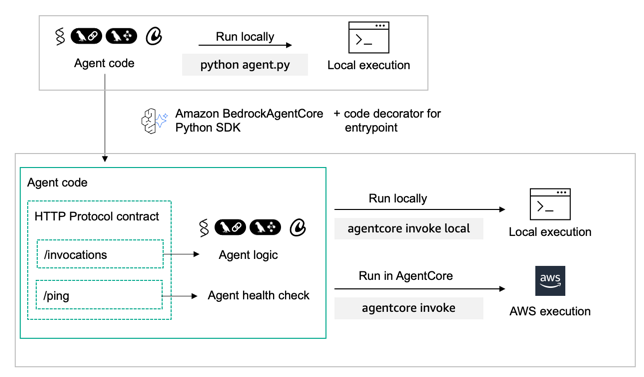
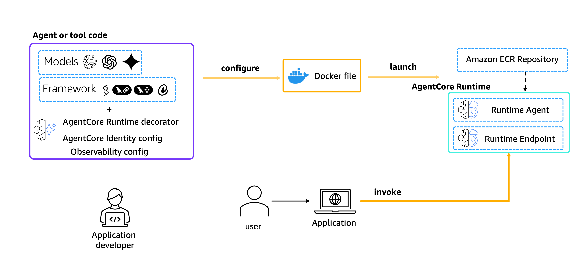
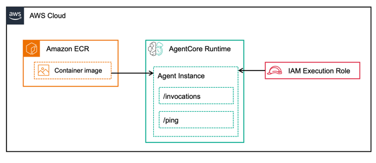

# Hosting AI Agents on AgentCore Runtime

## Overview

This tutorial demonstrates how to host AI agents on **Amazon Bedrock AgentCore Runtime** using the Amazon Bedrock AgentCore Python SDK. Learn to transform your agent code into a standardized HTTP service that integrates seamlessly with Amazon Bedrock's infrastructure.

AgentCore Runtime is a **framework and model-agnostic** platform that can host agents built with any agentic framework (Strands Agents, LangGraph, CrewAI) and any LLM model (in Amazon Bedrock, OpenAI, etc.).

The Amazon Bedrock AgentCore Python SDK acts as a wrapper that:

- **Transforms** your agent code into AgentCore's standardized protocols
- **Handles** HTTP and MCP server infrastructure automatically
- **Lets you focus** on your agent's core functionality
- **Supports** two protocol types:
  - **HTTP Protocol**: Traditional request/response REST API endpoints
  - **MCP Protocol**: Model Context Protocol for tools and agent servers

### Service Architecture

When hosting agents, the SDK automatically:

- Hosts your agent on port `8080`
- Provides two key endpoints:
  - **`/invocations`**: Primary agent interaction (JSON input → JSON/SSE output)
  - **`/ping`**: Health check for monitoring

Once your agent is prepared for deployment on AgentCore Runtime, you can use the Amazon Bedrock AgentCore StarterKit to deploy it to deploy it to AgentCore Runtime.

With the Starter Kit you can configure your agent deployment, launch it to create an Amazon ECR repository with the Agent's configuration and the AgentCore Runtime endpoint and invoke the created endpoint for validation.

Once deployed, your AgentCore Runtime architecture in AWS looks as following:

## Tutorial Examples

This tutorial includes three hands-on examples to get you started:

| Example                                                                | Framework      | Model          | Description                                |
| ---------------------------------------------------------------------- | -------------- | -------------- | ------------------------------------------ |
| **[01-strands-with-bedrock-model](01-strands-with-bedrock-model)**     | Strands Agents | Amazon Bedrock | Basic agent hosting with AWS native models |
| **[02-langgraph-with-bedrock-model](02-langgraph-with-bedrock-model)** | LangGraph      | Amazon Bedrock | LangGraph agent workflows                  |
| **[03-strands-with-openai-model](03-strands-with-openai-model)**       | Strands Agents | OpenAI         | Integration with external LLM providers    |

## Key Benefits

- **Framework Agnostic**: Works with any Python-based agent framework
- **Model Flexible**: Support for LLMs in Amazon Bedrock, OpenAI, and other LLM providers
- **Production Ready**: Built-in health checks and monitoring
- **Easy Integration**: Minimal code changes required
- **Scalable**: Designed for enterprise workloads

## Getting Started

Choose one of the tutorial examples above based on your preferred framework and model combination. Each example includes:

- Step-by-step setup instructions
- Complete code samples
- Testing guidelines
- Best practices

## Next Steps

After completing the tutorials, you can:

- Extend these patterns to other frameworks and models
- Deploy to production environments
- Integrate with your existing applications
- Scale your agent infrastructure
