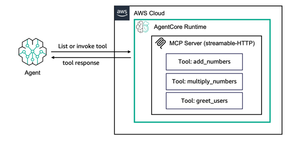

# Hosting MCP server on AgentCore Runtime

## Overview

In this session we will discuss how to host MCP tools on Amazon Bedrock AgentCore Runtime.

We will use the Amazon Bedrock AgentCore Python SDK to wrapper the agents function as an MCP server compatible with Amazon Bedrock AgentCore.
It will handle the MCP server details so you can focus on your agent's core functionality.

The Amazon Bedrock AgentCore Python SDK prepares your agent or tool code to run on AgentCore Runtime. 

It will transform your code into the AgentCore standardized HTTP protocol or MCP protocol contracts to allow for direct REST API endpoint communication for a traditional request/response pattern (HTTP protocol) or Model Context Protocol for tools and agents servers (MCP Protocol).

When you are hosting tools, the Amazon Bedrock AgentCore Python SDK will implement the [Stateless Streamable HTTP] transport protocol with the `MCP-Session-Id` header for [session isolation]https://modelcontextprotocol.io/specification/2025-06-18/basic/transports#session-management, servers must support stateless operation to not reject platform generated Mcp-Session-Id header.
Your MCP server will then be hosted on port `8000` and will provide one invocation path: the `mcp-POST`. This interaction endpoint with receive the MCP RPC messages and process them through your tool's capabilities. It supports both  application/json and text/event-stream as response content-types.

When you set your AgentCore protocol to MCP, AgentCore Runtime will expect the MCP server container to be on path `0.0.0.0:8000/mcp` as that's the default path supported by most of the official MCP server SDKs.

AgentCore Runtime requires you to host stateless streamable-http servers because it provides session-isolation by default and automatically adds a Mcp-Session-Id header for any request without it, so MCP clients can have continuity of connection to same Bedrock AgentCore Runtime session ID. 

Payload of `InvokeAgentRuntime` API is completely pass through, so RPC messages of protocols like MCP can easily be proxied.

In this tutorial you will learn:

* How to create an MCP server with tools
* How to test your server locally
* How to deploy your server to AWS
* How to invoke your deployed server

### Tutorial Details

| Information         | Details                                                   |
|:--------------------|:----------------------------------------------------------|
| Tutorial type       | Hosting Tools                                             |
| Tool type           | MCP server                                                |
| Tutorial components | Hosting tool on AgentCore Runtime. Creating an MCP server |
| Tutorial vertical   | Cross-vertical                                            |
| Example complexity  | Easy                                                      |
| SDK used            | Amazon BedrockAgentCore Python SDK and MCP Client         |

### Tutorial Architecture
In this tutorial we will describe how to deploy an existing MCP server to AgentCore runtime. 

For demonstration purposes, we will use a very simple MCP server with 3 tools: `add_numbers`, `multiply_numbers` and `greet_users`

### Tutorial Key Features

* Hosting MCP Server