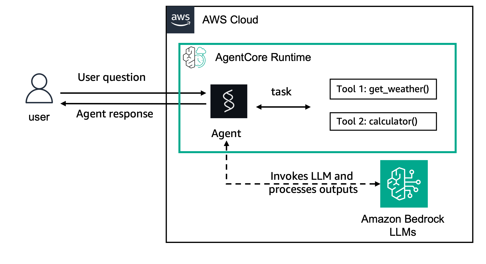

# Understanding Runtime Context and Session Management in AgentCore Runtime

## Overview

In this tutorial, we will learn how to understand and work with runtime context and session management in Amazon Bedrock AgentCore Runtime. This example demonstrates how AgentCore Runtime handles sessions, maintains context across multiple invocations, and how agents can access runtime information through the context object.

Amazon Bedrock AgentCore Runtime provides isolated sessions for each user interaction, enabling agents to maintain context and state across multiple invocations while ensuring complete security isolation between different users.

### Tutorial Details

|Information| Details|
|:--------------------|:---------------------------------------------------------------------------------|
| Tutorial type       | Context and Session Management|
| Agent type          | Single         |
| Agentic Framework   | Strands Agents |
| LLM model           | Anthropic Claude Sonnet 4 |
| Tutorial components | Runtime Context, Session Management, AgentCore Runtime, Strands Agent and Amazon Bedrock Model |
| Tutorial vertical   | Cross-vertical                                                                   |
| Example complexity  | Intermediate                                                                     |
| SDK used            | Amazon BedrockAgentCore Python SDK and boto3|

### Tutorial Architecture

In this tutorial, we will explore how Amazon Bedrock AgentCore Runtime manages sessions and provides context to agents. We'll demonstrate:

1. **Session Continuity**: How the same session ID maintains context across multiple invocations
2. **Context Object**: How agents can access runtime information through the context parameter
3. **Session Isolation**: How different session IDs create completely isolated environments
4. **Payload Flexibility**: How to pass custom data to agents through the payload

For demonstration purposes, we will use a Strands Agent that showcases these session management capabilities.

    

    

### Tutorial Key Features

* **Session-based Context Management**: Understanding how AgentCore Runtime maintains context within sessions
* **Runtime Session Lifecycle**: Learning about session creation, maintenance, and termination
* **Context Object Access**: Accessing runtime information like session ID through the context parameter
* **Session Isolation**: Demonstrating how different sessions provide complete isolation
* **Payload Handling**: Flexible data passing through custom payload structures
* **Cross-invocation State**: Maintaining agent state across multiple calls within the same session