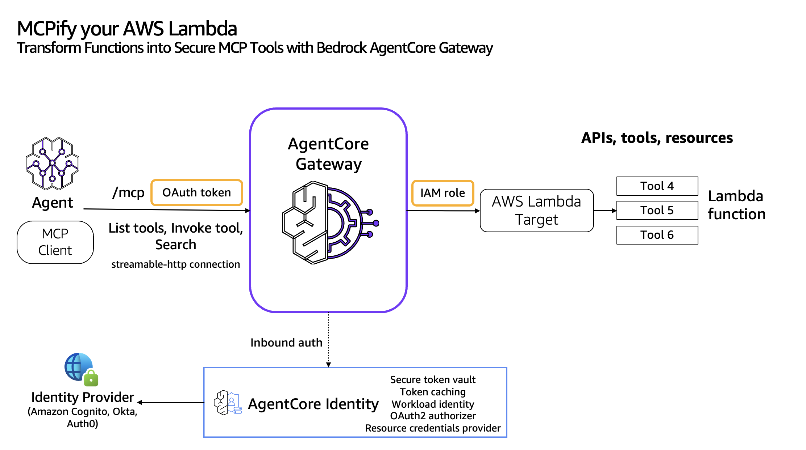
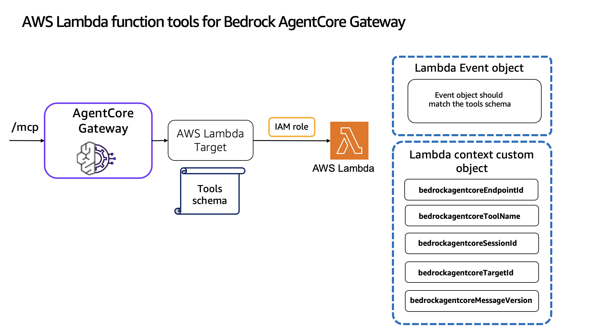

# Implement Lambda function tools for Gateway

## Overview
Bedrock AgentCore Gateway provides customers a way to turn their existing Lambda functions into fully-managed MCP servers without needing to manage infra or hosting. Customers can bring their existing AWS Lambda functions, or add new Lambda functions to front their tools. Gateway will provide a uniform Model Context Protocol (MCP) interface across all these tools. Gateway employs a dual authentication model to ensure secure access control for both incoming requests and outbound connections to target resources. The framework consists of two key components: Inbound Auth, which validates and authorizes users attempting to access gateway targets, and Outbound Auth, which enables the gateway to securely connect to backend resources on behalf of authenticated users. Together, these authentication mechanisms create a secure bridge between users and their target resources, supporting both IAM credentials and OAuth-based authentication flows. 




### Understanding the Lambda context object
When Gateway invokes a Lambda function, it passes special context information through thecontext.client_context object. This context includes important metadata about the invocation, which your function can use to determine how to process the request.
The following properties are available in the context.client_context.custom object:
* bedrockagentcoreEndpointId: The ID of the Gateway endpoint that received the request.
* bedrockagentcoreTargetId: The ID of the Gateway target that routed the request to your function.
* bedrockagentcoreMessageVersion: The version of the message format used for the request.
* bedrockagentcoreToolName: The name of the tool being invoked. This is particularly important when your Lambda function implements multiple tools.
* bedrockagentcoreSessionId: The session ID for the current invocation, which can be used to correlate multiple tool calls within the same session.

You can access these properties in your Lambda function code to determine which tool is being invoked and to customize your function's behavior accordingly



### Response format and error handling

Your Lambda function should return a response that the Gateway can interpret and pass back to the client. The response should be a JSON object with the following structure:The statusCode field should be an HTTP status code indicating the result of the operation:
* 200: Success
* 400: Bad request (client error)
* 500: Internal server error

The body field can be either a string or a JSON string representing a more complex response. If you want to return a structured response, you should serialize it to a JSON string

### Error handling
Proper error handling is important for providing meaningful feedback to clients. Your Lambda function should catch exceptions and return appropriate error responses

### Testing 

Note that the ```__context__``` field is not part of the actual event that will be passed to your function when invoked by Gateway. It's only used for testing purposes to simulate the context object.
When testing in the Lambda console, you'll need to modify your function to handle the simulated context. This approach allows you to test your Lambda function with different tool names and input parameters before deploying it as a Gateway target.

### Cross-account Lambda access

If your Lambda function is in a different AWS account than your Gateway, you need to configure a resource-based policy on the Lambda function to allow the Gateway to invoke it. Here's an example policy:

```
{
  "Version": "2012-10-17",
  "Id": "default",
  "Statement": [
    {
      "Sid": "cross-account-access",
      "Effect": "Allow",
      "Principal": {
        "AWS": "arn:aws:iam::123456789012:role/GatewayExecutionRole"
      },
      "Action": "lambda:InvokeFunction",
      "Resource": "arn:aws:lambda:us-west-2:987654321098:function:MyLambdaFunction"
    }
  ]
}
```
In this policy:
- 123456789012 is the account ID where the Gateway is deployed
- GatewayExecutionRole is the IAM role used by the Gateway.
- 987654321098 is the account ID where the Lambda function is deployed.
- MyLambdaFunction is the name of the Lambda function.

After adding this policy, you can specify the Lambda function ARN in your Gateway target configuration, even though it's in a different account.

### Tutorial Details


| Information          | Details                                                   |
|:---------------------|:----------------------------------------------------------|
| Tutorial type        | Interactive                                               |
| AgentCore components | AgentCore Gateway, AgentCore Identity                     |
| Agentic Framework    | Strands Agents                                            |
| LLM model            | Anthropic Claude Sonnet 3.7, Amazon Nova Pro              |
| Tutorial components  | Creating AgentCore Gateway and Invoking AgentCore Gateway |
| Tutorial vertical    | Cross-vertical                                            |
| Example complexity   | Easy                                                      |
| SDK used             | boto3                                                     |

## Tutorial Architecture

### Tutorial Key Features

* Expose Lambda functions into MCP tools
* Secure the tools call using AWS IAM and OAuth

## Tutorials Overview

In these tutorials we will cover the following functionality:

- [Transform your AWS Lambda function into MCP tools](01-gateway-target-lambda.ipynb)

