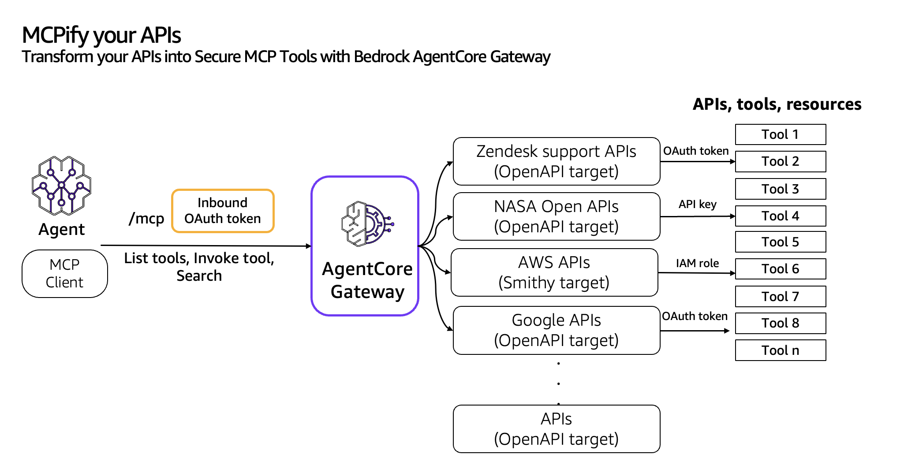
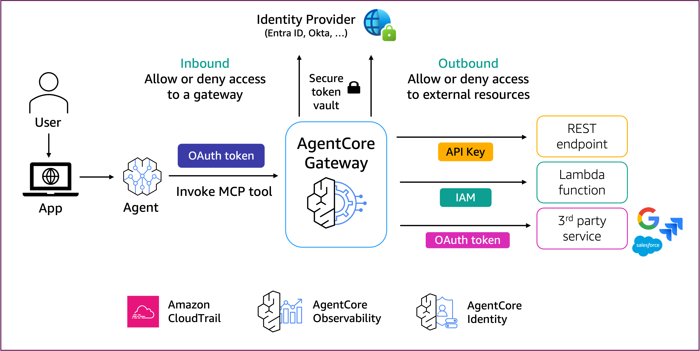

# Implement MCP tools from your APIs using Amazon Bedrock AgentCore Gateway

## Overview
Bedrock AgentCore Gateway provides customers a way to turn their existing APIs (OpenAPI and Smithy) into fully-managed MCP servers without needing to manage infra or hosting. Customers can bring their existing OpenAPI and Smithy specs to convert their tools. Gateway will provide a uniform Model Context Protocol (MCP) interface across all these tools. Gateway employs a dual authentication model to ensure secure access control for both incoming requests and outbound connections to target resources. The framework consists of two key components: Inbound Auth, which validates and authorizes users attempting to access gateway targets, and Outbound Auth, which enables the gateway to securely connect to backend APIs on behalf of authenticated users using API key, Oauth token and AWS IAM role.

## Defining concepts

Before starting, let us define a couple of important concepts for getting started with Amazon Bedrock AgentCore Gateway:
You can group your OpenAPI or Smithy APIs and create Bedrock AgentCore Gateway Target. A target is a resource that you use to logically group your APIs and attach to your AmazonCore Gateway. 

## Grouping your APIs into Gateway targets

Below are the best practices on grouping your APIs into Gateway target -
* Group your MCP tools based on Agentic application's business domain similar to Domain Driven Design principles applicable to microservices paradigm.
* You can attach only one resource credentials provider for outbound authorization for the Gateway target. Group the tools based on the outbound authorizer.
* Group your apis based on the type of the APIs i.e OpenAPI, Smithy, or AWS Lambda serving as a bridge to other enterprise APIs.

## Best practices

1. Documentation Quality Guidelines
- Write clear, descriptive summaries for each API endpoint and resource
- Use natural language descriptions that explain the purpose and functionality
- Include real-world use cases in the descriptions
- Avoid technical jargon unless necessary
- Ensure consistent terminology throughout documentation

2. Schema Documentation
- Provide detailed descriptions for all fields
- Include field constraints and validation rules
- Document data types precisely
- Add examples for complex data structures
- Explain relationships between different schemas

3. OpenAPI Specification best practices
- Validate specs using OpenAPI linters
- Ensure proper semantic versioning
- Include complete request/response examples
- Document error responses and codes
- Add security scheme definitions

4. Tools search optimization
- Include relevant keywords naturally in descriptions
- Provide context about when to use each API
- Document alternative approaches or related endpoints
- Include business domain terminology

5. API extraction guidelines
- Identify core functionality needed for agent tasks
- Create focused API subsets based on use cases
- Maintain semantic relationships between extracted APIs
- Preserve security definitions and common schemas
- Document dependencies between extracted components

6. Monolithic API Extraction Process:
- Review full OpenAPI specification
- Map agent use cases to specific endpoints and Auth requirements
- Extract relevant paths and schemas
- Maintain component dependencies
- Validate extracted specification
- Test semantic search effectiveness

Remember to regularly review and update documentation as APIs evolve, maintaining the quality and accuracy of the agents.

## Inbound and outbound authorization 
Bedrock AgentCore Gateway provides secure connections via inbound and outbound authentication. For the inbound authentication, the AgentCore Gateway analyzes the OAuth token passed during invocation to decide allow or deny the access to a tool in the gateway. If a tool needs access to external resources, the AgentCore Gateway can use outbound authentication via API Key, IAM or OAuth Token to allow or deny the access to the external resource.

During the inbound authorization flow, an agent or the MCP client calls an MCP tool in the AgentCore Gateway adding an OAuth access token (generated from the user’s IdP). AgentCore Gateway then validates the OAuth access token and performs inbound authorization.

If the tool running in AgentCore Gateway needs to access external resources, OAuth will retrieve credentials of downstream resources using the resource credential provider for the Gateway target. AgentCore Gateway pass the authorization credentials to the caller to get access to the downstream API. 

### Tutorial Details

| Information          | Details                                                   |
|:---------------------|:----------------------------------------------------------|
| Tutorial type        | Interactive                                               |
| AgentCore components | AgentCore Gateway, AgentCore Identity                     |
| Agentic Framework    | Strands Agents                                            |
| LLM model            | Anthropic Claude Sonnet 3.7, Amazon Nova Pro              |
| Tutorial components  | Creating AgentCore Gateway and Invoking AgentCore Gateway |
| Tutorial vertical    | Cross-vertical                                            |
| Example complexity   | Easy                                                      |
| SDK used             | boto3                                                     |

## Tutorial Architecture

### Tutorial Key Features

* Convert OpenAPI apis into MCP tools
* Convert Smithy models into MCP tools

### Tutorials Overview

In these tutorials we will cover the following functionality:

- [Transform your OpenAPIs into MCP tools](02-transform-openapi-into-mcp-tools)
- [Transform your Smithy models into MCP tools](03-transform-smithyapis-into-mcp-tools)

