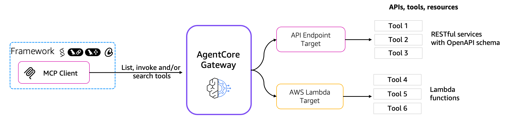
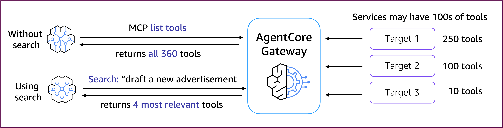

# Amazon Bedrock AgentCore Gateway - Semantic search

## Tutorial Architecture

Amazon Bedrock AgentCore Gateway provides unified connectivity between agents and the tools and resources they need to interact with. Gateway plays multiple roles in this connectivity layer:

1. **Security Guard**: Gateway manages OAuth authorization to ensure only valid users / agents access tools / resources.
2. **Translator**: Gateway translates agent requests made using popular protocols like the Model Context Protocol (MCP) into API requests and Lambda invocations. This means developers don’t need to host servers, manage protocol integration, version support, version patching, etc.
3. **Composer**: Gateway enables developers to seamlessly combine multiple APIs, functions, and tools into a single MCP  endpoint that an agent can use.
4. **Keychain**: Gateway handles the injection of the right credentials to use with the right tool, ensuring that agents can seamlessly leverage tools that require different sets of credentials.
5. **Researcher**: Gateway enables agents to search across all of their tools to find only the ones that are best for a given context or question. This allows agents to make use of 1000s of tools instead of just a handful. It also minimizes the set of tools that need to be provided in an agent’s LLM prompt, reducing latency and cost.
6. **Infrastructure Manager**: Gateway is completely serverless, and comes with built-in observability and auditing, alleviating the need for developers to manage additional infrastructure to integrate their agents and tools.

## AgentCore Gateway helps solve the challenge of MCP servers that have large numbers of tools

In a typical enterprise setting, agent builders encounter MCP servers that have hundreds or even thousands
of MCP tools. This volume of tools poses challenges for AI agents, including poor tool selection accuracy, increased cost, and higher latency driven by higher token usage from excessive tool metadata.
This can happen when connecting your agents to third party services (e.g., Zendesk, Salesforce,
Slack, JIRA, ...), or to existing enterprise REST services. AgentCore Gateway provides a built in semantic search across tools, which improves agent latency, cost, and accuracy, while still giving those agents the tools they need. Depending on your use case, LLM model, and agent framework, you can see up to 3x better latency by keeping an agent focused on relevant tools versus providing the full set of hundreds of tools from a typical MCP Server.

## Tutorials Overview

In these tutorials we will cover the following functionality:

- Creating Amazon Bedrock AgentCore Gateways with AWS Lambda-backed targets
- Using AgentCore Gateway semantic search
- Using Strands Agents to show how AgentCore Gateway search improves latency

- [Amazon Bedrock AgentCore Gateway - Semantic search](./01-gateway-search.ipynb)