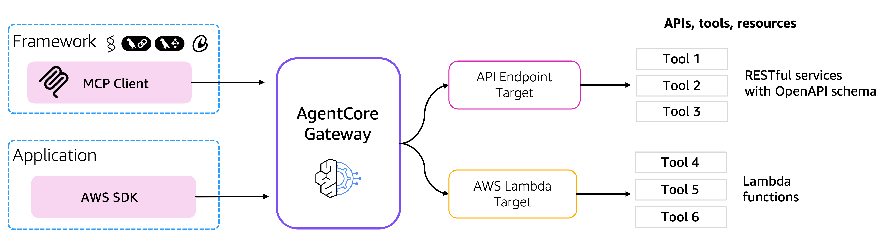
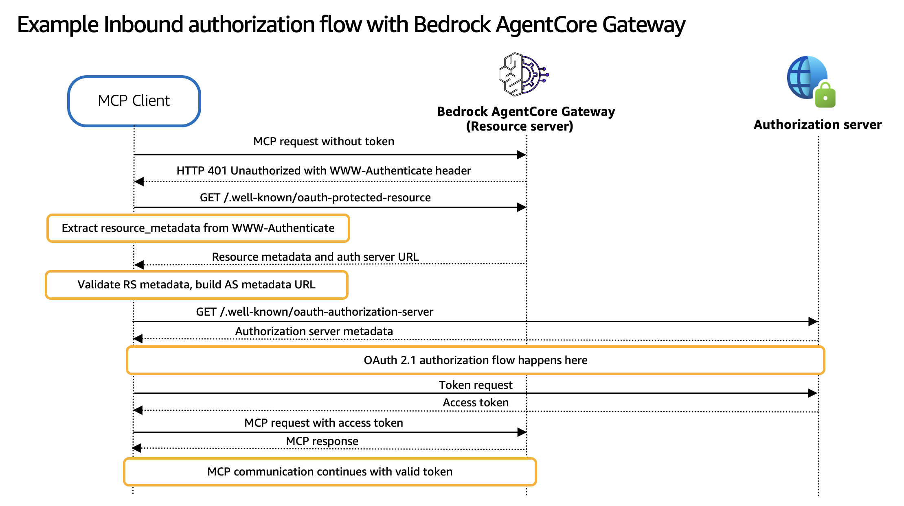
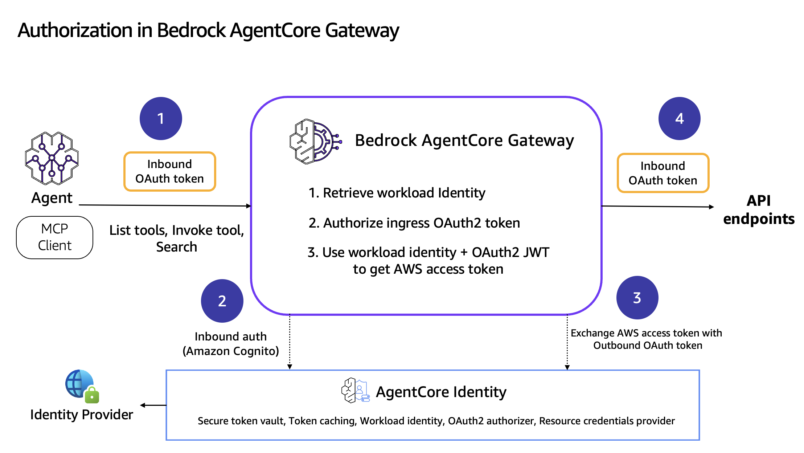
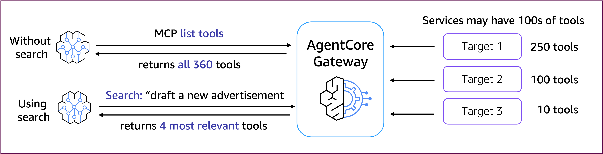

# Amazon Bedrock AgentCore Gateway

## Overview
Bedrock AgentCore Gateway provides customers a way to turn their existing APIs and Lambda functions into fully-managed MCP servers without needing to manage infra or hosting. Customers can bring OpenAPI spec or Smithy models for their existing APIs, or add Lambda functions that front their tools. Gateway will provide a uniform Model Context Protocol (MCP) interface across all these tools. Gateway employs a dual authentication model to ensure secure access control for both incoming requests and outbound connections to target resources. The framework consists of two key components: Inbound Auth, which validates and authorizes users attempting to access gateway targets, and Outbound Auth, which enables the gateway to securely connect to backend resources on behalf of authenticated users. Together, these authentication mechanisms create a secure bridge between users and their target resources, supporting both IAM credentials and OAuth-based authentication flows. Gateway supports MCP's Streamable HTTP transport connection.

## Defining concepts

Before starting, let us define a couple of important concepts for getting started with Amazon Bedrock AgentCore Gateway:

* **Amazon Bedrock AgentCore Gateway**: HTTP endpoint that customers can call with an MCP client for executing the standard MCP operations (i.e. listTools and invokeTool). Customers can also invoke this AmazonCore Gateway using an AWS SDK such as boto3.
* **Bedrock AgentCore Gateway Target**: a resource that customer uses to attach targets to their AmazonCore Gateway. Currently the following types are supported as targets for AgentCore Gateway:
    * Lambda ARNs
    * API specifications → OpenAPI, Smithy
* **MCP Transport**: mechanism that defines how messages move between clients (applications using LLMs) and the MCP servers. Currently AgentCore Gateway supports only `Streamable HTTP connections` as transport.

## How it works

## Inbound and outbound authorization 
Bedrock AgentCore Gateway provides secure connections via inbound and outbound authentication. For the inbound authentication, the AgentCore Gateway analyzes the OAuth token passed during invocation to decide allow or deny the access to a tool in the gateway. If a tool needs access to external resources, the AgentCore Gateway can use outbound authentication via API Key, IAM or OAuth Token to allow or deny the access to the external resource.

During the inbound authorization flow, an agent or the MCP client calls an MCP tool in the AgentCore Gateway adding an OAuth access token (generated from the user’s IdP). AgentCore Gateway then validates the OAuth access token and performs inbound authorization.

If the tool running in AgentCore Gateway needs to access external resources, OAuth will retrieve credentials of downstream resources using the resource credential provider for the Gateway target. AgentCore Gateway pass the authorization credentials to the caller to get access to the downstream API. 

### MCP authorization and Gateway

Amazon Bedrock AgentCore Gateway complies with the [MCP authorization specification](https://modelcontextprotocol.io/specification/2025-06-18/basic/authorization) for the authorization of incoming MCP tool calls.

### AgentCore Gateway and integration with AgentCore Identity

### Searching for Tools
Amazon Bedrock AgentCore Gateway also includes a powerful built-in semantic search capability that helps agents and 
developers finding the most relevant tools through natural language queries, through **reducing the context** passed to your agent for tool selection. This search functionality is implemented as a prebuilt tool that leverages vector embeddings for semantic matching.  Users can enable this feature during Gateway creation by opting in through the CreateGateway API. Once enabled, any subsequent CreateTarget operations automatically trigger the generation of vector embeddings for the target's tools. During this process, the CreateTarget response STATUS field will indicate "UPDATING" while embeddings are being generated

### Tutorial Details

| Information          | Details                                                   |
|:---------------------|:----------------------------------------------------------|
| Tutorial type        | Interactive                                               |
| AgentCore components | AgentCore Gateway, AgentCore Identity                     |
| Agentic Framework    | Strands Agents                                            |
| LLM model            | Anthropic Claude Sonnet 3.7, Amazon Nova Pro              |
| Tutorial components  | Creating AgentCore Gateway and Invoking AgentCore Gateway |
| Tutorial vertical    | Cross-vertical                                            |
| Example complexity   | Easy                                                      |
| SDK used             | boto3                                                     |

## Tutorial Architecture

### Tutorial Key Features

#### Secure Tool Access

Amazon Bedrock AgentCore Gateway complies with the [MCP authorization specification](https://modelcontextprotocol.io/specification/2025-06-18/basic/authorization) 
for the authorization of incoming MCP tool calls. 
Amazon Bedrock AgentCore Gateway also offers 2 options to support authorization of the outgoing calls from Gateway:
* using API key or
* using OAuth access tokens 
You can configure the authorization using Credentials provider API of the Amazon Bedrock AgentCore Identity and 
attach them to the AgentCore Gateway Target. 
Each Target (AWS Lambda, Smithy and OpenAPI) can be attached to a credentials provider.

#### Integration

Bedrock AgentCore Gateway integrates with 
* Bedrock AgentCore Identity
* Bedrock AgentCore Runtime

### Use cases

* Real-time interactive agents calling MCP tools
* Inbound & outbound authorization using different IdPs
* MCP-fying the AWS Lambda functions, Open APIs and Smithy models
* MCP tools discovery

### Benefits

* Gateway provides several key benefits that simplify AI agent development and deployment: No infrastructure management
* Fully managed service with no hosting concerns. Amazon Bedrock AgentCore handles all infrastructure for you automatically.
* Unified interface: Single MCP protocol for all tools eliminates the complexity of managing multiple API formats and authentication mechanisms in your agent code.
* Built-in authentication: OAuth and credential management handles token lifecycle, refresh, and secure storage without additional development effort.
* Automatic scaling: Scales automatically based on demand to handle varying workloads without manual intervention or capacity planning.
* Enterprise security: Enterprise-grade security features including encryption, access controls, and audit logging ensure secure tool access.

## Tutorials Overview

In these tutorials we will cover the following functionality:

- [Transforming AWS Lambda function into MCP tools](01-transform-lambda-into-mcp-tools)
- [Transforming APIs into MCP tools](02-transform-apis-into-mcp-tools)
- [Discovering MCP tools](03-discover-mcp-tools)
