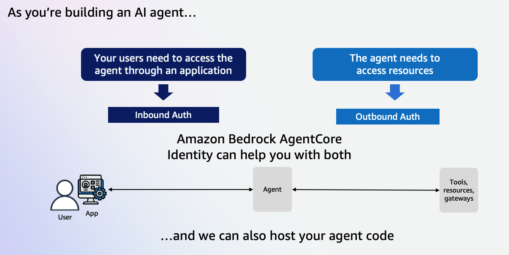
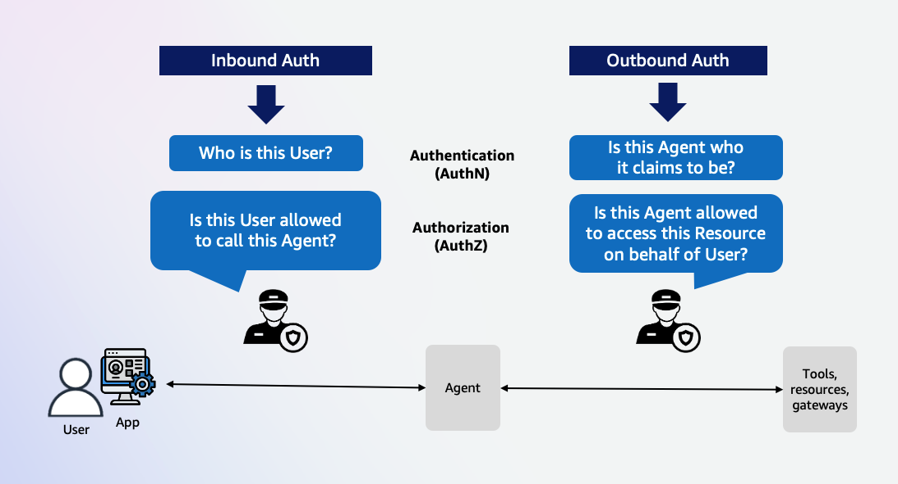

# Getting Started with Amazon Bedrock AgentCore Identity

## Introduction

Amazon Bedrock AgentCore Identity is a comprehensive identity and credential management service designed specifically for AI agents and automated workloads. It provides secure authentication, authorization, and credential management capabilities that enable users to invoke agents, and agents to access external resources and services on behalf of users while maintaining strict security controls and audit trails. Agent identities are implemented as workload identities with specialized attributes that enable agent-specific capabilities while maintaining compatibility with industry-standard workload identity patterns. The service integrates natively with Amazon Bedrock AgentCore to provide comprehensive identity and credential management for agent applications.

## Types of Auth supported by AgentCore Identity

AgentCore Identity lets you validate inbound access (Inbound Auth) for users and applications calling agents or tools in an AgentCore Runtime or validate access to AgentCore Gateway targets. It also provide secure outbound access (Outbound Auth) from an agent or Gateway target to external services. It integrates with your existing identity providers (such as Amazon Cognito) while enforcing permission boundaries for agents acting independently or on behalf of users (via OAuth). 

    
    

* Inbound: Inbound Auth is used to grant access to users to invoke agents or tools. Consider a scenario where a user wants to invoke an agent within an application. That user must have permissions to invoke the agent and the agent should retain who the user is when performing tasks. Inbound auth supports two mechanisms for auth, AWS IAM or Oauth. Oauth allows agents builders a way to invoke the agent without having to grant users IAM permissions. 
  
* Outbound: Outbound auth is used to grant agents or AgentCore Gateways access to AWS services or external resources on behalf of users. AgentCore Identity will use the provided IAM execution role to access AWS resources. Oauth 2-leg or 3-leg access flows will be used for external resources.