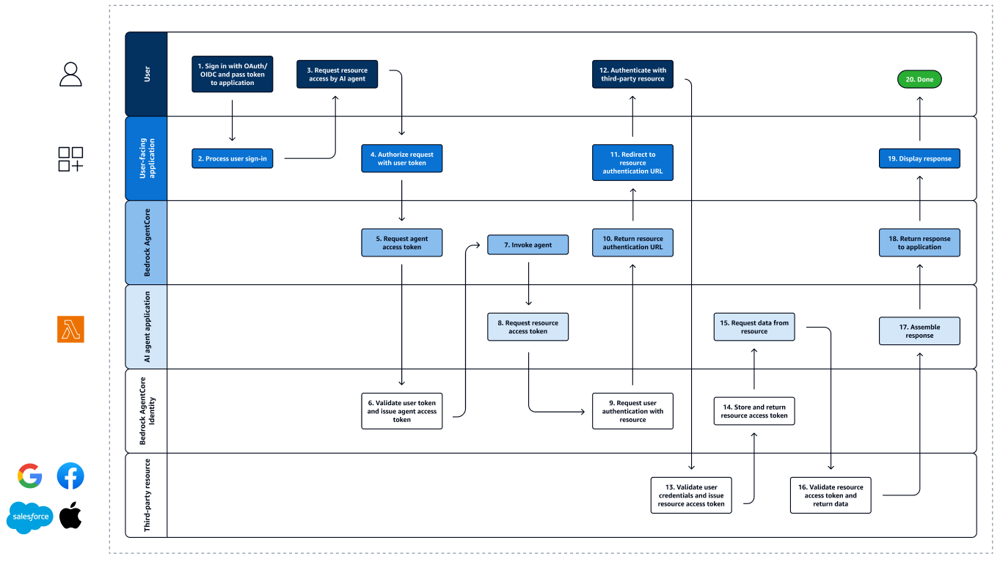

# How Bedrock AgentCore Identity works

## Introduction

AgentCore Identity addresses a fundamental challenge in AI agent deployment: enabling agents to securely access user-specific data across multiple services without compromising security or user experience. Traditional approaches either use broad access credentials without fine-grained controls or require explicit user consent for each service integration (creating poor user experience). AgentCore Identity solves this through a comprehensive workflow that implements zero trust security principles and delegation-based authentication.

The service operates on the principle of delegation rather than impersonation. Instead of agents using user credentials directly, agents authenticate as themselves while carrying verifiable user context. This approach enables fine-grained access control, comprehensive audit trails, and the ability to revoke agent access independently of user access. The workflow orchestrates complex authentication and authorization across multiple trust domains while presenting a simple interface to developers.

At its core, AgentCore Identity provides secure authentication mechanisms for agents to access resources while maintaining proper security boundaries. This enables services to make appropriate authorization decisions, supporting sophisticated use cases like cross-service agents that can access internal calendar systems and external services like Google Calendar within a single workflow.

The following diagram illustrates the complete AgentCore Identity workflow, showing how users, applications, agents, and AWS resources and third-party services interact securely:

    

The AgentCore Identity workflow consists of the following steps:

**User signs in with OAuth/OIDC and passes token to application** — The user authenticates through their organization's existing identity provider (such as Auth0, Cognito, or other OIDC-compliant systems) and receives an access token or identity token. This token contains the user's identity information and authorized scopes, establishing the user's identity context for the entire workflow. The application receives this token and will use it to authorize requests to the agent. 

**User-facing application processes user sign-in** — The application validates the user's authentication token and establishes a secure session. This step ensures that the user is properly authenticated and authorized to access the application's features, including the ability to invoke AI agents. The application may also extract user identity information from the token for personalization and access control purposes.

**User requests resource access by AI agent** — When the user initiates an agent interaction, the application makes a request to invoke the AI agent on the user's behalf. This request includes the user's authentication token and any necessary context about what the agent needs to accomplish. The application acts as a proxy, forwarding the user's authenticated request to the agent infrastructure while maintaining the user's identity context.

**User-facing application makes request to agent service with user token** — The Bedrock AgentCore service receives the request and validates the user's token against configured authorization policies. This validation includes checking the token's signature, expiration, issuer, audience, and required scopes. The service ensures that the user has the necessary permissions to invoke the specific agent and that the request meets all security requirements before proceeding.

**Bedrock AgentCore requests workload access token from Agent Credential Provider** — The agent service initiates a token exchange process to obtain an workload access token (technically a workload access token). The agent service submits the user's token to the AgentCore Identity's token exchange API. The request is authorized with IAM credentials. This enables secure, auditable access to downstream resources while maintaining the chain of trust and supporting authorization decisions. 

**AgentCore Identity validates the user token and issues an workload access token** — AgentCore Identity validates the signature, expiration, issuer, audience, and scopes of the user's token. It then returns a workload access token. This enables secure, auditable access to downstream resources while maintaining the chain of trust. The AgentCore Identity performs comprehensive zero trust validation of the request, including verifying the agent's identity, validating the user's original OAuth/OIDC token signature and claims, and checking that the agent has permission to access the requested resources on behalf of the user. This validation occurs regardless of the source or previous trust relationships, ensuring that every request is authenticated and authorized independently. 

**AI agent application invokes agent** — The agent application receives the workload access token and begins executing the requested task. The agent can now operate with a verifiable proof of both its own identity and the user it's acting on behalf of. This enables the agent to make authenticated requests to various tools and resources while maintaining full traceability of actions back to the original user.

**Agent requests resource access token** — When the agent needs to access AWS resources and third-party services (such as Google Calendar, Slack, or internal APIs), it requests appropriate credentials from the AgentCore Credential Provider. The agent presents its workload access token as proof of its identity and authorization. The system validates this token and determines what resources the agent is permitted to access based on configured policies and user consent. AgentCore Identity might have an existing token for the requested user identity and resource, in which case it returns the resource access token. 

**Amazon Bedrock AgentCore Identity requests user authentication with resource** — If AgentCore Identity doesn't have an existing access token for the requested resource in the token vault, it returns a response that indicates that user consent is needed at the provided URL. For resources that require explicit user consent (such as third-party services like Google Calendar), the system may need to initiate a user authentication flow. This typically involves redirecting the user to the resource provider's authorization server (such as Google's OAuth 2.0 endpoints or Microsoft's Azure AD) to grant permission for the agent to access their data. This step ensures that users maintain control over what resources agents can access on their behalf and supports both OAuth 2.0 client credentials grant (machine-to-machine) and OAuth 2.0 authorization code grant (user-delegated access) flows. 

**Bedrock AgentCore requests user authentication** — The agent service returns a response to the user-facing application, passing along the requested authorization URL.

**User-facing application displays authentication and consent prompt** — The user is prompted to enter their credentials and to share their data with the agent.

**User consents to share data** — The user accepts the consent prompt from the third-party provider.

**Third-party resource validates user credentials and issues resource access token** — The third-party service provider (such as Google, Microsoft, or Salesforce) validates the user's credentials and consent, then issues an access token specifically for the agent to use. This token is typically scoped to only the permissions that the user has explicitly granted to the agent, following the principle of least privilege access. The callback URL from this authorization request is an AgentCore Identity service endpoint that processes the provider response and collects the access token for the requested resource.

**AgentCore Identity stores and returns resource access token** — The AgentCore Identity returns the resource access token in response to the request from the agent. The service also securely stores the resource access token in the token vault for future use, associating it with the specific agent identity and user identity combination. This enables subsequent requests to reuse the token without requiring repeated user authentication, improving user experience while maintaining security. The token is encrypted and access-controlled to prevent unauthorized retrieval. The token vault operates under zero trust principles, ensuring that credentials can only be accessed by the exact agent and user combination that originally obtained them. This prevents unauthorized cross-access between different agents or users. 

**Agent requests data from resource.** — Using the resource-specific access token, the agent makes API calls to read or write data from the third-party resource. The agent operates within the bounds of the permissions granted by the user and the capabilities defined by the resource provider API. All actions are performed with the agent's identity clearly established for audit and security purposes.

**Third-party resource validates resource access token and returns data** — The third-party service validates the access token provided by the agent, ensuring it's valid, not expired, and has the necessary scopes for the requested operation. Upon successful validation, the resource returns the requested data or confirms the completion of the requested action. This validation ensures that only authorized agents with proper user consent can access protected resources.

**AI agent application assembles response** — The agent processes the data received from AWS resources and third-party services and combines it with any additional logic and context to create a comprehensive response. The agent maintains context about the user's original request and ensures that the response addresses the user's needs while incorporating data from the accessed resources.

**AgentCore returns response to application** — The agent sends its completed response back to the user-facing application. This response includes the results of the agent's actions, any data retrieved from AWS resources and third-party services, and confirmation of tasks completed. The response maintains the security context and provides audit information about what actions were performed on the user's behalf.

**User-facing application displays response** — The application presents the agent's response to the user in an appropriate format, whether that's text, structured data, or confirmation of completed actions. The user can see the results of their request and understand what the agent accomplished using their authorized access to various resources.

**Process completes (Done)** — The workflow concludes with all tokens properly managed, audit logs recorded, and the user's request fulfilled. The system maintains security throughout the process while providing a seamless experience for users who want to leverage AI agents to access and manipulate their data across multiple services and platforms.

This workflow is built on several key technical principles that distinguish AgentCore Credential Provider from traditional authentication approaches. The service implements zero trust security, where every request is validated regardless of source or previous trust relationships. It uses delegation-based authentication rather than impersonation, ensuring that agents always authenticate as themselves while carrying user context. The service is MCP (Model Context Protocol) compliant, supporting standard protocols for agent-to-tool communication. Finally, it provides cross-platform support, enabling agents to operate across AWS, other cloud providers, and on-premise environments while maintaining consistent security standards. 