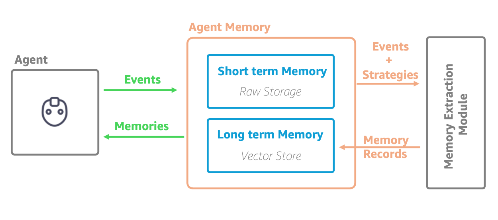

# Amazon Bedrock AgentCore Memory

## Overview

Memory is a critical component of intelligence. While Large Language Models (LLMs) have impressive capabilities, they lack persistent memory across conversations. Amazon Bedrock AgentCore Memory addresses this limitation by providing a managed service that enables AI agents to maintain context over time, remember important facts, and deliver consistent, personalized experiences.

## Key Capabilities

AgentCore Memory provides:

- **Core Infrastructure**: Serverless setup with built-in encryption and observability
- **Event Storage**: Raw event storage (conversation history/checkpointing) with branching support
- **Strategy Management**: Configurable extraction strategies (SEMANTIC, SUMMARY, USER_PREFERENCES, CUSTOM)
- **Memory Records Extraction**: Automatic extraction of facts, preferences, and summaries based on configured strategies
- **Semantic Search**: Vector-based retrieval of relevant memories using natural language queries

## How AgentCore Memory Works

AgentCore Memory operates on two levels:

### Short-Term Memory

Immediate conversation context and session-based information that provides continuity within a single interaction or closely related sessions.

### Long-Term Memory

Persistent information extracted and stored across multiple conversations, including facts, preferences, and summaries that enable personalized experiences over time.

## Memory Architecture

1. **Conversation Storage**: Complete conversations are saved in raw form for immediate access
2. **Strategy Processing**: Configured strategies automatically analyze conversations in the background
3. **Information Extraction**: Important data is extracted based on strategy types (typically takes ~1 minute)
4. **Organized Storage**: Extracted information is stored in structured namespaces for efficient retrieval
5. **Semantic Retrieval**: Natural language queries can retrieve relevant memories using vector similarity

## Memory Strategy Types

AgentCore Memory supports four strategy types:

- **Semantic Memory**: Stores factual information using vector embeddings for similarity search
- **Summary Memory**: Creates and maintains conversation summaries for context preservation
- **User Preference Memory**: Tracks user-specific preferences and settings
- **Custom Memory**: Allows customization of extraction and consolidation logic

## Getting Started

Explore the memory capabilities through our organized tutorials:

- **[Short-Term Memory](./01-short-term-memory/)**: Learn about session-based memory and immediate context management
- **[Long-Term Memory](./02-long-term-memory/)**: Understand persistent memory strategies and cross-conversation continuity

## Sample Notebooks Overview

| Memory Type | Framework           | Use Case           | Notebook                                                                                                                           |
| ----------- | ------------------- | ------------------ | ---------------------------------------------------------------------------------------------------------------------------------- |
| Short-Term  | Strands Agent       | Personal Agent     | [personal-agent.ipynb](./01-short-term-memory/01-single-agent/with-strands-agent/personal-agent.ipynb)                             |
| Short-Term  | LangGraph           | Fitness Coach      | [personal-fitness-coach.ipynb](./01-short-term-memory/01-single-agent/with-langgraph-agent/personal-fitness-coach.ipynb)           |
| Short-Term  | Strands Agent       | Travel Planning    | [travel-planning-agent.ipynb](./01-short-term-memory/02-multi-agent/with-strands-agent/travel-planning-agent.ipynb)                |
| Long-Term   | Strands Hooks       | Customer Support   | [customer-support.ipynb](./02-long-term-memory/01-single-agent/using-strands-agent-hooks/customer-support/customer-support.ipynb)  |
| Long-Term   | Strands Hooks       | Math Assistant     | [math-assistant.ipynb](./02-long-term-memory/01-single-agent/using-strands-agent-hooks/simple-math-assistant/math-assistant.ipynb) |
| Long-Term   | Strands Tool        | Culinary Assistant | [culinary-assistant.ipynb](./02-long-term-memory/01-single-agent/using-strands-agent-memory-tool/culinary-assistant.ipynb)         |
| Long-Term   | Strands Multi-Agent | Travel Booking     | [travel-booking-assistant.ipynb](./02-long-term-memory/02-multi-agent/with-strands-agent/travel-booking-assistant.ipynb)           |

## Prerequisites

- Python 3.10 or higher
- AWS account with Amazon Bedrock access
- Jupyter Notebook environment
- Required Python packages (see individual sample requirements.txt files)
