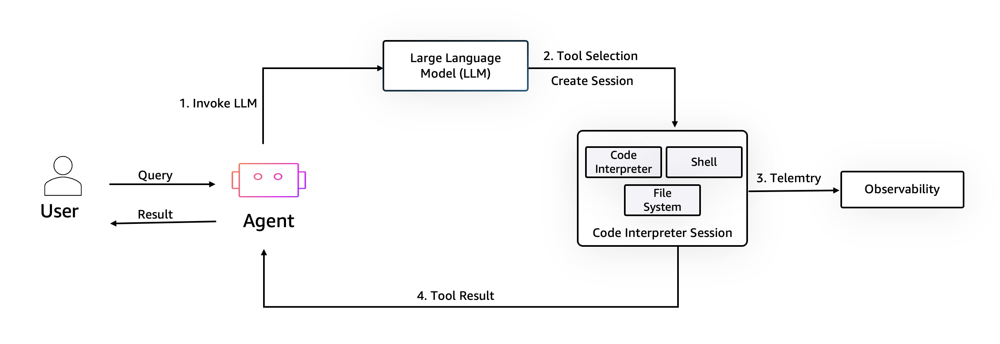

# Amazon Bedrock AgentCore RuntCode Interpreter

## Overview
Amazon Bedrock AgentCore Code Interpreter is a secure and serverless, environment where AI agents can directly write and execute code to complete end-to-end tasks, enabling them to perform complex data analysis, run simulations, generate visualizations, and automate programming tasks.

## How it works

The code execution sandbox enables agents to safely process user queries by creating an isolated environment with a code interpreter, shell, and file system. After a Large Language Model helps with tool selection, code is executed within this session, before being returned to the user or Agent for synthesis.

## Key Features

### Sessions in Environment

Ability to persist sessions across executions

### VPC Support and Internet Access

Provides enterprise-grade features including VPC connectivity and outside internet access

### Multiple Pre-built Environment Runtimes

Multiple pre-built runtimes including Python, NodeJS & TypeScript(coming soon: support for custom runtime code execution engine with custom libraries)

### Integration

Amazon Bedrock AgentCore Code Interpreter integrates with other Amazon Bedrock AgentCore capabilities through a unified SDK, including:

- Amazon Bedrock AgentCore Runtime
- Amazon Bedrock AgentCore Identity
- Amazon Bedrock AgentCore Memory
- Amazon Bedrock AgentCore Observability

This integration aims to simplify the development process and provide a comprehensive platform for building, deploying, and managing AI agents, with powerful code execution capabilities.

### Use Cases

The Amazon Bedrock AgentCore Code Interpreter is suitable for a wide range of applications, including:

- Code Execution and Review
- Data Analysis and Visualization

## Tutorials overview

In these tutorials we will cover the following functionality:

- [File Operations using Amazon Bedrock AgentCore Code Interpreter](01-file-operations-using-code-interpreter)
- [Code Execution with agent using Amazon Bedrock AgentCore Code Interpreter](02-code-execution-with-agent-using-code-interpreter)
- [Advanced Data Analysis with AI Agent using Amazon Bedrock AgentCore Code Interpreter](03-advanced-data-analysis-with-agent-using-code-interpreter)
- [Run Commnads using Amazon Bedrock AgentCore Code Interpreter](04-run-commands-using-code-interpreter)
