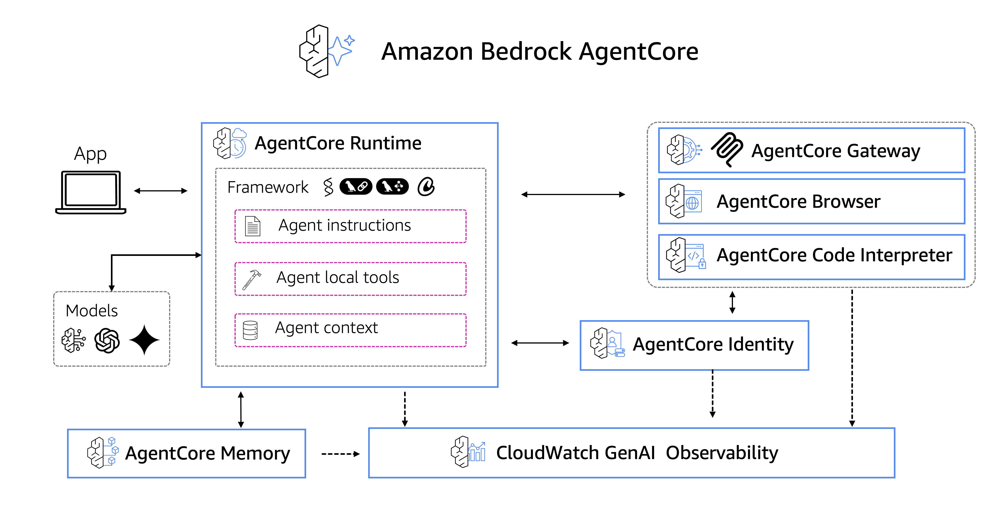

# 📚 Amazon Bedrock AgentCore Tutorials

Welcome to the tutorials section of the Amazon Bedrock AgentCore samples repository! 

This folder contains interactive, notebook-based tutorials designed to help you learn 
the fundamental capabilities of Amazon Bedrock AgentCore through hands-on examples.

Our tutorials are organized by Amazon Bedrock AgentCore components:

* **Runtime**: Amazon Bedrock AgentCore Runtime is a secure, serverless runtime capability that empowers organizations to deploy and scale both AI agents and tools, regardless of framework, protocol, or model choice—enabling rapid prototyping, seamless scaling, and accelerated time to market
* **Gateway**: AI agents need tools to perform real-world tasks—from searching databases to sending messages. Amazon Bedrock AgentCore Gateway automatically converts APIs, Lambda functions, and existing services into MCP-compatible tools so developers can quickly make these essential capabilities available to agents without managing integrations. 
* **Memory**: Amazon Bedrock AgentCore Memory makes it easy for developer to build rich, personalized agent experiences with fully-manged memory infrastructure and the ability to customize memory for your needs.
* **Identity**: Amazon Bedrock AgentCore Identity provides seamless agent identity and access management across AWS services and third-party applications such as Slack and Zoom while supporting any standard identity providers such as Okta, Entra, and Amazon Cognito.
* **Tools**: Amazon Bedrock AgentCore provides two built-in tools to simplify your agentic AI application development: Amazon Bedrock AgentCore **Code Interpreter** tool enables AI agents to write and execute code securely, enhancing their accuracy and expanding their ability to solve complex end-to-end tasks. Amazon Bedrock AgentCore **Browser Tool** is an enterprise-grade capability that enables AI agents to navigate websites, complete multi-step forms, and perform complex web-based tasks with human-like precision within a fully managed, secure sandbox environment with low latency
* **Observability**: Observability helps developers trace, debug, and monitor agent performance through unified operational dashboards. With support for OpenTelemetry compatible telemetry and detailed visualizations of each step of the agent workflow, Amazon Bedrock AgentCore Observability enables developers to easily gain visibility into agent behavior and maintain quality standards at scale.

Additionally, we provide an **end-to-end** example that demonstrate how to combine these components in practical scenarios.

## Amazon Bedrock AgentCore

The Amazon Bedrock AgentCore services can be used independently or combined to create production ready agents. They work with any agentic framework (such as Strands Agents, LangChain, LangGraph or CrewAI) and any model, available on Amazon Bedrock or not.

In these tutorials, we will learn how to use each service individually and combined.

## 🎯 Who These Tutorials Are For

These tutorials are perfect for:

 - Getting started with Amazon Bedrock AgentCore
 - Understanding core concepts before building advanced applications
 - Getting a solid foundation in AI agent development using Amazon Bedrock AgentCore
