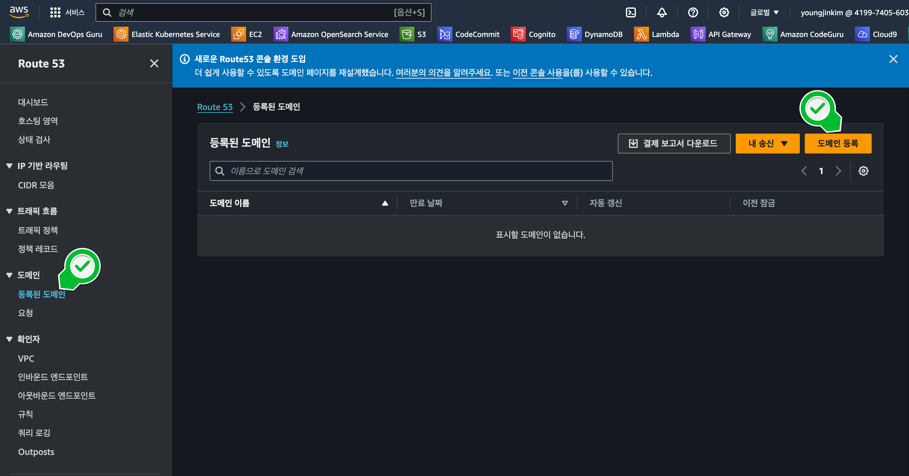
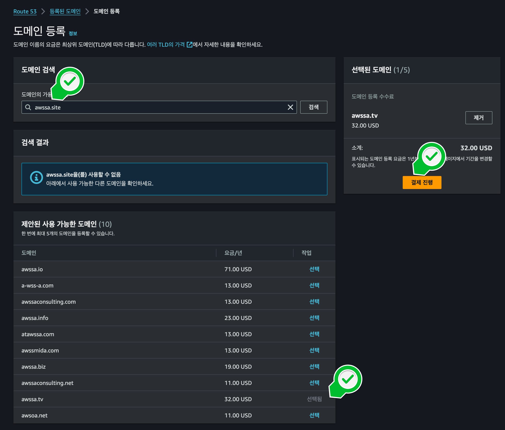

### 
**디렉토리 구조**

Streamlit on EC2가 동작되고, 구동할 수 있는 상태를 확인합니다.

이 단계에선 인증서 발급에 앞서, 도메인을 소유하고 있어합니다.
1. 도메인을 원하는 사이트에서 구매하여 준비합니다.

    

 

2. 본 포스팅에서 사용할 도메인(예 awssa.site)이라고 가정하겠습니다.

    

 

- [도메인등록1][https://domain.gabia.com/](https://domain.gabia.com/)
- [도메인등록2][https://hosting.cafe24.com](https://hosting.cafe24.com/?controller=new_domain_search)

