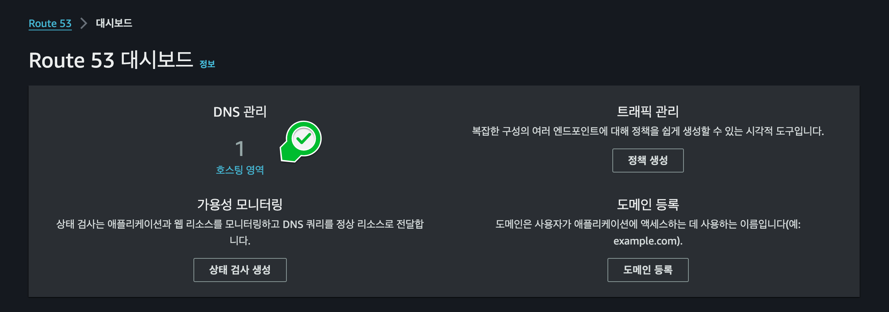
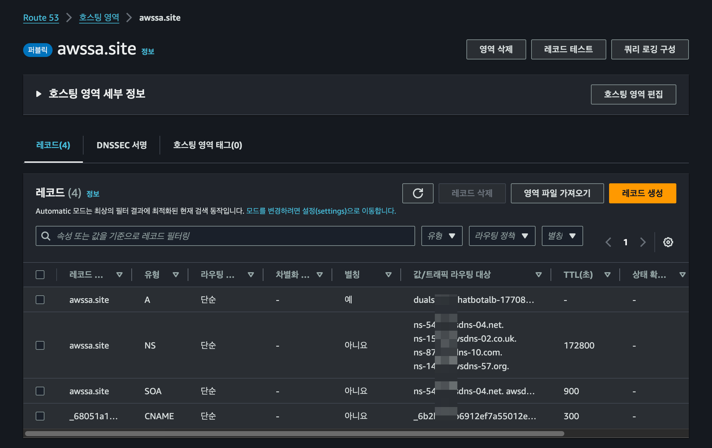

### 
**디렉토리 구조**

Streamlit on EC2가 동작되고, 구동할 수 있는 상태를 확인되고 도메인(awssa.site) 준비가 되어있어야 합니다.

이 단계에선 인증서 발급에 앞서, 도메인을 Route53에 인증합니다.
1. AWS Management Console에 로그인하여 Route53 대시보드 이동합니다.

    

2. 호스팅 영역을 생성하고 펴블릭소프팅 영역 선택합니다.

    
    

3. 최종 도메인 레코드 유형에는 A,NS,SOA,CNAME 4개 존재하도록 합니다.
   - 현재는 A, CNAME이 없는데, A유형은 다음 포스팅에 생성할 예정입니다.
   - CNAME은 바로 아래서 인증서 발급 후 만들 예정입니다.

    

   
   