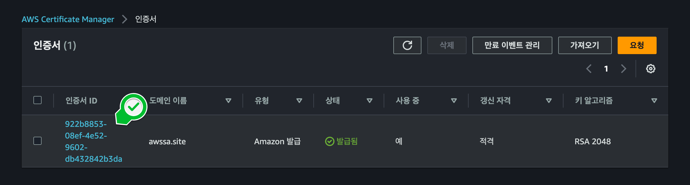
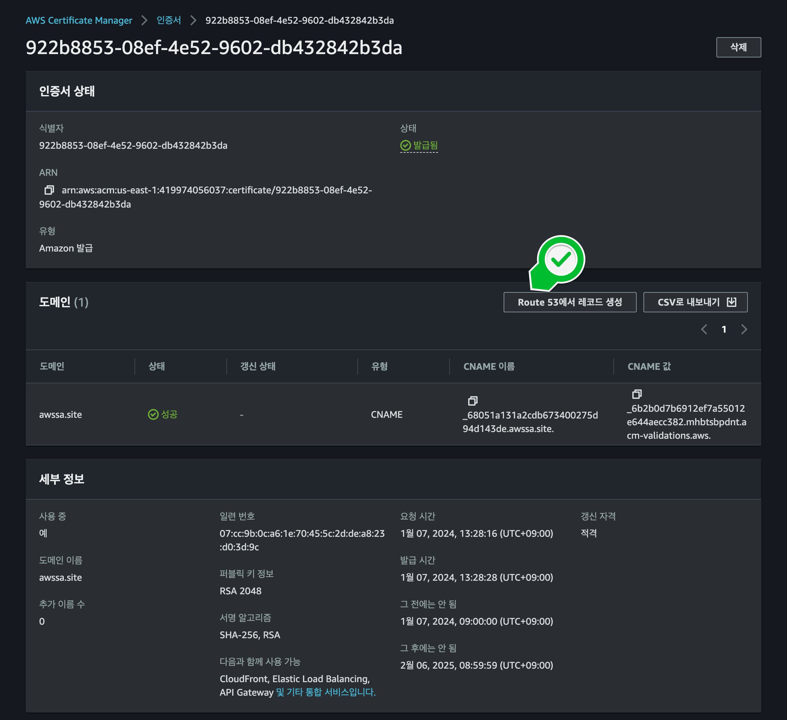

### 
**디렉토리 구조**

Streamlit on EC2가 동작되고, 구동할 수 있는 상태를 확인되고 도메인(awssa.site) 준비가 되어있어야 합니다.

이 단계에선 SSL(TLS)인증서를 발급 받아야합니다.
위에서 구매한 도메인에 대한 보안 인증서를 발급 받는과정입니다.
1. AWS Certificate Manager 대시보드로 이동합니다.

    
    
    

   
2. ACM메뉴에서 인증서 나열을 클릭하면, 요청한 인증서를 확인할 수 있습니다.

    

3. 앞에서 언급한 CNAME레코드를 만들어 봅니다. 발급받은 인증서ID를 클릭합니다.

    

4. Route53애ㅔ서 레코드 생성을 클릭합니다.일정 시간이 지나면, 상태가 발급됨으로 변경된것을 확인하실수 있습니다.

    

20~30분 정도 소요되고, 길면 최대 2시간까지도 소요될 수 있습니다.
호스팅 영역을 생성해 도메인을 인증하고, ACM으로 SSL인증서를 발급받았습니다.