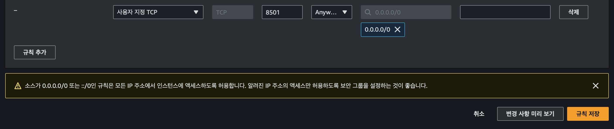
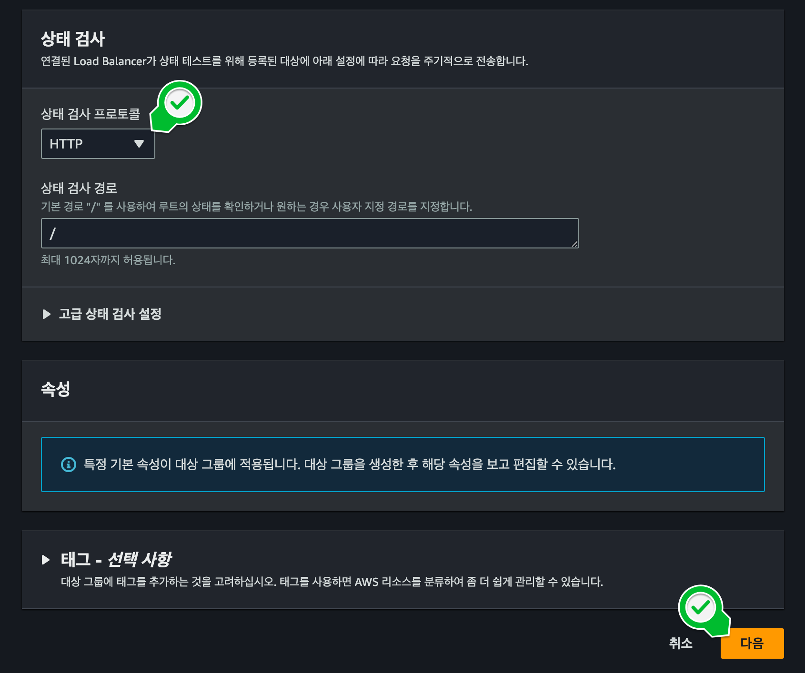

## 
**디렉토리 구조**

AWS(Route 53)에서 도메인 소유를 인증하고,ACM(AWS Certification Manager)를 통해 SSL(TSL) 인증서를 발급받았습니다.
C2 인스턴스의 로드 밸런싱을 위한 타겟 그룹을 생성하고,로드 밸런서(Load Balancer)로 리다이렉트 규칙을 설정하고(http 요청을 https로 리다이렉트),로드 밸런서의 Health check를 통과해 로드 밸런싱을 안전하게 유지하는 방법을 정리해보겠습니다.

1. Streamlit 웹서버에서 사용하는 포트(TCP 8501)의 인바운드 규칙 편집

    
    

2. 로드밸러스(Load Balancer)에 타겟그룹(Target Group) 설정으로 이동합니다.

    

3. 타켓유형은 인스턴스를 선택하고, 타겟그룹 이름과 포트(8501) 확인합니다.

    

4. Health check는 타켓 그룹의 EC2 인스턴스가 정상인지 확인하는 방법입니다.

    

5. 타켓그룹 생성되었음을 확인할 수 있습니다.

    

6. 로드밸런스(Load Balancer) 생성
7. 도메인 레코드 생성
8. 로드밸런서 리스너 규칙 추가
9. Health check
10. 확인