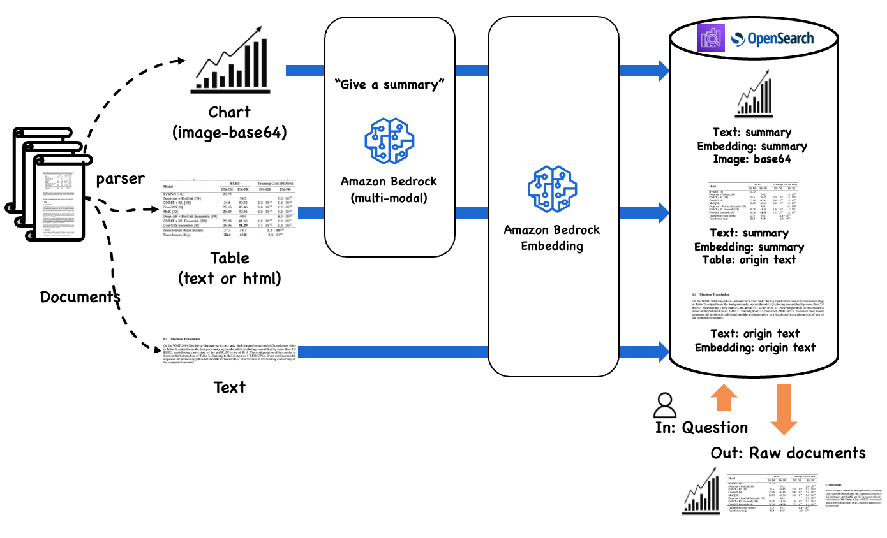

<h1 align="left"><b>Retrieval-Augmented Generation (RAG) over Complex PDF on AWS</b></h1>

    
    
    <a href="https://github.com/aws-samples/aws-ai-ml-workshop-kr/tree/master/genai/aws-gen-ai-kr/20_applications/02_qa_chatbot">
        
    

## 
**Workflow for RAG with Complex PDF**

- - -
## 
**Demo**

- ####  [VOD - Demo](https://www.youtube.com/watch?v=8YpfTuEbqJk)

- - -

## 
**Getting started**

- ####  [git clone first](https://github.com/aws-samples/aws-ai-ml-workshop-kr.git) and then [Hands on Lab](./01_rag_over_complex_doc.ipynb)

- - -

## 
**Citation**

-  If you find this repository useful, please consider giving a star ⭐ and citation
- - -

## 
**Contributors**

-  **Dongjin Jang, Ph.D.** (AWS AI/ML Specislist Solutions Architect) | [Mail](mailto:dongjinj@amazon.com) | [Linkedin](https://www.linkedin.com/in/dongjin-jang-kr/) | [Git](https://github.com/dongjin-ml) | [Hugging Face](https://huggingface.co/Dongjin-kr) |
-  **Byeong-eok Kang** (AWS Sr. Solutions Architect) | [Mail](mailto:eokkang@amazon.com) | [Linkedin](https://www.linkedin.com/in/byeong-eok-kang-15330221/) |
- - -

## 
**License**

-  This is licensed under the [MIT License](https://github.com/aws-samples/aws-ai-ml-workshop-kr/blob/master/LICENSE). 
