<h1 align="left"><b>Under Construction</b></h1>
<h1 align="left"><b>Retrieval-Augmented Generation (RAG) for Large Language Models on AWS</b></h1>

    
    
    
    
    

- - -

## 
**Updated**

- - -

## 
**Contents**

- [Overview](#Overview)
- [Hands-On List](#Hands-On-List)
- [Usage](#Usage)
- Learning Resources
    - [Reading and Watching List](#Reading-and-Watching-List)
    - [What Should We Know](#What-Should-We-Know)
    - [Building Production-Ready RAG Apps](#Building-Production-Ready-RAG-Apps)
        - [1. Table stakers](#Table-stakers)
        - [2. Advanced Retrieval](#Advanced-Retrieval)
        - [3. Fine-tuning - training](#Fine-tuning-training)
        - [4. Fine-tuning - inference](#Fine-tuning-inference)
        - [5. Evaluation](#Evaluation)
- [Citation](#Citation)
- [Contributors](#Contributors)
- [License](#License)

- - -

## 
**Overview**

- #####  Retrieval-Augmented Generation (RAG)는 LLM의 답변 생성에 외부 지식을 활용하는 것을 의미한다. 
- #####  RAG는 특히 knowledge-intensive task에서 답변 정확도를 향상시키고 hallucination을 감소시키는 것으로 알려져 있다. 
- #####  하지만 semantic vector search 기반의 naive RAG의 경우 여전히 부족한 답변의 정확도가 문제가 되고 있고 이는 real-world production으로의 이동을 막는 장애물이 되고 있다.
- #####  최근 들어 RAG의 한계를 극복하거나, 성능향상을 위한 기술적 발전이 계속 되고 있다.
- #####  이러한 자료들은 public하게 공개되어 있어 누구나 접근이 가능하나, 쏟아지는 자료 속에서 양질의 컨텐츠를 찾는 수고로움과, 러닝커브(이해 및 구현)가 필요하기에 이를 자신의 워크로드에 빠르게 적용하기 힘든 상황이다. 
- #####  따라서 이 Repositroy는 **양질의 기술 선별, 기술에 대한 설명 및 aws 기반 sample codes 제공을 통해, 고객의 RAG 기반 workload의 생산성 향상을 목적으로 한다.** 
- - -

## 
**Hands-On List**

- #####  [**Setting up the development environment**](https://github.com/aws-samples/aws-ai-ml-workshop-kr/tree/master/genai/aws-gen-ai-kr/00_setup) - 핸즈온 수행을 위한 환경설정
    - [Role, Model-Access, Packages](https://github.com/aws-samples/aws-ai-ml-workshop-kr/blob/master/genai/aws-gen-ai-kr/00_setup/setup.ipynb)
    - [OpenSearch](https://github.com/aws-samples/aws-ai-ml-workshop-kr/blob/master/genai/aws-gen-ai-kr/00_setup/setup-%08opensearch.ipynb)
- #####  [**Document Preprocessing**](https://github.com/aws-samples/aws-ai-ml-workshop-kr/tree/master/genai/aws-gen-ai-kr/20_applications/02_qa_chatbot/01_preprocess_docs) - 문서 전처리 및 OpenSearch기반 vectorDB 설정
- #####  [**Advanced RAG**](https://github.com/aws-samples/aws-ai-ml-workshop-kr/tree/master/genai/aws-gen-ai-kr/20_applications/02_qa_chatbot/02_rag) - Amazon Bedrock + OpenSearch + LangChain + SageMaker 기반 Advanced RAG 구현
    - [Hybrid-Fusion (Semantic + Lexical)](https://github.com/aws-samples/aws-ai-ml-workshop-kr/blob/master/genai/aws-gen-ai-kr/20_applications/02_qa_chatbot/02_rag/01_rag_hybrid_search.ipynb)
    - [ReRanker](https://github.com/aws-samples/aws-ai-ml-workshop-kr/blob/master/genai/aws-gen-ai-kr/20_applications/02_qa_chatbot/02_rag/02_rag_reranker.ipynb)
    - [RAG-Fusion (Query-rewriting)](https://github.com/aws-samples/aws-ai-ml-workshop-kr/blob/master/genai/aws-gen-ai-kr/20_applications/02_qa_chatbot/02_rag/03_rag_rag_fusion.ipynb)
    - [Hypothetical Document Embeddings (HyDE)](https://github.com/aws-samples/aws-ai-ml-workshop-kr/blob/master/genai/aws-gen-ai-kr/20_applications/02_qa_chatbot/02_rag/04_rag_hyde.ipynb)
    - [Parent-Documents](https://github.com/aws-samples/aws-ai-ml-workshop-kr/blob/master/genai/aws-gen-ai-kr/20_applications/02_qa_chatbot/02_rag/05_rag_parent_document.ipynb)
- #####  [**Chatbot**](https://github.com/aws-samples/aws-ai-ml-workshop-kr/tree/master/genai/aws-gen-ai-kr/20_applications/02_qa_chatbot/03_chatbot) - Advanced RAG 엔진 기반 chatbot 구현
- #####  [**Web-UI**](https://github.com/aws-samples/aws-ai-ml-workshop-kr/tree/master/genai/aws-gen-ai-kr/20_applications/02_qa_chatbot/04_web_ui) - Streamlit 기반 application 생성
- #####  [**Evaluation**](https://github.com/aws-samples/aws-ai-ml-workshop-kr/tree/master/genai/aws-gen-ai-kr/20_applications/02_qa_chatbot/05_evaluation) - Automatic and systematic evaluation
    - [Create-Ground-Truth](https://github.com/aws-samples/aws-ai-ml-workshop-kr/blob/master/genai/aws-gen-ai-kr/20_applications/02_qa_chatbot/05_evaluation/01_create_ground_truth.ipynb)
    - [Evaluator](https://github.com/aws-samples/aws-ai-ml-workshop-kr/blob/master/genai/aws-gen-ai-kr/20_applications/02_qa_chatbot/05_evaluation/02_evaluation.ipynb)
- - -

## 
**Usage**

- #####  반드시 해당 링크를 통해 환경세팅을 완료해 주세요 ==> [Env. setting](https://dongjin-notebook-bira.notebook.us-east-1.sagemaker.aws/lab/tree/aws-ai-ml-workshop-kr/genai/aws-gen-ai-kr/00_setup/setup.ipynb) 
- - -

## 
**Reading and Watching List**

- #####  [READ] [Retrieval-Augmented Generation for Large Language Models: A Survey](https://arxiv.org/abs/2312.10997v1)
- #####  [READ] [Practical Considerations in RAG Application Design](https://pub.towardsai.net/practical-considerations-in-rag-application-design-b5d5f0b2d19b)
- #####  [READ] [Why Your RAG Is Not Reliable in a Production Environment](https://towardsdatascience.com/why-your-rag-is-not-reliable-in-a-production-environment-9e6a73b3eddb)
- #####  [READ] [A Guide on 12 Tuning Strategies for Production-Ready RAG Applications](https://towardsdatascience.com/a-guide-on-12-tuning-strategies-for-production-ready-rag-applications-7ca646833439)
- #####  [READ] [5 Blog Posts To Become a RAG Master](https://levelup.gitconnected.com/5-blog-posts-to-become-a-rag-master-d6004c6150d0)

- #####  [WATCH] (한국어) [Advanced RAG Webinar by AWS ](https://kr-resources.awscloud.com/kr-on-demand)
- #####  [WATCH] [Building Production-Ready RAG Apps](https://www.youtube.com/watch?v=TRjq7t2Ms5I)
- #####  [WATCH] [Use RAG to improve responses in generative AI applications - re:Invent session](https://www.youtube.com/watch?v=N0tlOXZwrSs) | [post](https://www.linkedin.com/posts/manikhanuja_aws-reinvent-2023-use-rag-to-improve-responses-activity-7137694254964903937-QCua/?utm_source=share&utm_medium=member_desktop) | [git](https://github.com/aws-samples/amazon-bedrock-samples/blob/main/knowledge-bases/1_managed-rag-kb-retrieve-generate-api.ipynb) | 
- - -

## 
**What Should We Know**

- #####  **Lost in Middle** Phenomenon in RAG 
    - 
    - [paper] [Lost in the Middle: How Language Models Use Long Contexts](https://www-cs.stanford.edu/~nfliu/papers/lost-in-the-middle.arxiv2023.pdf)
    - [blog] [Lost in the Middle: How Language Models Use Long Contexts](https://medium.datadriveninvestor.com/lost-in-the-middle-how-language-models-use-long-contexts-9dd599d465be)
    - [blog] [Overcome Lost In Middle Phenomenon In RAG Using LongContextRetriver](https://medium.aiplanet.com/overcome-lost-in-middle-phenomenon-in-rag-using-longcontextretriver-2334dc022f0e)
    - [blog] [LLM의 Context Window Size가 크다고 좋은 것일까?](https://moon-walker.medium.com/llm%EC%9D%98-context-window-size%EA%B0%80-%ED%81%AC%EB%8B%A4%EA%B3%A0-%EC%A2%8B%EC%9D%80-%EA%B2%83%EC%9D%BC%EA%B9%8C-57870a3e315e)    
----

## 
**Building Production-Ready RAG Apps**

#### 
**1. Table stakers**

- #####  **Better Parsers and Chunk size**
    - [blog] [LLM based context splitter for large documents](https://medium.com/@ayhamboucher/llm-based-context-splitter-for-large-documents-445d3f02b01b)
    - [blog] [Accuracy by chunk sizes](https://pub.towardsai.net/practical-considerations-in-rag-application-design-b5d5f0b2d19b)
    - [blog] [Semantic chunking in practice](https://boudhayan-dev.medium.com/semantic-chunking-in-practice-23a8bc33d56d)
    - [**llmsherpa**](https://github.com/nlmatics/llmsherpa) - Mastering PDFs: Extracting Sections, Headings, Paragraphs, and Tables with Cutting-Edge Parser (PDF chunking) - | [blog](https://blog.llamaindex.ai/mastering-pdfs-extracting-sections-headings-paragraphs-and-tables-with-cutting-edge-parser-faea18870125) |
    - [**Stanza**](https://stanfordnlp.github.io/stanza/) – A Python NLP Package for Many Human Languages (Sentence based spliter) - | [git](https://github.com/nlmatics/llmsherpa) |

- #####  **Hybrid Search** (Lexical + Semantic search)
    - 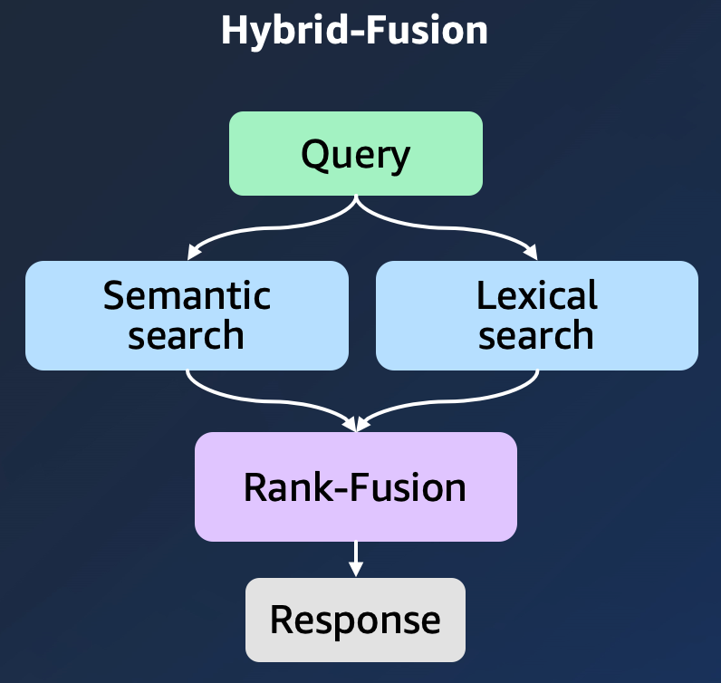
    - [vod] (한국어) [Hybrid Search using Amazon Bedrock and OpenSearch](https://kr-resources.awscloud.com/kr-on-demand/kr-fy23-q4-genai-session-03-video)
    - [vod] [Advanced RAG 03 - Hybrid Search BM25 & Ensembles](https://www.youtube.com/watch?v=lYxGYXjfrNI&list=PL8motc6AQftn-X1HkaGG9KjmKtWImCKJS&index=11)
    - [sample codes - aws] [Hybrid-Fusion](https://dongjin-notebook-bira.notebook.us-east-1.sagemaker.aws/lab/tree/aws-ai-ml-workshop-kr/genai/aws-gen-ai-kr/20_applications/02_qa_chatbot/02_rag/01_rag_hybrid_search.ipynb)
    - [blog] [Improving Retrieval Performance in RAG Pipelines with Hybrid Search](https://towardsdatascience.com/improving-retrieval-performance-in-rag-pipelines-with-hybrid-search-c75203c2f2f5)
    - [blog] [Amazon OpenSearch Service Hybrid Query를 통한 검색 기능 강화](https://aws.amazon.com/ko/blogs/tech/amazon-opensearch-service-hybrid-query-korean/)
    - Rank-Fusion: [RRF](https://velog.io/@acdongpgm/NLP.-Reciprocal-rank-fusion-RRF-%EC%9D%B4%ED%95%B4%ED%95%98%EA%B8%B0) (Reciprocal Rank Fusion)
        - 서로 다른 관련성 지표(relevance indicators)를 가진 여러 개의 결과 집합을 하나의 결과 집합으로 결합하는 방법
        - 튜닝을 필요로 하지 않으며, 서로 다른 관련성 지표들이 상호 관련되지 않아도 고품질을 결과를 얻을 수 있음
        
- #####  **Metadata Filters**
    - Leverage your document metadata (self-query)
        - 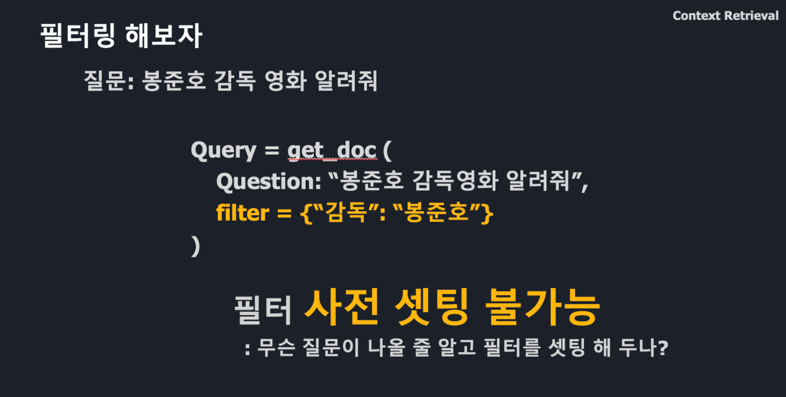
        - 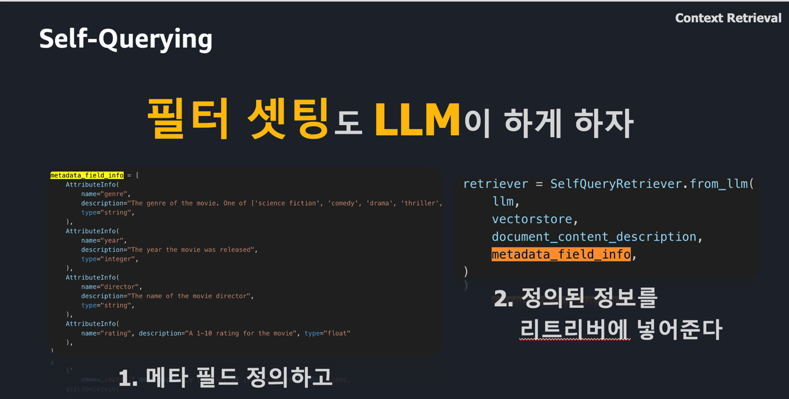
        - [vod] [Advanced RAG 01 - Self Querying Retrieval](https://www.youtube.com/watch?v=f4LeWlt3T8Y&list=PLJKSWzIAY6jCl7kY-Y8jEW6o0FW9Dtr9K&index=73&t=8s)
        - [sample codes] [selfQueryingRetriever_QAChains](https://github.com/insightbuilder/python_de_learners_data/blob/main/code_script_notebooks/projects/exploring_bard/selfQueryingRetriever_QAChains.ipynb?source=post_page-----cf12f3eed1f3--------------------------------)
        - [langchain] [Self-querying](https://python.langchain.com/docs/modules/data_connection/retrievers/self_query/)
        - [blog] [Deep Dive Into Self-Query Retriever In Langchain : Exploring Pros of Building SQ Retriever with PaLM](https://medium.com/@kamaljp/deep-dive-into-self-query-retriever-in-langchain-exploring-pros-of-building-sq-retriever-with-cf12f3eed1f3)
        
- #####  **Table extraction**
    - [Table Transformer](https://www.linkedin.com/posts/smockbrandon_github-microsofttable-transformer-table-activity-7138940321568096256-Sn0q?utm_source=share&utm_medium=member_desktop)
        - Parsing tables in PDFs is a super important RAG use case.
        - The Table Transformer model extracts tables from PDFs using object detection 📊
    - [blog] [Extract custom table from PDF with LLMs](https://medium.com/@knowledgrator/extract-custom-table-from-pdf-with-llms-2ad678c26200)
    - [blog] [RAG Pipeline Pitfalls: The Untold Challenges of Embedding Table](https://medium.com/towards-artificial-intelligence/rag-pipeline-pitfalls-the-untold-challenges-of-embedding-table-5296b2d8230a)
    - [blog] [Working with Table Data in Documents: Tips and Tricks for LLM](https://medium.com/@easonlai888/working-with-table-data-in-documents-tips-and-tricks-for-llm-50f09d2c4e95)
     - [blog] [Revolutionizing RAG with Enhanced PDF Structure Recognition](https://medium.com/@chatdocai/revolutionizing-rag-with-enhanced-pdf-structure-recognition-22227af87442)

#### 
**2. Advanced Retrieval**

- #####  **Query Transformations** (Query-Rewriting)
    - 
RAG-Fusion - Based on a user question, multiple sub queries are generated

        
        - 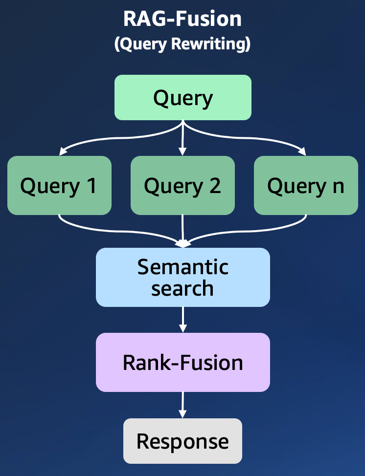
        - [vod] [Advanced RAG 06 - RAG Fusion](https://www.youtube.com/watch?v=GchC5WxeXGc&list=PL8motc6AQftn-X1HkaGG9KjmKtWImCKJS&index=13)
        - [blog] [Forget RAG, the Future is RAG-Fusion](https://towardsdatascience.com/forget-rag-the-future-is-rag-fusion-1147298d8ad1)
        - [paper] [Query Rewriting for Retrieval-Augmented Large Language Models, Xinbei *et al*., 2023](https://arxiv.org/pdf/2305.14283.pdf)
        - [sample codes - aws] [RAG-Fusion](https://github.com/aws-samples/aws-ai-ml-workshop-kr/blob/master/genai/aws-gen-ai-kr/20_applications/02_qa_chatbot/02_rag/03_rag_rag_fusion.ipynb)
        - [langchain] [template](https://github.com/langchain-ai/langchain/tree/master/templates/rag-fusion) | [implementation](https://github.com/langchain-ai/langchain/blob/master/cookbook/rag_fusion.ipynb)
        - [prompt] [query-augmentation](https://github.com/aws-samples/aws-ai-ml-workshop-kr/blob/master/genai/aws-gen-ai-kr/utils/rag.py)
    
    - 
Step-Back Prompting

        - [TBD]

- ##### **
 HyDE (Hypothetical Document Embeddings) - To improve context retrieval
**        
        
    - 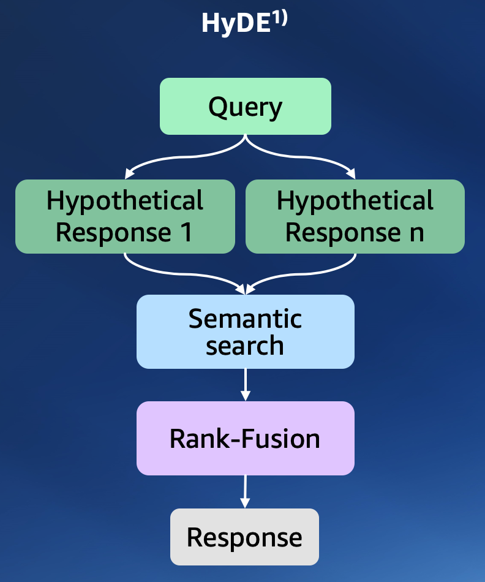
    - Revolutionising Search with Hypothetical Document Embeddings
    - context를 얻을 때, query 바로 이용해서 vector search를 하지 않고 query에 대한 답을 llm에게 얻고(RAG 쓰지 않는다) 이 답을 가지고 vector search를 하여 context를 얻는다.
    - 즉, 질문과 유사한 context를 찾을 것이냐 vs (실제 정답이 아닐지라도) hypothetical 답변과 비슷한 context를 찾을 것이냐 이다.
    - 질문-답변 pair가 (의미상) 너무 다를 때, 이 방법이 잘 동작할 수 있음
    - 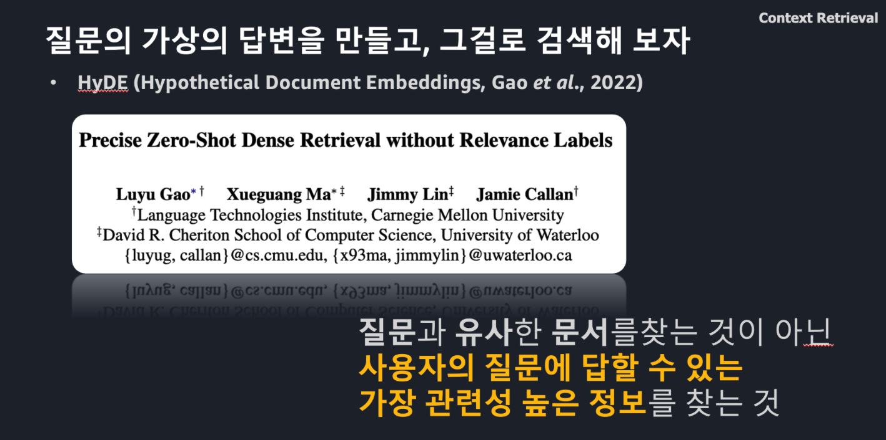
    - 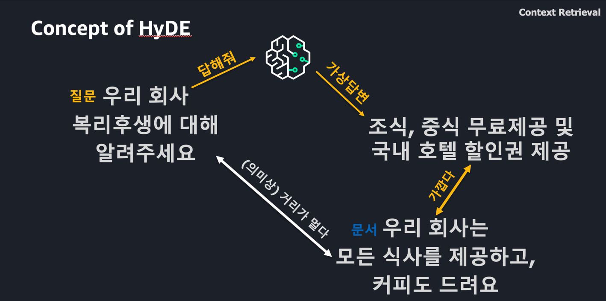
    - [vod] [Advanced RAG 05 - HyDE - Hypothetical Document Embeddings](https://www.youtube.com/watch?v=v_BnBEubv58&list=PL8motc6AQftn-X1HkaGG9KjmKtWImCKJS&index=12)
    - [sample codes - aws] [HyDE](https://github.com/aws-samples/aws-ai-ml-workshop-kr/blob/master/genai/aws-gen-ai-kr/20_applications/02_qa_chatbot/02_rag/04_rag_hyde.ipynb)
    - [blog] [HYDE: Revolutionising Search with Hypothetical Document Embeddings](https://medium.com/prompt-engineering/hyde-revolutionising-search-with-hypothetical-document-embeddings-3474df795af8)
    - [paper] [Precise Zero-Shot Dense Retrieval without Relevance Labels, Luyu *et al*., 2023](https://boston.lti.cs.cmu.edu/luyug/HyDE/HyDE.pdf)
    - [description] [HyDE based semantic search enabled on the OpenAI forum](https://community.openai.com/t/hyde-based-semantic-search-enabled-on-the-openai-forum/361207)
    - [langchain] [template](https://github.com/langchain-ai/langchain/tree/master/templates/hyde) | [implementation](https://github.com/langchain-ai/langchain/blob/master/cookbook/hypothetical_document_embeddings.ipynb) | [retriever](https://js.langchain.com/docs/integrations/retrievers/hyde)
    - [prompt] [query-augmentation-hyde](https://github.com/aws-samples/aws-ai-ml-workshop-kr/blob/master/genai/aws-gen-ai-kr/utils/rag.py)
    
- ##### **
 ReRanker - To address “Lost in Middle”
**
    
    - 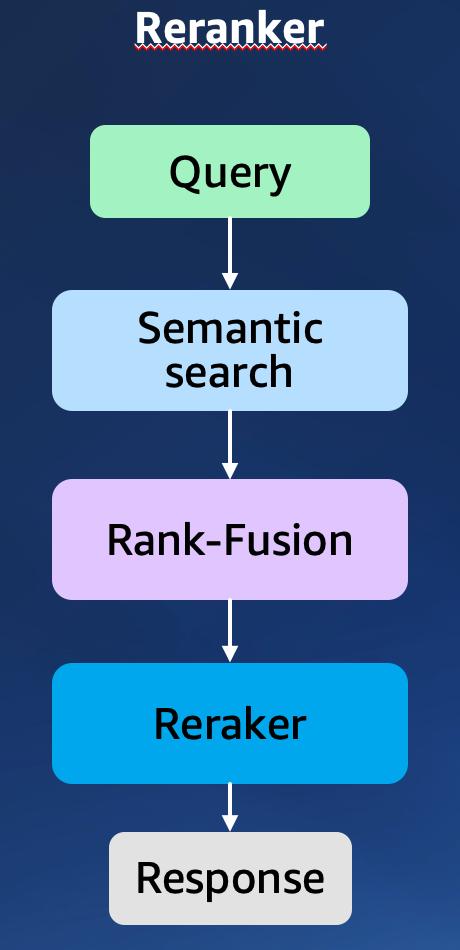
    - [vod] [RAG But Better: Rerankers with Cohere AI](https://www.youtube.com/watch?v=Uh9bYiVrW_s)
    - [sample codes - aws] [ReRanker](https://github.com/aws-samples/aws-ai-ml-workshop-kr/blob/master/genai/aws-gen-ai-kr/20_applications/02_qa_chatbot/02_rag/02_rag_reranker.ipynb)
    - [Korean ReRanker] [git](https://github.com/aws-samples/aws-ai-ml-workshop-kr/tree/master/genai/aws-gen-ai-kr/30_fine_tune/reranker-kr) | [huggingface](https://huggingface.co/Dongjin-kr/ko-reranker)

    - [blog] [Boosting RAG: Picking the Best Embedding & Reranker models](https://blog.llamaindex.ai/boosting-rag-picking-the-best-embedding-reranker-models-42d079022e83)
    - [blog] [Better RAG with LOTR-Lord of Retriever](https://blog.lancedb.com/better-rag-with-lotr-lord-of-retriever-23c8336b9a35)
    - [blog] [Rerankers and Two-Stage Retrieval](https://www.pinecone.io/learn/series/rag/rerankers/)
        - 현재 LLM은 context 많이 넣는다고 좋은것이 아님, 질문에 relevant한 document가 context 상위에 있어야 정확한 정답을 생성 할 수 있음
        - 하지만 semantic search 에서 사용하는 similarity(relevant) score가 정교 할까? (즉, 상위 랭커면 하위 랭커보다 항상 더 질문에 유사한 정보가 맞아?)를 생각해 보자
        - 그렇지 않다.
            - embedding은 meaning behind document를 표현하는 것에 특화되어 있다. 
            - Query와 answer corresponding query 문서가 의미상 항상 같은건 아니다. (HyDE의 가정을 생각해 보자)
            - 그리고 ANNs (Approximate Nearest Neighbor Search) 방식을 사용하기 때문에 정확하지 않아 
        - Reranker는 이러한 문제에 대응할 수 있는 방법이다.
            - reranker는 query와 document를 인풋으로 받고, 그에 대한 relevant score를 output
                - 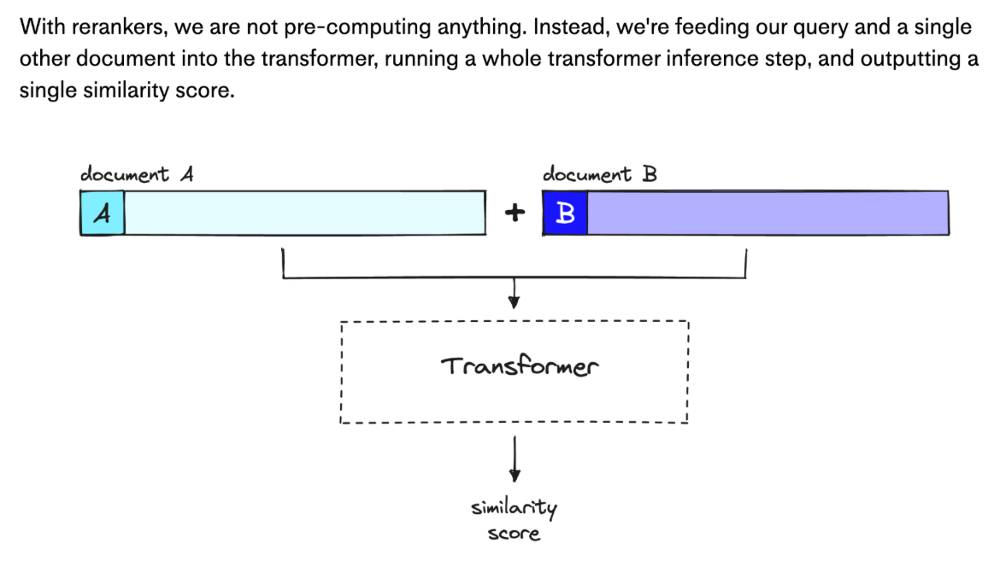
            - 이는 doc에 대한 emb는 미리 다 해놓고, query에 대한 emb 계산 후, 이를 doc emb값과 비교하는 일반적인 semantic search scheme과는 다르다. 
                - 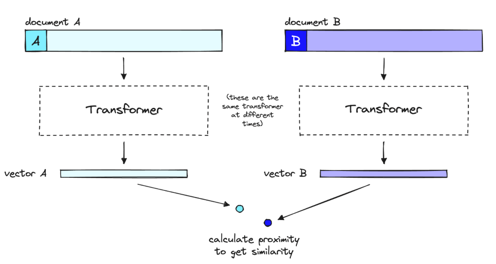
                - 이 방법의 경우 emb vector로 encoding 할 때, query를 고려할 수가 없다. (하나의 인풋으로 들어가면 attention mechanism에 의해서 query와 document 전체에 대한 relevant를 분석할 수 있다)
            - 근데 이 방식은 속도가 느려다 (미리 doc에 대한 embedding 계산을 해 놓는게 아니니까)
            - 그래서 two-stage retrieval system으로 접근한다.
                - 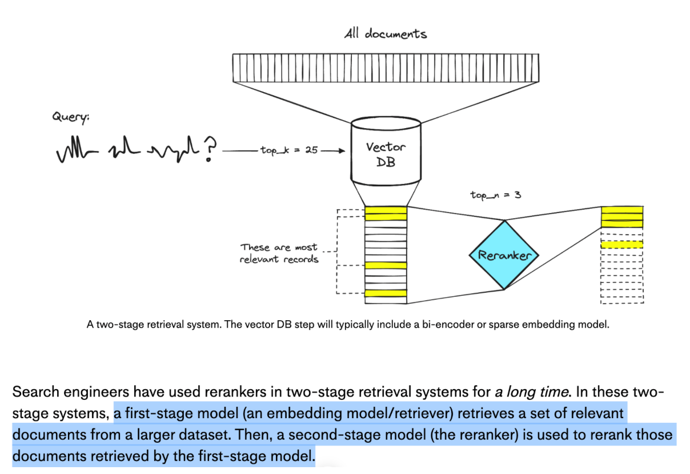

- ##### **
 Parent Documents - To balance between document search and generation performance
**
    - The Limitations of Traditional Embeddings
        - While traditional embeddings capture the essence of content, there’s an inherent challenge. As documents grow in size and complexity, representing their multifaceted nature in a single embedding can lead to a loss of specificity. It’s akin to trying to describe the plot of an epic novel in just one sentence; you might capture the overarching theme, but many nuances and subplots are left out.
        - (한글) 기존 임베딩은 콘텐츠의 본질을 포착하지만 본질적인 문제가 있습니다. 문서의 크기와 복잡성이 증가함에 따라 단일 임베딩으로 문서의 다면적인 특성을 표현하면 구체성이 상실될 수 있습니다. 이는 서사시 소설의 줄거리를 단 한 문장으로 설명하려는 것과 비슷합니다. 중요한 주제를 포착할 수 있지만 많은 뉘앙스와 하위 플롯이 생략됩니다.
    - [vod] [Advanced RAG 02 - Parent Document Retriever](https://www.youtube.com/watch?v=wQEl0GGxPcM)
    - [sample codes - aws] [Parent-Documents](https://github.com/aws-samples/aws-ai-ml-workshop-kr/blob/master/genai/aws-gen-ai-kr/20_applications/02_qa_chatbot/02_rag/05_rag_parent_document.ipynb)
    - [blog] [Advanced RAG- Providing Broader Context to LLMs Using ParentDocumentRetriever](https://medium.aiplanet.com/advanced-rag-providing-broader-context-to-llms-using-parentdocumentretriever-cc627762305a)
    - [blog] [RAG and Parent Document Retrievers: Making Sense of Complex Contexts with Code](https://medium.com/ai-insights-cobet/rag-and-parent-document-retrievers-making-sense-of-complex-contexts-with-code-5bd5c3474a8a)
    - 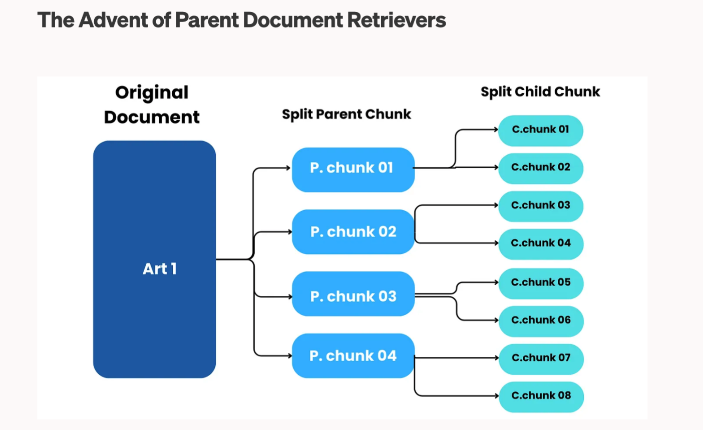
    
- ##### **
 Context Compression - To improve context clarity and address “Lost in Middle”
**
    
    - [vod] [Advanced RAG 04 - Contextual Compressors & Filters](https://www.youtube.com/watch?v=4sRigbRITF0&list=PL8motc6AQftn-X1HkaGG9KjmKtWImCKJS&index=11)
    - [vod] [Overcome Lost In Middle Phenomenon In RAG Using LongContextRetriver](https://medium.aiplanet.com/overcome-lost-in-middle-phenomenon-in-rag-using-longcontextretriver-2334dc022f0e)
    - [blog] [Mastering RAG: A Comprehensive Guide to Document Compression Techniques and Pipelines](https://medium.com/ai-insights-cobet/mastering-rag-a-comprehensive-guide-to-document-compression-techniques-and-pipelines-b2b01ce7a64e)
    - [langchain] [implementation](https://github.com/azharlabs/medium/blob/main/notebooks/Contextual_Compression_%2B_Filtering.ipynb?source=post_page-----b2b01ce7a64e--------------------------------)

#### 
**3. Fine-tuning - training**

- ##### **Reranker**
    - [ko-reranker] [git](https://github.com/aws-samples/aws-ai-ml-workshop-kr/tree/master/genai/aws-gen-ai-kr/30_fine_tune/reranker-kr) | [huggingface](https://huggingface.co/Dongjin-kr/ko-reranker)
    - [BAAI/bge-reranker-large] [example](https://github.com/FlagOpen/FlagEmbedding/blob/master/examples/reranker/README.md) | [run.py](https://github.com/FlagOpen/FlagEmbedding/blob/master/FlagEmbedding/reranker/run.py) | [ddp in sagemaker](https://github.com/huggingface/notebooks/blob/main/sagemaker/04_distributed_training_model_parallelism/sagemaker-notebook.ipynb) | [dataset](https://github.com/FlagOpen/FlagEmbedding/blob/master/FlagEmbedding/reranker/README.md)
    
#### 
**4. Fine-tuning - inference**

- ##### [blog] [Inference Llama 2 models with real-time response streaming using Amazon SageMaker](https://aws.amazon.com/ko/blogs/machine-learning/inference-llama-2-models-with-real-time-response-streaming-using-amazon-sagemaker/)

#### 
**5. Evaluation**

- ##### [blog] [A 3-Step Approach to Evaluate a Retrieval Augmented Generation (RAG)](https://towardsdatascience.com/a-3-step-approach-to-evaluate-a-retrieval-augmented-generation-rag-5acf2aba86de)
    - [Ground truth generator by LLM] [Boosting RAG: Picking the Best Embedding & Reranker models](https://blog.llamaindex.ai/boosting-rag-picking-the-best-embedding-reranker-models-42d079022e83) | [sample codes - aws](https://github.com/aws-samples/aws-ai-ml-workshop-kr/blob/master/genai/aws-gen-ai-kr/20_applications/02_qa_chatbot/05_evaluation/01_create_ground_truth.ipynb) 
        - 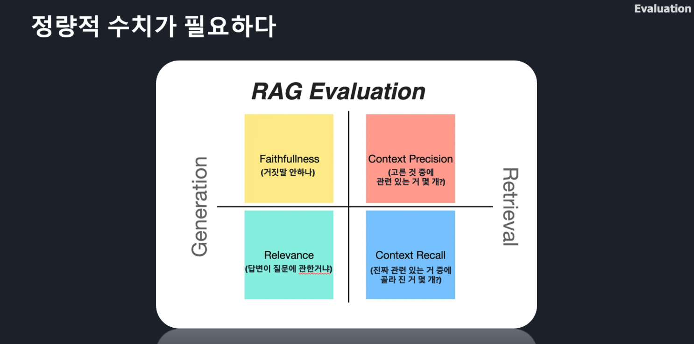
        - 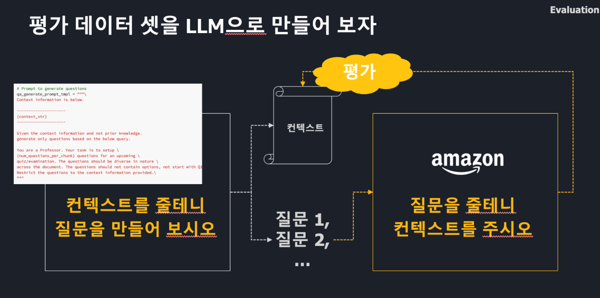
- ##### [blog] [Getting Started with LangSmith: A Step-by-Step Walkthrough](https://medium.com/@lei.shang/getting-started-with-langsmith-a-step-by-step-walkthrough-a5ca09adca43)
- ##### [langchain] [Evaluator](https://python.langchain.com/docs/guides/evaluation/string/criteria_eval_chain)
- ##### [Open source LLM based evaluator]
    - [social](https://www.linkedin.com/posts/llamaindex_gpt-4-is-a-popular-choice-for-llm-evals-activity-7141517817421496320-5oWr/?utm_source=share&utm_medium=member_android)
    - [blog] [LlamaIndex: RAG Evaluation Showdown with GPT-4 vs. Open-Source Prometheus Model](https://blog.llamaindex.ai/llamaindex-rag-evaluation-showdown-with-gpt-4-vs-open-source-prometheus-model-14cdca608277)
    - [sample codes](https://github.com/run-llama/llama_index/blob/main/docs/examples/evaluation/prometheus_evaluation.ipynb)
    - [paper] [PROMETHEUS: INDUCING FINE-GRAINED EVALUATION CAPABILITY IN LANGUAGE MODELS, Seungone *et al.*, 2023](https://arxiv.org/pdf/2310.08491.pdf)
        - 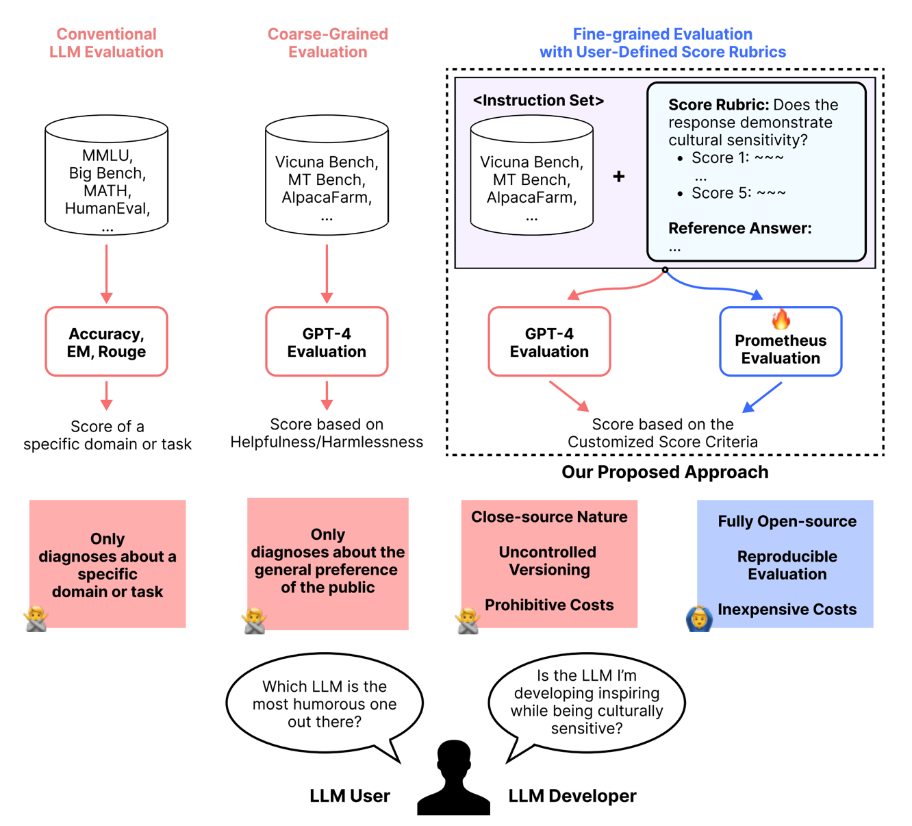
        - 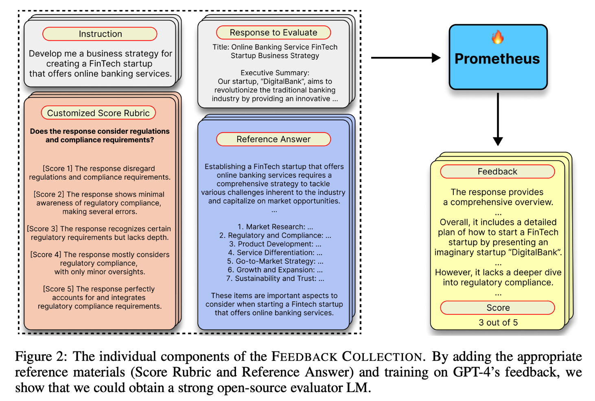
        - 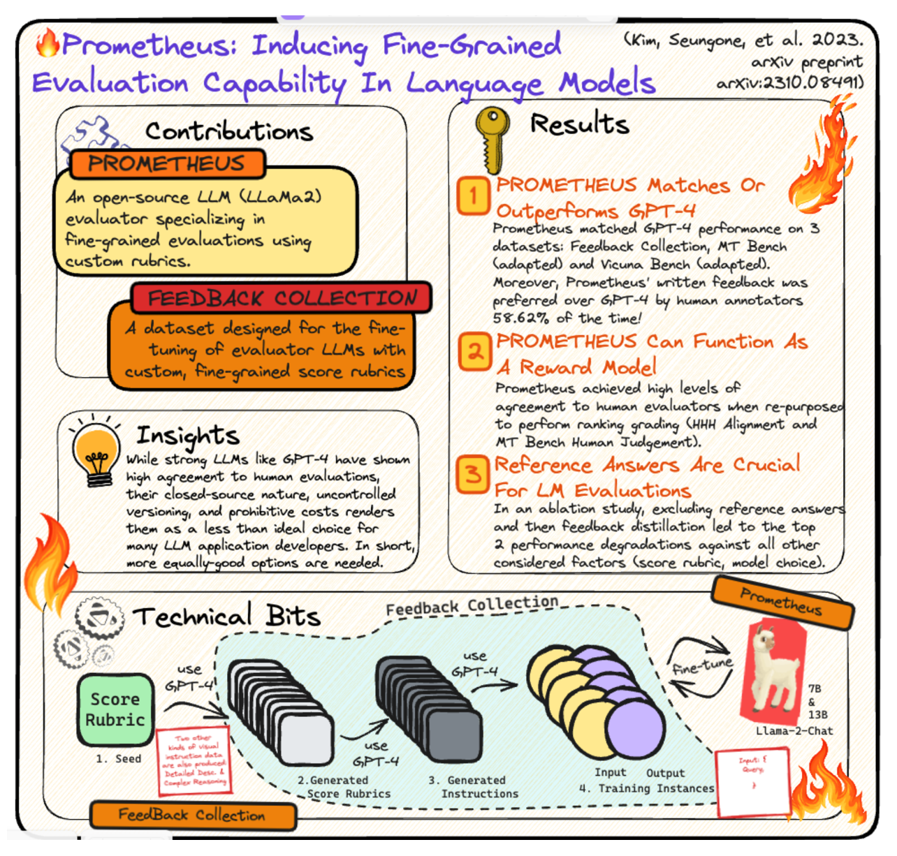
        - 
        - 

- - -

## 
**Citation**

-  If you find this repository useful, please consider giving a star ⭐ and citation

- - -

## 
**Contributors**

-  **Dongjin Jang, Ph.D.** (AWS AI/ML Specislist Solutions Architect) | [Mail](mailto:dongjinj@amazon.com) | [Linkedin](https://www.linkedin.com/in/dongjin-jang-kr/) | [Git](https://github.com/dongjin-ml) | 

- - -

## 
**License**

-  FlagEmbedding is licensed under the [MIT License](https://github.com/aws-samples/aws-ai-ml-workshop-kr/blob/master/LICENSE). 
