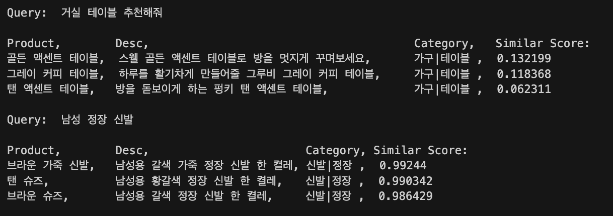
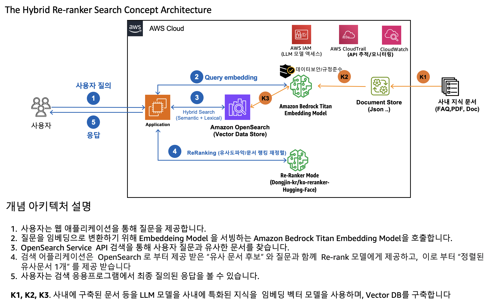
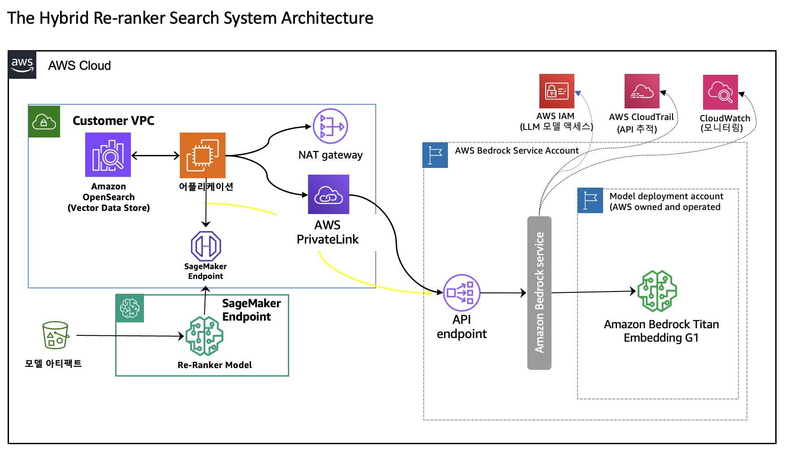
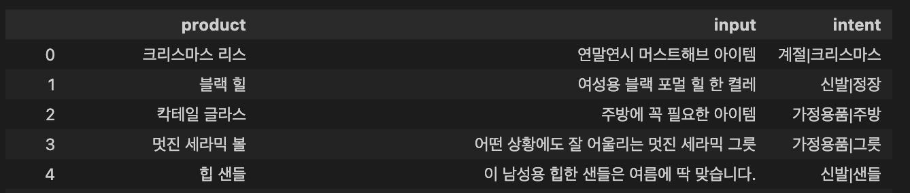

# The Hybrid Re-Ranker Search 시스템

이 워크샵은 Amazon OpenSearch 인덱스를 정의한 후에 4가지의 검색 방법인 Lexical, Semantic, Hybrid, 및 ReRanker 를 통한 검색을 하나씩 해보면서, 각각의 사용법을 익히고, 또한 성능 비교를 합니다. 


결론적으로 Hybrid 결과를 가지고 ReRanker 를 사용하는 방법이 가장 좋은 성능을 나타냅니다.

## 0. 비즈니스 문제
아래와 같이 쇼핑몰의 검색에서 자연어로 검색시에 관련된 상품 목록을 검색 결과로서 보여주는 솔루션을 Amazon Bedrock, Amazon OpenSearch 를 기반한 Hybrid 서치 및  Re-Ranker 모델을 사용을 해서 구축하는 워크샵 입니다. 
또한 검색의 정확도를 측정하기 위해서, 검증 데이터 셋의 "제품 설명" 을 입력으로 제공하고, "카테고리" 를 맞추는 것으로서 정확도 측정을 Lexical, Semantic, Hybrid, Re-Ranker 를 사용하여 측정하여, 정확도 검증을 하는 예시를 보여 줍니다.

#### 아래는 실제 노트북을 실행 후의 결과 입니다. 
- 샘플 데이터가 많지 않은 관계로, 풍부한 검색 결과는 나오지 않습니다. 고객의 기업 데이터로 해보시면 풍부한 검색 결과를 얻을 수 있습니다.
- 

## 1. 솔루션
### 1.1 개념도 아키텍처
- 아래의 개념 아키텍처의 설명 처럼, 제품 관련 데이터를 Amazon OpenSearch 에 Text, Embedding Vector, Metadata 를 저장을 하고, Lexical, Semantic, Hybrid, Re-Ranker 를 통하여 검색을 하는 솔루션 입니다.



### 1.2. 시스템 아키텍처
- 위의 개념도를 시스템 아키텍처로 표현하면 아래와 같이 구성이 됩니다.



## 2. 데이터 셋
데이터 셋은 [AWS Retail Demo Store](https://github.com/aws-samples/retail-demo-store) 에 사용된 데이터를 한글로 번역하여 아래와 같이 2개의 데이터 샛을 생성 했습니다.
- OpenSearch 인덱스 생성용 데이터셋 (375 샘플)
    - 아래에서 input 은 제품 설명이고, intent 는 제품 카테고리 입니다.
    - 
- 검증 데이터 셋 (256 샘플)

## 3. 성능

#### 검증 데이터샛 결과
- 아래의 성능은 진실값 (Intent: 카테고리) 가 있고, 검증 데이터샛의 Input (제품설명) 을 아래 4가지의 방법으로 검색하여 1개의 검색 결과를 가져옵니다. 이 검색 결과가 진실값과 일치하면 correct 이고, 그렇치 않으면 incorrect 으로 계산을 하였습니다.

### 3.1. Retail demo store 데이터 샛 평가
```
Test type: Lexical with Tori, 
	 accuracy: 0.971, total_sample: 375 , correct: 364, incorrec: 11
Test type: Semantic, 
	 accuracy: 0.965, total_sample: 375 , correct: 362, incorrec: 13
Test type: Hybrid, 
	 accuracy: 0.976, total_sample: 375 , correct: 366, incorrec: 9
Test type: Reranker Hybrid, 
	 accuracy: 0.979, total_sample: 375 , correct: 367, incorrec: 8
```
### 3.2. 익명의 다른 데이터 셋으로 평가 결과
```
Test type: Lexical with Tori, 
     accuracy: 0.686, total_sample: 1200 , correct: 823, incorrec: 377
Test type: Semantic, 
     accuracy: 0.654, total_sample: 1200 , correct: 785, incorrec: 415
Test type: Hybrid, 
     accuracy: 0.719, total_sample: 1200 , correct: 863, incorrec: 337
Test type: Reranker Hybrid, 
     accuracy: 0.787, total_sample: 1200 , correct: 944, incorrec: 256
```


## 4. 실습 노트북

- 00_setup_opensearch.ipynb
    - Amazon OpenSearch 설치 가이드 및 인증 정보 셋업 가이드 입니다.
- 01_setup_env.ipynb
    - 필요한 파이썬 패키지를 설치 합니다.            
- 02_deploy_KoSimCSE-embedding.ipynb
    - KoSimCSE 임베딩 모델 서빙을 위한 세이지 메이커에 엔드포인트 생성
- 03_deploy_kor_reranker.ipynb
    - ko-reranker 모델 서빙을 위한 세이지 메이커에 엔드포인트 생성
    - Amazbon Bedrock Titan Embedding Model 사용시 에는 실행 안하셔도 됩니다.
- 04_explore_data.ipynb
    - 주어진 데이터를 확인하고 CSV 파일을 JSON 로 생성합니다.
- 05_store_opensearch.ipynb
    - 오픈 서치 인덱스를 생성하고, JSON 데이터를 저장합니다.
- 06_test_opensearch.ipynb
    - 오픈 서치 인덱스를 Lexical, Semantic, Hybrid, Reranker 를 통하여 검색을 해봅니다.
- 07_evaluate_search_intent.ipynb
    - 검증 데이터 셋으로 검색이 얼마나 잘되는지 확인 합니다.
- 08_analyze_result.ipynb
    - 검증 데어터 셋의 평가 결과를 확인 합니다. 
- 09.CleanUp.ipynb
    - 리소스를 정리 합니다.

---
Contributor: 문곤수 (Gonsoo Moon)