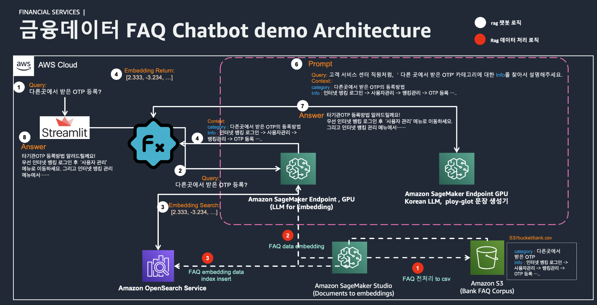

# rag-fsi-data-workshop

## Retrieval Augmented Question & Answering with Amazon SageMaker and Opensearch using LangChain


이 실습에서는 SageMaker Endpoint와 SDK, 그리고 [LangChain](https://python.langchain.com/docs/get_started/introduction) 및 [FAISS](https://faiss.ai/index.html)와 같은 오픈소스 소프트웨어를 통해 이러한 패턴을 구현하는 실무 경험을 쌓을 수 있습니다.


## 개요 
RAG (Retrieval-Augmented Generation)는 최신의 자연어 처리 (NLP) 분야에서 많은 관심을 받고 있는 아키텍처입니다. 기본적으로, RAG는 문제 해결을 위한 정보를 검색(retrieval)하고 그 정보를 바탕으로 문장을 생성(generation)하는 두 가지 과정을 통합합니다. 
이 실습에서는 RAG 아키텍처가 어떻게 Context 기반의 프롬프트 확장을 가능하게 하는지에 대해 설명합니다. 또한, RAG가 어떻게 Amazon Opensearch와 통합되어 외부의 신뢰할 수 있는 데이터베이스나 문서를 검색하는 과정을 강화하는지에 대해 실습합니다.


## Context 기법의 확장
전통적인 Seq2Seq (Sequence-to-Sequence) 모델은 주어진 입력에 대해 출력을 생성하기 위해 고정된 수의 토큰을 사용합니다. 그러나 RAG는 이러한 접근 방식을 확장하여 다양한 문맥 정보를 수집하고 활용할 수 있습니다. 이러한 확장성은 프롬프트 엔지니어링에 큰 유리함을 제공합니다.

### RAG의 프롬프트 확장

<div align="center">
    
</div>

프롬프트 확장이란, 사용자가 제공하는 질문이나 명령어에 대한 반응을 개선하기 위한 방법입니다. RAG를 사용하면, 모델은 문맥에 따라 다양한 외부 정보를 검색할 수 있으며, 이를 통해 보다 정확하고 상세한 응답을 생성할 수 있습니다.

예를 들어, 사용자가 "세계에서 가장 높은 산은 무엇인가요?"라고 물을 경우, 일반적인 Seq2Seq 모델은 사전 학습된 지식만을 바탕으로 답변을 생성합니다. 그러나 RAG 모델은 외부의 신뢰할 수 있는 데이터베이스나 문서를 검색하여, 현재까지 알려진 가장 정확한 정보를 제공할 수 있습니다.

### RAG의 주요 구성 요소

- **문제 질의 (Query)**  
  사용자가 특정 질문이나 문제를 제시합니다.

- **검색 엔진 (Retriever)**  
  주어진 질의에 따라 관련된 문서나 정보를 데이터베이스에서 검색합니다.
    - Amazon OpenSearch의 Faiss vector store를 활용합니다.
    - Faiss의 임베딩 검색은 [`similarity_search_with_score`](https://python.langchain.com/docs/integrations/vectorstores/faiss) 함수를 사용하여 L2 Norm을 기준으로 유사도를 계산합니다.

- **순위 매기기 (Ranking)**  
  검색된 정보를 관련성이 높은 순으로 정렬합니다.
    - 로컬 Faiss 검색의 경우, L2 distance search를 사용하며, 값이 클수록 높은 에러를 나타냅니다.
    - OpenSearch에서는 Faiss의 ranking score를 정규화하여, 값이 클수록 높은 유사도를 나타냅니다.

- **생성 모델 (Generator)**  
  정렬된 문서나 정보를 기반으로 최종 답변을 생성합니다.
    - Ployglot 12.8B 또는 5.8B 한국어 LLM (KULLM 모델)을 사용합니다.

- **응답 (Output)**  
  생성된 답변이 프롬프트 엔지니어링을 거쳐 문장 형태로 사용자에게 반환됩니다.

### RAG와 Amazon Opensearch의 통합
<div align="center">
    
</div>

RAG는 주어진 문맥 또는 프롬프트를 더 잘 이해하고 응답하기 위해 외부 정보를 검색합니다. Amazon Opensearch의 통합은 이 과정을 더욱 강화합니다. Amazon Opensearch를 사용하면, 대규모 데이터를 효율적으로 처리할 수 있습니다. 이를 통해 RAG는 더욱 다양한 문서와 데이터를 검색하여 응답을 생성할 수 있습니다.
Amazon Opensearch의 통합은 RAG 아키텍처의 정보 검색 능력을 더욱 강화할 수 있습니다. RAG를 활용한 LLM은 더욱 다양하고 신뢰할 수 있는 응답을 생성할 수 있게 되어, NLP 분야에서의 응용 가능성이 더욱 확장됩니다.


## 한국어 금융 QnA 챗봇 모델 생성 가이드

### Step 1. SageMaker Endpoint에 Embedding Vector 모델 배포
[보기 - TASK-1_Embedding_Vector_Model_Creation.ipynb](https://github.com/hyeonsangjeon/AWS-LLM-SageMaker/blob/main/RAG-SageMaker/rag-fsi-data-workshop/TASK-1_Embedding_Vector_Model_Creation.ipynb)

1. AWS SageMaker Studio 콘솔에 로그인합니다.
2. SageMaker Studio 로컬에서 embedding tokenizer를 테스트 해봅니다.
3. SageMaker Endpoint에 Embedding Vector 모델을 선택하고 배포를 시작합니다.
4. 모델 배포가 완료되면, 생성된 Endpoint를 확인합니다.

### Step 2. SageMaker Endpoint에 Ployglot 한국어 LLM 5.8B(이벤트엔진계정의 경우) or 12.8B 배포
[보기 - TASK-2_Polyglot_5.8B_Korea_LLM_Model_Creation.ipynb](https://github.com/hyeonsangjeon/AWS-LLM-SageMaker/blob/main/RAG-SageMaker/rag-fsi-data-workshop/TASK-2_Polyglot_5.8B_Korea_LLM_Model_Creation.ipynb)
[보기 - TASK-2-optional_Polyglot_12.8B_Korea_LLM_Model_Creation.ipynb](https://github.com/hyeonsangjeon/AWS-LLM-SageMaker/blob/main/RAG-SageMaker/rag-fsi-data-workshop/TASK-2-optional_Polyglot_12.8B_Korea_LLM_Model_Creation.ipynb)

1. SageMaker 콘솔로 돌아가서 새 모델을 생성합니다.
2. Polyglot 한국어 LLM 5.8B (이벤트엔진 계정의 경우) 또는 12.8B를 선택합니다. (실습 이벤트엔진 계정에서 배포할 수 있는 5.8B모델의 경우 G5.2xlarge GPU1개 인스턴스에서 생성되나 LLM의 성능은 12.8B에 비해 떨어집니다.)
3. SageMaker Endpoint에 한국어 Polyglot LLM 모델 배포를 시작합니다.
4. 배포가 완료되면 새로운 Endpoint를 확인한 다음, 문장요약 테스트를 합니다. 

### Step 3. 한국어 금융 Question & Answering 데이터 로컬 임베딩 검색 테스트
[보기 - TASK-3_FSI_FAQ_Faiss_Vector_Search_Local_Store_Test.ipynb](https://github.com/hyeonsangjeon/AWS-LLM-SageMaker/blob/main/RAG-SageMaker/rag-fsi-data-workshop/TASK-3_FSI_FAQ_Faiss_Vector_Search_Local_Store_Test.ipynb)

1. SageMaker Studio 로컬 환경에서 한국어 금융 QnA 데이터셋을 준비합니다.
2. 앞서 생성한 Embedding Vector 모델의 Endpoint를 사용하여 데이터를 임베딩합니다.
3. 임베딩된 데이터를 Studio 로컬에서 로드한 다음 검색 RAG 테스트를 진행합니다.

### Step 4. SageMaker Opensearch 생성 및 인덱스에 금융 FAQ 임베딩 데이터 입력 검색 테스트 
[보기 - TASK-4_OpenSearch_Creation_and_Vector_Insertion.ipynb](https://github.com/hyeonsangjeon/AWS-LLM-SageMaker/blob/main/RAG-SageMaker/rag-fsi-data-workshop/TASK-4_OpenSearch_Creation_and_Vector_Insertion.ipynb)

1. AWS 콘솔에서 SageMaker Opensearch 서비스를 찾아 들어갑니다.
2. 새 Opensearch 도메인을 생성합니다.
3. 앞서 임베딩한 금융 FAQ 데이터를 SageMaker에 배포된 Embedding Vector 모델 Endpoint를 이용하여 벡터형식으로 Opensearch 인덱스에 입력합니다.
4. 인덱스에 데이터 입력이 완료되면 RAG 검색 테스트를 진행합니다.


### Step 5. Streamlit으로 QnA 챗봇 모델 생성해보기 
[보기 - TASK-5_OpenSearch_LLM_RAG_Streamlit_Chatbot_Example.py](https://github.com/hyeonsangjeon/AWS-LLM-SageMaker/blob/main/RAG-SageMaker/rag-fsi-data-workshop/TASK-5_OpenSearch_LLM_RAG_Streamlit_Chatbot_Example.py)
1. SageMaker Studio의 Jupyter Lab에서 Terminal을 엽니다.
2. Terminal 환경에서 Streamlit관련 패키지들을 설치합니다.
```sh
pip install -r /home/sagemaker-user/AWS-LLM-SageMaker/RAG-SageMaker/rag-fsi-data-workshop/requirements.txt

```
4. Streamlit 앱 파일을 오픈하고, SageMaker Embedding Vector 모델, Ployglot LLM 모델, opensearch_domain_endpoint 정보를 입력 수정합니다.
5. Streamlit을 실행해봅니다.
```sh
streamlit run TASK-5_OpenSearch_LLM_RAG_Streamlit_Chatbot_Example.py
```
6. QnA 챗봇 로직은 알맞게 수정해봅니다. 
7. 앱을 실행하여 챗봇 모델이 잘 동작하는지 테스트합니다.
``` text
Studio의 Jupyter Lab 도메인 URL과 유사한 URL을 사용하여 새 브라우저 탭에서 앱에 액세스할 수 있습니다. 예를 들어 Jupyter Lab URL이
https://t0r5tpibtvoywyw.studio.us-east-1.sagemaker.aws/jupyterlab/default/lab?
인 걍우 Streamlit 앱의 URL은
https://t0r5tpibtvoywyw.studio.us-east-1.sagemaker.aws/jupyterlab/default/proxy/8501/ 입니다. 
(lab이 proxy/8501/로 대체됩니다. 8501/ 마지막 슬레시를 꼭 붙여줍니다.) 이전 단계에서 확인된 포트 번호가 8501과 다른 경우 Streamlit 앱의 URL에 8501 대신 해당 포트 번호를 사용하세요.
```


## 👥 Contributors
- **HyeonSang Jeon** (AWS Solutions Architect) | [Mail](mailto:hsjeon@amazon.com) | [Git](https://github.com/hyeonsangjeon) |

- - -

## 🔑 License
- This is licensed under the [MIT License](https://github.com/aws-samples/aws-ai-ml-workshop-kr/blob/master/LICENSE).