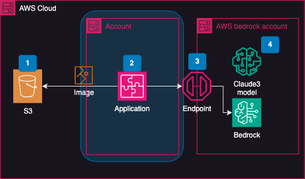

# Image styling recommendation with prompte engineering

이 저장소에는 Anthropic Claude-3 Sonnet 모델을 AWS Bedrock 런타임에서 사용하는 방법을 보여주는 Python 예제 코드가 포함되어 있습니다.



**요구 사항**

* Python 3.7 이상
* AWS 계정 및 자격 증명
* AWS CLI 설치 및 구성

**설치**

1. 이 저장소를 클론하세요.

`git clone https://github.com/aws-samples/anthropic-claude-3-sonnet-bedrock-runtime-example.git`

가상 환경을 생성하고 활성화합니다.

```bash
python3 -m venv venv
source venv/bin/activate
```

필요한 Python 패키지를 설치합니다.

`pip install -r requirements.txt`

**사용 방법**

1. matching_product_claude3.ipynb 파일을 편집하여 AWS 리전과 Claude-3 Sonnet 모델 ID를 업데이트합니다.
2. 스크립트를 실행합니다.


이 예제 코드는 Anthropic Claude-3 Sonnet 모델을 AWS Bedrock 런타임에서 사용하는 방법을 보여줍니다. 텍스트 및 이미지 입력을 제공하고 모델의 출력을 가져옵니다.

**추가 리소스**
* [Anthropic Claude 설명서](https://docs.anthropic.com/claude/docs/intro-to-claude)
* [AWS Bedrock 런타임 설명서](https://docs.aws.amazon.com/ko_kr/bedrock/latest/userguide/service_code_examples_bedrock-runtime.html)