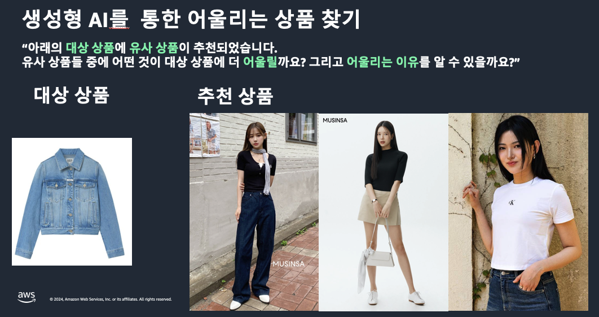
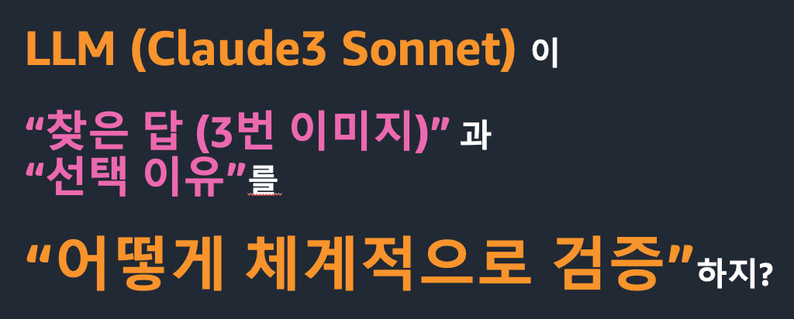

# Evaluation for the Image styling recommendation with prompte engineering

## 1. 비즈니스 문제 정의
- 문제는 크게 아래 두가지로 정의 됩니다. 
    - (1) 생성형 AI를  통한 어울리는 상품 찾기, 
        - 
    - (2) 어울리는 상품을 LLM 이 찾고 "선택 이유" 에 대해서 잘 기술이 되었는지를 체계적으로 검증
        - 

## 2. 솔루션
notebook 폴더에 아래의 두개의 노트북을 실행하면 솔루션을 얻을 수 있습니다.
- 01_matching_codi_product.ipynb
- 02_matching_reason_evaluation.ipynb

## 3.사용 데이터
- 사용한 이미지는 ["무신사"](https://www.musinsa.com/app/?utm_source=google_shopping&utm_medium=sh&utm_campaign=pmax_ongoing&source=GOSHSAP001&utm_source=google_shopping&utm_medium=sh&utm_campaign=pmax_ongoing&source=GOSHSAP001&gad_source=1&gclid=CjwKCAjw57exBhAsEiwAaIxaZv09yuMwcaiR6VnTCsEtLNv2RGHtxR7uGrDROKAFhzW-rUZst1JCEBoC4I8QAvD_BwE) 의 웹사이트에서 다운로드 한 이미지를 사용합니다.

## 4.실험 환경
### 4.1 SageMaker Studio Code Editor
- 노트북은 [SageMaker Studio Code Editor](https://docs.aws.amazon.com/sagemaker/latest/dg/code-editor.html) 및 커널 base (Python 3.10.13) 에서 테스트 되었습니다.
- 실행 환경에 설치된 Python Package 참고 하세요. --> [requirements.txt](requirements.txt)

### 4.2 기타 환경
**요구 사항**

* Python 3.7 이상
* AWS 계정 및 자격 증명
* AWS CLI 설치 및 구성

**설치**

1. 이 저장소를 클론하세요.

`git clone https://github.com/aws-samples/aws-ai-ml-workshop-kr.git`

가상 환경을 생성하고 활성화합니다.

```bash
python3 -m venv venv
source venv/bin/activate
```

필요한 Python 패키지를 설치합니다.

`pip install -r requirements.txt`

다운로드 받은 깃 리포의 해당 폴더로 이동 합니다.
`cd genai/aws-gen-ai-kr/20_applications/05_image_styling_recommendation_with_prompt_engineering/evaluation` 


## A. 참고 자료
- [Building with Anthropic’s Claude 3 on Amazon Bedrock and LangChain](https://medium.com/@dminhk/building-with-anthropics-claude-3-on-amazon-bedrock-and-langchain-%EF%B8%8F-2b842f9c0ca8)
- [Amazon Bedrock 기반 Amorepacific 리뷰 요약 서비스 평가 방법 구현하기](langchain_core.runnables.base.RunnableSequence)
- [Amazon Bedrock model IDs](https://docs.aws.amazon.com/bedrock/latest/userguide/model-ids.html)
이 저장소에는 Anthropic Claude-3 Sonnet 모델을 AWS Bedrock 런타임에서 사용하는 방법을 보여주는 Python 예제 코드가 포함되어 있습니다.
- [Anthropic Claude 설명서](https://docs.anthropic.com/claude/docs/intro-to-claude)
- [AWS Bedrock 런타임 설명서](https://docs.aws.amazon.com/ko_kr/bedrock/latest/userguide/service_code_examples_bedrock-runtime.html)