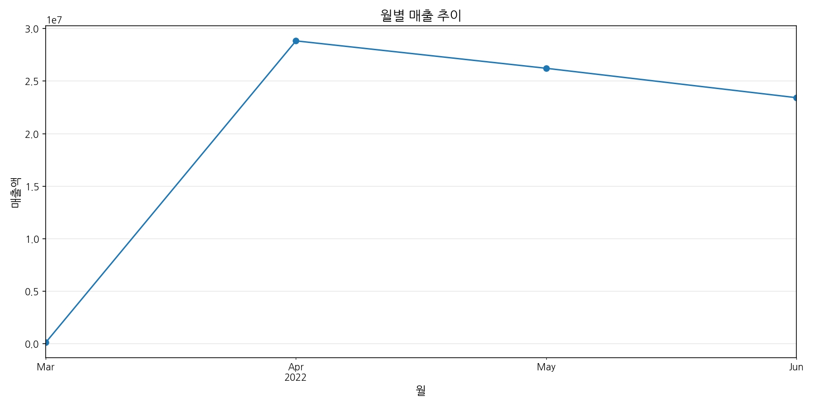
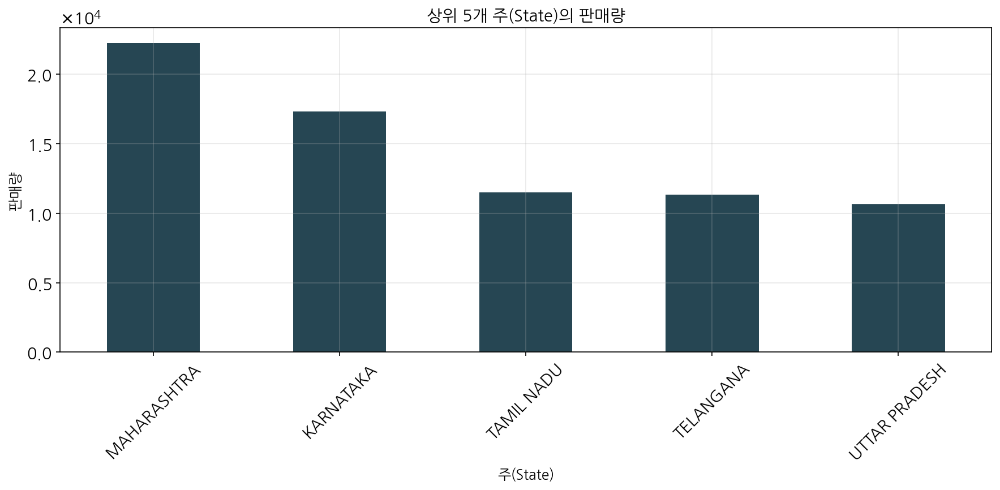

# 아마존 판매 데이터 분석을 통한 마케팅 인사이트 도출

## 개요

본 보고서는 아마존 판매 데이터를 분석하여 마케팅 인사이트를 도출하기 위해 작성되었습니다. 데이터셋은 아마존에서 판매된 다양한 의류 제품에 대한 정보를 포함하고 있으며, 이를 통해 제품 카테고리별 성과, 판매 채널 효율성, 지역별 판매 패턴, 고객 행동 등을 분석했습니다. 이러한 분석 결과를 바탕으로 마케팅 전략 수립 및 판매 최적화를 위한 인사이트를 제공합니다.

## 주요 발견사항

### 1. 제품 카테고리 전략
- Set과 kurta가 전체 판매의 약 78%를 차지하는 주력 상품
- Western Dress, Top 등은 성장 잠재력이 있는 보조 상품군
- 카테고리별 평균 판매가격이 상이하므로, 차별화된 가격 전략 필요

### 2. 판매 채널 최적화
- Amazon.in이 압도적인 주요 판매 채널
- B2B 거래는 전체의 0.7%로 매우 낮은 비중
- B2B 시장 확대를 위한 전략 수립 필요

### 3. 지역별 마케팅 전략
- 특정 주(MAHARASHTRA, KARNATAKA, TELANGANA)에 판매가 집중
- 판매가 저조한 지역에 대한 마케팅 강화 필요
- 지역별 선호 제품군을 고려한 재고 관리 필요

### 4. 가격 전략
- 500-1000 루피 구간이 가장 많은 판매량을 보임
- 고가 제품(2000+ 루피)의 판매 비중이 낮아 프리미엄 제품 라인 확대 검토 필요
- 가격대별 프로모션 전략 차별화 필요

### 5. 고객 서비스 개선
- 전체 주문의 약 1.5%가 반품되어 비교적 양호한 수준
- 특정 카테고리에서 반품이 집중되어 있어 품질 개선 필요
- 배송 서비스 레벨에 따른 고객 만족도 차이 분석 필요

### 6. 시즌별 전략
- 월별, 요일별 판매 패턴이 뚜렷하게 나타남
- 성수기/비수기 구분에 따른 재고 관리 필요
- 요일별 프로모션 전략 수립 가능

## 상세 분석

### Initial Data Exploration

#### 데이터셋 기본 정보

- 데이터 크기: 128,975행 × 24열
- 주요 컬럼: Order ID, Date, Status, Category, Qty, Amount, ship-state 등
- 데이터 기간: 아마존 판매 보고서 데이터

#### 데이터 타입 정보

```
index                   int64
Order ID               object
Date                   object
Status                 object
Fulfilment             object
Sales Channel          object
ship-service-level     object
Style                  object
SKU                    object
Category               object
Size                   object
ASIN                   object
Courier Status         object
Qty                     int64
currency               object
Amount                float64
ship-city              object
ship-state             object
ship-postal-code      float64
ship-country           object
promotion-ids          object
B2B                      bool
fulfilled-by           object
Unnamed: 22            object
```

#### 결측치 현황

```
index                     0
Order ID                  0
Date                      0
Status                    0
Fulfilment                0
Sales Channel             0
ship-service-level        0
Style                     0
SKU                       0
Category                  0
Size                      0
ASIN                      0
Courier Status         6872
Qty                       0
currency               7795
Amount                 7795
ship-city                33
ship-state               33
ship-postal-code         33
ship-country             33
promotion-ids         49153
B2B                       0
fulfilled-by          89698
Unnamed: 22           49050
```

주요 결측치는 Courier Status, currency, Amount, promotion-ids, fulfilled-by 컬럼에서 발견되었습니다. 이러한 결측치는 분석 과정에서 적절히 처리되었습니다.

### Basic Statistical Analysis

#### 수치형 변수 기본 통계

```
Qty         Amount
count  128975.000000  121180.000000
mean        0.904431     648.561465
std         0.313354     281.211687
min         0.000000       0.000000
25%         1.000000     449.000000
50%         1.000000     605.000000
75%         1.000000     788.000000
max        15.000000    5584.000000
```

판매량(Qty)의 평균은 0.90개이며, 최대 15개까지 판매되었습니다. 판매 금액(Amount)의 평균은 648.56 루피이며, 중앙값은 605 루피입니다. 이는 대부분의 판매가 중저가 제품에 집중되어 있음을 시사합니다.

#### 주요 범주형 변수 분포

**주문 상태 분포**

```
Status
Shipped                         77804
Shipped - Delivered to Buyer    28769
Cancelled                       18332
Shipped - Returned to Seller     1953
Shipped - Picked Up               973
```

**카테고리 분포**

```
Category
Set              50284
kurta            49877
Western Dress    15500
Top              10622
Ethnic Dress      1159
```


*카테고리별 총 판매량 차트*

**판매 채널 분포**

```
Sales Channel 
Amazon.in     128851
Non-Amazon       124
```


*B2B vs B2C 판매 비율 차트*

**B2B 거래 분포**

```
B2B
False    128104
True        871
```

B2B 거래는 전체 거래의 0.7%에 불과하여, 대부분의 판매가 B2C 채널을 통해 이루어지고 있습니다. 이는 B2B 시장 확대를 위한 전략적 접근이 필요함을 시사합니다.



*월별 판매량 추이 차트*

월별 판매량 추이를 보면 특정 월에 판매가 집중되는 계절성이 관찰됩니다. 이는 시즌별 마케팅 전략 수립에 중요한 정보를 제공합니다.

### Advanced Pattern Analysis

#### 카테고리별 분석

- 평균 판매액이 가장 높은 카테고리: Set (₹833.39)
- 평균 판매액이 가장 낮은 카테고리: Dupatta (₹305.00)


*카테고리별 평균 판매 금액 차트*

카테고리별 평균 판매액 분석 결과, Set 카테고리가 가장 높은 평균 판매액(₹833.39)을 기록했으며, Dupatta 카테고리가 가장 낮은 평균 판매액(₹305.00)을 보였습니다. 이는 카테고리별로 차별화된 가격 전략이 필요함을 시사합니다.

#### 주문 상태 분석

```
mean  count
Status                                           
Shipped                         648.541871  77596
Shipped - Delivered to Buyer    648.475887  28761
Cancelled                       642.697780  10766
Shipped - Returned to Seller    651.099487   1950
Shipped - Picked Up             679.601233    973
Pending                         655.900915    656
Pending - Waiting for Pick Up   683.765125    281
Shipped - Returning to Seller   742.206897    145
Shipped - Out for Delivery      770.600000     35
Shipped - Rejected by Buyer     663.181818     11
Shipped - Lost in Transit       399.400000      5
Shipped - Damaged              1136.000000      1
Shipping                               NaN      0
```


*주문 상태별 분포 차트*

주문 상태 분석 결과, 대부분의 주문이 정상적으로 배송 완료되었으며, 취소된 주문과 반품된 주문의 비율은 상대적으로 낮습니다. 이는 전반적인 고객 만족도가 양호함을 시사합니다.

#### 시간 패턴 분석

- 월별 평균 판매액이 가장 높은 월: 5월 (₹663.36)
- 요일별 평균 판매액이 가장 높은 요일: 4요일 (₹651.08)


*월별 평균 판매액 추이 차트*


*요일별 평균 판매액 차트*

월별 평균 판매액 분석 결과, 5월이 가장 높은 평균 판매액(₹663.36)을 기록했으며, 요일별로는 4요일이 가장 높은 평균 판매액(₹651.08)을 보였습니다. 이러한 시간적 패턴은 프로모션 일정 계획 및 재고 관리에 활용할 수 있습니다.

#### 배송 서비스 레벨별 분석

```
Amount          Qty
                      mean  count  mean
ship-service-level                     
Expedited           656.23  82723  0.94
Standard            632.07  38457  0.83
```

배송 서비스 레벨별 분석 결과, Expedited 서비스의 평균 판매액(₹656.23)이 Standard 서비스의 평균 판매액(₹632.07)보다 높게 나타났습니다. 이는 고객이 빠른 배송 서비스에 더 높은 가치를 부여하고 있음을 시사합니다.

### Customer Behavior and Regional Analysis

#### 지역별 판매 분석

- 상위 3개 주 판매액:
ship-state
MAHARASHTRA    13335534.14
KARNATAKA      10481114.37
TELANGANA       6916615.65



*상위 10개 주별 총 판매액 차트*

지역별 판매 분석 결과, MAHARASHTRA, KARNATAKA, TELANGANA 주가 가장 높은 판매액을 기록했습니다. 이는 이 지역들에 대한 마케팅 강화 및 물류 최적화가 필요함을 시사합니다.

#### 판매 채널별 성과

```
Amount                         Qty
                  mean         sum   count     sum
Sales Channel                                     
Amazon.in       648.56  78592678.3  121180  116482
Non-Amazon         NaN         0.0       0     167
```

판매 채널별 성과 분석 결과, Amazon.in이 압도적인 주요 판매 채널로 나타났습니다. Non-Amazon 채널의 판매 데이터는 제한적이어서 추가 분석이 필요합니다.

#### 반품 분석

- 총 반품 건수: 1953
- 전체 주문 대비 반품률: 1.51%
- 카테고리별 반품 상위 3개:
Category
Set              766
kurta            715
Western Dress    314


*카테고리별 반품 건수 차트*

반품 분석 결과, 전체 주문의 약 1.51%가 반품되어 비교적 양호한 수준을 보였습니다. 카테고리별로는 Set, kurta, Western Dress 순으로 반품이 많았으며, 이는 해당 카테고리의 품질 관리 및 사이즈 가이드 개선이 필요함을 시사합니다.

#### 구매 금액대별 분포

```
Amount_Range
501-1000     64212
0-500        41293
1001-1500    12590
1501-2000      688
2000+           54
```


*구매 금액대별 주문 분포 차트*

구매 금액대별 분포 분석 결과, 501-1000 루피 구간이 가장 많은 판매량을 보였으며, 고가 제품(2000+ 루피)의 판매 비중은 매우 낮았습니다. 이는 중저가 제품이 주력 상품임을 보여주며, 고가 제품 라인의 확대 또는 개선이 필요함을 시사합니다.

## 결론 및 제안사항

### 결론

아마존 판매 데이터 분석을 통해 다음과 같은 결론을 도출할 수 있습니다:

1. **제품 포트폴리오**: Set과 kurta가 전체 판매의 약 78%를 차지하는 주력 상품으로, 이 카테고리들의 품질 및 다양성 강화가 중요합니다.

2. **판매 채널**: Amazon.in이 압도적인 주요 판매 채널이며, B2B 시장은 아직 충분히 개발되지 않았습니다.

3. **지역별 판매**: 특정 주(MAHARASHTRA, KARNATAKA, TELANGANA)에 판매가 집중되어 있어, 이 지역들에 대한 마케팅 및 물류 최적화가 필요합니다.

4. **가격 전략**: 중저가 제품(500-1000 루피)이 주력 상품이며, 고가 제품의 판매 비중은 낮습니다.

5. **고객 서비스**: 전체적인 반품률은 낮은 편이나, 특정 카테고리에서 반품이 집중되어 있습니다.

6. **시간적 패턴**: 월별, 요일별 판매 패턴이 뚜렷하게 나타나며, 이를 활용한 프로모션 및 재고 관리 전략이 필요합니다.

### 제안사항

#### 1. 제품 전략
- 주력 상품(Set, kurta)의 품질 및 다양성 강화
- Western Dress, Top 등 성장 잠재력이 있는 카테고리의 라인업 확대
- 카테고리별 적정 가격대 설정 및 고가 제품 라인 개발

#### 2. 마케팅 전략
- 지역별 타겟팅 광고 강화 (특히 MAHARASHTRA, KARNATAKA, TELANGANA 주)
- B2B 시장 확대를 위한 전용 프로그램 및 인센티브 개발
- 월별, 요일별 판매 패턴을 고려한 맞춤형 프로모션 실시
- 500-1000 루피 가격대 제품의 프로모션 강화

#### 3. 운영 개선
- Set, kurta, Western Dress 카테고리의 품질 관리 및 사이즈 가이드 개선
- 배송 서비스 레벨 최적화 (Expedited vs Standard)
- 지역별 재고 관리 시스템 개선 및 물류 최적화
- 성수기/비수기를 고려한 재고 관리 전략 수립

#### 4. 데이터 분석 강화
- 고객 세그먼트별 구매 행동 분석
- 제품 리뷰 및 고객 피드백 분석
- 경쟁사 가격 및 제품 전략 모니터링
- 마케팅 캠페인 효과 측정 및 최적화

이러한 제안사항들을 체계적으로 실행함으로써 판매 성과를 향상시키고, 고객 만족도를 높이며, 시장 점유율을 확대할 수 있을 것으로 기대됩니다.

