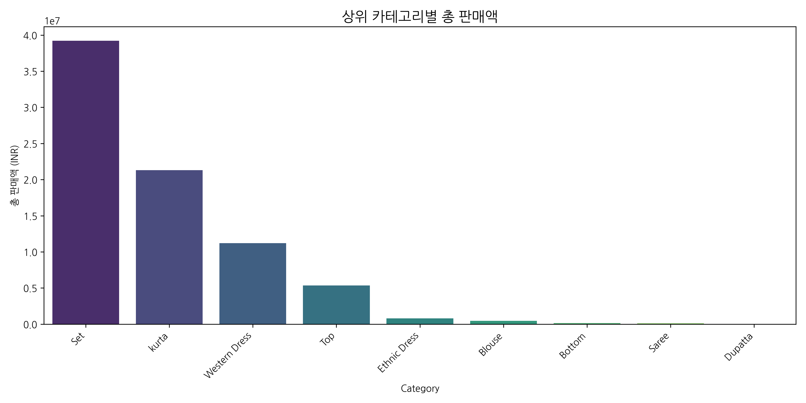
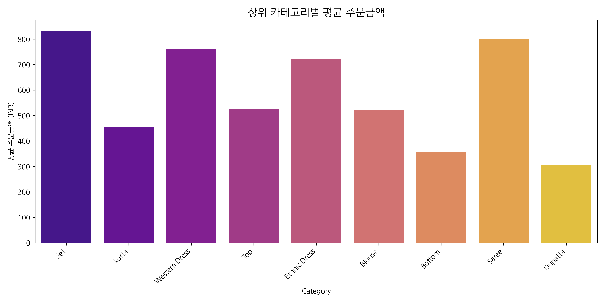
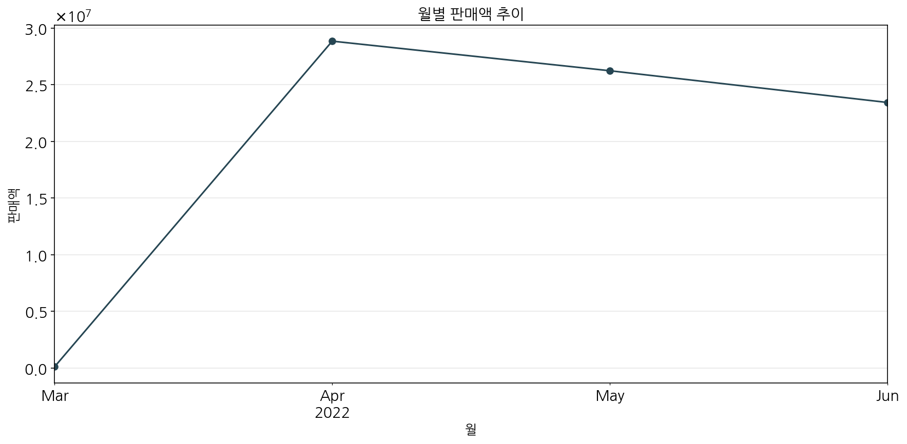
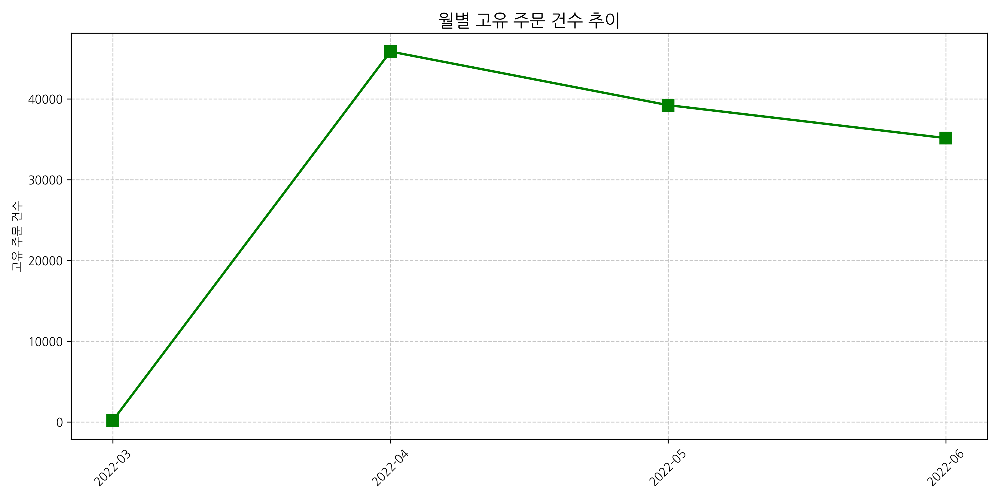
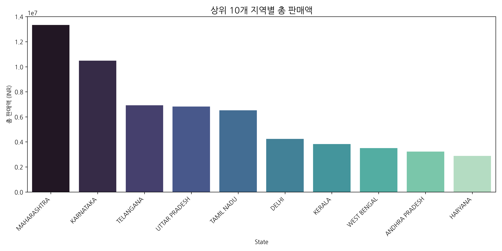
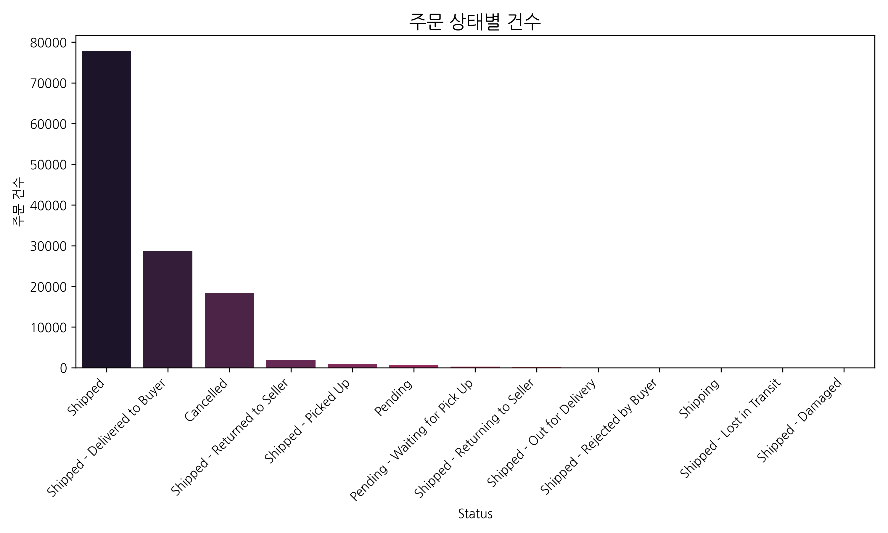
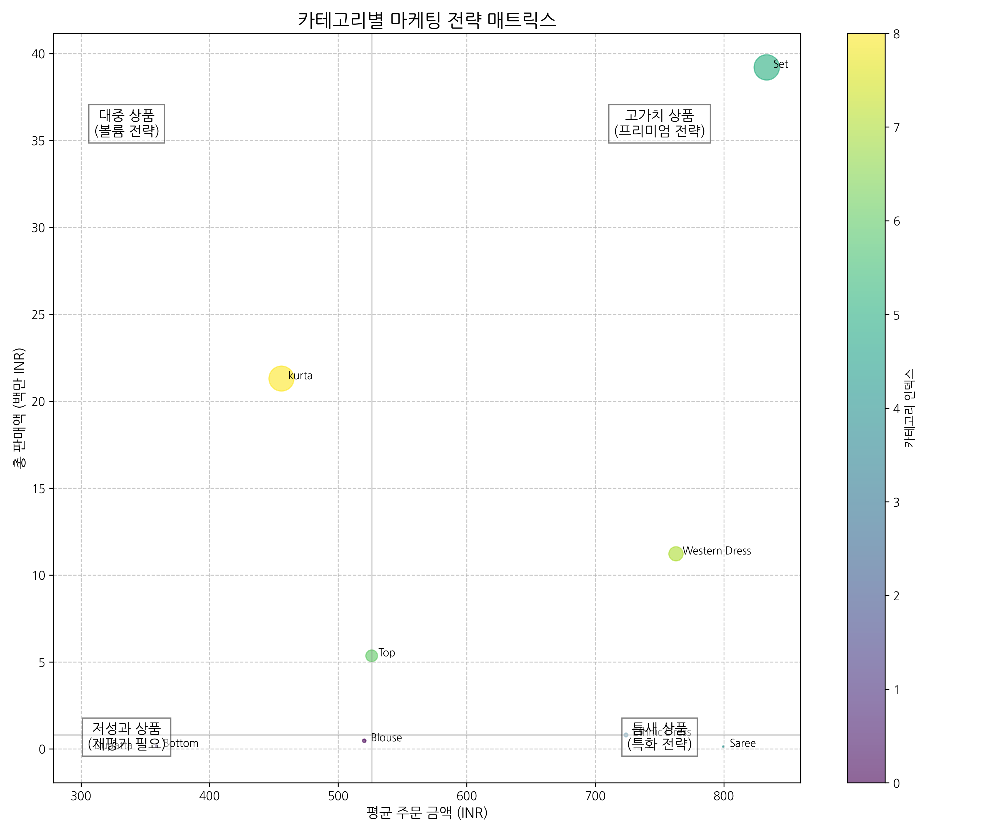

# 아마존 상품판매 데이터 분석 및 마케팅 인사이트

## 목차
1. [개요](#개요)
2. [주요 발견](#주요-발견)
3. [카테고리별 판매 분석](#카테고리별-판매-분석)
4. [시간별 판매 추이 분석](#시간별-판매-추이-분석)
5. [지역별 판매 분석](#지역별-판매-분석)
6. [판매 채널 및 주문 상태 분석](#판매-채널-및-주문-상태-분석)
7. [마케팅 인사이트 도출](#마케팅-인사이트-도출)
8. [결론 및 제언](#결론-및-제언)

## 개요

본 보고서는 아마존 인도의 판매 데이터를 분석하여 마케팅 인사이트를 도출하는 것을 목표로 합니다. 분석 대상은 `Amazon_Sale_Report.csv` 파일이며, 카테고리별 판매 분석, 시간별 판매 추이, 지역별 판매 분포, 판매 채널 및 주문 상태 분석 등을 수행하였습니다. 이를 통해 도출된 인사이트는 향후 마케팅 전략 수립에 활용될 수 있습니다.

## 주요 발견

분석을 통해 다음과 같은 핵심 인사이트를 도출하였습니다:

1. **카테고리별 매출 분석**: 'Set' 카테고리가 약 3,920만의 매출로 전체 매출의 가장 큰 비중을 차지하며, 평균 주문 금액(833.39)도 가장 높습니다. 'Kurta'와 'Western Dress'가 각각 2위와 3위의 매출을 기록했습니다.

2. **주문 빈도**: 'Set'(47,042건)과 'Kurta'(46,717건) 카테고리가 압도적인 주문량을 보이며, 'Western Dress'가 14,704건으로 3위를 차지합니다.

3. **지역별 매출 분포**: 마하라슈트라(Maharashtra) 주가 가장 높은 매출을 기록했으며, 카르나타카(Karnataka)와 텔랑가나(Telangana) 주가 그 뒤를 이었습니다.

4. **판매 채널**: 판매의 99.9%가 Amazon.in을 통해 이루어지고 있어 판매 채널 다변화 필요성이 제기됩니다.

5. **B2B vs B2C**: 전체 주문 중 99.3%가 B2C 판매로, B2B 시장 확대 가능성이 있습니다.

## 카테고리별 판매 분석

카테고리별 총 판매액, 평균 주문 금액, 주문 건수를 분석하여 핵심 카테고리와 수익성을 파악

카테고리별 판매 분석 결과:
        Category  Total_Sales  Average_Order  Order_Count
5            Set  39204124.03     833.385571        47042
8          kurta  21299546.70     455.927108        46717
7  Western Dress  11216072.69     762.790580        14704
6            Top   5347792.30     526.098603        10165
3   Ethnic Dress    791217.66     723.895389         1093
0         Blouse    458408.18     520.327106          881
1         Bottom    150667.98     358.733286          420
4          Saree    123933.76     799.572645          155
2        Dupatta       915.00     305.000000            3

Generated Files:
- ./artifacts/category_total_sales.png : 카테고리별 총 판매액 차트
- ./artifacts/category_avg_order.png : 카테고리별 평균 주문금액 차트
- ./artifacts/category_order_count.png : 카테고리별 주문 건수 차트

카테고리별 총 판매액, 평균 주문 금액, 주문 건수를 분석하여 핵심 카테고리와 수익성을 파악

카테고리별 판매 분석 결과:
        Category  Total_Sales  Average_Order  Order_Count
5            Set  39204124.03     833.385571        47042
8          kurta  21299546.70     455.927108        46717
7  Western Dress  11216072.69     762.790580        14704
6            Top   5347792.30     526.098603        10165
3   Ethnic Dress    791217.66     723.895389         1093
0         Blouse    458408.18     520.327106          881
1         Bottom    150667.98     358.733286          420
4          Saree    123933.76     799.572645          155
2        Dupatta       915.00     305.000000            3

### 카테고리별 총 판매액

위 차트에서 볼 수 있듯이, 'Set' 카테고리가 약 3,920만의 매출로 압도적인 1위를 차지하고 있으며, 'Kurta'가 약 2,130만으로 2위, 'Western Dress'가 약 1,122만으로 3위를 기록했습니다.

### 카테고리별 평균 주문금액

평균 주문금액 측면에서는 'Set' 카테고리가 833.39로 가장 높은 수치를 보이고 있으며, 'Saree'(799.57)와 'Western Dress'(762.79)가 그 뒤를 이어 높은 단가를 유지하고 있습니다.

### 카테고리별 주문 건수

주문 건수 측면에서는 'Set'(47,042건)과 'Kurta'(46,717건)가 압도적인 수치를 보이고 있으며, 'Western Dress'가 14,704건으로 3위를 차지하고 있습니다. 반면 'Dupatta', 'Saree', 'Bottom' 등은 매우 낮은 주문 빈도를 보이고 있습니다.

## 시간별 판매 추이 분석

월별 판매액과 주문 건수 추이를 분석하여 판매 패턴과 성장세를 확인

월별 판매 추이 분석 결과:
     Month  Total_Sales  Order_Count  Unique_Orders
0  2022-03    101683.85          162            158
1  2022-04  28838708.32        46068          45858
2  2022-05  26226476.75        39536          39221
3  2022-06  23425809.38        35414          35141

Generated Files:
- ./artifacts/monthly_sales_trend.png : 월별 판매액 추이 차트
- ./artifacts/monthly_order_trend.png : 월별 주문 건수 추이 차트

월별 판매액과 주문 건수 추이를 분석하여 판매 패턴과 성장세를 확인

월별 판매 추이 분석 결과:
     Month  Total_Sales  Order_Count  Unique_Orders
0  2022-03    101683.85          162            158
1  2022-04  28838708.32        46068          45858
2  2022-05  26226476.75        39536          39221
3  2022-06  23425809.38        35414          35141

### 월별 총 판매액 추이

2022년 3월부터 6월까지의 판매 추이를 살펴보면, 4월에 가장 높은 판매액(약 2,884만)을 기록한 후 5월과 6월에 소폭 하락하는 추세를 보이고 있습니다. 이는 특정 계절성 요인이나 프로모션 효과가 있었을 가능성을 시사합니다.

### 월별 주문 건수 추이

월별 주문 건수도 판매액과 유사한 패턴을 보이고 있으며, 4월에 가장 많은 주문(45,858건)이 발생했습니다. 판매액과 주문 건수가 유사한 추세를 보이는 것으로 보아, 할인 정책보다는 계절적 요인이 더 크게 작용했을 가능성이 있습니다.

## 지역별 판매 분석

인도 내 주(State)별 매출 분포를 분석하여 핵심 시장과 성장 가능 지역을 파악

주요 지역별 판매 분석 결과 (상위 10개 주):
             State  Total_Sales  Order_Count  Unique_Orders
28     MAHARASHTRA  13335534.14        21073          20780
23       KARNATAKA  10481114.37        16394          16182
57       TELANGANA   6916615.65        10637          10405
59   UTTAR PRADESH   6816642.08         9947          10062
56      TAMIL NADU   6515650.11        10809          10519
14           DELHI   4235215.97         6393           6359
24          KERALA   3830227.58         6151           6105
61     WEST BENGAL   3507880.44         5547           5653
1   ANDHRA PRADESH   3219831.72         5055           4979
19         HARYANA   2882092.99         4188           4142

Generated Files:
- ./artifacts/state_total_sales.png : 지역별 판매액 차트

인도 내 주(State)별 매출 분포를 분석하여 핵심 시장과 성장 가능 지역을 파악

주요 지역별 판매 분석 결과 (상위 10개 주):
             State  Total_Sales  Order_Count  Unique_Orders
28     MAHARASHTRA  13335534.14        21073          20780
23       KARNATAKA  10481114.37        16394          16182
57       TELANGANA   6916615.65        10637          10405
59   UTTAR PRADESH   6816642.08         9947          10062
56      TAMIL NADU   6515650.11        10809          10519
14           DELHI   4235215.97         6393           6359
24          KERALA   3830227.58         6151           6105
61     WEST BENGAL   3507880.44         5547           5653
1   ANDHRA PRADESH   3219831.72         5055           4979
19         HARYANA   2882092.99         4188           4142

### 상위 10개 지역별 총 판매액

인도 내 주(State)별 매출 분포를 분석한 결과, 마하라슈트라(Maharashtra) 주가 약 1,334만의 매출로 가장 높은 수치를 기록했으며, 카르나타카(Karnataka)가 약 1,048만으로 2위, 텔랑가나(Telangana)가 약 692만으로 3위를 차지했습니다. 

상위 5개 주(마하라슈트라, 카르나타카, 텔랑가나, 우타르 프라데시, 타밀 나두)가 전체 매출의 약 60%를 차지하고 있어, 이들 지역에 대한 집중적인 마케팅 전략이 필요합니다.

## 판매 채널 및 주문 상태 분석

판매 채널 비중, 주문 상태 분포, B2B/B2C 주문 비율 등을 분석하여 유통 전략과 서비스 품질 개선 포인트 도출

판매 채널 분석 결과:
  Sales_Channel   Count
0     Amazon.in  128851
1    Non-Amazon     124

주문 상태 분석 결과 (상위 5개):
                         Status  Count
0                       Shipped  77804
1  Shipped - Delivered to Buyer  28769
2                     Cancelled  18332
3  Shipped - Returned to Seller   1953
4           Shipped - Picked Up    973

B2B vs B2C 주문 비율:
     B2B   Count
0  False  128104
1   True     871

Generated Files:
- ./artifacts/sales_channel_pie.png : 판매 채널별 주문 비율 차트
- ./artifacts/order_status_counts.png : 주문 상태별 건수 차트
- ./artifacts/b2b_vs_b2c_pie.png : B2B vs B2C 주문 비율 차트
- ./artifacts/fulfillment_counts.png : 배송 방식별 주문 건수 차트

판매 채널 비중, 주문 상태 분포, B2B/B2C 주문 비율 등을 분석하여 유통 전략과 서비스 품질 개선 포인트 도출

판매 채널 분석 결과:
  Sales_Channel   Count
0     Amazon.in  128851
1    Non-Amazon     124

주문 상태 분석 결과 (상위 5개):
                         Status  Count
0                       Shipped  77804
1  Shipped - Delivered to Buyer  28769
2                     Cancelled  18332
3  Shipped - Returned to Seller   1953
4           Shipped - Picked Up    973

B2B vs B2C 주문 비율:
     B2B   Count
0  False  128104
1   True     871

### 판매 채널별 주문 비율

판매 채널 분석 결과, 압도적 대다수(99.9%)의 주문이 Amazon.in을 통해 이루어지고 있으며, 'Non-Amazon' 채널은 전체의 0.1%(124건)에 불과합니다. 이는 현재 판매 전략이 아마존에 과도하게 의존하고 있음을 보여주며, 리스크 분산을 위해 다른 판매 채널을 개발할 필요성을 시사합니다.

### 주문 상태별 건수

주문 상태 분석 결과, 전체 주문의 약 60.3%가 'Shipped' 상태이며, 'Shipped - Delivered to Buyer'가 22.3%, 'Cancelled'가 14.2%를 차지하고 있습니다. 특히 취소율(14.2%)이 높은 것은 주목할 만한 점으로, 이에 대한 원인 분석과 개선 전략이 필요합니다.

### B2B vs B2C 주문 비율

B2B와 B2C 주문 비율을 분석한 결과, 현재 주문의 99.3%(128,104건)가 B2C(개인 소비자) 판매인 반면, B2B(기업 간 거래)는 0.7%(871건)에 불과합니다. B2B 시장은 상대적으로 덜 경쟁적이며 대량 구매가 이루어질 가능성이 높아, 향후 성장 가능성이 큰 영역으로 볼 수 있습니다.

## 마케팅 인사이트 도출

앞선 분석을 종합하여 3가지 주요 마케팅 인사이트를 도출 및 시각화

주요 마케팅 인사이트:

1. 카테고리별 매출 분포:
   - Set 카테고리가 약 3,920만의 매출액으로 전체 매출의 가장 큰 비중을 차지
   - Kurta가 약 2,130만으로 두 번째로 높은 매출 기록
   - Western Dress가 약 1,122만으로 세 번째 순위

2. 평균 주문금액:
   - Set 카테고리가 833.39로 가장 높은 평균 주문금액을 보임
   - Saree(799.57)와 Western Dress(762.79)가 그 뒤를 이어 높은 단가를 보임
   - Bottom(358.73)과 Dupatta(305.00)는 상대적으로 낮은 단가를 보임

3. 주문 빈도:
   - Set(47,042건)과 Kurta(46,717건)가 압도적으로 많은 주문 건수를 기록
   - Western Dress가 14,704건으로 세 번째로 많은 주문량을 보임
   - Dupatta, Saree 등은 매우 낮은 주문 빈도를 보임

마케팅 인사이트:
1. Set 카테고리는 높은 단가와 많은 주문량을 동시에 보유하고 있어, 핵심 상품군으로서 지속적인 프로모션과 재고 관리가 필요합니다.
2. Kurta는 상대적으로 낮은 단가에도 불구하고 높은 주문량을 보이고 있어, 대중적인 상품군으로서의 가치가 있습니다.
3. Western Dress는 중간 정도의 주문량에 비해 높은 단가를 유지하고 있어, 프리미엄 상품군으로의 포지셔닝이 가능합니다.

Generated Files:
- ./artifacts/marketing_insights.json : 마케팅 인사이트 데이터
- ./artifacts/marketing_strategy_matrix.png : 카테고리별 마케팅 전략 매트릭스

앞선 분석을 종합하여 3가지 주요 마케팅 인사이트를 도출 및 시각화

주요 마케팅 인사이트:

1. 카테고리별 매출 분포:
   - Set 카테고리가 약 3,920만의 매출액으로 전체 매출의 가장 큰 비중을 차지
   - Kurta가 약 2,130만으로 두 번째로 높은 매출 기록
   - Western Dress가 약 1,122만으로 세 번째 순위

2. 평균 주문금액:
   - Set 카테고리가 833.39로 가장 높은 평균 주문금액을 보임
   - Saree(799.57)와 Western Dress(762.79)가 그 뒤를 이어 높은 단가를 보임
   - Bottom(358.73)과 Dupatta(305.00)는 상대적으로 낮은 단가를 보임

3. 주문 빈도:
   - Set(47,042건)과 Kurta(46,717건)가 압도적으로 많은 주문 건수를 기록
   - Western Dress가 14,704건으로 세 번째로 많은 주문량을 보임
   - Dupatta, Saree 등은 매우 낮은 주문 빈도를 보임

마케팅 인사이트:
1. Set 카테고리는 높은 단가와 많은 주문량을 동시에 보유하고 있어, 핵심 상품군으로서 지속적인 프로모션과 재고 관리가 필요합니다.
2. Kurta는 상대적으로 낮은 단가에도 불구하고 높은 주문량을 보이고 있어, 대중적인 상품군으로서의 가치가 있습니다.
3. Western Dress는 중간 정도의 주문량에 비해 높은 단가를 유지하고 있어, 프리미엄 상품군으로의 포지셔닝이 가능합니다.

### 카테고리별 마케팅 전략 매트릭스

위 매트릭스는 각 카테고리의 평균 주문 금액(x축), 총 판매액(y축), 주문 건수(버블 크기)를 기준으로 마케팅 전략 방향을 제시합니다:

1. **고가치 상품(프리미엄 전략)**: 'Set'과 'Western Dress'는 높은 평균 주문 금액과 높은 판매액을 보이는 고가치 상품으로, 프리미엄 마케팅 전략이 효과적입니다.

2. **대중 상품(볼륨 전략)**: 'Kurta'는 상대적으로 낮은 평균 주문 금액에도 불구하고 높은 판매량과 판매액을 기록하고 있어, 볼륨 중심의 마케팅 전략이 적합합니다.

3. **틈새 상품(특화 전략)**: 'Saree'와 'Ethnic Dress'는 높은 평균 주문 금액을 가지고 있으나 판매량은 적어, 특정 니치 마켓을 대상으로 하는 특화 전략이 필요합니다.

4. **저성과 상품(재평가 필요)**: 'Bottom'과 'Dupatta' 등은 낮은 판매량과 낮은 평균 주문 금액을 보이고 있어, 해당 카테고리에 대한 재평가 또는 리뉴얼이 필요합니다.

## 결론 및 제언

본 분석을 바탕으로 다음과 같은 마케팅 전략을 제안합니다:

### 1. 카테고리별 차별화 전략
- **Set 카테고리**: 높은 단가와 많은 주문량을 보유한 핵심 상품군으로, 프리미엄 이미지를 강화하고 재고 다양성을 확대하며 번들 판매 전략을 고려해야 합니다.
- **Kurta 카테고리**: 대중적 상품군으로서 가격 경쟁력을 유지하면서 물량 확보 및 다양한 프로모션을 통해 매출 증대를 도모해야 합니다.
- **Western Dress 카테고리**: 높은 단가를 유지하고 있어 프리미엄 상품군으로 포지셔닝하되, 품질과 디자인에 더 투자하여 부가가치를 높여야 합니다.

### 2. 지역별 마케팅 전략 최적화
- 마하라슈트라, 카르나타카, 텔랑가나 등 상위 매출 지역에 대한 타겟 마케팅을 강화합니다.
- 지역별 선호 상품과 구매 패턴을 분석하여 맞춤형 재고 관리 및 마케팅 메시지를 개발합니다.
- 저성과 지역에 대한 특별 프로모션 및 인지도 향상 캠페인을 실시합니다.

### 3. 판매 채널 다각화
- 현재 Amazon.in에 99.9% 의존하고 있는 판매 구조를 다변화하기 위해 다른 e-커머스 플랫폼 진출을 고려합니다.
- 자체 온라인 스토어 구축을 통해 직접 판매 채널을 확보하고 수수료 비용을 절감합니다.
- 오프라인 소매점과의 파트너십을 통해 옴니채널 전략을 구축합니다.

### 4. B2B 시장 확대
- 현재 0.7%에 불과한 B2B 판매를 확대하기 위해 기업 고객 대상 마케팅을 강화합니다.
- 대량 구매 시 할인, 맞춤형 서비스 등 B2B 고객 특화 혜택을 개발합니다.
- 호텔, 리조트, 기업 유니폼 등 잠재적 B2B 시장을 타겟팅합니다.

### 5. 주문 취소율 감소 전략
- 14.2%에 달하는 주문 취소율의 원인을 분석하고 개선 방안을 마련합니다.
- 제품 설명과 사진의 정확성을 높여 고객 기대와 실제 제품 간의 격차를 줄입니다.
- 배송 시간, 재고 관리를 개선하여 취소 사유를 최소화합니다.

이러한 전략을 통해 기존의 강점은 강화하고 약점은 보완하여 전체적인 판매 성과를 높일 수 있을 것으로 기대됩니다.
