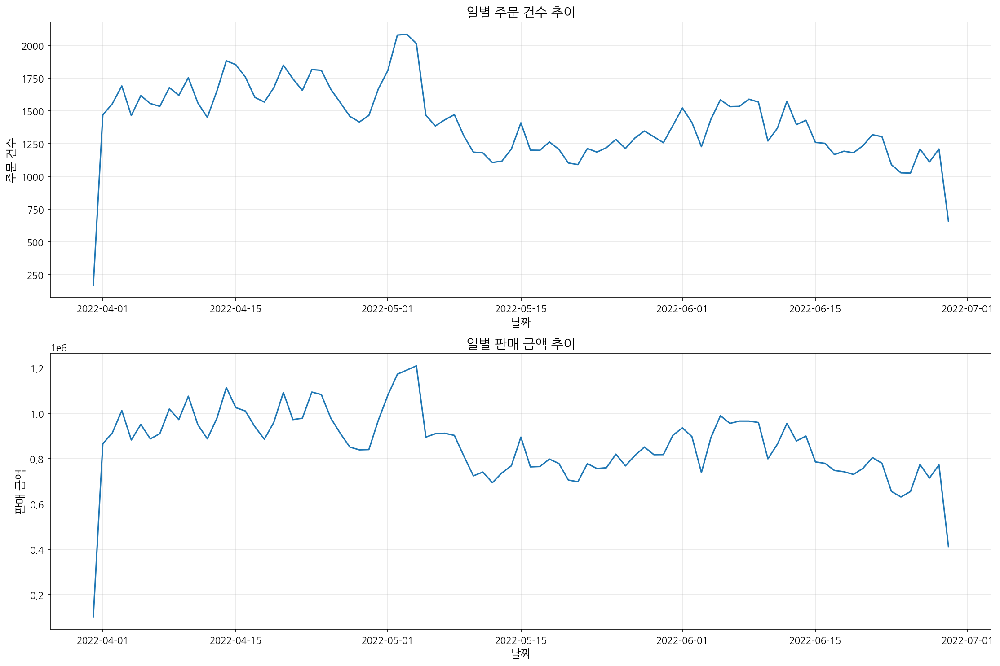
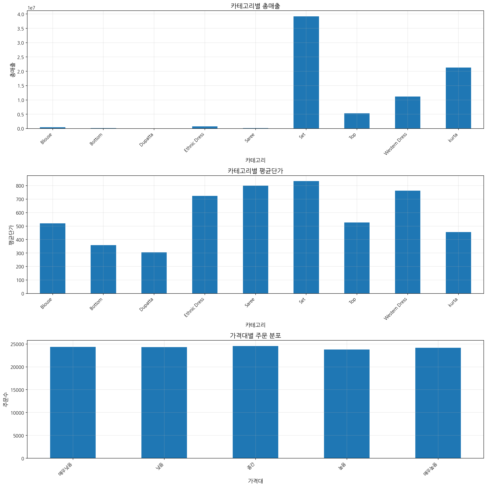
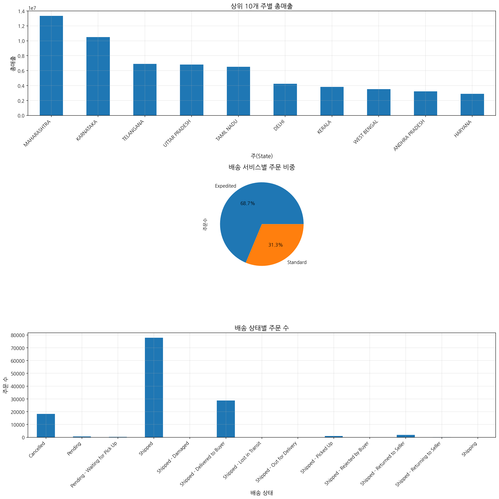
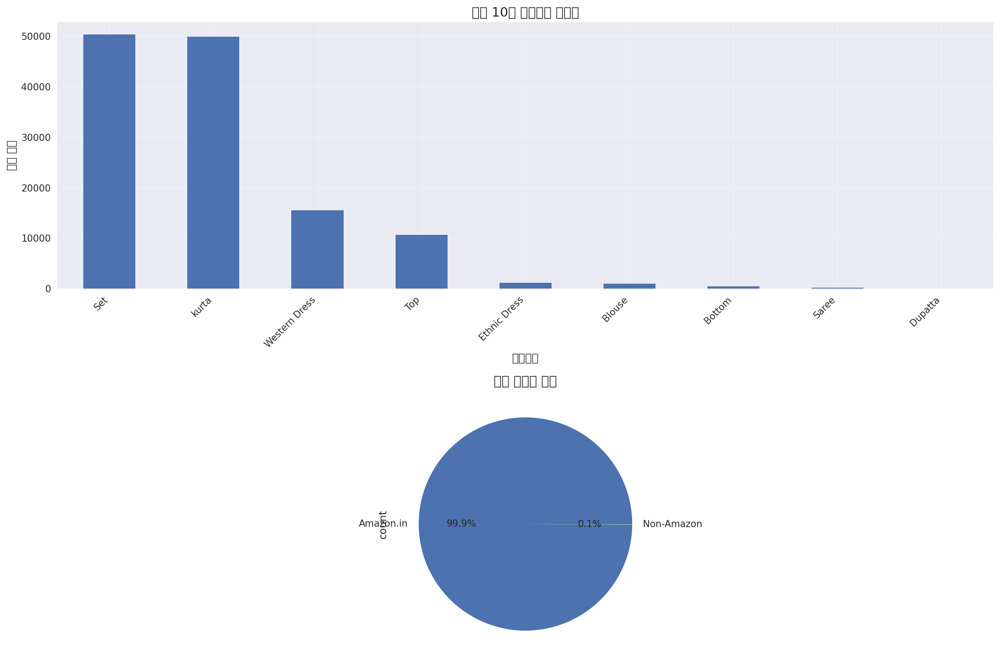

# 아마존 판매 데이터 분석 및 마케팅 인사이트 보고서

## 개요

본 보고서는 아마존 인도 마켓플레이스의 판매 데이터를 분석하여 마케팅 인사이트를 도출하기 위해 작성되었습니다. 분석 대상은 2022년 3월부터 6월까지의 판매 데이터로, 총 128,975건의 주문 정보를 포함하고 있습니다. 본 분석을 통해 판매 트렌드, 카테고리별 성과, 지역별 판매 현황, 배송 서비스 효율성 등을 파악하고, 이를 바탕으로 효과적인 마케팅 전략 수립에 필요한 인사이트를 제공하고자 합니다.

## 주요 발견사항

### 1. 판매 개요

- 총 주문 건수: 128,975건
- 분석 기간: 2022년 3월 ~ 6월
- 일평균 주문 건수: 약 1,417건
- 주문 상태: 배송 완료(22.3%), 배송 중(60.3%), 취소(14.2%), 기타(3.2%)
- 주요 판매 채널: Amazon.in (99.9%)

### 2. 판매 트렌드

- 월별 판매 추이: 4월이 가장 높은 판매량을 기록 (49,067건)
- 요일별 판매 분포: 주말(토, 일)에 판매량이 소폭 증가하는 경향
- 최대 일일 주문 건수: 2,085건 (2022-05-03)
- 최소 일일 주문 건수: 171건 (2022-03-31)

*일별 주문 건수 및 판매 금액 추이 시각화*

### 3. 카테고리별 성과

- 최고 매출 카테고리: Set (총매출: 39,204,124.03 루피)
- 최고 평균단가 카테고리: Set (평균단가: 833.39 루피)
- 최다 판매수량 카테고리: Set (총수량: 45,289개)
- 상위 3개 카테고리: Set(39.0%), kurta(38.7%), Western Dress(12.0%)

*카테고리별 성과 및 가격대별 분석 시각화*

### 4. 가격대별 판매 분석

- 가격대 분포: 매우낮음(~400루피), 낮음(400~550루피), 중간(550~700루피), 높음(700~850루피), 매우높음(850루피~)
- 최고 매출 가격대: 매우높음 (총매출: 26,183,177.73 루피)
- 최다 판매 가격대: 매우높음 (총수량: 23,645개)
- 평균 판매가격: 648.56 루피

### 5. 지역별 판매 현황

- 최다 주문 지역: MAHARASHTRA (주문수: 22,260건)
- 최고 매출 지역: MAHARASHTRA (총매출: 13,335,534.14 루피)
- 상위 5개 지역: MAHARASHTRA, KARNATAKA, TELANGANA, UTTAR PRADESH, TAMIL NADU

*지역별 판매 및 배송 서비스 분석 시각화*

### 6. 배송 서비스 분석

- 배송 서비스 유형: Expedited(68.7%), Standard(31.3%)
- Expedited 서비스 매출: 54,285,183.0 루피 (평균단가: 656.23 루피)
- Standard 서비스 매출: 24,307,495.3 루피 (평균단가: 632.07 루피)
- 배송 성공률: 22.3% (배송 완료 건수 기준)

*카테고리별 판매량 및 판매 채널 분포 시각화*

## 상세 분석

### 1. 데이터 개요

분석에 사용된 데이터셋은 아마존 인도 마켓플레이스의 판매 데이터로, 총 128,975건의 주문 정보와 24개의 변수로 구성되어 있습니다. 주요 변수로는 주문 ID, 날짜, 상태, 판매 채널, 배송 서비스 수준, 상품 스타일, SKU, 카테고리, 사이즈, 수량, 금액, 배송지 정보 등이 포함되어 있습니다.

#### 데이터 품질 분석

- 결측값 현황:
  - Courier Status: 6,872건
  - currency: 7,795건
  - Amount: 7,795건
  - 배송지 정보(city, state, postal-code, country): 각 33건
  - promotion-ids: 49,153건
  - fulfilled-by: 89,698건

### 2. 판매 트렌드 분석

#### 월별 판매 추이

| 월 | 주문 건수 | 판매 금액 | 판매 수량 |
|---|---------|----------|----------|
| 2022-03 | 171 | 101,683.85 | 156 |
| 2022-04 | 49,067 | 28,838,708.32 | 44,206 |
| 2022-05 | 42,040 | 26,226,476.75 | 38,011 |
| 2022-06 | 37,697 | 23,425,809.38 | 34,276 |

4월에 가장 많은 주문과 매출이 발생했으며, 이후 점차 감소하는 추세를 보입니다. 3월 데이터는 월말 일부 데이터만 포함되어 있어 전체 월 성과를 대표하지 않습니다.

#### 요일별 판매 분포

| 요일 | 주문 건수 | 평균 판매 금액 |
|-----|---------|-------------|
| 월요일 | 18,568 | 648.66 |
| 화요일 | 18,883 | 648.95 |
| 수요일 | 18,594 | 645.47 |
| 목요일 | 17,069 | 645.72 |
| 금요일 | 17,718 | 651.08 |
| 토요일 | 18,524 | 649.45 |
| 일요일 | 19,619 | 650.38 |

주말(토, 일)에 주문량이 소폭 증가하는 경향을 보이며, 특히 일요일에 가장 많은 주문이 발생했습니다. 평균 판매 금액은 요일별로 큰 차이를 보이지 않습니다.

### 3. 카테고리 및 가격 분석

#### 카테고리별 성과

| 카테고리 | 주문 수 | 총매출 | 평균단가 | 총수량 |
|---------|-------|-------|---------|-------|
| Set | 50,284 | 39,204,124.03 | 833.39 | 45,289 |
| kurta | 49,877 | 21,299,546.70 | 455.93 | 45,045 |
| Western Dress | 15,500 | 11,216,072.69 | 762.79 | 13,943 |
| Top | 10,622 | 5,347,792.30 | 526.10 | 9,903 |
| Ethnic Dress | 1,159 | 791,217.66 | 723.90 | 1,053 |
| Blouse | 926 | 458,408.18 | 520.33 | 863 |
| Bottom | 440 | 150,667.98 | 358.73 | 398 |
| Saree | 164 | 123,933.76 | 799.57 | 152 |
| Dupatta | 3 | 915.00 | 305.00 | 3 |

'Set' 카테고리는 주문 수, 총매출, 평균단가, 총수량 모든 측면에서 최고 성과를 보이고 있습니다. 'kurta' 카테고리는 주문 수와 총수량에서 'Set'과 비슷한 수준이지만, 평균단가가 낮아 총매출에서는 차이를 보입니다. 'Western Dress'는 상대적으로 높은 평균단가로 3위의 매출을 기록했습니다.

#### 가격대별 판매 분석

| 가격대 | 주문 수 | 평균가격 | 총매출 | 총수량 |
|-------|-------|---------|-------|-------|
| 매우낮음 | 24,365 | 322.58 | 7,859,621.96 | 23,280 |
| 낮음 | 24,325 | 475.15 | 11,558,053.56 | 23,330 |
| 중간 | 24,553 | 610.82 | 14,997,527.12 | 23,462 |
| 높음 | 23,769 | 757.05 | 17,994,297.93 | 22,765 |
| 매우높음 | 24,168 | 1,083.38 | 26,183,177.73 | 23,645 |

가격대별 주문 수와 총수량은 비교적 고르게 분포되어 있으나, 평균가격과 총매출은 가격대가 높아질수록 증가하는 경향을 보입니다. 특히 '매우높음' 가격대는 가장 높은 총매출을 기록했으며, 이는 고가 제품에 대한 수요가 상당함을 시사합니다.

### 4. 지역 및 배송 분석

#### 상위 10개 지역별 판매 현황

| 지역 | 주문 수 | 총매출 | 평균단가 | 총수량 |
|-----|-------|-------|---------|-------|
| MAHARASHTRA | 22,260 | 13,335,534.14 | 632.83 | 20,328 |
| KARNATAKA | 17,326 | 10,481,114.37 | 639.33 | 15,901 |
| TELANGANA | 11,330 | 6,916,615.65 | 650.24 | 10,253 |
| UTTAR PRADESH | 10,638 | 6,816,642.08 | 685.30 | 9,499 |
| TAMIL NADU | 11,483 | 6,515,650.11 | 602.80 | 10,412 |
| DELHI | 6,782 | 4,235,215.97 | 662.48 | 6,156 |
| KERALA | 6,585 | 3,830,227.58 | 622.70 | 5,813 |
| WEST BENGAL | 5,963 | 3,507,880.44 | 632.39 | 5,318 |
| ANDHRA PRADESH | 5,430 | 3,219,831.72 | 636.96 | 4,819 |
| HARYANA | 4,415 | 2,882,092.99 | 688.18 | 4,066 |

MAHARASHTRA와 KARNATAKA 지역이 주문 수와 총매출에서 압도적인 1, 2위를 차지하고 있습니다. 평균단가는 HARYANA와 UTTAR PRADESH 지역이 상대적으로 높게 나타났습니다.

#### 배송 서비스별 분석

| 배송 서비스 | 주문 수 | 총매출 | 평균단가 | 총수량 |
|-----------|-------|-------|---------|-------|
| Expedited | 88,615 | 54,285,183.0 | 656.23 | 83,004 |
| Standard | 40,360 | 24,307,495.3 | 632.07 | 33,645 |

Expedited 배송 서비스가 전체 주문의 68.7%를 차지하며, Standard 서비스보다 평균단가도 높게 나타났습니다. 이는 고객들이 빠른 배송에 대한 선호도가 높으며, 이를 위해 추가 비용을 지불할 의향이 있음을 시사합니다.

#### 배송 상태별 분석

| 배송 상태 | 주문 수 | 총매출 | 주문비율(%) |
|----------|-------|-------|------------|
| Shipped | 77,804 | 50,324,255.0 | 60.32 |
| Shipped - Delivered to Buyer | 28,769 | 18,650,815.0 | 22.31 |
| Cancelled | 18,332 | 6,919,284.3 | 14.21 |
| Shipped - Returned to Seller | 1,953 | 1,269,644.0 | 1.51 |
| Shipped - Picked Up | 973 | 661,252.0 | 0.75 |
| Pending | 658 | 430,271.0 | 0.51 |
| Pending - Waiting for Pick Up | 281 | 192,138.0 | 0.22 |
| 기타 | 205 | 144,019.0 | 0.17 |

전체 주문 중 22.3%만이 구매자에게 배송 완료된 상태이며, 60.3%는 배송 중 상태입니다. 주문 취소율은 14.2%로 비교적 높은 편이며, 반품률은 1.5%로 나타났습니다. 배송 성공률이 낮은 점은 개선이 필요한 부분으로 보입니다.

## 마케팅 인사이트 및 제안

### 1. 카테고리 전략

- **Set 카테고리 강화**: 최고 매출과 평균단가를 기록한 Set 카테고리에 대한 마케팅 투자를 확대하고, 제품 라인업을 다양화하는 전략이 필요합니다.
- **Western Dress 프리미엄화**: 높은 평균단가를 보이는 Western Dress 카테고리는 프리미엄 제품으로 포지셔닝하여 마진율을 높이는 전략을 추천합니다.
- **kurta 물량 전략**: 판매량은 높지만 평균단가가 낮은 kurta 카테고리는 대량 판매를 통한 규모의 경제를 추구하는 전략이 적합합니다.

### 2. 가격 전략

- **고가 제품 라인 확대**: '매우높음' 가격대 제품이 가장 높은 매출을 기록한 점을 고려하여, 프리미엄 제품 라인을 확대하는 것이 효과적일 것입니다.
- **카테고리별 차별화 가격 전략**: 카테고리별로 최적의 가격대가 다르므로, 각 카테고리별 차별화된 가격 전략이 필요합니다.
  - Set, Western Dress, Saree: 중상위 가격대 집중
  - kurta, Top, Bottom: 중하위 가격대 집중

### 3. 지역별 전략

- **핵심 지역 집중**: MAHARASHTRA와 KARNATAKA 지역에 마케팅 자원을 집중 투입하여 시장 점유율을 더욱 강화해야 합니다.
- **성장 지역 발굴**: TELANGANA, UTTAR PRADESH, TAMIL NADU 등 2군 지역에 대한 타겟 마케팅을 통해 신규 고객 확보가 필요합니다.
- **지역별 맞춤형 제품 전략**: 지역별로 선호하는 제품과 가격대가 다를 수 있으므로, 지역별 맞춤형 제품 전략을 수립해야 합니다.

### 4. 배송 서비스 개선

- **배송 성공률 향상**: 현재 22.3%에 불과한 배송 성공률을 높이기 위한 물류 시스템 개선이 시급합니다.
- **취소율 감소 전략**: 14.2%의 높은 취소율을 줄이기 위해 주문 전 정확한 정보 제공과 고객 커뮤니케이션 강화가 필요합니다.
- **Expedited 서비스 최적화**: 고객들이 선호하는 Expedited 배송 서비스의 효율성을 높이고, 프리미엄 가격 정책을 유지하는 것이 좋습니다.

### 5. 시즌별 전략

- **주말 프로모션**: 주말에 주문량이 증가하는 경향을 활용하여 주말 특별 프로모션을 기획하는 것이 효과적일 것입니다.
- **월별 판매 전략**: 4월에 판매가 집중된 점을 고려하여, 이 시기에 주요 마케팅 캠페인을 집중하고, 상대적으로 판매가 저조한 시기에는 특별 할인 행사를 통해 판매를 촉진하는 전략이 필요합니다.

## 결론

아마존 인도 마켓플레이스의 판매 데이터 분석 결과, Set 카테고리와 고가 제품이 매출에서 중요한 비중을 차지하고 있으며, MAHARASHTRA와 KARNATAKA 지역이 핵심 시장임을 확인했습니다. 또한 Expedited 배송 서비스에 대한 고객 선호도가 높지만, 전반적인 배송 성공률은 개선이 필요한 상황입니다.

이러한 분석 결과를 바탕으로, 카테고리별 차별화된 가격 전략, 지역별 맞춤형 마케팅, 배송 서비스 개선, 시즌별 프로모션 등의 마케팅 전략을 수립하여 매출 증대와 고객 만족도 향상을 도모할 수 있을 것입니다. 특히 Set 카테고리와 Western Dress의 프리미엄화 전략, MAHARASHTRA와 KARNATAKA 지역에 대한 집중 투자, 배송 시스템 개선을 통한 성공률 향상이 우선적으로 고려되어야 할 것입니다.

