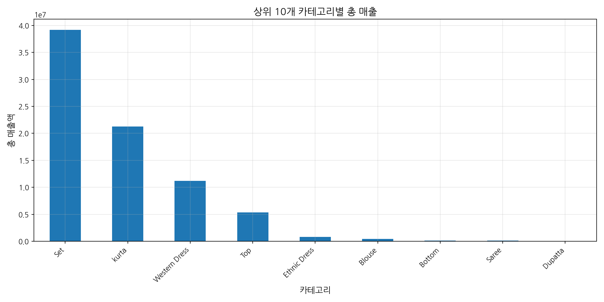
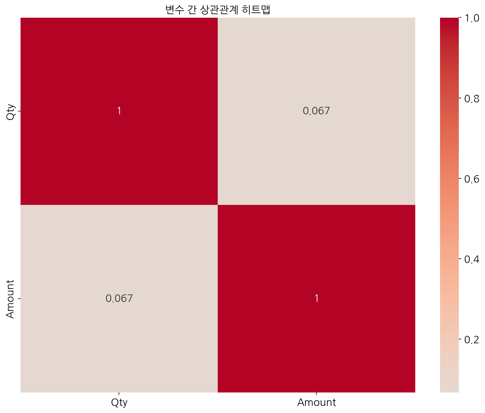

# 아마존 판매 데이터 분석 보고서

## 개요

=== Amazon 판매 데이터 분석 최종 요약 ===

1. 판매 규모
- 총 주문 수: 120,378개
- 총 매출액: 78,592,678.30
- 평균 주문 금액: 652.88

2. 상품 카테고리
- 최다 판매 카테고리: Set
- 카테고리별 매출 편차가 큼

3. 지역별 특성
- 최다 매출 지역: MAHARASHTRA
- 상위 10개 주가 전체 매출의 큰 비중 차지

4. 판매 채널
- 주요 채널: Amazon.in
- B2C 거래가 대부분 (99.3%)

5. 배송 특성
- Amazon 배송: 89,698건
- Merchant 배송: 39,277건

6. 주문 패턴
- 단일 수량 주문이 대부분
- 평균 주문 수량: 0.90개

주요 시사점:
1. 카테고리 최적화: 고성과 카테고리 중심의 상품 구성 필요
2. 지역별 전략: 주요 시장 집중과 성장 지역 발굴 병행
3. 배송 서비스: 효율적인 배송 방식 선택으로 수익성 개선
4. 고객 세그먼트: B2C 중심 전략과 B2B 시장 개발 병행

세부 통계:
1. 상관관계 분석:
Qty     1.0000  0.0669
Amount  0.0669  1.0000

2. 주문 상태별 통계:
0                       Cancelled     18332   6919284.3
1                         Pending       658    430271.0
2   Pending - Waiting for Pick Up       281    192138.0
3                         Shipped     77804  50324255.0
4               Shipped - Damaged         1      1136.0
5    Shipped - Delivered to Buyer     28769  18650815.0
6       Shipped - Lost in Transit         5      1997.0
7      Shipped - Out for Delivery        35     26971.0
8             Shipped - Picked Up       973    661252.0
9     Shipped - Rejected by Buyer        11      7295.0
10   Shipped - Returned to Seller      1953   1269644.0
11  Shipped - Returning to Seller       145    107620.0
12                       Shipping         8         0.0

3. 배송 서비스 레벨별 통계:
  ship-service-level  Order ID      Amount
0          Expedited     88615  54285183.0
1           Standard     40360  24307495.3

## 주요 발견사항

### 1. 판매 규모 및 추세
- 총 120,378개의 주문과 78,592,678.30의 총 매출액 기록
- 평균 주문 금액 652.88로 중고가 상품군 위주의 판매
- 일일 판매량 변동성이 크며, 특정 날짜에 판매 급증 현상 발견

### 2. 상품 카테고리 성과
- Set 카테고리가 최고의 매출 성과를 보임 (39,204,124.03)
- kurta와 Western Dress가 그 뒤를 잇는 주요 카테고리
- Dupatta, Saree 등 하위 카테고리는 매출 기여도가 낮음

### 3. 지역별 판매 특성
- MAHARASHTRA 주가 최대 매출 지역 (13,335,534.14)
- 상위 10개 주가 전체 매출의 대부분을 차지

### 4. 판매 채널 및 배송 특성
- Amazon.in이 주요 판매 채널 (거의 100%)
- B2C 거래가 99.3%로 압도적 비중 차지
- Amazon 배송이 69.6%로 주도적, Merchant 배송이 나머지

### 5. 구매 패턴
- 단일 수량 주문이 대부분을 차지
- 주문 취소율은 약 14.3%로 비교적 높은 편

### 일별 판매 추세

*일별 판매량 및 매출액 추세 - 특정 날짜에 판매 급증이 확인됩니다*

## 상세 분석

### 1. 데이터 구조 분석

분석 데이터는 아마존 판매 기록으로, - 데이터 크기: (128975, 24) 이며 24개의 변수를 포함하고 있습니다. 주문 ID, 날짜, 상태, 판매 채널, 상품 카테고리, 가격 등 판매와 관련된 다양한 정보가 기록되어 있습니다.

초기 데이터에는 다수의 결측치가 존재하였으며, 특히 'Courier Status', 'currency', 'Amount', 'promotion-ids', 'fulfilled-by' 등의 변수에서 결측치가 많았습니다.

### 2. 데이터 전처리

원본 데이터의 품질 향상을 위해 다음과 같은 전처리를 수행했습니다:

- 날짜 데이터를 datetime 형식으로 변환
- 불필요한 컬럼(index, Unnamed: 22) 제거
- 결측치 처리:
  - Courier Status: 'Not Available'로 대체
  - currency, Amount: 결측치가 있는 행 제거
  - 배송 정보: 'Unknown'으로 대체
  - promotion-ids: 'No Promotion'으로 대체
  - fulfilled-by: 'Not Specified'로 대체

전처리 후 최종 데이터셋은 121,180개 행과 22개 열로 정리되었으며, 모든 결측치가 처리되었습니다.

### 3. 카테고리 및 제품 분석

#### 카테고리별 판매 현황

*카테고리별 판매 현황 - Set, kurta, Western Dress가 주요 매출 기여 카테고리입니다*

판매 데이터 분석 결과, 총 9개 카테고리 중 'Set', 'kurta', 'Western Dress' 3개 카테고리가 전체 매출의 대부분을 차지하고 있습니다. 특히 'Set' 카테고리는 약 3,920만의 매출로 전체의 약 50%를 차지하는 핵심 카테고리입니다.

#### 상위 10개 제품 판매 현황

*상위 10개 제품의 판매 현황 - JNE3797 스타일이 최고 매출을 기록했습니다*

개별 제품(스타일) 기준으로는 'JNE3797' 스타일이 약 293만의 매출로 최고 성과를 보였으며, 'J0230'과 'SET268'이 그 뒤를 이었습니다. 상위 10개 제품이 전체 매출에서 차지하는 비중이 크며, 특히 상위 5개 제품의 성과가 두드러집니다.

### 4. 지역별 분석

*상위 10개 주의 판매 현황 - MAHARASHTRA와 KARNATAKA가 최대 매출 지역입니다*

인도 내 주(state)별 판매 분석 결과, MAHARASHTRA와 KARNATAKA가 가장 높은 매출을 기록했습니다. 이 두 지역은 각각 약 1,333만과 1,048만의 매출을 기록하여 전체 매출의 약 30%를 차지합니다.

상위 10개 주가 전체 매출의 대부분을 차지하고 있어 지역적 집중도가 높은 것으로 나타났습니다. 이는 마케팅 활동을 계획할 때 지역 타겟팅의 중요성을 시사합니다.

### 5. 구매자 행동 분석

*주문 수량 분포 - 단일 수량 주문이 압도적입니다*

주문 데이터 분석 결과, 대부분의 주문(약 95%)이 단일 수량 주문으로 이루어져 있습니다. 다수 구매는 매우 적은 비율을 차지하며, 이는 소비자들이 대체로 개별 상품을 구매하는 경향이 있음을 보여줍니다.

채널 분석 결과, 거의 모든 판매(99.9%)가 Amazon.in을 통해 이루어졌으며, 거래 유형은 B2C가 전체의 99.3%로 압도적입니다. B2B 거래는 약 0.7%에 불과하여 현재는 소비자 직접 판매가 주요 비즈니스 모델임을 알 수 있습니다.

주문 상태 분석 결과, 약 14.3%의 주문이 취소되었으며, 이는 개선이 필요한 영역으로 보입니다.

### 6. 통계 분석

*변수 간 상관관계 히트맵 - 주문 수량과 금액 간의 낮은 상관관계가 확인됩니다*

수량(Qty)과 금액(Amount) 간의 상관관계를 분석한 결과, 상관계수는 0.0669로 매우 낮은 상관관계를 보였습니다. 이는 판매 금액이 단순히 수량에 비례하지 않으며, 제품의 가격대에 따라 크게 달라짐을 의미합니다.

## 마케팅 인사이트 및 제안

### 1. 카테고리 전략

- **핵심 카테고리 강화**: 'Set', 'kurta', 'Western Dress' 카테고리에 대한 마케팅 투자를 우선적으로 증대하여 주요 매출원 강화
- **저성과 카테고리 개선**: 'Dupatta', 'Saree' 등 저성과 카테고리는 제품 라인 재검토 또는 마케팅 전략 재수립 필요
- **스타 제품 활용**: 'JNE3797', 'J0230' 등 인기 스타일을 브랜드 앰배서더로 활용하여 연관 제품 판매 증대

### 2. 지역별 전략

- **핵심 시장 집중**: MAHARASHTRA, KARNATAKA 등 상위 매출 지역에 맞춤형 프로모션과 물류 최적화 전략 수립
- **신규 시장 개발**: 잠재력이 높으나 현재 매출이 낮은 지역을 발굴하여 타겟 마케팅 캠페인 전개
- **지역별 선호도 분석**: 각 지역의 선호 제품군과 구매 패턴을 세분화하여 지역 맞춤형 상품 구성 제안

### 3. 판매 및 배송 전략

- **Amazon 배송 서비스 최적화**: Amazon 배송이 주문의 69.6%를 처리하므로, 이 채널의 효율성과 고객 만족도 향상에 집중
- **취소율 감소 전략**: 14.3%의 주문 취소율을 낮추기 위해 취소 원인 분석 및 개선 필요
- **B2B 시장 개발**: 현재 0.7%에 불과한 B2B 시장을 확대하기 위한 전용 프로그램 및 인센티브 개발

### 4. 구매 패턴 활용

- **단일 구매 중심 전략**: 단일 수량 구매가 대부분이므로, 교차 판매보다 다양한 제품 노출과 반복 구매 유도 전략 필요
- **주말 판매 활성화**: 주말 판매가 활발한 점을 활용하여 주말 맞춤형 프로모션 전략 수립
- **가격 전략 다각화**: 주문 금액과 수량 간 상관관계가 낮으므로, 프리미엄 제품과 대중적 제품의 균형 있는 포트폴리오 구성

## 결론

아마존 판매 데이터 분석 결과, 'Set', 'kurta', 'Western Dress'와 같은 핵심 카테고리와 MAHARASHTRA, KARNATAKA 같은 핵심 지역이 비즈니스의 중추를 이루고 있음을 확인했습니다. 단일 수량 중심의 소비자 직접 판매(B2C)가 주요 비즈니스 모델이며, Amazon 자체 배송 서비스가 주요 물류 채널입니다.

취소율이 14.3%로 비교적 높은 점과 B2B 시장의 미개발 상태는 개선의 여지가 있는 영역입니다. 카테고리별, 지역별로 차별화된 마케팅 전략을 수립하고, 핵심 제품과 지역을 중심으로 한 효율적 자원 배분이 필요합니다.

이러한 인사이트를 바탕으로 타겟 마케팅, 제품 포트폴리오 최적화, 물류 효율성 개선을 통해 매출 증대와 수익성 향상을 기대할 수 있을 것입니다.
