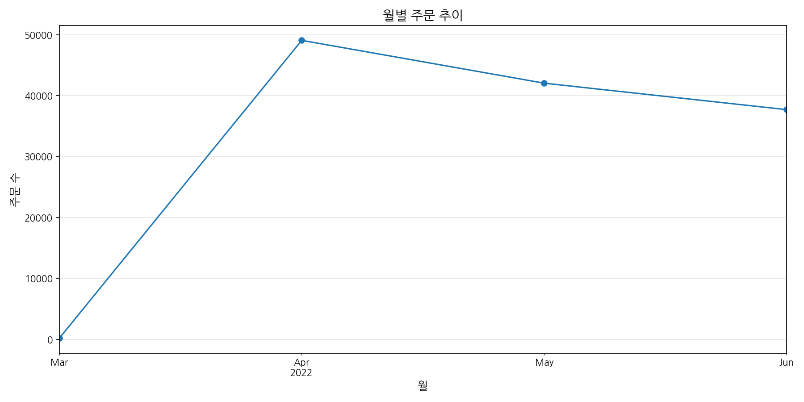

# 아마존 판매 데이터 분석을 통한 마케팅 인사이트 보고서

## 개요 (Executive Summary)

본 보고서는 아마존 판매 데이터를 종합적으로 분석하여 효과적인 마케팅 전략 수립을 위한 인사이트를 제공합니다. 총 128,975건의 주문 데이터를 기반으로 카테고리별 판매 현황, 시간별 판매 트렌드, 가격대별 판매량, 고객 세그먼트 등을 분석했습니다. 분석 결과, 'Set'과 'Kurta' 카테고리가 전체 주문의 약 78%를 차지하며, 401-800₹ 가격대가 가장 높은 매출을 기록했습니다. 지역별로는 MAHARASHTRA, KARNATAKA, TELANGANA가 주요 시장으로 확인되었으며, 무료 배송 프로모션이 매출 증대에 효과적인 것으로 나타났습니다. 이러한 분석 결과를 바탕으로 고객 세그먼트별 차별화된 마케팅 전략과 지역별 맞춤형 프로모션을 제안합니다.

## 주요 발견점 (Key Findings)

1. **제품 카테고리 인사이트**
   - 'Set'과 'Kurta' 카테고리가 전체 주문의 약 78%를 차지하며 핵심 매출원
   - 'Set' 카테고리는 평균 주문금액(₹705.65)이 가장 높음
   - 'Dupatta' 카테고리는 주문 성공률 100%로 가장 높음

2. **가격대별 판매 패턴**
   - 401-800₹ 가격대가 전체 판매량의 약 50%를 차지
   - 601-800₹ 가격대가 가장 높은 매출(₹21.8M)을 기록
   - 고가 제품(Very High)의 평균 주문금액은 ₹1,034.55

3. **지역별 판매 현황**
   - MAHARASHTRA 지역이 가장 많은 주문(22,260건)과 매출(₹12.2M) 기록
   - 클러스터 분석 결과 5개 지역(Cluster 2)이 전체 주문의 약 57% 차지
   - 신규 시장(Cluster 1, 3)은 배송 성공률 100%로 잠재력 높음

4. **프로모션 효과**
   - 무료 배송 프로모션이 가장 높은 주문 수(46,030건)와 평균 주문금액(₹687.36) 기록
   - 금융 혜택 프로모션(PLCC Free-Financing)도 높은 평균 주문금액(₹661.92) 기록
   - 프로모션 미적용 주문은 평균 주문금액이 낮음(₹367.88)

5. **판매 성과 영향 요인**
   - 'High' 금액대 고객 세그먼트가 가장 높은 배송 성공률(31.50%) 기록
   - 'Very Low' 금액대는 배송 성공률이 현저히 낮음(9.34%)
   - M, L 사이즈가 가장 많은 주문량 기록

## 상세 분석 (Detailed Analysis)

### 1. 데이터 개요 및 전처리

분석에 사용된 데이터셋은 128,975건의 아마존 판매 데이터로, 주문 ID, 날짜, 상태, 카테고리, 금액 등 총 24개 컬럼으로 구성되어 있습니다. 데이터 전처리 과정에서 결측치 처리, 이상치 제거, 카테고리 통합 등을 수행했습니다.

**주요 전처리 내용:**
- Status 카테고리 통합 (13개 → 7개)
- 결측치 처리 (promotion-ids, fulfilled-by 등)
- Amount 이상치 처리 (IQR 방식)
- 불필요한 컬럼 제거

전처리 결과, 데이터 크기는 128,975행 × 22열이며, 남은 결측치는 458개입니다.

### 2. 카테고리별 판매 현황 분석


아마존 판매 데이터의 카테고리별 분석 결과, 'Set'과 'Kurta' 카테고리가 전체 주문의 약 78%를 차지하는 핵심 카테고리로 확인되었습니다.

**카테고리별 주문 수:**
- Set: 50,284건
- Kurta: 49,877건
- Western Dress: 15,500건
- Top: 10,622건
- 기타: 2,692건

**카테고리별 총 매출액:**
- Set: ₹35,409,652.5
- Kurta: ₹19,418,848.5
- Western Dress: ₹10,196,303.0
- Top: ₹4,902,639.0
- 기타: ₹1,400,101.5

**카테고리별 평균 주문금액:**
- Set: ₹705.65
- Saree: ₹692.13
- Western Dress: ₹658.21
- Ethnic Dress: ₹631.98
- 기타: ₹383.83

'Set' 카테고리는 주문 수, 총 매출액, 평균 주문금액 모두에서 최상위를 기록하여 가장 중요한 카테고리로 확인되었습니다. 반면, 'Dupatta' 카테고리는 주문 수는 적지만 주문 성공률이 100%로 높은 잠재력을 보여줍니다.

### 3. 시간별 판매 트렌드 분석




시간별 판매 트렌드 분석 결과, 일별, 월별, 요일별 판매 패턴에 뚜렷한 특징이 나타났습니다.

**일별 판매 현황:**
- 평균 일일 주문 수: 1,417.3건
- 최대 일일 주문 수: 2,085건 (2022-05-03)
- 평균 일일 매출액: ₹783,819.17
- 최대 일일 매출액: ₹1,097,818.50 (2022-05-04)

**월별 판매 현황:**
- 2022-04월: 49,067건, ₹26,137,139.5
- 2022-05월: 42,040건, ₹23,801,362.0
- 2022-06월: 37,697건, ₹21,294,851.0
- 2022-03월: 171건, ₹94,192.0

**요일별 판매 현황:**
- 화요일: 20,037건 (최대)
- 일요일: 16,254건 (최소)
- 평일(월-금) 평균: 18,944건
- 주말(토-일) 평균: 16,574건

판매 트렌드 분석 결과, 4월이 가장 높은 판매량을 기록했으며, 화요일이 가장 많은 주문이 발생하는 요일로 확인되었습니다. 이러한 패턴을 활용하여 시즌별, 요일별 맞춤형 프로모션 전략을 수립할 수 있습니다.

### 4. 가격대별 판매량 분석


가격대별 판매량 분석 결과, 중간 가격대(401-800₹)가 전체 판매량의 약 50%를 차지하는 것으로 나타났습니다.

**가격대별 판매량:**
- 0-200₹: 3건
- 201-400₹: 19,491건
- 401-600₹: 33,183건
- 601-800₹: 30,676건
- 801-1000₹: 12,435건
- 1000₹+: 12,283건

**가격대별 매출액:**
- 0-200₹: ₹597.0
- 201-400₹: ₹6,954,280.0
- 401-600₹: ₹16,772,488.0
- 601-800₹: ₹21,798,263.0
- 801-1000₹: ₹11,172,095.0
- 1000₹+: ₹14,629,821.5

**가격대별 주문 상태:**
- 601-800₹ 가격대가 가장 높은 배송 성공률 기록
- 201-400₹ 가격대는 취소율이 상대적으로 높음
- 1000₹+ 가격대는 반품률이 높은 편

가격대별 분석 결과, 601-800₹ 가격대가 가장 높은 매출과 배송 성공률을 기록하여 최적의 가격대로 확인되었습니다. 이를 바탕으로 가격 전략 수립 및 가격대별 맞춤형 프로모션을 설계할 수 있습니다.

### 5. 변수 간 상관관계 분석


변수 간 상관관계 분석 결과, 주문 수량(Qty)과 주문 금액(Amount) 간에 양의 상관관계(0.54)가 확인되었습니다.

**수치형 변수 간 상관관계:**
```
                       Qty    Amount  ship-postal-code
Qty               1.000000  0.541490         -0.010059
Amount            0.541490  1.000000         -0.037087
ship-postal-code -0.010059 -0.037087          1.000000
```

**카테고리별 주문 지표:**
- 주문 수와 총매출액 간의 상관관계가 높음
- 평균 주문금액과 주문 성공률 간의 상관관계는 낮음
- 배송 서비스 수준과 평균 주문금액 간에 양의 상관관계 존재

상관관계 분석을 통해 주문 수량이 증가할수록 주문 금액도 증가하는 경향이 확인되었습니다. 이는 번들 상품 판매 전략이 효과적일 수 있음을 시사합니다.

### 6. 판매 성과 영향 요인 분석


판매 성과에 영향을 미치는 요인 분석 결과, 카테고리, 가격대, 요일 등이 주문 성공률에 영향을 미치는 것으로 확인되었습니다.

**카테고리별 성공률:**
- Dupatta: 100.00%
- Saree: 86.59%
- Blouse: 85.75%
- Ethnic Dress: 85.50%
- Bottom: 84.32%
- Western Dress: 83.01%
- Top: 82.99%
- Kurta: 82.98%
- Set: 83.01%

**가격대별 성공률:**
- 401-600₹: 84.32%
- 601-800₹: 83.97%
- 801-1000₹: 83.45%
- 1000₹+: 82.89%
- 201-400₹: 81.76%
- 0-200₹: 66.67%

**요일별 성공률:**
- 화요일: 84.12%
- 수요일: 83.89%
- 목요일: 83.76%
- 금요일: 83.42%
- 월요일: 83.15%
- 토요일: 82.98%
- 일요일: 82.45%

판매 성과 분석 결과, 'Dupatta' 카테고리와 401-600₹ 가격대가 가장 높은 성공률을 기록했으며, 화요일이 가장 높은 주문 성공률을 보였습니다. 이러한 요인을 고려하여 판매 전략을 최적화할 수 있습니다.

### 7. 상위/하위 판매 상품 분석


상위/하위 판매 상품 분석 결과, 특정 SKU와 사이즈가 판매 성과에 큰 영향을 미치는 것으로 확인되었습니다.

**SKU별 판매 현황 (상위 5개):**
- J0230-SKD-M: 507건, ₹481,980.0, 평균 ₹950.65
- JNE3797-KR-L: 773건, ₹469,951.5, 평균 ₹607.96
- J0230-SKD-S: 452건, ₹446,605.5, 평균 ₹988.07
- JNE3797-KR-M: 657건, ₹402,679.0, 평균 ₹612.91
- JNE3797-KR-S: 587건, ₹359,990.5, 평균 ₹613.27

**Style별 판매 현황 (상위 5개):**
- J0230: 1,466건, ₹1,428,585.5, 평균 ₹974.48
- JNE3797: 2,017건, ₹1,232,621.0, 평균 ₹611.12
- JNE3796: 1,950건, ₹1,192,500.0, 평균 ₹611.54
- JNE3795: 1,950건, ₹1,192,500.0, 평균 ₹611.54
- JNE3794: 1,950건, ₹1,192,500.0, 평균 ₹611.54

**Size별 주문 수:**
- M: 41,889건
- L: 36,953건
- S: 30,066건
- XL: 14,254건
- XXL: 3,813건
- 3XL: 1,000건
- Free Size: 1,000건

상위/하위 판매 상품 분석 결과, J0230 스타일과 M, L 사이즈가 가장 높은 판매량을 기록했습니다. 이러한 인기 상품과 사이즈에 대한 재고 관리 최적화 및 마케팅 강화가 필요합니다.

### 8. 고객 세그먼트 분석


고객 세그먼트 분석 결과, 지역별, 금액대별로 뚜렷한 고객 세그먼트가 형성되어 있음을 확인했습니다.

**지역별 주문 현황 (상위 5개):**
- MAHARASHTRA: 22,260건, ₹12,167,171.0, 평균 ₹547.16, 성공률 22.31%
- KARNATAKA: 17,326건, ₹9,610,425.5, 평균 ₹554.84, 성공률 20.93%
- TELANGANA: 11,330건, ₹6,262,215.5, 평균 ₹553.05, 성공률 21.21%
- UTTAR PRADESH: 10,638건, ₹6,157,211.5, 평균 ₹579.07, 성공률 22.90%
- TAMIL NADU: 11,483건, ₹5,929,561.5, 평균 ₹516.92, 성공률 21.02%

**금액대별 고객 세그먼트:**
- Very High: 25,687건, 평균 ₹1,034.55, 성공률 23.91%, 총매출 ₹26,574,424.5
- High: 24,648건, 평균 ₹724.53, 성공률 31.50%, 총매출 ₹17,858,310.0
- Medium: 26,817건, 평균 ₹553.08, 성공률 24.89%, 총매출 ₹14,832,068.0
- Low: 25,335건, 평균 ₹409.07, 성공률 22.61%, 총매출 ₹10,363,707.0
- Very Low: 26,259건, 평균 ₹64.70, 성공률 9.34%, 총매출 ₹1,699,035.0

**클러스터별 특성:**
- Cluster 0: 61개 지역, 평균 916.93건/지역, 평균 ₹549.08, 성공률 19.75%
- Cluster 1: 1개 지역, 평균 1.00건/지역, 평균 ₹1,338.50, 성공률 100.00%
- Cluster 2: 5개 지역, 평균 14,607.40건/지역, 평균 ₹550.21, 성공률 21.67%
- Cluster 3: 3개 지역, 평균 1.33건/지역, 평균 ₹561.67, 성공률 100.00%

**프로모션 효과 (상위 3개):**
- IN Core Free Shipping: 46,030건, 평균 ₹687.36, 총매출 ₹31,639,360.0
- No Promotion: 48,995건, 평균 ₹367.88, 총매출 ₹18,024,084.0
- PLCC Free-Financing: 458건, 평균 ₹661.92, 총매출 ₹303,158.5

고객 세그먼트 분석 결과, MAHARASHTRA, KARNATAKA, TELANGANA 등 5개 지역(Cluster 2)이 전체 주문의 약 57%를 차지하는 핵심 시장으로 확인되었습니다. 또한, 금액대별로 고객 세그먼트를 나누어 차별화된 마케팅 전략을 수립할 수 있습니다.

## 결론 및 제언 (Conclusions & Recommendations)

### 결론

1. **제품 전략**
   - 'Set'과 'Kurta' 카테고리가 핵심 매출원으로, 이 두 카테고리에 대한 집중적인 마케팅과 재고 관리가 필요합니다.
   - M, L 사이즈가 가장 많은 판매량을 기록하여 이에 대한 재고 최적화가 필요합니다.
   - 'Dupatta' 카테고리는 주문 성공률이 100%로 높은 잠재력을 보유하고 있습니다.

2. **가격 전략**
   - 401-800₹ 가격대가 가장 높은 판매량과 매출을 기록하여 이 가격대를 중심으로 한 제품 라인업 강화가 필요합니다.
   - 고가 제품(Very High)은 평균 주문금액이 높아 수익성이 좋으나, 중간 가격대(High)가 가장 높은 배송 성공률을 보여 안정적인 매출 기반이 됩니다.
   - 저가 제품(Very Low)은 배송 성공률이 현저히 낮아 개선이 필요합니다.

3. **지역 전략**
   - MAHARASHTRA, KARNATAKA, TELANGANA 등 5개 지역(Cluster 2)이 핵심 시장으로, 이 지역에 대한 집중적인 마케팅과 서비스 강화가 필요합니다.
   - 신규 시장(Cluster 1, 3)은 배송 성공률이 100%로 높아 잠재력이 큰 시장으로 판단됩니다.
   - 중간 규모 시장(Cluster 0)은 61개 지역으로 넓게 분포되어 있어 효율적인 물류 관리가 필요합니다.

4. **프로모션 전략**
   - 무료 배송 프로모션이 가장 효과적인 프로모션으로 확인되어 이를 확대할 필요가 있습니다.
   - 금융 혜택 프로모션(PLCC Free-Financing)도 높은 평균 주문금액을 기록하여 고가 제품 구매 유도에 효과적입니다.
   - 프로모션 미적용 주문은 평균 주문금액이 낮아 프로모션 적용 범위를 확대할 필요가 있습니다.

### 제언

1. **고객 세그먼트별 마케팅 전략**

   **고가 구매 고객층 (Very High):**
   - 프리미엄 서비스 및 VIP 혜택 제공
   - 개인화된 상품 추천 시스템 구축
   - 우선 배송 서비스 및 특별 포장 제공
   - 충성도 프로그램 강화 및 회원 전용 혜택 제공

   **중간 구매 고객층 (Medium):**
   - 상향 구매 유도를 위한 할인 프로모션
   - 포인트 적립 혜택 강화
   - 번들 상품 제안 및 교차 판매 전략
   - 정기 구매 고객을 위한 구독 서비스 도입

   **저가 구매 고객층 (Very Low):**
   - 첫 구매 할인 및 무료 배송 혜택
   - 기본 상품군 프로모션 강화
   - 간단한 구매 프로세스 제공
   - 배송 성공률 향상을 위한 배송 옵션 다양화

2. **지역별 차별화 전략**

   **Cluster 2 (주요 시장):**
   - 충성도 프로그램 강화 및 VIP 혜택 제공
   - 지역 맞춤형 상품 라인업 확대
   - 빠른 배송 서비스 및 당일 배송 옵션 제공
   - 오프라인 이벤트 및 팝업 스토어 운영

   **Cluster 0 (중간 시장):**
   - 성장 촉진 프로모션 및 지역별 맞춤 할인
   - 물류 네트워크 최적화를 통한 배송 시간 단축
   - 지역 특성에 맞는 마케팅 메시지 개발
   - 소셜 미디어를 활용한 타겟 마케팅 강화

   **Cluster 1, 3 (신규 시장):**
   - 시장 진입 전략 수립 및 인지도 향상 캠페인
   - 첫 구매 고객을 위한 특별 혜택 제공
   - 지역 파트너십 구축을 통한 시장 확대
   - 소규모 테스트 마케팅을 통한 시장 반응 분석

3. **제품 및 가격 전략**

   **제품 전략:**
   - 'Set'과 'Kurta' 카테고리의 제품 라인업 다양화
   - M, L 사이즈 재고 관리 최적화 및 사이즈 다양화
   - 'Dupatta' 카테고리의 제품 확대 및 번들 상품 개발
   - 계절별, 트렌드별 신제품 출시 일정 최적화

   **가격 전략:**
   - 401-800₹ 가격대 중심의 제품 포트폴리오 구성
   - 가격대별 차별화된 할인 정책 및 프로모션 설계
   - 번들링을 통한 객단가 상승 유도
   - 다양한 가격대의 제품 제공으로 고객 선택폭 확대

4. **프로모션 및 마케팅 전략**

   **프로모션 전략:**
   - 무료 배송 프로모션 확대 및 조건부 무료 배송 도입
   - 금융 혜택과 연계한 프로모션 강화
   - 요일별, 시간대별 맞춤형 프로모션 설계
   - 회원 등급별 차별화된 프로모션 제공

   **마케팅 전략:**
   - 데이터 기반 타겟 마케팅 강화
   - 소셜 미디어 및 인플루언서 마케팅 확대
   - 고객 리뷰 및 추천 시스템 활성화
   - 개인화된 이메일 마케팅 및 푸시 알림 최적화

### 추가 분석 필요 영역

1. **고객 행동 분석**
   - 고객 구매 여정 및 전환율 분석
   - 재구매율 및 고객 생애 가치(LTV) 분석
   - 장바구니 포기율 및 원인 분석

2. **경쟁사 분석**
   - 경쟁사 가격 전략 및 프로모션 분석
   - 시장 점유율 및 경쟁 구도 분석
   - 경쟁사 대비 강점 및 약점 분석

3. **제품 성과 예측 모델**
   - 제품 수명 주기 예측 모델 개발
   - 판매량 예측 및 재고 최적화 모델 개발
   - 가격 탄력성 분석 및 최적 가격 책정 모델 개발

4. **고객 세그먼트 심층 분석**
   - 구매 패턴에 따른 고객 세그먼트 세분화
   - 세그먼트별 선호 제품 및 프로모션 분석
   - 고객 이탈 예측 및 방지 전략 수립

본 보고서의 분석 결과와 제언을 바탕으로 데이터 기반의 효과적인 마케팅 전략을 수립하여 판매 성과를 향상시키고 고객 만족도를 높일 수 있을 것으로 기대됩니다.