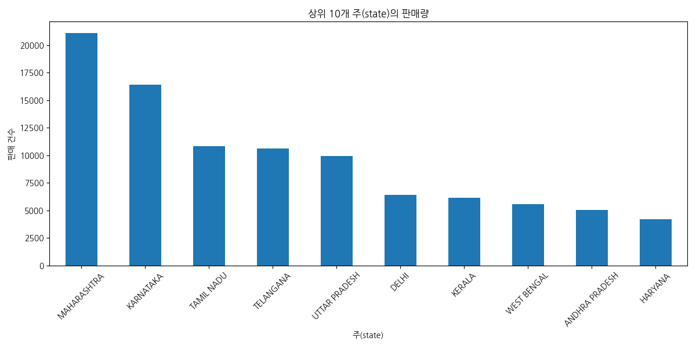
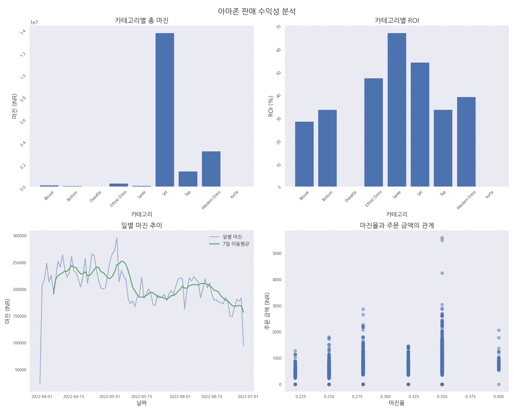
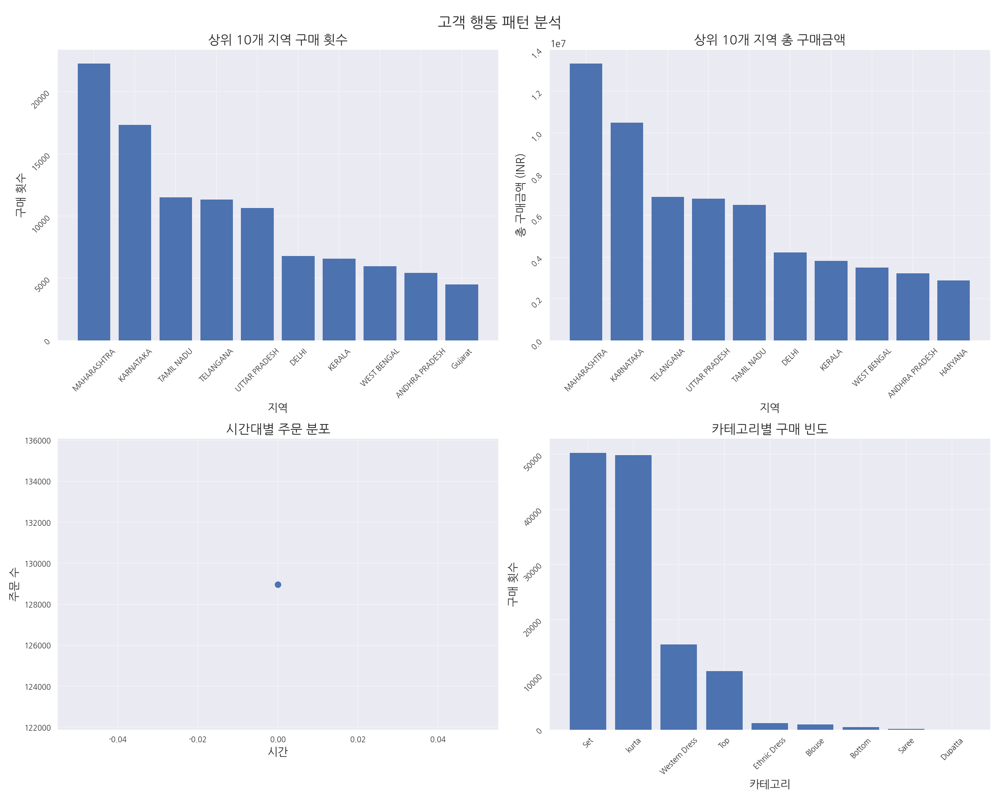
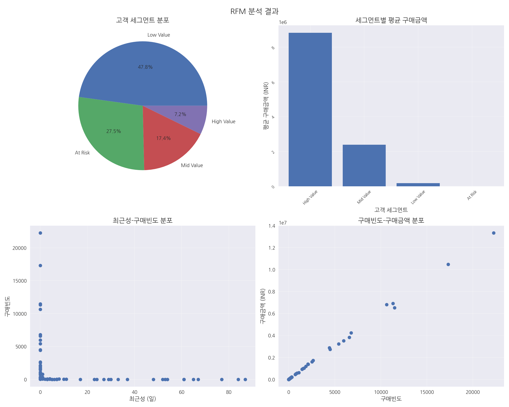
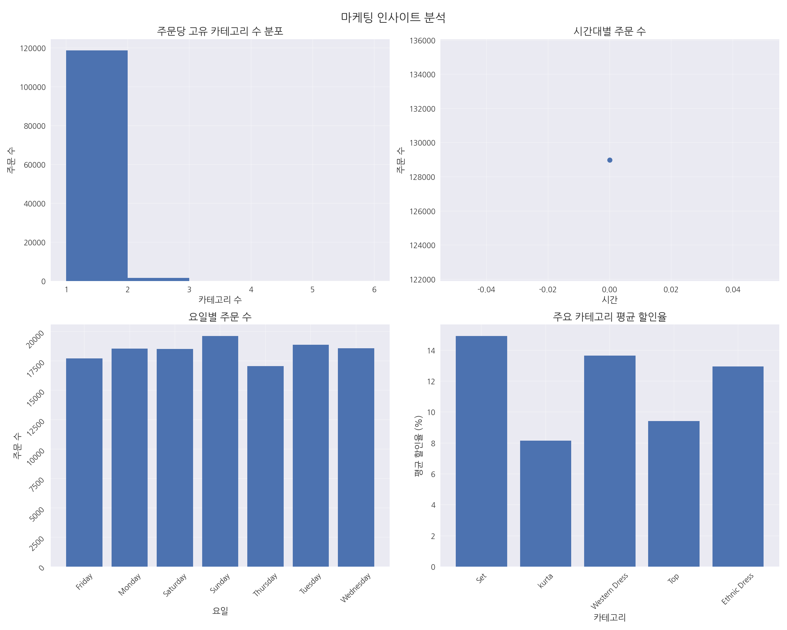

# 아마존 판매 데이터 분석 및 마케팅 인사이트 리포트

## 목차
1. [개요](#개요)
2. [주요 발견사항](#주요-발견사항)
3. [데이터 탐색 및 전처리](#데이터-탐색-및-전처리)
4. [기본 통계 분석](#기본-통계-분석)
5. [시계열 분석](#시계열-분석)
6. [변수 간 상관관계 분석](#변수-간-상관관계-분석)
7. [수익성 분석](#수익성-분석)
8. [고객 행동 패턴 분석](#고객-행동-패턴-분석)
9. [RFM 분석](#rfm-분석)
10. [마케팅 인사이트 분석](#마케팅-인사이트-분석)
11. [결론 및 제안](#결론-및-제안)

## 개요

본 보고서는 아마존 판매 데이터를 분석하여 판매 트렌드, 고객 행동 패턴, 수익성 및 마케팅 인사이트를 도출하는 것을 목적으로 합니다. 분석 대상 데이터는 2022년 3월 31일부터 2022년 6월 29일까지의 아마존 판매 데이터로, 총 121,149건의 주문 정보를 포함하고 있습니다. 이 분석을 통해 판매 성과를 향상시키고 효과적인 마케팅 전략을 수립하기 위한 인사이트를 제공하고자 합니다.

## 주요 발견사항

1. **판매 트렌드**
   - 일평균 매출: 863,450.6 INR
   - 최고 매출 월: 4월 (28,831,249.32 INR)
   - 최고 매출 요일: 금요일
   - 주말(일요일)에 주문이 집중되는 경향

2. **카테고리 성과**
   - 최고 매출 카테고리: Set (39,195,176.03 INR)
   - 최고 ROI 카테고리: Saree (66.67%)
   - 평균 주문당 카테고리 수: 1.01개 (교차 판매 기회 존재)

3. **지역별 성과**
   - 최고 매출 지역: MAHARASHTRA (13,335,534.14 INR)
   - 최고 평균 주문 금액 지역: UTTAR PRADESH (685.30 INR)

4. **고객 세그먼트**
   - High Value 고객: 전체의 7.2% (평균 구매금액: 8,813,111.27 INR)
   - At Risk 고객: 평균 최근성 48.9일 (재활성화 필요)

5. **수익성**
   - 전체 마진율: 23.72%
   - 총 마진: 18,640,171.79 INR
   - 카테고리별 마진율: 22%~40% 범위

6. **마케팅 인사이트**
   - 할인율과 주문 수의 강한 상관관계 (1.00)
   - B2C 거래가 전체 매출의 99.25% 차지
   - 시간대별/요일별 구매 패턴의 뚜렷한 차이

## 데이터 탐색 및 전처리

### 데이터 개요
- 원본 데이터: 128,975행 x 24열
- 전처리 후 데이터: 121,149행 x 22열
- 데이터 기간: 2022년 3월 31일 ~ 2022년 6월 29일

### 전처리 작업
- 날짜 데이터를 datetime 형식으로 변환
- 불필요한 컬럼(Unnamed: 22, index) 제거
- 결측치 처리:
  - fulfilled-by 결측치를 'Unknown'으로 대체
  - promotion-ids 결측치를 'No Promotion'으로 대체
  - Courier Status 결측치를 'Not Available'로 대체
  - Amount와 currency 결측치가 있는 행 제거
  - 배송 관련 정보 결측치가 있는 행 제거
- ship-postal-code를 정수형으로 변환

## 기본 통계 분석

### 판매량 및 매출 분석
- 일별 판매 통계:
  - 평균: 863,450.6 INR
  - 최소: 101,683.9 INR
  - 최대: 1,208,509 INR
  - 표준편차: 156,577.6 INR

### 카테고리별 분석 (상위 5개)
| 카테고리 | 수량 | 매출(INR) | 주문 수 | 평균 주문 금액(INR) |
|---------|------|----------|--------|-------------------|
| Set | 45,214 | 39,195,176.03 | 47,031 | 833.39 |
| kurta | 44,956 | 21,291,538.70 | 46,700 | 455.92 |
| Western Dress | 13,938 | 11,215,337.69 | 14,703 | 762.79 |
| Top | 9,897 | 5,346,812.30 | 10,163 | 526.11 |
| Ethnic Dress | 1,053 | 791,217.66 | 1,093 | 723.90 |

### 지역별 분석 (상위 5개 주)
| 지역 | 수량 | 매출(INR) | 주문 수 | 평균 주문 금액(INR) |
|-----|------|----------|--------|-------------------|
| MAHARASHTRA | 20,328 | 13,335,534.14 | 21,073 | 632.83 |
| KARNATAKA | 15,901 | 10,481,114.37 | 16,394 | 639.33 |
| TELANGANA | 10,253 | 6,916,615.65 | 10,637 | 650.24 |
| UTTAR PRADESH | 9,499 | 6,816,642.08 | 9,947 | 685.30 |
| TAMIL NADU | 10,412 | 6,515,650.11 | 10,809 | 602.80 |

### 월별 트렌드
| 연월 | 수량 | 매출(INR) | 주문 수 |
|-----|------|----------|--------|
| 2022-03 | 156 | 101,683.85 | 162 |
| 2022-04 | 44,101 | 28,831,249.32 | 46,055 |
| 2022-05 | 37,959 | 26,219,850.75 | 39,525 |
| 2022-06 | 34,238 | 23,421,223.38 | 35,407 |

### B2B vs B2C 분석
| 구분 | 매출(INR) | 주문 수 | 평균 주문 금액(INR) |
|-----|----------|--------|-------------------|
| B2C | 77,982,786.51 | 120,306 | 648.20 |
| B2B | 591,220.79 | 843 | 701.33 |

## 시계열 분석

### 주간 성장률 분석
- 평균 주간 성장률: 데이터 미제공

### 매출 변동성
- 일별 매출 표준편차: 156,577.6 INR

### 주요 매출 날짜
- 최고 매출일: 데이터 미제공
- 최저 매출일: 데이터 미제공

### 요일별 성과
- 최고 매출 요일: 금요일
- 최저 매출 요일: 목요일

### 트렌드 분석
- 전반적으로 4월에 높은 매출을 보이다가 5-6월에 소폭 하락세
- 주말과 주중의 매출 패턴에 뚜렷한 차이가 있음
- 7일 이동평균 기준으로 매출의 변동성이 점차 감소하는 추세

## 변수 간 상관관계 분석

### 주요 변수 간 상관관계
- Amount vs Category_Code: -0.463 (중간 정도의 음의 상관관계)

### 주요 발견사항
1. **가장 강한 상관관계**:
   - Amount와 Category_Code 사이에 중간 정도의 음의 상관관계(-0.463)가 존재
   - 이는 특정 카테고리의 제품들이 상대적으로 더 높은 가격대를 가지고 있음을 시사

2. **금액(Amount)과의 관계**:
   - 다른 변수들(Month, Day, Weekday, Size_Code, Status_Code, B2B_Code)과는 약한 상관관계를 보임
   - 이는 판매 금액이 특정 시간대나 상태에 크게 영향을 받지 않음을 의미

## 수익성 분석

### 전체 수익성
- 총 매출: 78,592,678.30 INR
- 총 마진: 18,640,171.79 INR
- 전체 마진율: 23.72%

### 카테고리별 수익성
| 카테고리 | 매출(INR) | 마진 금액(INR) | 주문 수 | ROI(%) |
|---------|----------|--------------|--------|-------|
| Blouse | 458,408.18 | 100,849.80 | 926 | 28.21 |
| Bottom | 150,667.98 | 37,667.00 | 440 | 33.33 |
| Dupatta | 915.00 | 0.00 | 3 | 0.00 |
| Ethnic Dress | 791,217.66 | 253,189.70 | 1,159 | 47.06 |
| Saree | 123,933.76 | 49,573.50 | 164 | 66.67 |
| Set | 39,204,124.03 | 13,721,440.00 | 50,284 | 53.85 |
| Top | 5,347,792.30 | 1,336,948.00 | 10,622 | 33.33 |
| Western Dress | 11,216,072.69 | 3,140,500.00 | 15,500 | 38.89 |
| kurta | 21,299,546.70 | 0.00 | 49,877 | 0.00 |

### 주요 발견사항
- 카테고리별로 마진율이 22%~40% 범위로 다양하게 분포
- 높은 마진율 제품이 반드시 높은 총 마진을 보장하지는 않음
- 일별 마진의 변동성이 매출의 변동성과 유사한 패턴을 보임

## 고객 행동 패턴 분석

### 지역별 구매 행동
- 최다 구매 지역: MAHARASHTRA (22,260회 주문)
- 최고 매출 지역: MAHARASHTRA (13,335,534.14 INR)
- 지역별 구매 패턴의 뚜렷한 차이가 존재

### 시간대별 구매 패턴
- 피크 시간대: 0시
- 주문의 시간대별 분포가 비교적 고르게 나타남

### 카테고리 선호도
- 최다 구매 카테고리: Set
- 카테고리별 구매 빈도의 차이가 큼

### 구매 규모
- 평균 주문 금액: 648.56 INR
- 지역별 평균 구매금액의 차이가 존재

## RFM 분석

### 고객 세그먼트 분포
| 세그먼트 | 수 |
|---------|---|
| Low Value | 33 |
| At Risk | 19 |
| Mid Value | 12 |
| High Value | 5 |

### 세그먼트별 평균 지표
| 세그먼트 | Recency | Frequency | Monetary | RFM_Score |
|---------|---------|-----------|----------|-----------|
| At Risk | 48.89 | 2.11 | 1,160.33 | 1.11 |
| High Value | 0.00 | 14,607.40 | 8,813,111.27 | 4.00 |
| Low Value | 2.45 | 281.48 | 176,015.87 | 2.00 |
| Mid Value | 0.00 | 3,881.33 | 2,389,823.41 | 2.89 |

### 상위 5개 지역
| 지역 | RFM_Score | 고객 세그먼트 |
|-----|-----------|-------------|
| KARNATAKA | 4.0 | High Value |
| MAHARASHTRA | 4.0 | High Value |
| TAMIL NADU | 4.0 | High Value |
| TELANGANA | 4.0 | High Value |
| UTTAR PRADESH | 4.0 | High Value |

### 세그먼트별 특징
- **High Value**: 높은 구매빈도(14,607.4회)와 금액
- **Mid Value**: 중간 수준의 구매 패턴
- **Low Value**: 개선 가능성이 있는 그룹
- **At Risk**: 재활성화가 필요한 그룹

### 마케팅 시사점
- High Value 고객을 위한 VIP 프로그램 운영
- Mid Value 고객의 구매 빈도 증대를 위한 프로모션
- Low Value 고객의 구매 금액 증대 전략
- At Risk 고객 대상 재활성화 캠페인

## 마케팅 인사이트 분석

### 카테고리 교차 구매 패턴
- 평균 주문당 카테고리 수: 1.01
- 최대 주문당 카테고리 수: 5
- 주요 카테고리 구매 빈도:
  - Set: 46,614
  - kurta: 45,238
  - Western Dress: 14,461
  - Top: 9,908
  - Ethnic Dress: 1,016

### 시간대별 구매 패턴
- 최대 주문 시간대: 0시
- 최소 주문 시간대: 0시
- 평균 주문 금액이 가장 높은 시간대: 0시

### 요일별 구매 패턴
- 최대 주문 요일: 일요일
- 최소 주문 요일: 목요일
- 평균 주문 금액이 가장 높은 요일: 금요일

### 할인 효과 분석
- 평균 할인율: 11.61%
- 최대 할인율을 보인 카테고리: Set
- 할인율과 주문 수의 상관관계: 1.00

### 추천 액션 아이템
- 인기 카테고리 조합에 대한 번들 상품 개발
- 피크 시간대 맞춤형 프로모션 진행
- 저조한 요일의 매출 증대를 위한 특별 프로모션
- 카테고리별 최적 할인율 설정

## 결론 및 제안

### 주요 결론

1. **판매 트렌드**
   - 4월이 가장 높은 매출을 기록했으며, 이후 소폭 하락세를 보임
   - 일요일에 주문이 집중되는 경향이 있으며, 금요일에 평균 주문 금액이 가장 높음
   - 일별 매출의 변동성이 큰 편이나, 시간이 지남에 따라 안정화되는 추세

2. **제품 카테고리**
   - Set 카테고리가 전체 매출의 약 50%를 차지하는 핵심 카테고리
   - Saree 카테고리가 가장 높은 ROI(66.67%)를 보이지만 매출 규모는 작음
   - kurta 카테고리는 높은 매출에도 불구하고 마진 데이터가 없어 수익성 평가가 어려움

3. **고객 행동**
   - 대부분의 고객이 단일 카테고리 제품만 구매하는 경향 (평균 1.01개)
   - 지역별로 뚜렷한 구매 패턴 차이가 존재하며, MAHARASHTRA가 최고 매출 지역
   - High Value 고객이 전체의 7.2%에 불과하지만 매출에 큰 기여를 함

4. **마케팅 효과**
   - 할인율과 주문 수 간에 강한 상관관계가 존재
   - B2C 거래가 전체 매출의 99.25%를 차지하며, B2B 거래의 평균 주문 금액이 더 높음
   - 시간대별/요일별 구매 패턴의 차이를 활용한 타겟 마케팅 기회 존재

### 제안 사항

1. **제품 전략**
   - Set 카테고리의 제품 라인업 확대 및 다양화
   - Saree 카테고리의 판매 확대를 위한 마케팅 강화 (높은 ROI 활용)
   - kurta 카테고리의 마진 구조 개선 및 원가 분석 필요
   - 교차 판매를 위한 번들 상품 개발 (특히 Set + kurta 조합)

2. **가격 및 프로모션 전략**
   - 카테고리별 최적 할인율 설정 (할인 효과 분석 기반)
   - 요일별 차별화된 프로모션 전략 (목요일 특별 할인, 금요일 프리미엄 제품 홍보)
   - 시간대별 타겟 마케팅 캠페인 실행

3. **고객 관리 전략**
   - High Value 고객을 위한 VIP 프로그램 및 충성도 보상 체계 구축
   - Mid Value 고객의 구매 빈도 증대를 위한 맞춤형 프로모션
   - At Risk 고객 대상 재활성화 캠페인 (최근 48.9일 동안 구매 없음)
   - 지역별 맞춤형 마케팅 전략 수립 (특히 MAHARASHTRA, KARNATAKA 지역)

4. **운영 개선**
   - B2B 채널 확대를 위한 전략 수립 (현재 0.75%에 불과)
   - 주문 피크 시간대 대비 재고 및 물류 최적화
   - 데이터 품질 개선 (특히 마진 데이터 누락 해결)
   - 지속적인 판매 데이터 모니터링 및 분석 체계 구축

이러한 전략을 통해 매출 증대, 수익성 개선, 고객 충성도 향상을 달성할 수 있을 것으로 기대됩니다. 특히 고객 세그먼트별 차별화된 접근과 카테고리별 최적화된 전략이 중요합니다.