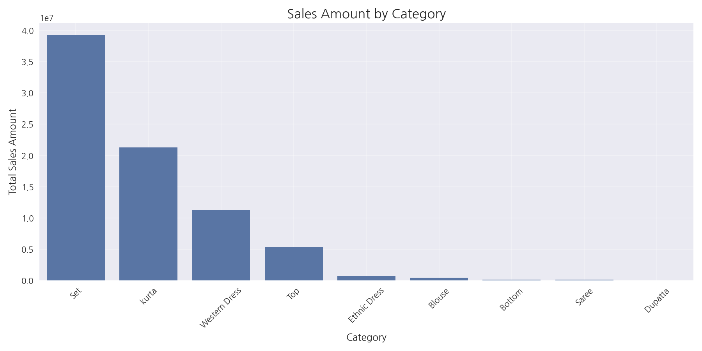
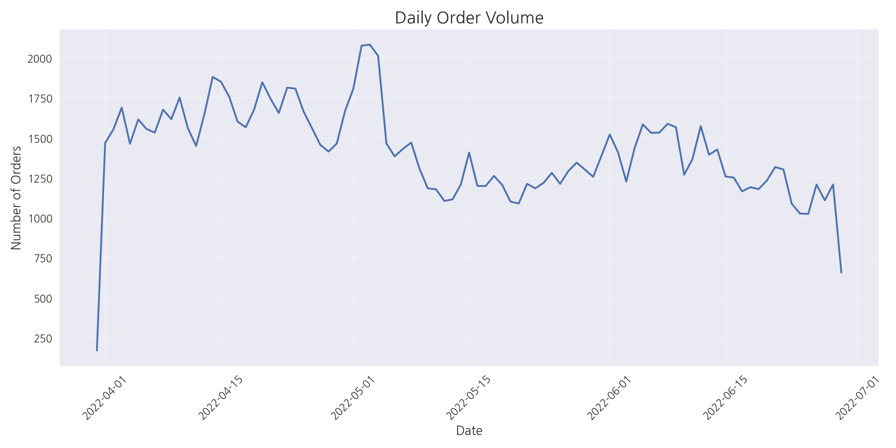
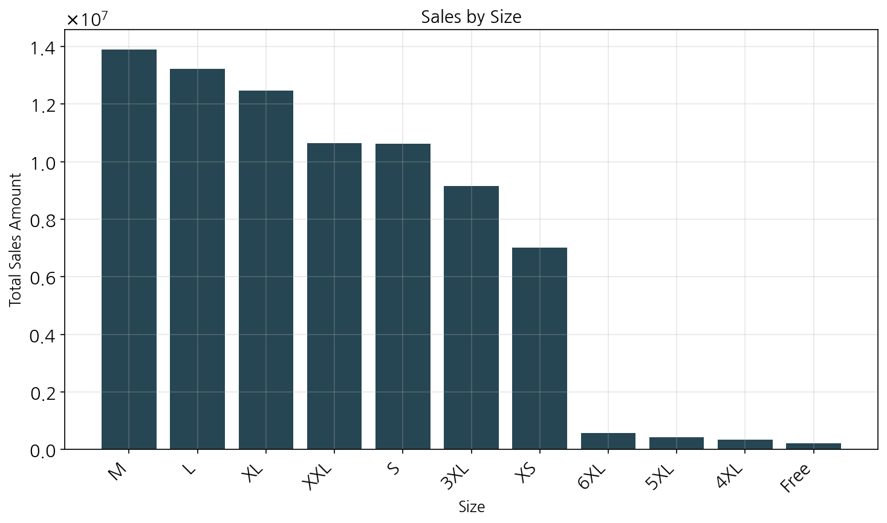
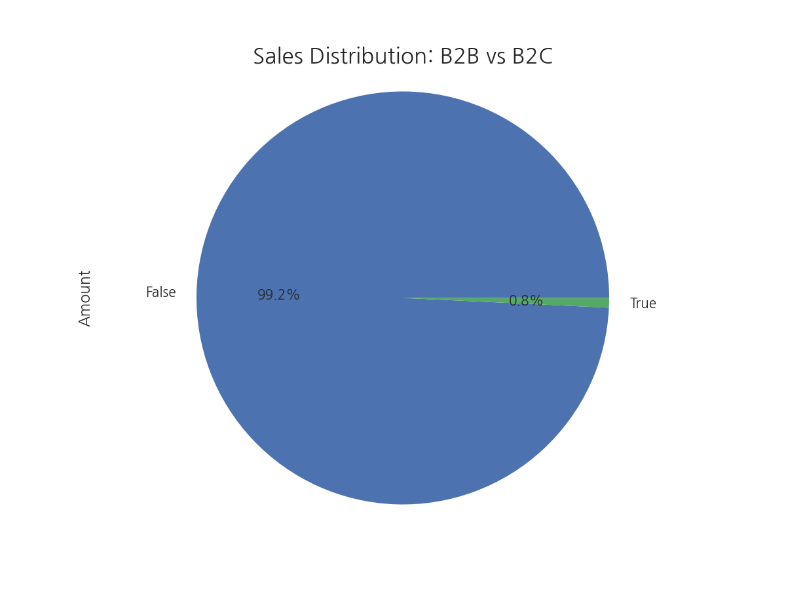

# Amazon Product Sales Data Analysis Report

## Executive Summary

This report presents a comprehensive analysis of Amazon product sales data, providing key insights into sales patterns, product performance, customer preferences, and geographical distribution. The analysis covers sales data from March to June 2022, with a total of 128,975 orders generating ₹78,592,678.30 in revenue.

Key highlights from the analysis include:

- **Sales Performance**: The highest sales were recorded in April 2022 (₹28,838,708.32), with an average order value of ₹648.56 across all transactions.
- **Product Categories**: "Set" emerged as the top-performing category (₹39,204,124.03), followed by "Kurta" (₹21,299,546.70).
- **Customer Segments**: B2C transactions dominate the business model, accounting for 99.3% of all orders.
- **Geographical Insights**: Maharashtra leads in sales (₹13,335,534.14), with Bengaluru being the top-performing city (₹6,849,664.99).
- **Fulfillment Strategy**: Amazon fulfillment handles 69.6% of orders, demonstrating the importance of the platform's logistics infrastructure.

This report provides actionable marketing insights and recommendations based on the comprehensive data analysis to optimize sales strategies and improve market positioning.

## Key Findings

1. **Sales Performance Metrics**
   - Total Orders: 128,975
   - Total Sales Amount: ₹78,592,678.30
   - Average Order Value: ₹648.56
   - Total Quantity Sold: 116,649 units

2. **Product Category Performance**
   - Top category: Set (₹39,204,124.03)
   - Second best: Kurta (₹21,299,546.70)
   - Third best: Western Dress (₹11,216,072.69)
   - Lowest performing: Dupatta (₹915.00)

3. **Size Distribution**
   - Most popular size: M (22,711 orders)
   - Second most popular: L (22,132 orders)
   - Least popular: Free (378 orders)

4. **Geographical Distribution**
   - Top state: Maharashtra (₹13,335,534.14)
   - Top city: Bengaluru (₹6,849,664.99)
   - Strong presence in major metropolitan areas

5. **Business Model**
   - B2C dominates with 99.3% of orders (₹78,001,457.51)
   - B2B accounts for only 0.7% of orders (₹591,220.79)

6. **Fulfillment Strategy**
   - Amazon fulfillment: 69.6% of orders (₹54,322,151.00)
   - Merchant fulfillment: 30.4% of orders (₹24,270,527.30)

## Detailed Analysis

### 1. Initial Data Loading and Inspection

The analysis began with loading and inspecting the Amazon sales dataset, which contained 128,975 records across 24 columns. The dataset included critical information such as order details, product information, pricing, geographical data, and fulfillment methods.

Key columns in the dataset included:
- Order ID, Date, Status
- Product details (Style, SKU, Category, Size, ASIN)
- Financial information (Currency, Amount)
- Geographical data (ship-city, ship-state, ship-postal-code, ship-country)
- Business type (B2B flag)
- Fulfillment information (Fulfilment, fulfilled-by)

Basic statistical analysis revealed:
- Quantity per order ranged from 0 to 15 items
- Order amounts ranged from ₹0 to ₹5,584
- Postal codes ranged from 110001 to 989898

### 2. Data Cleaning and Basic Analysis

#### Data Cleaning Process
The data preparation phase included:
- Converting the Date column to datetime format for time-series analysis
- Filling missing values in Courier Status, fulfilled-by, and promotion-ids columns
- Standardizing formats for consistent analysis

#### Monthly Sales Summary
The analysis of monthly sales revealed a significant pattern:

| Month    | Orders | Amount (₹)    | Quantity |
|----------|--------|---------------|----------|
| Mar 2022 | 171    | 101,683.85    | 156      |
| Apr 2022 | 49,067 | 28,838,708.32 | 44,206   |
| May 2022 | 42,040 | 26,226,476.75 | 38,011   |
| Jun 2022 | 37,697 | 23,425,809.38 | 34,276   |

#### Category-wise Sales Summary
The product category analysis showed clear leaders and opportunities:

| Category      | Orders | Amount (₹)    | Quantity |
|---------------|--------|---------------|----------|
| Set           | 50,284 | 39,204,124.03 | 45,289   |
| Kurta         | 49,877 | 21,299,546.70 | 45,045   |
| Western Dress | 15,500 | 11,216,072.69 | 13,943   |
| Top           | 10,622 | 5,347,792.30  | 9,903    |
| Ethnic Dress  | 1,159  | 791,217.66    | 1,053    |
| Blouse        | 926    | 458,408.18    | 863      |
| Bottom        | 440    | 150,667.98    | 398      |
| Saree         | 164    | 123,933.76    | 152      |
| Dupatta       | 3      | 915.00        | 3        |

### 3. Sales Visualization and Fulfillment Analysis

#### Monthly Sales Trend Analysis

The monthly sales trend visualization shows:
- Highest sales in April 2022 (₹28,838,708.32)
- Lowest sales in March 2022 (₹101,683.85)
- A slight declining trend from April to June, suggesting potential seasonality

#### Category-wise Sales Distribution

The category distribution visualization highlights:
- "Set" and "Kurta" categories dominate sales, accounting for approximately 77% of total revenue
- "Western Dress" represents a significant third category
- Several niche categories with minimal contribution (Dupatta, Saree, Bottom)

#### Daily Order Volume Analysis

The daily order volume analysis reveals:
- Average daily orders: 1,417.31
- Maximum daily orders: 2,085
- Minimum daily orders: 171
- Fluctuations in daily order volume, indicating potential day-of-week effects

#### Size Distribution Analysis

The size distribution visualization shows:
- Medium (M) is the most popular size with 22,711 orders
- Large (L) follows closely with 22,132 orders
- XL and S sizes also show strong demand
- Free size has minimal demand with only 378 orders

#### Fulfillment Analysis
The analysis of fulfillment methods revealed:

| Fulfillment | Orders | Amount (₹)    | Quantity |
|-------------|--------|---------------|----------|
| Amazon      | 89,698 | 54,322,151.00 | 84,087   |
| Merchant    | 39,277 | 24,270,527.30 | 32,562   |

This indicates that Amazon's fulfillment service handles approximately 69.6% of all orders, demonstrating the importance of the platform's logistics infrastructure.

### 4. Geographical and Business Type Analysis

#### Top 10 States by Sales

The geographical analysis by state revealed:
- Maharashtra leads with ₹13,335,534.14 in sales (22,260 orders)
- Karnataka follows with ₹10,481,114.37 (17,326 orders)
- Telangana ranks third with ₹6,916,615.65 (11,330 orders)
- The top 10 states account for a significant portion of total sales

#### Top 10 Cities by Sales
The city-wise analysis showed:
- Bengaluru leads with ₹6,849,664.99 in sales (11,217 orders)
- Hyderabad follows with ₹4,946,032.82 (8,074 orders)
- Mumbai ranks third with ₹3,704,461.80 (6,126 orders)
- Major metropolitan areas dominate the sales landscape

#### B2B vs B2C Analysis

The business type analysis revealed:
- B2C transactions dominate with 128,104 orders (₹78,001,457.51)
- B2B transactions account for only 871 orders (₹591,220.79)
- B2C represents 99.3% of total orders and 99.2% of total sales value

## Conclusions and Recommendations

### Key Conclusions

1. **Product Portfolio Strategy**
   - The "Set" and "Kurta" categories are the backbone of the business, accounting for approximately 77% of total revenue.
   - Western Dress represents a significant growth opportunity as the third-largest category.
   - Several categories (Dupatta, Saree, Bottom) have minimal contribution and may need strategic evaluation.

2. **Geographical Focus**
   - Maharashtra, Karnataka, and Telangana represent the strongest markets and should be prioritized.
   - Major metropolitan areas (Bengaluru, Hyderabad, Mumbai) drive significant sales and warrant targeted marketing.
   - There may be untapped potential in emerging tier-2 cities that could be explored.

3. **Business Model**
   - The business is overwhelmingly B2C-focused (99.3% of orders).
   - The minimal B2B presence suggests either an untapped opportunity or a strategic decision to focus on retail customers.

4. **Fulfillment Strategy**
   - Amazon fulfillment handles 69.6% of orders, highlighting the importance of this channel.
   - Merchant fulfillment accounts for 30.4%, indicating a significant portion of self-managed logistics.

5. **Sizing Strategy**
   - Medium (M) and Large (L) sizes dominate customer preferences.
   - Free size products have minimal demand and may not warrant significant inventory investment.

### Recommendations

1. **Product Strategy**
   - **Expand top performers**: Increase inventory and variety in the "Set" and "Kurta" categories to capitalize on their popularity.
   - **Develop Western Dress line**: Invest in expanding the Western Dress category, which shows strong potential as the third-largest revenue generator.
   - **Evaluate underperforming categories**: Consider phasing out or repositioning low-performing categories like Dupatta, or bundle them with popular items.
   - **Size optimization**: Focus inventory on M and L sizes, which show the highest demand, while maintaining balanced stock of XL and S sizes.

2. **Geographical Strategy**
   - **Regional marketing campaigns**: Develop targeted marketing campaigns for Maharashtra, Karnataka, and Telangana to reinforce presence in these strong markets.
   - **City-specific promotions**: Create city-specific promotions for Bengaluru, Hyderabad, and Mumbai to capitalize on their high sales volumes.
   - **Expansion strategy**: Identify and target high-potential tier-2 cities to expand market reach beyond metropolitan areas.

3. **Business Model Optimization**
   - **B2B exploration**: Evaluate the potential for expanding B2B sales through dedicated business accounts, bulk pricing, and specialized customer service.
   - **B2C enhancement**: Further strengthen the B2C model with personalized shopping experiences, loyalty programs, and enhanced customer engagement.

4. **Fulfillment Optimization**
   - **Amazon fulfillment leverage**: Maximize the benefits of Amazon fulfillment for faster delivery and improved customer satisfaction.
   - **Merchant fulfillment efficiency**: Improve efficiency in merchant-fulfilled orders to reduce costs and enhance delivery speed.
   - **Hybrid approach**: Develop a strategic hybrid approach that leverages both fulfillment methods based on product type, geography, and order value.

5. **Seasonal Strategy**
   - **Inventory planning**: Plan inventory levels based on the observed monthly sales patterns, with increased stock for peak months.
   - **Promotional calendar**: Develop a promotional calendar that aligns with sales trends, with targeted promotions during slower months.
   - **New product launches**: Time new product launches to coincide with peak sales months for maximum visibility and adoption.

6. **Marketing Recommendations**
   - **Category-focused campaigns**: Develop marketing campaigns that highlight the strengths of top-performing categories.
   - **Size-specific messaging**: Create size-specific messaging that addresses the needs of customers in the most popular size ranges.
   - **Regional content**: Develop regionally relevant content and promotions that resonate with customers in top-performing states and cities.
   - **Fulfillment messaging**: Highlight the benefits of Amazon fulfillment in marketing materials to build customer confidence.

By implementing these recommendations, the business can optimize its product portfolio, geographical focus, and fulfillment strategy to drive increased sales and customer satisfaction.