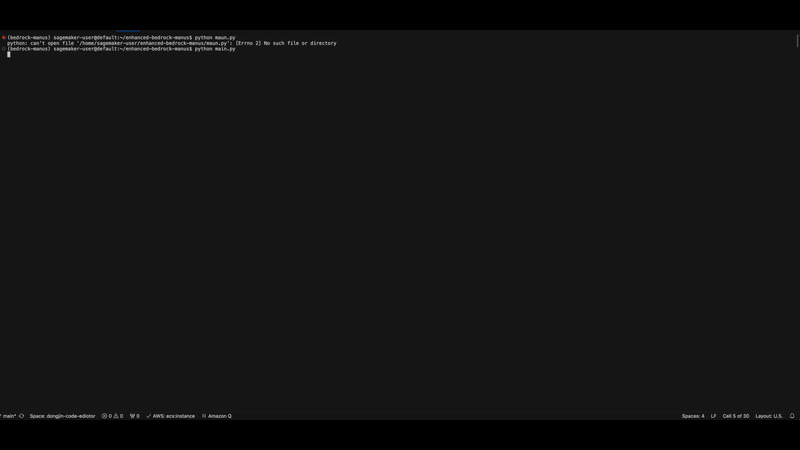
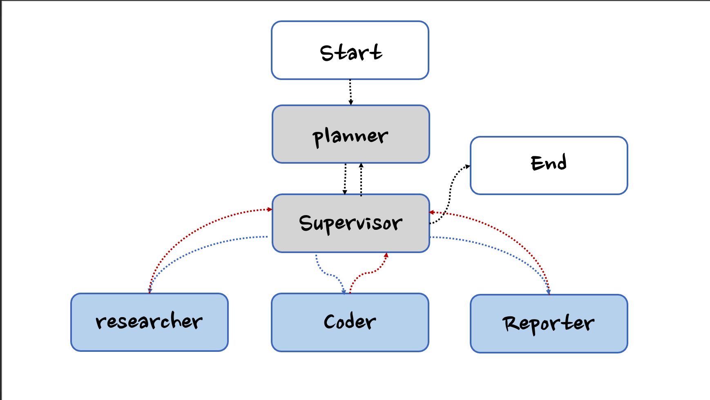

# [USE-CASES] Deep Research based on Bedrock-Manus

<p align="left">
    <a href="https://github.com/aws-samples">
            
    </a>
    <a href="https://github.com/aws-samples/aws-ai-ml-workshop-kr/blob/master/LICENSE">
        
    </a>
    <a href="https://github.com/aws-samples/aws-ai-ml-workshop-kr/tree/master/genai/aws-gen-ai-kr/20_applications/08_bedrock_manus">
            
    </a>
</p>

[English](./README.md)

> Amazon Bedrock-Optimized AI Automation Framework

Bedrock-Manus is an AI automation framework optimized for Amazon Bedrock and business use cases.

> Come From Open Source, Back to Open Source

Bedrock-Manus is based on the open-source project [LangManus](https://github.com/Darwin-lfl/langmanus).

> Amazon Bedrock-Optimized AI Automation Framework

## Demo Video

> **Task**: I'm planning to buy a laptop. Which products released within the past 2 years would you recommend? Please create the results as a PDF report.

[]

- [View on YouTube](https://www.youtube.com/watch?v=Pb1lJTSLI98)
- Output in Demo is [English- Report.pdf (6 pages)](./assets/final_report_deep_resrarch.pdf))

## Table of Contents
- [Quick Start](#quick-start)
- [Architecture](#architecture)
- [Features](#features)
- [Setup](#setup)
    - [Prerequisites](#prerequisites)
    - [Installation](#installation)
    - [API Keys Configuration](#api-keys-configuration)
- [Usage](#usage)
- [Contributors](#contributors)
- [License](#license)
- [Acknowledgments](#acknowledgments)

## Quick Start

```bash
# Clone the repository
git clone https://github.com/aws-samples/aws-ai-ml-workshop-kr.git
cd aws-ai-ml-workshop-kr/genai/aws-gen-ai-kr/20_applications/08_bedrock_manus/use_cases/01_deep_research_strands_sdk

# Create and activate virtual environment
cd setup/
./create_conda_virtual_env.sh bedrock-manus

# Configure API keys (Required)
cd ..
echo "TAVILY_API_KEY=your_tavily_api_key_here" > .env

# Run the project
conda activate bedrock-manus
python main.py

```

## Architecture

Bedrock-Manus implements a hierarchical multi-agent system where a supervisor coordinates specialized agents to accomplish complex tasks:



The system consists of the following agents working together:

1. **Planner** - Analyzes tasks and creates execution strategies
2. **Supervisor** - Oversees and manages the execution of other agents
3. **Researcher** - Solves a given problem by gatering information from the web
4. **Coder** - Handles code generation and modifications
5. **Reporter** - Generates reports and summaries of the workflow results

## Features

### Core Capabilities
- 🤖 **LLM Integration**
    - Support for all models provided in Amazon Bedrock (Nova, Claude, DeepSeek, Llama, etc.)
    - Multi-tier LLM system for different task complexities

### Development Features
- 🐍 **Python Integration**
    - Built-in Python REPL
    - Code execution environment

### Workflow Management
- 📊 **Visualization and Control**
    - Planning based on TODO list
    - Workflow graph visualization
    - Multi-agent orchestration
    - Task delegation and monitoring

## Setup

### Prerequisites

- This code has been tested in the environments listed below.
    - Amazon SageMaker AI Studio (CodeEditor and JypyterLab)

### Installation

Bedrock-Manus leverages `conda environment`
Follow the steps below to set up a virtual environment and install the necessary dependencies:

```bash
# Step 1: Create and activate a virtual environment through conda
cd setup/
./create_conda_virtual_env.sh bedrock-manus
```

### API Keys Configuration

**Important**: Before running the application, you must configure the required API keys.

#### Required API Keys

1. **Tavily API Key** (Required for web search functionality)
   - Sign up at [Tavily](https://tavily.com) to get your API key
   - The Researcher agent uses Tavily for real-time web searches and information gathering

#### Setting Up Environment Variables

Create a `.env` file in the project root directory:

```bash
# Create .env file
touch .env
```

Add your API keys to the `.env` file:

```bash
# Required: Tavily API key for web search
TAVILY_API_KEY=your_tavily_api_key_here

# Optional: Other configuration
# JINA_API_KEY=your_jina_api_key_here
# CHROME_INSTANCE_PATH=/Applications/Google Chrome.app/Contents/MacOS/Google Chrome
# BROWSER_HEADLESS=False
```

#### Alternative: Environment Variables

You can also set the API keys as system environment variables:

```bash
export TAVILY_API_KEY=your_tavily_api_key_here
```

**Note**: Without the Tavily API key, the application will fail to start with a validation error. Make sure to configure it before running the application.

By completing these steps, you'll ensure your environment is properly configured and ready for development.

## Usage

### Basic Execution

To run Bedrock-Manus with default settings:

```bash
python main.py
```
or use `main.ipynb`

To run Bedrock-Manus with UI (Streamlit):
```bash
cd app/
streamlit run app.py
```

### Advanced Configuration

Bedrock-Manus can be customized through various configuration files in the `src/config` directory:
- `agents.py`: Modify team composition, agent system prompts, and `prompt caching` enablement

### Agent Prompts System

Bedrock-Manus uses a sophisticated prompting system in the `src/prompts` directory to define agent behaviors and responsibilities:

#### Core Agent Roles

- **Supervisor ([`src/prompts/supervisor.md`](src/prompts/supervisor.md))**: Coordinates the team and delegates tasks by analyzing requests and determining which specialist should handle them. Makes decisions about task completion and workflow transitions.

- **Planner ([`src/prompts/planner.md`](src/prompts/file_manager.md))**: Plan and Execute tasks using a team of specialized agents to achieve the desired outcome.

- **Researcher ([`src/prompts/researcher.md`](src/prompts/researher.md))**: Specializes in information gathering through web searches and data collection. Uses Tavily search and web crawling capabilities while avoiding mathematical computations or file operations.

- **Coder ([`src/prompts/coder.md`](src/prompts/coder.md))**: Professional software engineer role focused on Python and bash scripting. Handles:
    - Python code execution and analysis
    - Shell command execution
    - Technical problem-solving and implementation

- **Reporter ([`src/prompts/reporter.md`](src/prompts/coder.md))**: Professional reporter responsible for writing clear, comprehensive reports based ONLY on provided information and verifiable facts.
    - Summary imtermideate results
    - Python code execution (results generation)
    - Shell command execution (results generation)

#### Prompt System Architecture

The prompts system uses a template engine ([`src/prompts/template.py`](src/prompts/template.py)) that:
- Loads role-specific markdown templates
- Handles variable substitution (e.g., current time, team member information)
- Formats system prompts for each agent

Each agent's prompt is defined in a separate markdown file, making it easy to modify behavior and responsibilities without changing the underlying code.

## Contributors

- **Dongjin Jang, Ph.D.** (AWS AI/ML Specislist Solutions Architect) | [Mail](mailto:dongjinj@amazon.com) | [Linkedin](https://www.linkedin.com/in/dongjin-jang-kr/) | [Git](https://github.com/dongjin-ml) | [Hugging Face](https://huggingface.co/Dongjin-kr) |

## License

- <span style="#FF69B4;"> This is licensed under the [MIT License](https://github.com/aws-samples/aws-ai-ml-workshop-kr/blob/master/LICENSE). </span>

## Acknowledgments

Special thanks to all the open source projects and contributors (especilly LangMauns) that make BedrockManus possible. We stand on the shoulders of giants.
