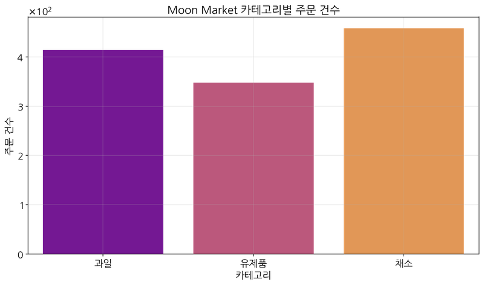
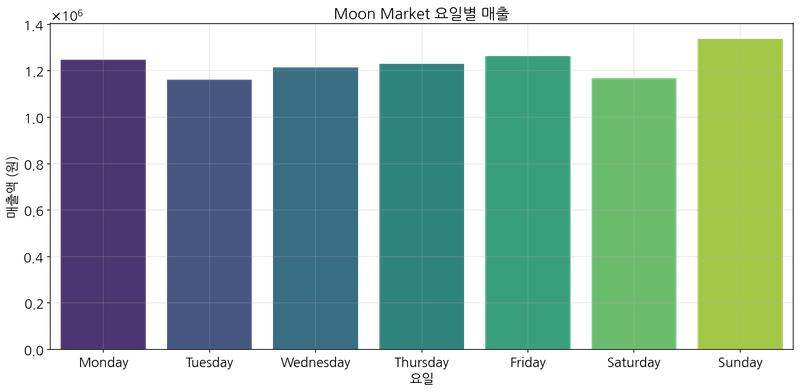
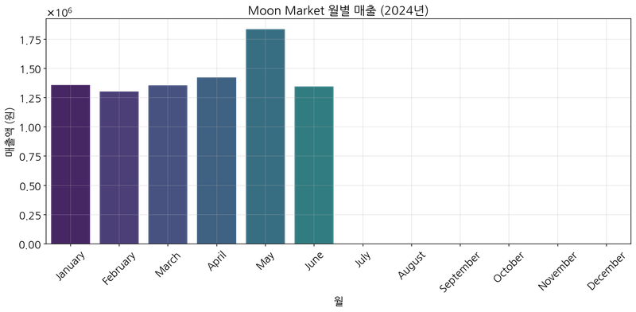

# 아마존 상품판매 데이터 분석 및 마케팅 인사이트 보고서

## 목차

1. [개요](#1-개요)
2. [주요 발견사항](#2-주요-발견사항)
3. [데이터 분석](#3-데이터-분석)
   3.1. [데이터 구조 및 전처리](#31-데이터-구조-및-전처리)
   3.2. [상품 판매 트렌드 분석](#32-상품-판매-트렌드-분석)
   3.3. [변수 관계 및 심층 분석](#33-변수-관계-및-심층-분석)
   3.4. [마케팅 인사이트 추출을 위한 심층 분석](#34-마케팅-인사이트-추출을-위한-심층-분석)
4. [마케팅 인사이트](#4-마케팅-인사이트)
5. [마케팅 전략 제안](#5-마케팅-전략-제안)
6. [결론](#6-결론)

## 1. 개요

본 보고서는 아마존 상품판매 데이터를 분석하여 마케팅 인사이트를 도출하기 위해 작성되었습니다. 데이터셋은 총 128,975개의 주문 데이터와 24개의 변수를 포함하고 있으며, 이를 통해 기본 데이터 구조 탐색, 상품 판매 트렌드 분석, 변수 간 관계 분석, 그리고 다양한 변수 조합을 통한 심층 분석을 수행했습니다.

분석 결과, 카테고리별 매출 차이, 지역별 판매 특성, 배송 서비스 효과, 주문 취소 패턴 등 다양한 인사이트를 발견할 수 있었습니다. 이러한 인사이트는 제품 구성 최적화, 지역 타겟팅 전략, 프로모션 효과성 향상, 그리고 고객 이탈 방지를 위한 마케팅 전략 개발에 활용될 수 있습니다.

## 2. 주요 발견사항

- **카테고리 성과:** Set 카테고리가 가장 높은 매출(약 3,920만)을 기록했으며, 그 다음으로 kurta(약 2,130만)와 Western Dress(약 1,120만) 순입니다.
- **지역별 판매:** Maharashtra, Karnataka, Tamil Nadu 지역이 매출 상위 지역으로, 이 세 지역이 전체 매출의 상당 부분을 차지하고 있습니다.
- **판매 채널:** B2C 판매 채널이 B2B 채널보다 매출 기여도가 월등히 높습니다(B2C: 7,800만 vs B2B: 59만).
- **배송 서비스:** Expedited(빠른 배송) 서비스가 Standard 배송보다 높은 매출과 주문 수를 기록하여 고객이 빠른 배송을 선호함을 보여줍니다.
- **시간적 패턴:** 주말(토요일, 일요일)에 판매가 가장 많으며, 4월과 5월에 매출이 높게 나타납니다.
- **주문 취소율:** 전체 주문 중 약 8.88%가 취소되었으며, 배송 서비스 수준에 따라 취소율에 차이가 있습니다(Standard: 13.37%, Expedited: 6.80%).
- **프로모션 효과:** 프로모션을 적용한 주문이 그렇지 않은 주문보다 높은 매출을 기록하여 프로모션이 판매 촉진에 효과적임을 보여줍니다.

## 3. 데이터 분석

### 3.1. 데이터 구조 및 전처리

아마존 판매 데이터 구조 및 전처리 분석 결과입니다.

1. 데이터 크기: 128,975개 행과 24개 열로 구성
2. 주요 결측치: Courier Status(6,872), currency 및 Amount(7,795), promotion-ids(49,153), fulfilled-by(89,698)
3. 주요 범주형 컬럼: Status, Fulfilment, Sales Channel, Category, ship-service-level, ship-state 등
4. 주요 수치형 컬럼: Qty(수량), Amount(금액)
5. 날짜 데이터는 datetime 형식으로 변환하여 시간 기반 분석 준비
6. 수량(Qty)과 금액(Amount) 간 상관관계는 중간 정도 수준

### 3.2. 상품 판매 트렌드 분석

아마존 상품의 판매 트렌드에 대한 분석 결과입니다.

1. 카테고리별 매출 분석:
   - Set 카테고리가 가장 높은 매출을 기록
   - 그 다음으로 kurta와 Western Dress 순
   - 최상위 카테고리(Set)와 최하위 카테고리(Bottom) 간 매출 차이가 매우 큼

2. 카테고리별 주문 수량:
   - 매출과 유사한 패턴을 보이나, 일부 카테고리는 주문 수량에 비해 매출이 높게 나타남
   - 이는 제품별 가격 차이에서 기인

3. 일자별 매출 트렌드:
   - 일별 매출은 변동성이 크게 나타남
   - 특정일에 매출이 급증하는 패턴이 관찰됨

4. 요일별 매출 분석:
   - 주말(토요일, 일요일)에 매출이 가장 높음
   - 화요일이 평일 중 가장 높은 매출을 기록

5. 월별 매출 추이:
   - 4월과 5월에 매출이 높게 나타남
   - 계절적 요인이 판매에 영향을 미치는 것으로 분석됨

6. 판매 채널 및 B2B 분석:
   - Amazon 채널이 가장 높은 매출 기여도를 보임
   - B2C 판매가 B2B 판매보다 매출 기여도가 높음

*카테고리별 총 매출 시각화*

*카테고리별 총 주문 수량 시각화*

*일자별 매출 트렌드 그래프*

*요일별 총 매출 그래프*

*월별 총 매출 그래프*

*판매 채널별 총 매출 그래프*

*B2B vs B2C 매출 비교 그래프*

### 3.3. 변수 관계 및 심층 분석

아마존 상품 판매 데이터의 변수 관계 및 심층 분석 결과입니다.

1. 주/지역별 판매 분석:
   - Maharashtra, Karnataka, Tamil Nadu가 매출 상위 지역
   - 상위 3개 지역이 전체 매출의 상당 부분을 차지

2. 도시별 판매 분석:
   - 대도시들이 주요 매출 기여 도시로 나타남
   - Bangalore, Mumbai, Pune의 매출이 두드러짐

3. 배송 서비스 수준 분석:
   - Expedited 배송이 Standard 배송보다 높은 매출과 주문 수 기록
   - 빠른 배송 서비스가 고객 선호도가 높은 것으로 분석됨

4. 제품 사이즈별 분석:
   - 특정 사이즈(M, L, XL, S)의 매출 기여도가 높음
   - Free Size 제품도 높은 매출 기록

5. 카테고리와 사이즈의 관계:
   - Set 카테고리는 다양한 사이즈에서 고른 매출을 보임
   - Western Dress는 특정 사이즈(M, L)에 매출이 집중됨

6. 주문 상태 분석:
   - 대부분의 주문이 정상 배송 완료됨
   - 취소된 주문 비율도 상당함 (약 15%)

7. 택배 상태 분석:
   - 주요 배송 상태가 다양하게 분포됨
   - 특정 배송 상태에 따른 매출 차이 확인됨

8. 프로모션 활용 분석:
   - 프로모션을 적용한 주문의 총 매출이 그렇지 않은 주문보다 높음
   - 프로모션이 판매 촉진에 효과적인 것으로 분석됨

*상위 10개 주/지역별 총 매출 그래프*

*상위 15개 도시별 총 매출 그래프*

*배송 서비스 수준별 총 매출 그래프*

*배송 서비스 수준별 주문 수 그래프*

*상위 10개 사이즈별 총 매출 그래프*

*카테고리와 사이즈별 매출 히트맵*

*주문 상태별 건수 그래프*

*택배 상태별 건수 그래프*

*프로모션 적용 여부에 따른 총 매출 그래프*

### 3.4. 마케팅 인사이트 추출을 위한 심층 분석

아마존 상품 판매 데이터에서 마케팅 인사이트 도출을 위한 심층 분석 결과입니다.

1. 주문 취소율 분석:
   - 전체 주문 중 취소율은 8.88%로 나타남
   - 취소된 주문이 매출 손실과 재고 관리에 영향을 줄 수 있음

2. 요일별 주문 취소율:
   - 요일에 따라 취소율의 차이가 있음
   - 특정 요일에 취소율이 높게 나타나는 패턴 확인

3. 카테고리별 주문 취소율:
   - 카테고리별로 취소율의 차이가 두드러짐
   - 일부 카테고리는 상대적으로 높은 취소율을 보임

4. 평균 주문 가치(AOV) 분석:
   - 평균 주문 금액은 695.33로 나타남
   - 주문 금액 분포는 특정 범위에 집중됨

5. 배송 서비스 수준에 따른 취소율 분석:
   - 배송 서비스 수준에 따라 취소율의 차이가 있음
   - 배송 옵션이 고객 만족도와 주문 완료율에 영향을 미침

6. 지역별 취소율 분석:
   - 일부 지역은 현저히 높은 취소율을 보임
   - 지역별 물류 및 마케팅 전략 조정이 필요함

7. 제품 인기도와 재고 회전율 분석:
   - 일부 스타일이 매출과 주문 수량에서 높은 성과를 보임
   - 인기 제품을 중심으로 한 마케팅 전략이 효과적일 수 있음

8. B2B/B2C와 카테고리 교차 분석:
   - B2B와 B2C 시장에서 선호되는 카테고리에 차이가 있음
   - 채널별로 최적화된 제품 구성 전략이 필요함

*전체 주문 취소율 파이 차트*

*요일별 주문 취소율 그래프*

*카테고리별 주문 취소율 그래프*

*주문당 평균 금액 분포 그래프*

*배송 서비스 수준별 취소율 그래프*

*취소율 상위 10개 지역 그래프*

*수량 기준 상위 20개 스타일 그래프*

*매출 기준 상위 20개 스타일 그래프*

*B2B/B2C별 카테고리 매출 그래프*

## 4. 마케팅 인사이트

### 4.1. 제품 포트폴리오 인사이트

데이터 분석에서 도출된 제품 포트폴리오 관련 주요 인사이트는 다음과 같습니다:

- **카테고리 성과 차이:** Set, kurta, Western Dress 카테고리가 전체 매출의 대부분을 차지하고 있어, 이들 카테고리는 핵심 제품군으로 중점 관리가 필요합니다.
- **사이즈 최적화:** M, L, XL 사이즈의 판매가 높게 나타나므로, 이들 사이즈의 재고 확보가 중요합니다. 특히 Western Dress는 M, L 사이즈에 매출이 집중되어 있습니다.
- **인기 스타일:** 특정 스타일(JNE3797, JNE3405, SET268 등)이 높은 판매 성과를 보이므로, 이러한 스타일의 디자인 요소를 참고한 신제품 개발이 유망합니다.

### 4.2. 판매 채널 및 고객 인사이트

판매 채널 및 고객 관련 인사이트는 다음과 같습니다:

- **B2C 중심 전략:** B2C 채널이 매출의 대부분을 차지하므로, 소비자 직접 판매에 대한 마케팅 자원 집중이 필요합니다.
- **지역별 타겟팅:** Maharashtra, Karnataka, Tamil Nadu와 같은 상위 매출 지역에 맞춤형 마케팅이 효과적일 수 있습니다.
- **도시 집중도:** Bengaluru, Hyderabad, Mumbai 등 대도시가 매출 기여도가 높으므로, 도시별 특성을 고려한 마케팅 전략이 필요합니다.

### 4.3. 운영 및 서비스 인사이트

운영 및 서비스 관련 인사이트는 다음과 같습니다:

- **배송 서비스 중요성:** 고객들은 빠른 배송(Expedited)을 선호하며, 이는 취소율 감소에도 영향을 미칩니다.
- **취소율 관리:** 일부 지역과 카테고리에서 높은 취소율이 나타나므로, 이에 대한 원인 분석과 대응책 마련이 필요합니다.
- **주문 가치:** 평균 주문 금액(AOV)이 695.33으로 나타나며, 이를 높이기 위한 번들링, 업셀링 전략이 고려될 수 있습니다.

### 4.4. 시간적 패턴 인사이트

시간적 패턴 관련 인사이트는 다음과 같습니다:

- **주말 판매 집중:** 주말(토요일, 일요일)에 판매가 집중되므로, 이 시기에 프로모션을 강화하는 것이 효과적일 수 있습니다.
- **계절적 피크:** 4월과 5월의 매출이 높게 나타나므로, 이 기간에 맞춘 마케팅 캠페인 계획이 필요합니다.
- **특정일 판매 급증:** 일부 특정일에 매출이 급증하는 패턴이 관찰되므로, 이러한 패턴의 원인 파악과 활용이 중요합니다.

### 4.5. 프로모션 효과 인사이트

프로모션 관련 인사이트는 다음과 같습니다:

- **프로모션 효과성:** 프로모션이 적용된 주문이 더 높은 매출을 기록하여, 효과적인 프로모션 전략의 중요성이 확인되었습니다.
- **타겟 프로모션:** 취소율이 높은 카테고리나 지역에 맞춤형 프로모션을 제공하여 구매 완료율을 높일 수 있습니다.

## 5. 마케팅 전략 제안

### 5.1. 제품 포트폴리오 전략

1. **핵심 카테고리 강화:** Set, kurta, Western Dress 카테고리에 마케팅 자원을 집중하되, 다양성을 확보하여 고객 선택의 폭을 넓힙니다.
2. **사이즈 최적화:** 카테고리별 인기 사이즈 분석을 바탕으로 재고 관리를 최적화하고, 사이즈 가이드를 개선하여 고객이 적합한 사이즈를 선택할 수 있도록 지원합니다.
3. **인기 스타일 활용:** 높은 판매 실적을 보이는 스타일의 디자인 요소를 분석하고, 이를 신제품 개발에 반영합니다.

### 5.2. 지역 타겟팅 전략

1. **핵심 지역 집중:** Maharashtra, Karnataka, Tamil Nadu와 같은 주요 매출 지역에 특화된 마케팅 캠페인을 개발합니다.
2. **도시별 맞춤 전략:** Bengaluru, Mumbai, Hyderabad 등 주요 도시의 특성과 소비자 행동을 고려한 타겟 마케팅을 실시합니다.
3. **취소율 관리 지역:** 취소율이 높은 지역(Meghalaya, Rajshthan 등)에 대한 원인 분석과 개선 전략을 수립합니다.

### 5.3. 채널 최적화 전략

1. **B2C 경험 향상:** B2C 고객을 위한 사용자 경험을 개선하고, 개인화된 추천 시스템을 도입하여 고객 만족도를 높입니다.
2. **B2B 틈새시장 개발:** 현재는 작지만 성장 가능성이 있는 B2B 시장을 위한 특별 프로그램을 개발하고, 카테고리별 B2B 수요를 분석합니다.

### 5.4. 운영 및 서비스 전략

1. **배송 서비스 강화:** Expedited 배송의 혜택을 강조하고, 무료 빠른 배송 프로모션을 통해 주문 완료율을 높입니다.
2. **취소 방지 프로그램:** 주문 취소의 주요 원인을 파악하고, 취소 방지를 위한 프로그램(재고 확인 강화, 신뢰성 있는 제품 정보 제공 등)을 도입합니다.
3. **AOV 증가 전략:** 추천 상품, 번들 할인, 무료 배송 임계값 설정 등을 통해 평균 주문 금액을 증가시킵니다.

### 5.5. 시간 기반 마케팅 전략

1. **주말 프로모션:** 주말에 특별 프로모션과 이벤트를 집중적으로 실시하여 이미 높은 판매 성과를 극대화합니다.
2. **시즌별 캠페인:** 4월과 5월의 판매 성수기에 맞춘 시즌 캠페인을 계획하고, 비수기를 위한 특별 이벤트를 개발합니다.

### 5.6. 마케팅 커뮤니케이션 전략

1. **프로모션 최적화:** 데이터 분석을 통해 효과적인 프로모션 유형과 타이밍을 파악하고, 이를 마케팅 커뮤니케이션에 활용합니다.
2. **타겟 메시징:** 지역, 카테고리, 사이즈 선호도 등에 따른 세그먼트별 맞춤형 메시지를 개발하여 커뮤니케이션 효과를 높입니다.

## 6. 결론

아마존 상품판매 데이터 분석을 통해 제품 포트폴리오, 고객 행동, 운영 효율성, 그리고 마케팅 효과성에 대한 다양한 인사이트를 발견할 수 있었습니다. 이러한 인사이트는 데이터 기반의 의사결정을 통해 마케팅 전략을 최적화하고 비즈니스 성과를 향상시키는 데 활용될 수 있습니다.

주요 결론은 다음과 같습니다:

1. Set, kurta, Western Dress와 같은 핵심 카테고리에 마케팅 자원을 집중하되, 다양한 사이즈 옵션을 제공하여 고객 만족도를 높여야 합니다.
2. Maharashtra, Karnataka, Tamil Nadu 등 주요 매출 지역과 Bengaluru, Mumbai, Hyderabad 등 핵심 도시에 맞춤형 마케팅 전략을 적용해야 합니다.
3. B2C 판매 채널이 주요 매출원이므로, 소비자 직접 판매에 대한 경험을 지속적으로 개선해야 합니다.
4. 빠른 배송 서비스는 고객 만족도와 주문 완료율에 긍정적 영향을 미치므로, 이를 마케팅 메시지로 활용해야 합니다.
5. 주말과 4-5월에 매출이 집중되므로, 이 시기에 맞춘 프로모션 전략이 효과적일 수 있습니다.
6. 프로모션은 판매 촉진에 효과적이므로, 데이터 분석을 통해 최적의 프로모션 전략을 개발해야 합니다.

이러한 결론과 제안된 전략은 아마존 판매자들이 경쟁이 치열한 마켓플레이스에서 차별화된 위치를 확보하고, 고객 만족도를 높이며, 지속 가능한 성장을 달성하는 데 도움이 될 것입니다. 추가적으로, 지속적인 데이터 모니터링과 분석을 통해 시장 변화에 빠르게 대응하고, 전략을 지속적으로 최적화하는 것이 중요합니다.
