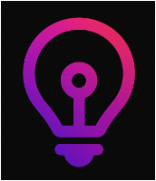
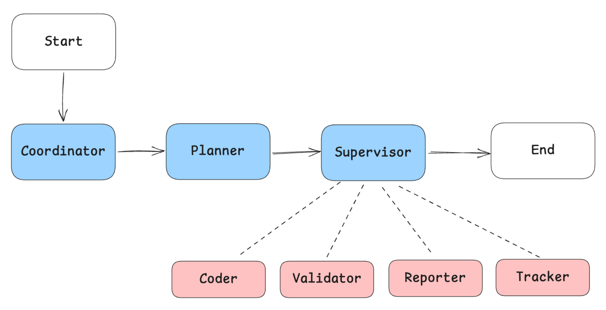

<div align="center">
  <div>
    
  </div>

  <h1 style="margin-top: 10px;">Deep Insight</h1>

  <h2>A model-driven approach to building customizable reporting agents with Amazon Bedrock</h2>

  <div align="center">
    <a href="https://github.com/aws-samples/aws-ai-ml-workshop-kr/graphs/commit-activity"></a>
    <a href="https://github.com/aws-samples/aws-ai-ml-workshop-kr/blob/master/LICENSE"></a>
    <a href="https://www.python.org/downloads/"></a>
  </div>

  <p>
    <a href="#why-deep-insight">Why Deep Insight?</a>
    ◆ <a href="#quick-start">Quick Start</a>
    ◆ <a href="#demo">Demo</a>
    ◆ <a href="#installation">Installation</a>
    ◆ <a href="#architecture">Architecture</a>
  </p>
</div>

## *Latest News* 🔥

- **[2025/10]** Released [AWS workshop](https://catalog.us-east-1.prod.workshops.aws/workshops/ee17ba6e-edc4-4921-aaf6-ca472841c49b/ko-KR) for Deep Insight (Korean)
- **[2025/10]** Added support for Claude Sonnet 4.5 with enhanced reasoning capabilities
- **[2025/09]** Released Deep Insight framework built on Strands SDK and Amazon Bedrock with hierarchical multi-agent architecture

## Why Deep Insight?

Transform weeks of manual reporting work into minutes using hierarchical multi-agent systems built on Strands SDK and Amazon Bedrock.

- **🎨 Full Customization & Control** - Modify agents, prompts, and workflows with complete code access in your AWS VPC
- **🔒 Enterprise-Grade Security** - Single-tenant VPC deployment with complete data isolation
- **🤖 Advanced Multi-Agent Architecture** - Hierarchical workflow with Coordinator, Planner, Supervisor, and specialized tool agents
- **📊 Transparency & Verifiability** - Reports with calculation methods, sources, and reasoning processes
- **🚀 Beyond Reporting** - Extend to any agent use case: shopping, support, log analysis, and more

## Quick Start

```bash
# 1. Clone and setup (see Installation for details)
git clone https://github.com/aws-samples/aws-ai-ml-workshop-kr.git
cd aws-ai-ml-workshop-kr/genai/aws-gen-ai-kr/20_applications/08_bedrock_manus/use_cases/06_insight_extractor_strands_sdk_workshop_phase_1
cd setup/ && ./create-uv-env.sh deep-insight 3.12 && cd ..

# 2. Run your analysis
uv run python main.py --user_query "Create a sales performance report for Moon Market. Analyze from sales and marketing perspectives, generate charts and extract insights, then create a PDF file. The analysis target is the `./data/Dat-fresh-food-claude.csv` file."
```

> **Note**: Requires Python 3.12+ and AWS credentials configured (tested in us-west-2 region).

## Demo

### Amazon Sales Data Analysis

> **Task**: "Create a sales performance report for Moon Market. Analyze from sales and marketing perspectives, generate charts and extract insights, then create a PDF file. The analysis target is the `./data/Dat-fresh-food-claude.csv` file."

[▶️ Watch Full Demo on YouTube](https://www.youtube.com/watch?v=pn5aPfYSnp0)

### Sample Outputs

📄 [English Report](./assets/report_en.pdf) | 📄 [Korean Report](./assets/report.pdf)

## Installation

### Environment Setup

```bash
# Navigate to setup directory
cd setup/

# Create UV environment with Python 3.12
./create-uv-env.sh deep-insight 3.12

# Return to project root and run
cd ..
uv run python main.py --user_query "Your analysis request here"
```

### Configure AWS Credentials

**Option 1: AWS CLI (Recommended)**

```bash
aws configure
```

**Option 2: Environment Variables**

```bash
# Direct export
export AWS_REGION=us-west-2
export AWS_ACCESS_KEY_ID=your_access_key
export AWS_SECRET_ACCESS_KEY=your_secret_key

# OR use .env file
cp .env.example .env
# Edit .env with your AWS credentials
```

## Architecture

### System Overview



### Three-Tier Agent Hierarchy

```
┌─────────────────────────────────────────────────────────┐
│                     User Input                          │
│              (Natural Language Query)                   │
└──────────────────────┬──────────────────────────────────┘
                       │
                       ▼
┌─────────────────────────────────────────────────────────┐
│  COORDINATOR (Entry Point)                              │
│  • Handles initial user requests                        │
│  • Routes simple queries directly                       │
│  • Hands off complex tasks to Planner                   │
│  Model: Claude Sonnet 4 (no reasoning)                  │
└──────────────────────┬──────────────────────────────────┘
                       │
                       ▼
┌─────────────────────────────────────────────────────────┐
│  PLANNER (Strategic Thinking)                           │
│  • Analyzes task complexity                             │
│  • Creates detailed execution plan                      │
│  • Uses reasoning for step-by-step strategy             │
│  Model: Claude Sonnet 4 (reasoning enabled)             │
└──────────────────────┬──────────────────────────────────┘
                       │
                       ▼
┌─────────────────────────────────────────────────────────┐
│  SUPERVISOR (Task Orchestrator)                         │
│  • Delegates tasks to specialized agents                │
│  • Monitors progress and coordinates workflow           │
│  • Aggregates results from tool agents                  │
│  Model: Claude Sonnet 4 (prompt caching enabled)        │
└──────────┬──────────┬──────────┬────────────────────────┘
           │          │          │          │
     ┌─────┘    ┌─────┘    ┌─────┘    ┌─────┘
     ▼          ▼          ▼          ▼
┌─────────┐ ┌─────────┐ ┌─────────┐ ┌──────────┐
│  CODER  │ │REPORTER │ │TRACKER  │ │VALIDATOR │
│         │ │         │ │         │ │          │
│ Python  │ │ Report  │ │Progress │ │ Quality  │
│ Bash    │ │ Format  │ │Monitor  │ │ Validate │
│ Analysis│ │ Generate│ │ State   │ │ Verify   │
└─────────┘ └─────────┘ └─────────┘ └──────────┘
```

## Contributing

We welcome contributions! See [CONTRIBUTING.md](CONTRIBUTING.md) for details.

### Quick Start for Contributors

```bash
# Fork the repository on GitHub, then clone your fork
git clone https://github.com/YOUR_USERNAME/aws-ai-ml-workshop-kr.git
cd aws-ai-ml-workshop-kr/genai/aws-gen-ai-kr/20_applications/08_bedrock_manus/use_cases/06_insight_extractor_strands_sdk_workshop_phase_1

# Follow installation steps above to set up your environment

# Create feature branch
git checkout -b feature/your-feature-name

# Make changes, test, then commit and push
git add .
git commit -m "Add feature: description"
git push origin feature/your-feature-name

# Open a Pull Request on GitHub
```

### Contribution Areas

- **New Agent Types**: Add specialized agents for specific domains
- **Tool Integration**: Create new tools for agent capabilities
- **Model Support**: Add support for additional LLM providers
- **Documentation**: Improve guides, examples, and tutorials
- **Bug Fixes**: Fix issues and improve stability
- **Performance**: Optimize streaming, caching, and execution

## License

This project is licensed under the **MIT License** - see the [LICENSE](LICENSE) file for details.

## Acknowledgments

### Philosophy

> **"Come From Open Source, Back to Open Source"**

We believe in the power of open collaboration. Deep Insight takes the excellent work of the LangManus community and extends it with AWS-native capabilities, then contributes those enhancements back to the community.

## Contributors

- **Dongjin Jang, Ph.D.** - AWS AI/ML Specialist Solutions Architect
  - [Email](mailto:dongjinj@amazon.com) | [LinkedIn](https://www.linkedin.com/in/dongjin-jang-kr/) | [GitHub](https://github.com/dongjin-ml) | [Hugging Face](https://huggingface.co/Dongjin-kr)

---

<div align="center">
  <p>
    <strong>Built with ❤️ by AWS KOREA SA Team</strong><br>
    <sub>Empowering enterprises to build customizable agentic AI systems</sub>
  </p>
</div>
