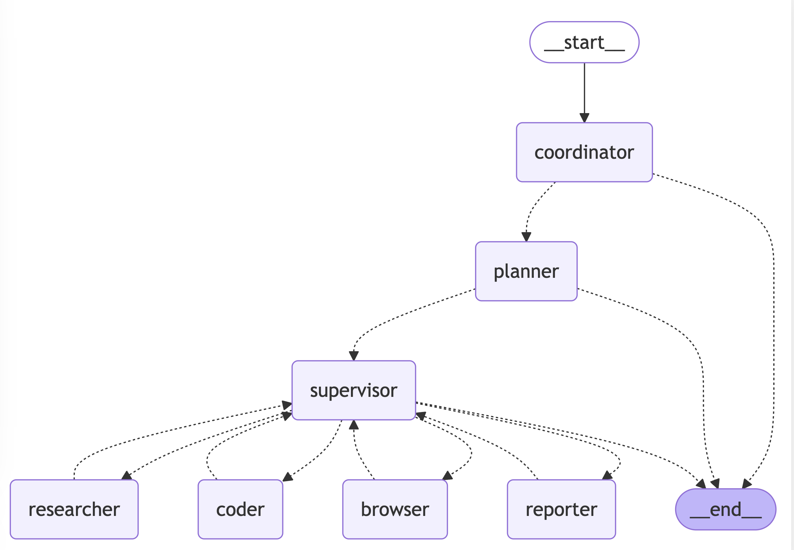

# LangManus

[](https://www.python.org/downloads/)
[](https://opensource.org/licenses/MIT)

[English](./README.md) | [简体中文](./README_zh.md)

> 源于开源，回馈开源

LangManus 是一个社区驱动的 AI 自动化框架，它建立在开源社区的卓越工作基础之上。我们的目标是将语言模型与专业工具（如网络搜索、爬虫和 Python 代码执行）相结合，同时回馈让这一切成为可能的社区。

## 演示视频

> **Task**: Calculate the influence index of DeepSeek R1 on HuggingFace. This index can be designed by considering a weighted sum of factors such as followers, downloads, and likes.
>
> **任务**：计算 DeepSeek R1 在 HuggingFace 上的影响力指数。该指数可以通过考虑粉丝、下载量和点赞数等权重因素来设计。

[](./assets/demo.mp4)

- [在 YouTube 上观看](https://youtu.be/sZCHqrQBUGk)
- [下载视频](https://github.com/langmanus/langmanus/blob/main/assets/demo.mp4)

## 目录
- [快速开始](#快速开始)
- [架构](#架构)
- [功能特性](#功能特性)
- [为什么选择 LangManus？](#为什么选择-langmanus)
- [安装设置](#安装设置)
    - [前置要求](#前置要求)
    - [安装步骤](#安装步骤)
    - [配置](#配置)
- [使用方法](#使用方法)
- [网页界面](#网页界面)
- [开发](#开发)
- [贡献](#贡献)
- [许可证](#许可证)
- [致谢](#致谢)
- [API 服务器](#api-服务器)

## 快速开始

```bash
# 克隆仓库
git clone https://github.com/langmanus/langmanus.git
cd langmanus

# 用uv创建并激活虚拟环境
uv python install 3.12
uv venv --python 3.12

source .venv/bin/activate  # Windows系统使用: .venv\Scripts\activate

# 安装依赖
uv sync

# 配置环境
cp .env.example .env
# 编辑 .env 文件，填入你的 API 密钥

# 运行项目
uv run main.py
```

## 架构

LangManus 实现了一个分层的多智能体系统，其中有一个主管智能体协调专门的智能体来完成复杂任务：



系统由以下智能体协同工作：

1. **协调员（Coordinator）**：工作流程的入口点，处理初始交互并路由任务
2. **规划员（Planner）**：分析任务并制定执行策略
3. **主管（Supervisor）**：监督和管理其他智能体的执行
4. **研究员（Researcher）**：收集和分析信息
5. **程序员（Coder）**：负责代码生成和修改
6. **浏览器（Browser）**：执行网页浏览和信息检索
7. **汇报员（Reporter）**：生成工作流结果的报告和总结

## 功能特性

### 核心能力
- 🤖 **LLM 集成**
    - 支持通义千问等开源模型
    - OpenAI 兼容的 API 接口
    - 多层 LLM 系统适配不同任务复杂度

### 工具和集成
- 🔍 **搜索和检索**
    - 通过 Tavily API 进行网络搜索
    - 使用 Jina 进行神经搜索
    - 高级内容提取

### 开发特性
- 🐍 **Python 集成**
    - 内置 Python REPL
    - 代码执行环境
    - 使用 uv 进行包管理

### 工作流管理
- 📊 **可视化和控制**
    - 工作流程图可视化
    - 多智能体编排
    - 任务分配和监控

## 为什么选择 LangManus？

我们信奉开源协作的力量。本项目的实现离不开以下优秀项目的支持：
- [Qwen](https://github.com/QwenLM/Qwen)：提供开源语言模型
- [Tavily](https://tavily.com/)：提供搜索能力
- [Jina](https://jina.ai/)：提供神经搜索技术
- 以及众多其他开源贡献者

我们致力于回馈社区，欢迎各种形式的贡献——无论是代码、文档、问题报告还是功能建议。

## 安装设置

### 前置要求

- [uv](https://github.com/astral-sh/uv) 包管理器

### 安装步骤

LangManus 使用 [uv](https://github.com/astral-sh/uv) 作为包管理器以简化依赖管理。
按照以下步骤设置虚拟环境并安装必要的依赖：

```bash
# 步骤 1：用uv创建并激活虚拟环境
uv python install 3.12
uv venv --python 3.12

# Unix/macOS 系统：
source .venv/bin/activate

# Windows 系统：
.venv\Scripts\activate

# 步骤 2：安装项目依赖
uv sync
```

### 配置

LangManus 使用三层 LLM 系统，分别用于推理、基础任务和视觉语言任务。在项目根目录创建 `.env` 文件并配置以下环境变量：

```ini
# 推理 LLM 配置（用于复杂推理任务）
REASONING_MODEL=your_reasoning_model
REASONING_API_KEY=your_reasoning_api_key
REASONING_BASE_URL=your_custom_base_url  # 可选

# 基础 LLM 配置（用于简单任务）
BASIC_MODEL=your_basic_model
BASIC_API_KEY=your_basic_api_key
BASIC_BASE_URL=your_custom_base_url  # 可选

# 视觉语言 LLM 配置（用于涉及图像的任务）
VL_MODEL=your_vl_model
VL_API_KEY=your_vl_api_key
VL_BASE_URL=your_custom_base_url  # 可选

# 工具 API 密钥
TAVILY_API_KEY=your_tavily_api_key
JINA_API_KEY=your_jina_api_key  # 可选

# 浏览器配置
CHROME_INSTANCE_PATH=/Applications/Google Chrome.app/Contents/MacOS/Google Chrome  # 可选，Chrome 可执行文件路径
```

> **注意：**
>
> - 系统对不同类型的任务使用不同的模型：
>     - 推理 LLM 用于复杂的决策和分析
>     - 基础 LLM 用于简单的文本任务
>     - 视觉语言 LLM 用于涉及图像理解的任务
> - 所有 LLM 的基础 URL 都可以独立自定义
> - 每个 LLM 可以使用不同的 API 密钥
> - Jina API 密钥是可选的，提供自己的密钥可以获得更高的速率限制（你可以在 [jina.ai](https://jina.ai/) 获该密钥）
> - Tavily 搜索默认配置为最多返回 5 个结果（你可以在 [app.tavily.com](https://app.tavily.com/) 获取该密钥）

您可以复制 `.env.example` 文件作为模板开始：

```bash
cp .env.example .env
```

### 配置预提交钩子
LangManus 包含一个预提交钩子，在每次提交前运行代码检查和格式化。设置步骤：

1. 使预提交脚本可执行：
```bash
chmod +x pre-commit
```

2. 安装预提交钩子：
```bash
ln -s ../../pre-commit .git/hooks/pre-commit
```

预提交钩子将自动：
- 运行代码检查（`make lint`）
- 运行代码格式化（`make format`）
- 将任何重新格式化的文件添加回暂存区
- 如果有任何代码检查或格式化错误，阻止提交

## 使用方法

### 基本执行

使用默认设置运行 LangManus：

```bash
uv run main.py
```

### API 服务器

LangManus 提供基于 FastAPI 的 API 服务器，支持流式响应：

```bash
# 启动 API 服务器
make serve

# 或直接运行
uv run server.py
```

API 服务器提供以下端点：

- `POST /api/chat/stream`：用于 LangGraph 调用的聊天端点，流式响应
    - 请求体：
    ```json
    {
      "messages": [
        {"role": "user", "content": "在此输入您的查询"}
      ],
      "debug": false
    }
    ```
    - 返回包含智能体响应的服务器发送事件（SSE）流


### 高级配置

LangManus 可以通过 `src/config` 目录中的各种配置文件进行自定义：
- `env.py`：配置 LLM 模型、API 密钥和基础 URL
- `tools.py`：调整工具特定设置（如 Tavily 搜索结果限制）
- `agents.py`：修改团队组成和智能体系统提示

### 智能体提示系统

LangManus 在 `src/prompts` 目录中使用复杂的提示系统来定义智能体的行为和职责：

#### 核心智能体角色

- **主管（[`src/prompts/supervisor.md`](src/prompts/supervisor.md)）**：通过分析请求并确定由哪个专家处理来协调团队并分配任务。负责决定任务完成情况和工作流转换。

- **研究员（[`src/prompts/researcher.md`](src/prompts/researcher.md)）**：专门通过网络搜索和数据收集来收集信息。使用 Tavily 搜索和网络爬取功能，避免数学计算或文件操作。

- **程序员（[`src/prompts/coder.md`](src/prompts/coder.md)）**：专业软件工程师角色，专注于 Python 和 bash 脚本。处理：
    - Python 代码执行和分析
    - Shell 命令执行
    - 技术问题解决和实现

- **文件管理员（[`src/prompts/file_manager.md`](src/prompts/file_manager.md)）**：处理所有文件系统操作，重点是正确格式化和保存 markdown 格式的内容。

- **浏览器（[`src/prompts/browser.md`](src/prompts/browser.md)）**：网络交互专家，处理：
    - 网站导航
    - 页面交互（点击、输入、滚动）
    - 从网页提取内容

#### 提示系统架构

提示系统使用模板引擎（[`src/prompts/template.py`](src/prompts/template.py)）来：
- 加载特定角色的 markdown 模板
- 处理变量替换（如当前时间、团队成员信息）
- 为每个智能体格式化系统提示

每个智能体的提示都在单独的 markdown 文件中定义，这样无需更改底层代码就可以轻松修改行为和职责。

## 网页界面

LangManus 提供一个默认的网页界面。

请参考 [langmanus/langmanus-web](https://github.com/langmanus/langmanus-web) 项目了解更多信息。

## 开发

### 测试

运行测试套件：

```bash
# 运行所有测试
make test

# 运行特定测试文件
pytest tests/integration/test_workflow.py

# 运行覆盖率测试
make coverage
```

### 代码质量

```bash
# 运行代码检查
make lint

# 格式化代码
make format
```

## 贡献

我们欢迎各种形式的贡献！无论是修复错别字、改进文档，还是添加新功能，您的帮助都将备受感激。请查看我们的[贡献指南](CONTRIBUTING.md)了解如何开始。

## 许可证

本项目是开源的，基于 [MIT 许可证](LICENSE)。

## 致谢

特别感谢所有让 LangManus 成为可能的开源项目和贡献者。我们站在巨人的肩膀上。
