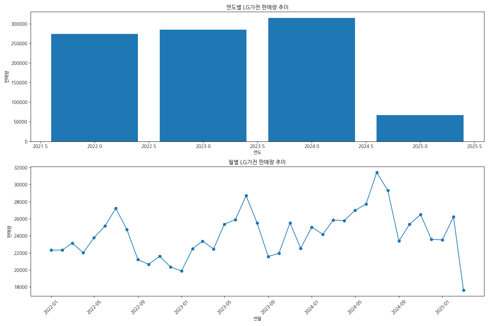
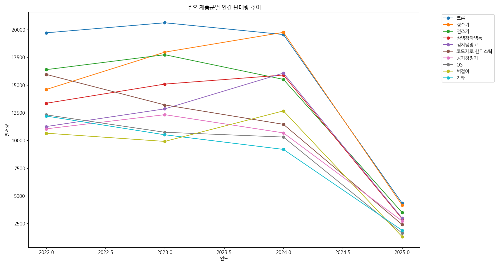
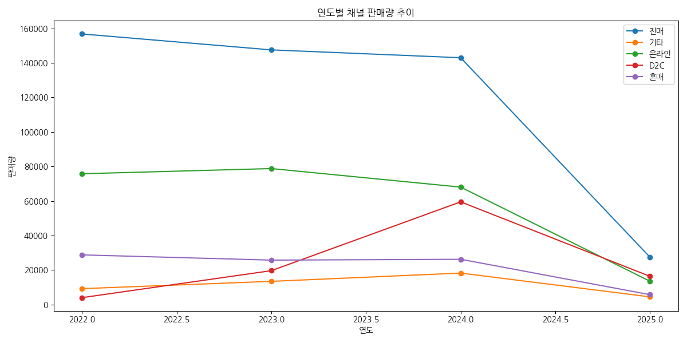
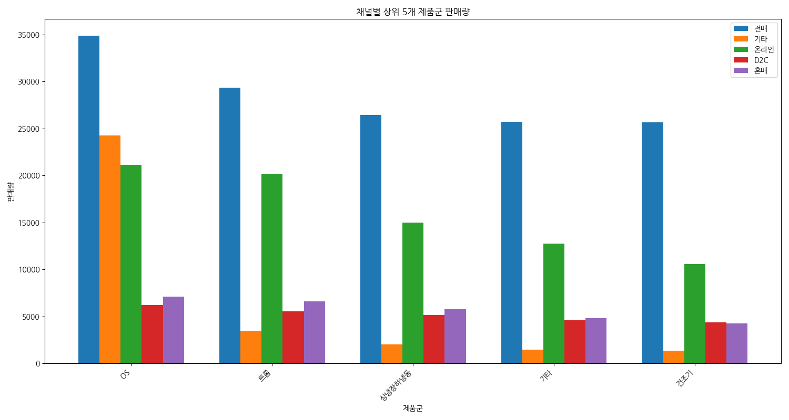
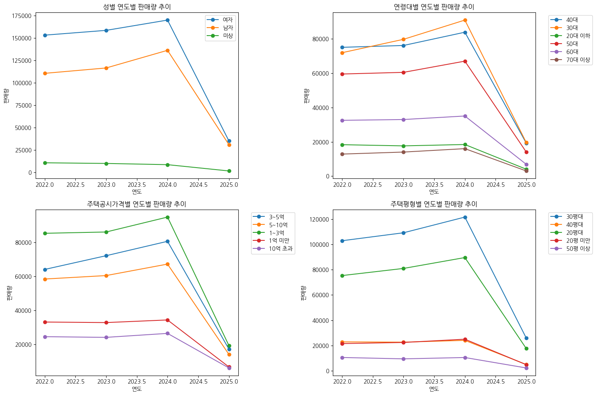
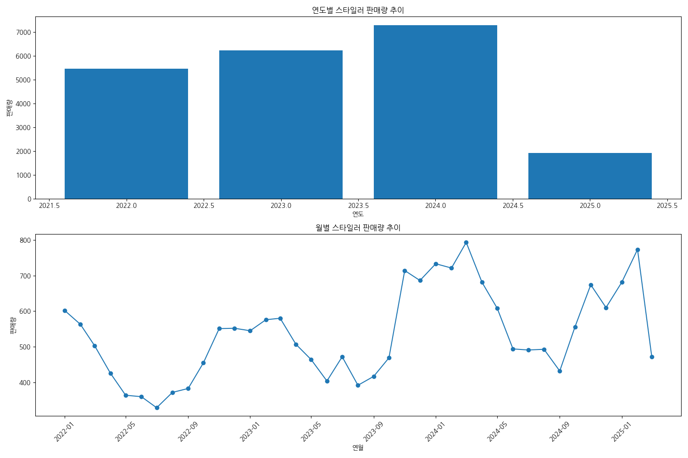
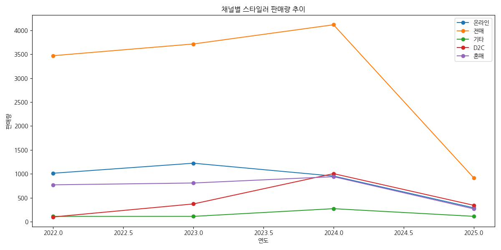
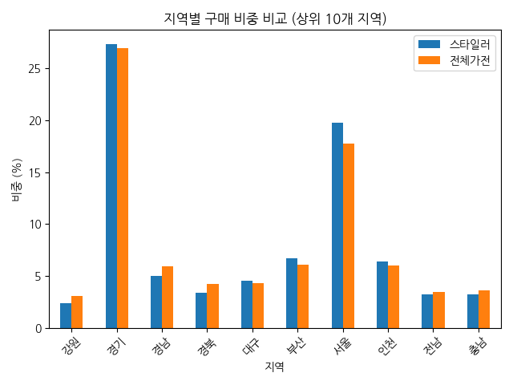
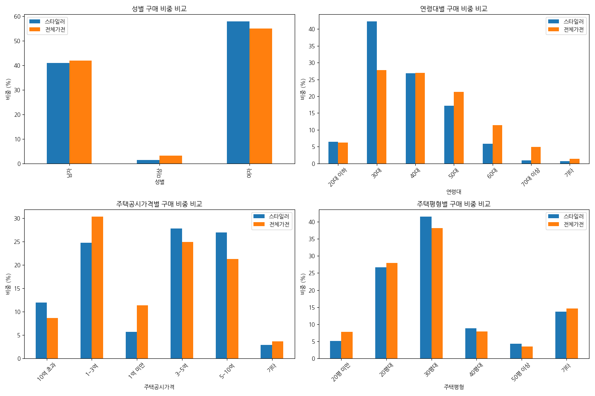

# LG가전 판매 트렌드 및 스타일러 특성 비교 분석 보고서

## 개요 (Executive Summary)

본 보고서는 2022년부터 2025년 3월까지의 LG가전 판매 데이터를 분석하여 전체 가전 판매 트렌드와 스타일러 제품의 판매 특성을 비교 분석한 결과를 제시합니다. 총 942,115건의 판매 데이터를 기반으로 연도별/월별 판매 추이, 판매 채널별 특성, 구매고객 특성 등을 다각도로 분석하였습니다. 분석 결과, 스타일러는 전체 가전과 비교하여 차별화된 시장 특성과 고객층을 보유하고 있으며, 특히 30대 여성 고객과 중상위 주택 가격대 거주자들에게 높은 인기를 보이는 것으로 나타났습니다.

## 주요 발견점 (Key Findings)

1. **판매 트렌드**
   - 전체 가전 판매량은 2022년부터 2024년까지 꾸준히 증가하는 추세를 보임
   - 스타일러 판매량도 같은 기간 동안 지속적으로 증가하며, 전체 가전 대비 비중이 2022년 1.99%에서 2025년 2.86%로 상승

2. **판매 채널 특성**
   - 전체 가전과 스타일러 모두 '전매' 채널이 가장 높은 판매 비중을 차지 (전체 가전 50.40%, 스타일러 58.48%)
   - 스타일러는 전체 가전 대비 '전매'와 '혼매' 채널 비중이 더 높고, '온라인' 채널 비중은 더 낮음

3. **구매고객 특성**
   - 스타일러는 여성 구매 비중(57.79%)이 전체 가전(54.90%)보다 높음
   - 스타일러는 30대 구매 비중(42.27%)이 전체 가전(27.84%)보다 현저히 높음
   - 스타일러는 고가 주택(5억 이상) 거주자 비중이 전체 가전보다 높음

4. **지역별 특성**
   - 전체 가전과 스타일러 모두 경기, 서울, 부산 순으로 판매 비중이 높음
   - 스타일러는 서울 지역 판매 비중(19.74%)이 전체 가전(17.73%)보다 높음

## 상세 분석 (Detailed Analysis)

### 1. 데이터 개요

분석에 사용된 데이터셋은 2022년 1월부터 2025년 3월까지의 LG가전 판매 데이터로, 총 942,115건의 거래 기록을 포함하고 있습니다. 데이터는 구매년월, 제품군, 판매 채널, 고객 특성(성별, 연령, 지역 등) 등 총 15개 컬럼으로 구성되어 있습니다.

주요 변수 구성:
- 시간 변수: base_mm (구매년월)
- 제품 변수: pdfm_dv_val (제품군)
- 채널 변수: chnl_div_val (구매채널), chnl_div_hpos_val (온오프라인구분)
- 고객 특성 변수: gendr_nm (성별), age (연령), age_group (연령대), rst_ctdo_nm (지역), eqdr_group (평형대), rst_puan_prc (공시가격)
- 판매량 변수: buy_qt (구매수량)

### 2. 전체 LG가전 판매 트렌드 분석

#### 2.1 연도별/월별 판매량 추이

LG가전 전체 판매량은 2022년부터 2024년까지 꾸준히 증가하는 추세를 보였습니다.

- 2022년: 274,541대
- 2023년: 285,161대
- 2024년: 315,034대
- 2025년(3월까지): 67,379대

#### 2.2 상위 제품군별 판매량

상위 판매 제품군은 트롬(64,215대), 정수기(56,468대), 건조기(53,113대), 상냉장하냉동(47,258대), 김치냉장고(43,154대) 순으로 나타났습니다. 스타일러는 20,898대로 전체 제품군 중 20위를 차지했습니다.

### 3. 판매 채널별 LG가전 판매 분석

#### 3.1 채널별 판매 비중

LG가전 전체 판매에서 채널별 비중은 다음과 같습니다:
- 전매: 474,812대 (50.40%)
- 온라인: 236,122대 (25.06%)
- D2C: 99,450대 (10.56%)
- 혼매: 86,431대 (9.17%)
- 기타: 45,300대 (4.81%)

#### 3.2 연도별 채널 판매량 추이

연도별 채널 판매량 추이를 살펴보면, '전매' 채널이 모든 연도에서 가장 높은 판매량을 보이고 있으며, '온라인' 채널이 그 뒤를 따르고 있습니다.

#### 3.3 채널별 상위 제품군 판매량

각 채널별로 인기 있는 제품군에 차이가 있으며, 채널별 상위 제품군 판매량은 다음과 같습니다:

### 4. LG가전 구매고객 특성 분석

#### 4.1 성별 및 연령대별 판매 비중

LG가전 구매고객의 성별 비중은 여성(54.90%), 남성(41.87%), 미상(3.23%) 순으로 나타났습니다. 연령대별로는 30대(27.84%), 40대(27.01%), 50대(21.35%) 순으로 높은 비중을 차지했습니다.

#### 4.2 지역별 판매 비중

지역별 판매 비중은 경기(26.95%), 서울(17.73%), 부산(6.06%) 순으로 높게 나타났습니다.

#### 4.3 주택 특성별 판매 비중

주택 평형대별로는 30평대(38.19%), 20평대(27.98%), 기타(14.66%) 순으로 판매 비중이 높았으며, 주택 공시가격별로는 1~3억(30.34%), 3~5억(24.85%), 5~10억(21.26%) 순으로 나타났습니다.

### 5. 스타일러 판매 트렌드 분석

#### 5.1 연도별/월별 스타일러 판매량 추이

스타일러 판매량은 2022년부터 2024년까지 꾸준히 증가하는 추세를 보였습니다.

- 2022년: 5,460대
- 2023년: 6,226대
- 2024년: 7,286대
- 2025년(3월까지): 1,926대

전체 가전 대비 스타일러 비중은 2022년 1.99%에서 2025년 2.86%로 증가했습니다.

#### 5.2 채널별 스타일러 판매 비중

스타일러 판매에서 채널별 비중은 다음과 같습니다:
- 전매: 12,222대 (58.48%)
- 온라인: 3,476대 (16.63%)
- 혼매: 2,785대 (13.33%)
- D2C: 1,814대 (8.68%)
- 기타: 601대 (2.88%)

### 6. 스타일러 구매고객 특성 분석

#### 6.1 성별 및 연령대별 구매 비중

스타일러 구매고객의 성별 비중은 여성(57.79%), 남성(40.86%), 미상(1.35%) 순으로 나타났습니다. 연령대별로는 30대(42.27%), 40대(26.79%), 50대(17.18%) 순으로 높은 비중을 차지했습니다.

#### 6.2 지역별 구매 비중

지역별 구매 비중은 경기(27.33%), 서울(19.74%), 부산(6.72%) 순으로 높게 나타났습니다.

#### 6.3 주택 특성별 구매 비중

주택 평형대별로는 30평대(41.58%), 20평대(26.62%), 기타(13.64%) 순으로 구매 비중이 높았으며, 주택 공시가격별로는 3~5억(27.79%), 5~10억(26.94%), 1~3억(24.70%) 순으로 나타났습니다.

### 7. 전체 가전과 스타일러 비교 분석

#### 7.1 판매 트렌드 비교

2025년 3월까지의 데이터 기준으로 전체 가전과 스타일러의 성장률을 비교하면 다음과 같습니다:
- 전체 가전: -75.46%
- 스타일러: -64.73%

스타일러의 성장률이 전체 가전보다 상대적으로 높게 나타났습니다.

#### 7.2 채널별 판매 비중 비교

채널별 판매 비중을 비교하면, 스타일러는 전체 가전 대비 '전매'(58.48% vs 50.40%)와 '혼매'(13.33% vs 9.17%) 채널의 비중이 더 높고, '온라인'(16.63% vs 25.06%)과 'D2C'(8.68% vs 10.56%) 채널의 비중은 더 낮게 나타났습니다.

#### 7.3 구매고객 특성 비교

**성별 특성:**
- 전체 가전: 여성 54.90%, 남성 41.87%
- 스타일러: 여성 57.79%, 남성 40.86%

스타일러는 전체 가전 대비 여성 구매 비중이 더 높게 나타났습니다.

**연령대 특성:**
- 전체 가전 주요 연령층: 30대(27.84%), 40대(27.01%), 50대(21.35%)
- 스타일러 주요 연령층: 30대(42.27%), 40대(26.79%), 50대(17.18%)

스타일러는 전체 가전 대비 30대 구매 비중이 현저히 높게 나타났습니다.

**주택 특성:**
- 전체 가전 주요 평형: 30평대(38.19%), 20평대(27.98%), 기타(14.66%)
- 스타일러 주요 평형: 30평대(41.58%), 20평대(26.62%), 기타(13.64%)

스타일러는 전체 가전 대비 30평대 주택 거주자의 구매 비중이 더 높게 나타났습니다.

**주택 공시가격:**
- 전체 가전: 1~3억(30.34%), 3~5억(24.85%), 5~10억(21.26%)
- 스타일러: 3~5억(27.79%), 5~10억(26.94%), 1~3억(24.70%)

스타일러는 전체 가전 대비 중상위 가격대(3억 이상) 주택 거주자의 구매 비중이 더 높게 나타났습니다.

## 결론 및 제언 (Conclusions & Recommendations)

### 결론

1. **스타일러의 성장 가능성**
   - 스타일러는 전체 가전 대비 판매 비중이 꾸준히 증가하고 있으며, 성장률도 상대적으로 높게 나타나 향후 성장 가능성이 높은 제품군으로 평가됨

2. **차별화된 고객층**
   - 스타일러는 30대 여성, 중상위 주택 가격대(3억 이상) 거주자, 30평대 주택 거주자 등 특정 고객층에서 높은 인기를 보임
   - 이는 스타일러가 일반 가전과는 차별화된 고유한 시장 특성을 가지고 있음을 시사함

3. **채널 전략의 중요성**
   - 스타일러는 '전매'와 '혼매' 채널에서 상대적으로 높은 판매 비중을 보이며, 이는 오프라인 채널의 중요성을 시사함
   - 반면, 온라인 채널에서의 판매 비중은 전체 가전 대비 낮게 나타남

### 제언

1. **타겟 마케팅 전략 강화**
   - 30대 여성, 중상위 주택 가격대 거주자 등 스타일러의 주요 고객층을 타겟으로 한 맞춤형 마케팅 전략 수립
   - 라이프스타일과 연계한 마케팅 메시지 개발 (예: 바쁜 30대 직장인을 위한 의류 관리 솔루션)

2. **채널 최적화**
   - '전매'와 '혼매' 채널에서의 강점을 더욱 강화하기 위한 오프라인 매장 전략 수립
   - 온라인 채널에서의 판매 비중을 높이기 위한 디지털 마케팅 강화 및 온라인 구매 경험 개선

3. **제품 라인업 확장**
   - 주요 고객층의 니즈를 반영한 스타일러 제품 라인업 확장 (예: 30평대 주택 공간에 최적화된 사이즈, 디자인 등)
   - 다양한 가격대의 제품 출시를 통해 잠재 고객층 확대

4. **지역별 차별화 전략**
   - 서울, 경기 등 수도권 지역에서의 높은 판매 비중을 활용한 지역 맞춤형 마케팅 전략 수립
   - 상대적으로 판매 비중이 낮은 지역에 대한 시장 확대 전략 개발

5. **시즌별 프로모션 최적화**
   - 월별 판매 추이 분석을 통해 시즌별 판매 특성을 파악하고, 이에 맞는 프로모션 전략 수립
   - 계절 변화에 따른 의류 관리 니즈를 반영한 마케팅 메시지 개발

이러한 전략적 접근을 통해 스타일러의 시장 점유율을 더욱 확대하고, 차별화된 고객 경험을 제공함으로써 LG가전의 경쟁력을 강화할 수 있을 것으로 기대됩니다.