# LG가전 판매 트렌드 분석 보고서

## 개요 (Executive Summary)

본 보고서는 2022년 1월부터 2025년 3월까지의 LG가전 판매 데이터를 분석하여 전체 가전 및 스타일러 제품의 판매 트렌드와 구매 고객 특성을 파악하고자 합니다. 총 942,115건의 판매 데이터를 바탕으로 연도별/월별 판매 추이, 채널별 판매 비중, 구매 고객의 인구통계학적 특성 및 주거 특성 등을 분석하였습니다. 특히 스타일러 제품(20,898건, 전체의 2.22%)에 대한 세부 분석을 통해 전체 가전 제품과의 차이점을 도출하였습니다.

## 주요 발견점 (Key Findings)

1. **판매 트렌드**
   - 전체 가전 판매량은 2022년부터 2024년까지 꾸준히 증가하는 추세를 보이며, 2024년에 가장 높은 판매량을 기록했습니다.
   - 스타일러 제품 역시 2022년부터 2024년까지 판매량이 지속적으로 증가하였습니다.
   - 전체 가전 대비 스타일러 판매 비중은 평균 2.22%이며, 월별로는 최소 1.21%에서 최대 3.07%까지 변동을 보입니다.

2. **판매 채널**
   - 전체 가전 판매의 주요 채널은 전매(50.4%), 온라인(25.1%), D2C(10.6%) 순입니다.
   - 스타일러 제품은 전매 채널의 비중이 58.5%로 전체 가전보다 높고, 온라인 채널 비중은 16.6%로 전체 가전보다 낮습니다.
   - 혼매 채널은 스타일러 판매에서 13.3%로, 전체 가전(9.2%)보다 높은 비중을 차지합니다.

3. **구매 고객 특성**
   - 전체 가전 구매 고객은 30대(27.8%)와 40대(27.0%)가 주요 연령층이나, 스타일러 구매 고객은 30대(42.3%)에 집중되어 있습니다.
   - 성별 구매 비중은 전체 가전과 스타일러 모두 여성이 높으며, 스타일러는 여성 비중(58.6%)이 전체 가전(56.7%)보다 더 높습니다.
   - 주택 평형대는 전체 가전과 스타일러 모두 30평대가 가장 높은 비중을 차지하며, 스타일러는 30평대 비중(41.6%)이 전체 가전(38.2%)보다 높습니다.
   - 주택 공시가격대는 전체 가전은 1~3억(30.3%)이 가장 높은 비중을 차지하나, 스타일러는 3~5억(27.8%)과 5~10억(26.9%)이 주요 구매층입니다.

## 상세 분석 (Detailed Analysis)

### 1. 데이터 탐색 및 전처리

#### 데이터셋 개요
- 총 942,115건의 판매 데이터 (2022년 1월 ~ 2025년 3월)
- 15개 컬럼으로 구성: 판매 시점, 제품 정보, 채널 정보, 고객 특성 등
- 주요 결측치: 성별(30,444건), 연령(12,549건), 지역(27,859건)

#### 기초 통계
- 구매자 평균 연령: 46.3세 (최소 13세, 최대 105세)
- 제품군 수: 82개 (트롬, 정수기, 건조기 등)
- 판매 채널: 오프라인(59.6%), 온라인(35.6%), 기타(4.8%)

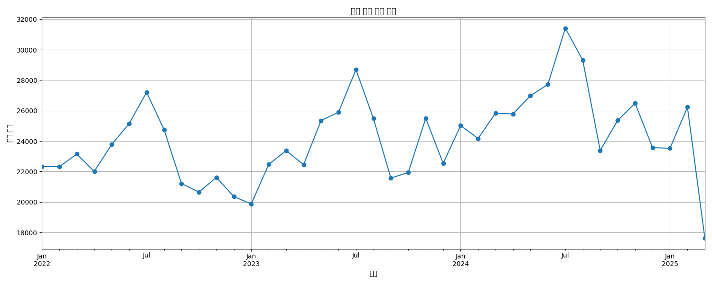

### 2. 전체 판매 트렌드 분석

#### 연도별/월별 판매량 추이
- 2022년: 274,541건
- 2023년: 285,161건
- 2024년: 315,034건
- 2025년(3월까지): 67,379건

판매량은 연도별로 꾸준히 증가하는 추세를 보이며, 계절성이 존재하는 것으로 나타났습니다. 특히 2024년에 가장 높은 판매량을 기록했습니다.

#### 상위 제품군 판매량
상위 10개 제품군이 전체 판매량의 큰 비중을 차지하고 있으며, 트롬(64,215건), 정수기(56,468건), 건조기(53,113건)가 상위 3개 제품군입니다. 스타일러는 전체 제품군 중 20번째로 높은 판매량을 기록했습니다.

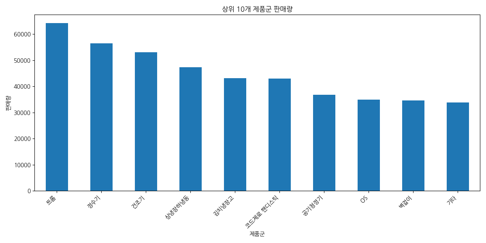

#### 채널별 판매 비중
- 전매: 474,812건 (50.4%)
- 온라인: 236,122건 (25.1%)
- D2C: 99,450건 (10.6%)
- 혼매: 86,431건 (9.2%)
- 기타: 45,300건 (4.8%)

전매 채널이 전체 판매의 절반 이상을 차지하고 있으며, 온라인 채널이 그 뒤를 잇고 있습니다.

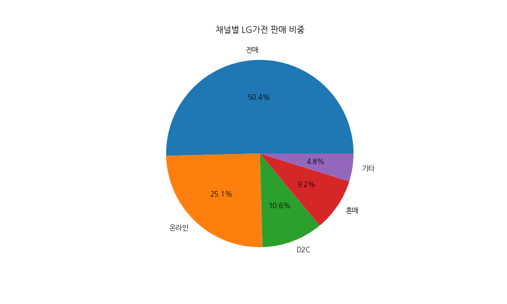

#### 채널별 월별 판매 트렌드
각 채널별 판매 트렌드는 시간에 따라 변화하는 패턴을 보이며, 특히 전매 채널의 판매량이 가장 높고 변동성도 큰 것으로 나타났습니다.

### 3. 구매 고객 특성 변화 분석

#### 연령대별 구매 비중
- 30대: 262,302건 (27.8%)
- 40대: 254,424건 (27.0%)
- 50대: 201,131건 (21.3%)
- 60대: 107,435건 (11.4%)
- 20대 이하: 58,391건 (6.2%)
- 70대 이상: 45,883건 (4.9%)
- 기타: 12,549건 (1.3%)

30대와 40대가 전체 구매의 절반 이상을 차지하고 있으며, 연령대별 구매 비중은 시간에 따라 변화하는 패턴을 보입니다.

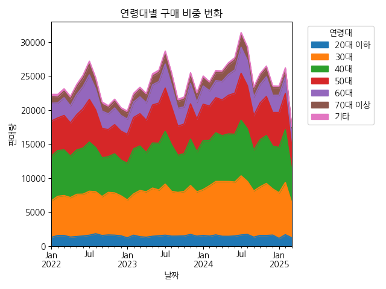

#### 성별 구매 비중
- 여성: 517,219건 (56.7%)
- 남성: 394,452건 (43.3%)
- 결측치: 30,444건

여성 구매자가 남성보다 높은 비중을 차지하고 있습니다.

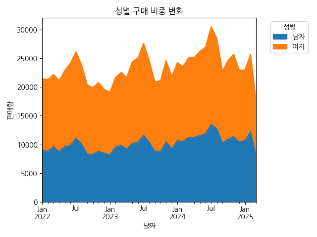

#### 지역별 구매 비중
- 경기: 253,870건 (27.8%)
- 서울: 167,039건 (18.3%)
- 부산: 57,097건 (6.2%)
- 인천: 56,983건 (6.2%)
- 경남: 56,062건 (6.1%)

상위 3개 지역(경기, 서울, 부산)이 전체 판매의 52.3%를 차지하고 있으며, 특히 경기 지역의 판매량이 가장 높습니다.

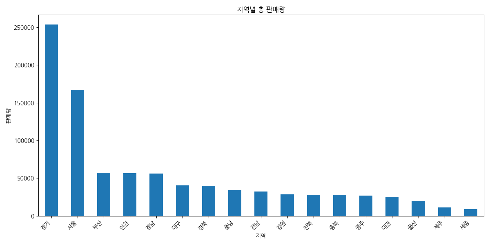

#### 주택 공시가격대별 구매 비중
- 1~3억: 285,793건 (30.3%)
- 3~5억: 234,153건 (24.9%)
- 5~10억: 200,249건 (21.3%)
- 1억 미만: 106,919건 (11.3%)
- 10억 초과: 81,064건 (8.6%)
- 기타: 33,937건 (3.6%)

1~3억 공시가격대 주택 거주자가 가장 높은 구매 비중을 차지하고 있으며, 공시가격대별 구매 비중은 시간에 따라 변화하는 패턴을 보입니다.

#### 평형대별 구매 비중
- 30평대: 359,777건 (38.2%)
- 20평대: 263,595건 (28.0%)
- 기타: 138,075건 (14.7%)
- 40평대: 74,441건 (7.9%)
- 20평 미만: 73,657건 (7.8%)
- 50평 이상: 32,570건 (3.5%)

30평대와 20평대가 전체 구매의 66.2%를 차지하고 있으며, 특히 30평대 평형의 비중이 가장 높습니다.

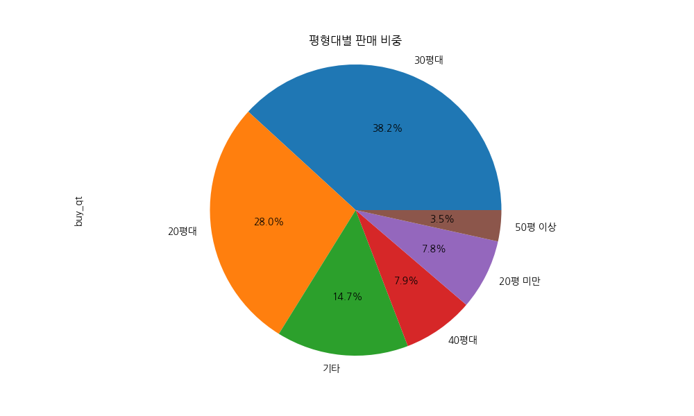

### 4. 스타일러 제품 세부 분석

#### 스타일러 판매 트렌드
- 2022년: 5,460건
- 2023년: 6,226건
- 2024년: 7,286건
- 2025년(3월까지): 1,926건

스타일러 판매량은 2022년부터 2024년까지 꾸준히 증가하는 추세를 보이며, 2024년에 가장 높은 판매량을 기록했습니다. 월별 판매량의 변동성은 전체 가전 대비 0.54% 수준입니다.

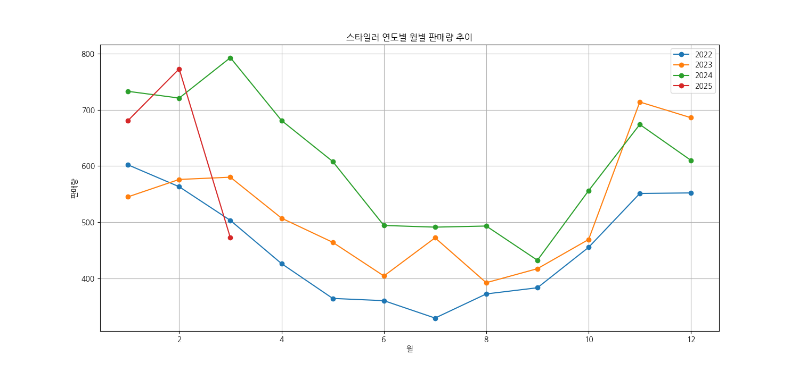

#### 스타일러 채널별 판매 비중
- 전매: 12,222건 (58.5%)
- 온라인: 3,476건 (16.6%)
- 혼매: 2,785건 (13.3%)
- D2C: 1,814건 (8.7%)
- 기타: 601건 (2.9%)

스타일러 판매는 전매 채널이 가장 높은 비중을 차지하고 있으며, 전체 가전 대비 전매와 혼매 채널의 비중이 더 높습니다.

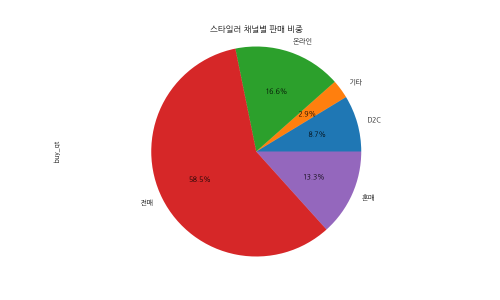

#### 스타일러 구매 고객 특성
- 연령대별 판매량:
  - 30대: 8,833건 (42.3%)
  - 40대: 5,599건 (26.8%)
  - 50대: 3,590건 (17.2%)
  - 20대 이하: 1,349건 (6.5%)
  - 60대: 1,212건 (5.8%)
  - 70대 이상: 179건 (0.9%)
  - 기타: 136건 (0.7%)

스타일러 구매 고객은 30대가 가장 높은 비중을 차지하고 있으며, 전체 가전 대비 30대 비중이 훨씬 높습니다.

- 평형대별 판매량:
  - 30평대: 8,690건 (41.6%)
  - 20평대: 5,563건 (26.6%)
  - 기타: 2,851건 (13.6%)
  - 40평대: 1,831건 (8.8%)
  - 20평 미만: 1,060건 (5.1%)
  - 50평 이상: 903건 (4.3%)

스타일러 구매 고객은 30평대 평형 거주자가 가장 높은 비중을 차지하고 있으며, 전체 가전 대비 30평대 비중이 더 높습니다.

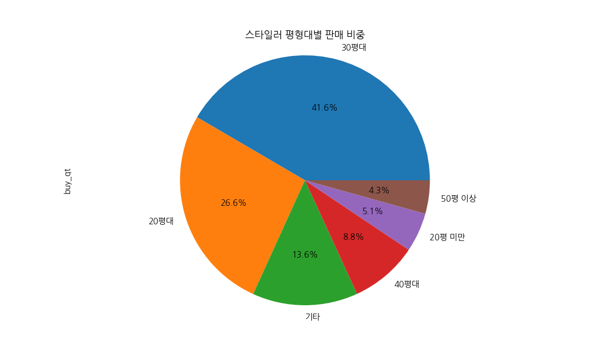

#### 전체 가전 대비 스타일러 비중
- 전체 기간 평균 비중: 2.22%
- 월별 최대 비중: 3.07%
- 월별 최소 비중: 1.21%

전체 가전 판매량 대비 스타일러 판매 비중은 평균 2.22% 수준이며, 시간에 따른 판매 비중 변화 추이를 확인할 수 있습니다.

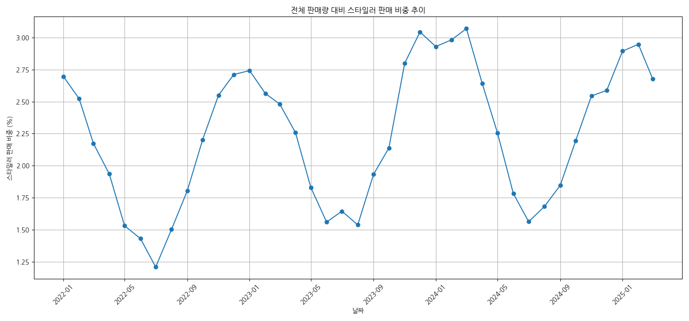

### 5. 전체 가전과 스타일러 구매 고객 특성 비교

#### 연령대별 비교
스타일러 구매 고객은 30대 비중(42.3%)이 전체 가전(27.8%)보다 훨씬 높으며, 60대 이상 고령층 비중은 전체 가전보다 낮습니다.

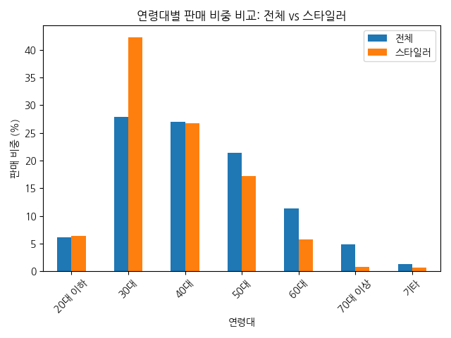

#### 성별 비교
스타일러 구매 고객은 여성 비중(58.6%)이 전체 가전(56.7%)보다 약간 높습니다.

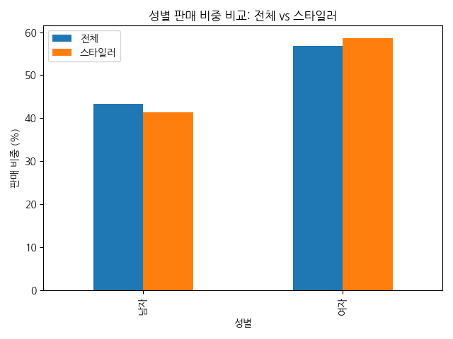

#### 평형대별 비교
스타일러 구매 고객은 30평대 비중(41.6%)이 전체 가전(38.2%)보다 높으며, 20평 미만 소형 평형 비중은 전체 가전보다 낮습니다.

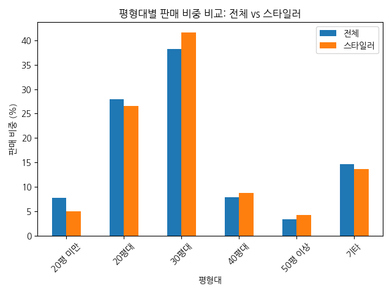

#### 공시가격대별 비교
스타일러 구매 고객은 3~5억(27.8%)과 5~10억(26.9%) 공시가격대 비중이 전체 가전보다 높으며, 1억 미만 저가 주택 비중은 전체 가전보다 낮습니다.

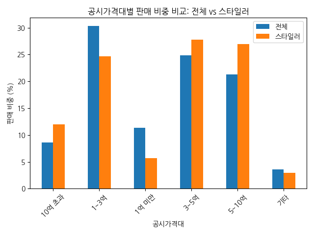

#### 채널별 비교
스타일러 판매는 전매(58.5%)와 혼매(13.3%) 채널 비중이 전체 가전보다 높으며, 온라인(16.6%) 채널 비중은 전체 가전(25.1%)보다 낮습니다.

## 결론 및 제언 (Conclusions & Recommendations)

### 결론

1. **판매 트렌드**
   - LG가전 전체 및 스타일러 제품 모두 2022년부터 2024년까지 꾸준한 판매 성장을 보이고 있습니다.
   - 스타일러 제품은 전체 가전 대비 약 2.22%의 판매 비중을 차지하며, 월별 변동성이 존재합니다.

2. **판매 채널**
   - 전매 채널이 전체 가전(50.4%)과 스타일러(58.5%) 모두에서 가장 중요한 판매 채널입니다.
   - 스타일러는 전체 가전 대비 온라인 채널 의존도가 낮고(16.6% vs 25.1%), 혼매 채널 비중이 높습니다(13.3% vs 9.2%).

3. **구매 고객 특성**
   - 스타일러 구매 고객은 30대(42.3%), 여성(58.6%), 30평대(41.6%), 3~5억 및 5~10억 공시가격대 주택 거주자가 주요 타겟층입니다.
   - 전체 가전 대비 스타일러는 젊은 연령층, 중대형 평형, 중고가 주택 거주자의 비중이 더 높습니다.

### 제언

1. **타겟 마케팅 전략**
   - 스타일러 제품은 30대 여성, 30평대 이상 중대형 평형 거주자를 핵심 타겟으로 마케팅 전략을 수립해야 합니다.
   - 전체 가전 대비 스타일러의 60대 이상 고령층 비중이 낮으므로, 고령층을 위한 사용 편의성 개선 및 맞춤형 마케팅이 필요합니다.

2. **채널 전략**
   - 스타일러 제품은 전매 채널 의존도가 높으므로, 전매 채널의 판매 역량 강화 및 인센티브 제도 개선이 필요합니다.
   - 온라인 채널 비중이 전체 가전보다 낮으므로, 온라인 채널 활성화를 위한 전략적 접근이 필요합니다.

3. **제품 및 서비스 개발**
   - 30평대 이상 중대형 평형 거주자의 니즈에 맞는 스타일러 제품 라인업 확대가 필요합니다.
   - 3~5억, 5~10억 공시가격대 주택 거주자를 위한 프리미엄 서비스 및 부가 기능 개발이 필요합니다.

4. **성장 전략**
   - 스타일러 제품의 판매 비중(2.22%)을 높이기 위한 전략적 접근이 필요합니다.
   - 20대 이하 젊은 층과 1~3억 공시가격대 주택 거주자를 위한 엔트리 모델 개발 및 마케팅이 필요합니다.