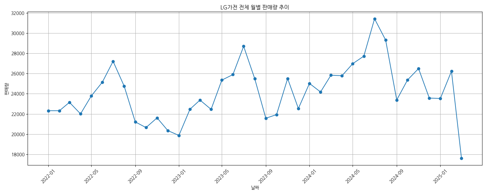
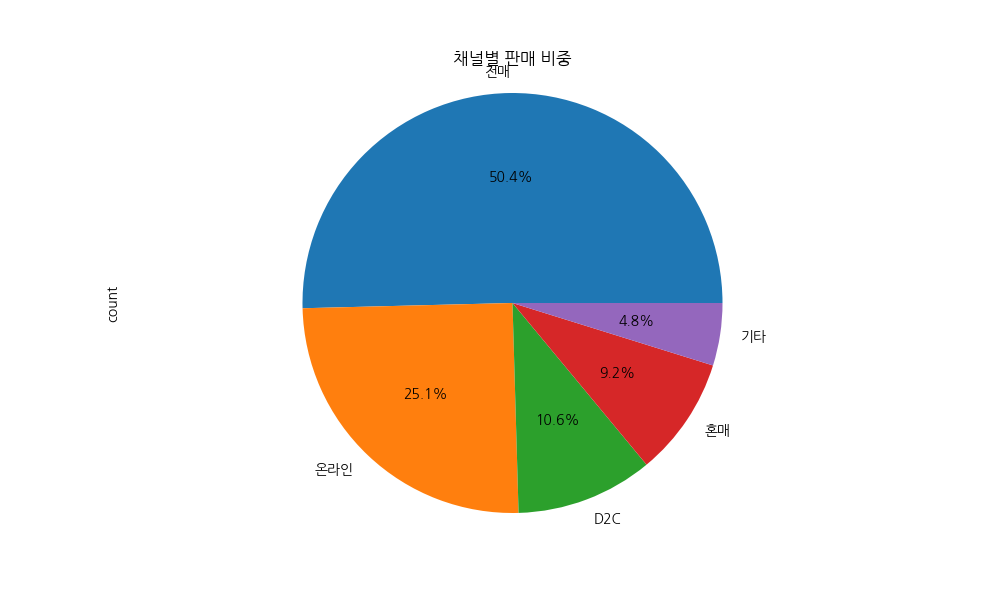
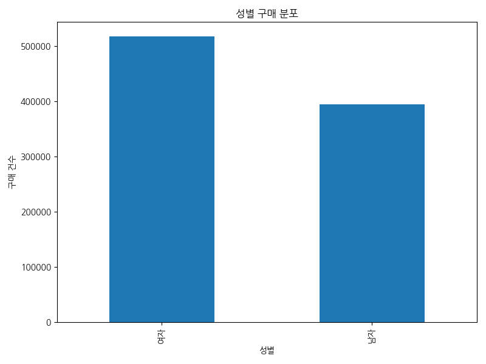
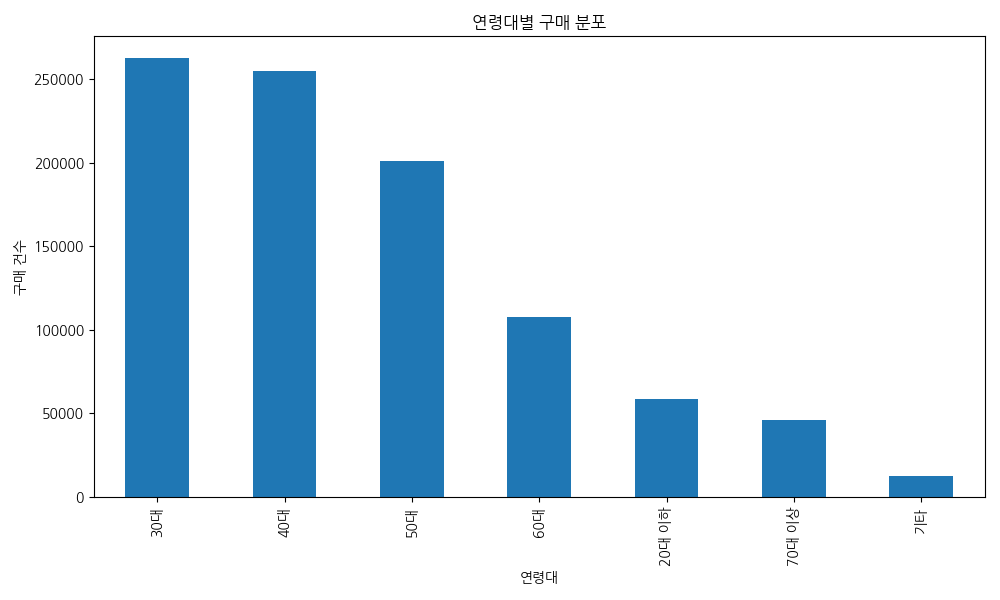
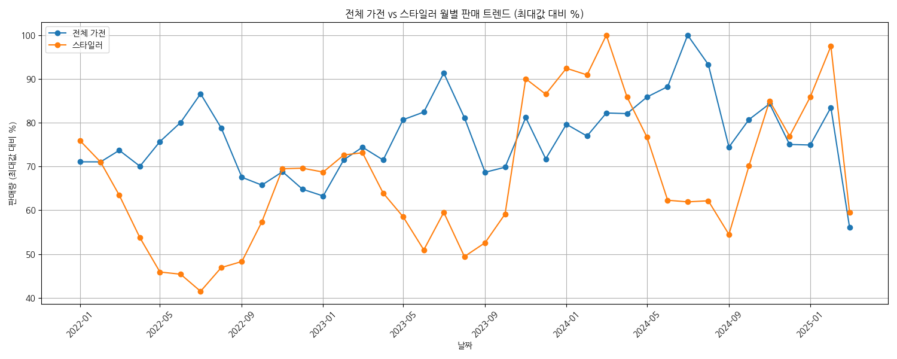
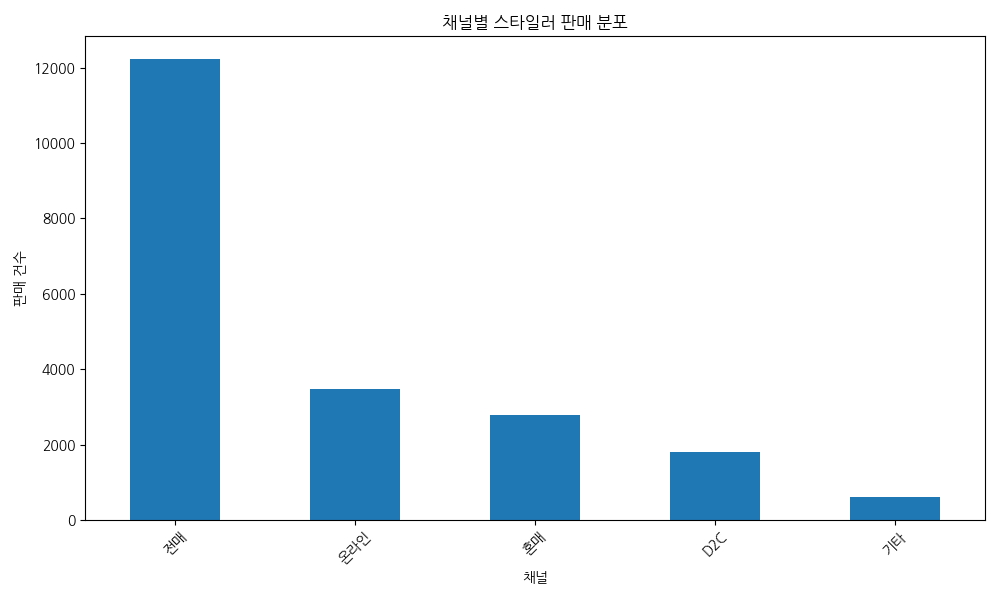
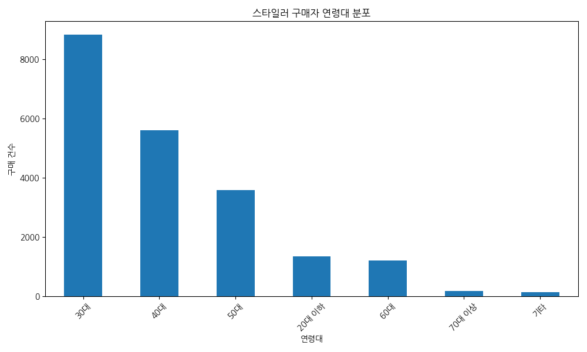

# LG 가전 판매 트렌드 분석 보고서

## 개요 (Executive Summary)

본 보고서는 2022년 1월부터 2025년 3월까지의 LG 가전제품 판매 데이터를 분석하여 전체 가전제품과 스타일러 제품의 판매 트렌드 및 고객 특성을 파악하는 것을 목적으로 합니다. 분석 결과, LG 가전제품은 월평균 24,157개가 판매되며, 전매 채널이 전체 판매의 50.4%로 가장 높은 비중을 차지하고 있습니다. 주요 구매층은 30-40대(54.8%)와 여성(56.7%)이며, 경기(33.1%)와 서울(21.8%) 지역에서 가장 많이 판매되고 있습니다. 스타일러 제품은 전체 가전 판매의 2.22%를 차지하며, 전체 가전 대비 더 젊은 연령층(평균 41.9세)과 여성 비율이 높은 특징을 보입니다.

## 주요 발견점 (Key Findings)

1. **판매 채널 특성**
   - 전체 가전과 스타일러 모두 전매 채널이 가장 높은 비중을 차지 (전체 가전 50.4%, 스타일러 58.5%)
   - 스타일러는 전체 가전 대비 온라인 채널 비중이 낮음 (16.6% vs 25.1%)
   - 스타일러는 혼매 채널 비중이 전체 가전보다 높음 (13.3% vs 9.2%)

2. **고객 특성**
   - 스타일러 구매자의 평균 연령은 41.9세로, 전체 가전 구매자(46.3세)보다 4.5세 낮음
   - 스타일러는 30-40대 구매 비중이 69.1%로, 전체 가전(54.8%)보다 높음
   - 여성 구매 비율은 스타일러가 57.8%로, 전체 가전(56.7%)보다 약간 높음
   - 두 제품군 모두 경기와 서울 지역에서 가장 많이 판매됨

3. **판매 트렌드**
   - 전체 가전 월평균 판매량은 24,157개, 스타일러는 535.8개
   - 전체 가전 최대 판매월은 2024년 7월(31,415개), 스타일러는 2024년 3월(793개)
   - 전체 가전의 평균 월간 증감률은 -0.04%로 안정적인 판매 추세를 보임

## 상세 분석 (Detailed Analysis)

### 1. 데이터 개요

분석에 사용된 데이터는 총 942,115개의 레코드로 구성되어 있으며, 중복 레코드는 없습니다. 데이터는 15개의 컬럼으로 구성되어 있으며, 이 중 2개는 수치형 변수, 12개는 범주형 변수입니다. 결측치는 성별(3.23%), 지역(2.96%), 연령(1.33%) 변수에서 발견되었습니다.

주요 제품 분포를 살펴보면, 트롬(64,215개), 정수기(56,468개), 건조기(53,113개) 순으로 많이 판매되었으며, 스타일러는 20,898개로 전체의 2.22%를 차지하고 있습니다.

### 2. LG가전 전체 판매 트렌드 분석

#### 2.1 전체 판매 추이

LG 가전제품은 2022년 1월부터 2025년 3월까지 월평균 24,157개가 판매되었습니다. 판매량이 가장 많았던 달은 2024년 7월(31,415개)이었으며, 가장 적었던 달은 2025년 3월(17,622개)이었습니다. 전체적인 판매 추세는 계절적 변동을 보이면서도 비교적 안정적인 모습을 보이고 있습니다.

#### 2.2 채널별 판매 현황

LG 가전제품의 채널별 판매 비중은 전매(50.4%), 온라인(25.1%), D2C(10.6%), 혼매(9.2%), 기타(4.8%) 순으로 나타났습니다. 전매 채널이 전체 판매의 절반 이상을 차지하며, 온라인 채널이 그 뒤를 잇고 있습니다.

### 3. 고객 특성별 LG가전 구매 트렌드 분석

#### 3.1 성별 구매 분포

LG 가전제품 구매자의 성별 분포는 여성이 517,219명(56.7%), 남성이 394,452명(43.3%)으로, 여성 구매자가 더 많은 것으로 나타났습니다.

#### 3.2 연령대별 구매 분포

연령대별 구매 분포는 30대(262,302명, 28.0%), 40대(254,424명, 26.8%), 50대(201,131명, 21.3%), 60대(107,435명, 11.4%), 20대 이하(58,391명, 6.2%), 70대 이상(45,883명, 4.9%), 기타(12,549명, 1.3%) 순으로 나타났습니다. 30-40대가 전체 구매의 54.8%를 차지하며 주요 구매층을 형성하고 있습니다.

#### 3.3 지역별 구매 분포

지역별 구매 분포는 경기(253,870명, 33.1%), 서울(167,039명, 21.8%), 부산(57,097명, 7.4%), 인천(56,983명, 7.4%) 순으로 나타났습니다. 수도권(경기, 서울, 인천) 지역이 전체 구매의 62.3%를 차지하고 있습니다.

#### 3.4 주택 공시가격별 구매 분포

주택 공시가격별 구매 분포는 1~3억(285,793명, 30.3%), 3~5억(234,153명, 24.9%), 5~10억(200,249명, 21.3%), 1억 미만(106,919명, 11.3%), 10억 초과(81,064명, 8.6%), 기타(33,937명, 3.6%) 순으로 나타났습니다.

#### 3.5 주택평형별 구매 분포

주택평형별 구매 분포는 30평대(359,777명, 38.2%), 20평대(263,595명, 28.0%), 기타(138,075명, 14.7%), 40평대(74,441명, 7.9%), 20평 미만(73,657명, 7.8%), 50평 이상(32,570명, 3.5%) 순으로 나타났습니다.

#### 3.6 채널별 고객 특성

채널별 연령대 분포를 살펴보면, D2C 채널은 30대(33.7%)와 40대(33.4%)의 비중이 높고, 전매 채널은 다른 채널에 비해 50대 이상의 비중이 높은 특징을 보입니다. 성별 분포에서는 D2C 채널이 유일하게 남성 비율(53.3%)이 여성보다 높으며, 나머지 채널은 모두 여성 비율이 높게 나타났습니다.

### 4. 스타일러 제품 판매 트렌드 분석

#### 4.1 스타일러 판매 현황

스타일러 제품은 전체 분석 기간 동안 총 20,898개가 판매되어 전체 가전 판매의 2.22%를 차지했습니다. 월평균 판매량은 535.8개이며, 판매량이 가장 많았던 달은 2024년 3월(793개), 가장 적었던 달은 2022년 7월(329개)이었습니다.

#### 4.2 채널별 판매 현황

스타일러의 채널별 판매 비중은 전매(58.5%), 온라인(16.6%), 혼매(13.3%), D2C(8.7%), 기타(2.9%) 순으로 나타났습니다. 전체 가전과 비교했을 때, 스타일러는 전매 채널의 비중이 더 높고(58.5% vs 50.4%), 온라인 채널의 비중은 더 낮은(16.6% vs 25.1%) 특징을 보입니다.

#### 4.3 고객 특성 분석

스타일러 구매자의 성별 분포는 여성이 12,076명(57.8%), 남성이 8,539명(42.2%)으로, 전체 가전과 마찬가지로 여성 구매자가 더 많습니다. 연령대별 분포는 30대(8,833명, 42.3%), 40대(5,599명, 26.8%), 50대(3,590명, 17.2%), 20대 이하(1,349명, 6.5%), 60대(1,212명, 5.8%), 70대 이상(179명, 0.9%), 기타(136명, 0.7%) 순으로 나타났습니다.

지역별 분포는 경기(5,711명, 27.3%), 서울(4,125명, 19.7%), 부산(1,405명, 6.7%), 인천(1,340명, 6.4%) 순으로, 전체 가전과 유사한 패턴을 보이고 있습니다.

### 5. 전체 가전과 스타일러의 비교 분석

#### 5.1 주요 차이점

1. **연령대 분포**: 스타일러는 30-40대 비중이 69.1%로, 전체 가전(54.8%)보다 14.3%p 높습니다. 특히 30대 비중이 42.3%로 매우 높게 나타났습니다.
2. **평균 연령**: 스타일러 구매자의 평균 연령은 41.9세로, 전체 가전 구매자(46.3세)보다 4.5세 낮습니다.
3. **판매 채널**: 스타일러는 전매 채널 비중이 58.5%로, 전체 가전(50.4%)보다 8.1%p 높습니다. 반면 온라인 채널 비중은 16.6%로, 전체 가전(25.1%)보다 8.5%p 낮습니다.
4. **성별 비중**: 스타일러는 여성 구매 비율이 57.8%로, 전체 가전(56.7%)보다 약간 높습니다.

#### 5.2 공통점

1. 두 제품군 모두 전매 채널이 가장 높은 비중을 차지합니다.
2. 여성 구매자가 남성보다 더 많습니다.
3. 수도권(서울, 경기, 인천) 지역 구매 비중이 높습니다.
4. 30-40대가 주요 구매층을 형성하고 있습니다.

## 결론 및 제언 (Conclusions & Recommendations)

### 결론

1. **판매 채널 전략**: LG 가전제품은 전매 채널이 주요 판매 경로로, 전체 판매의 절반 이상을 차지하고 있습니다. 특히 스타일러는 전매 채널 의존도가 더 높은 특징을 보입니다.

2. **타겟 고객층**: LG 가전제품의 주요 구매층은 30-40대 여성이며, 특히 스타일러는 이 연령대의 비중이 더 높습니다. 스타일러 구매자의 평균 연령이 전체 가전보다 낮다는 점은 비교적 젊은 소비자층에게 더 어필하고 있음을 시사합니다.

3. **지역적 특성**: 수도권(경기, 서울, 인천) 지역이 전체 판매의 60% 이상을 차지하고 있어, 인구 밀집 지역에서의 판매가 중요함을 알 수 있습니다.

4. **판매 트렌드**: 전체 가전의 월간 판매량은 계절적 변동을 보이면서도 비교적 안정적인 추세를 유지하고 있습니다.

### 제언

1. **채널 다각화 전략**: 스타일러의 경우 전매 채널 의존도가 높은 만큼, 온라인 및 D2C 채널 강화를 통해 판매 경로를 다각화하는 전략이 필요합니다.

2. **타겟 마케팅 강화**: 스타일러는 30-40대 여성 소비자에게 특히 인기가 높으므로, 이 타겟층을 대상으로 한 맞춤형 마케팅 전략을 강화할 필요가 있습니다.

3. **지역별 차별화 전략**: 수도권 지역에서의 높은 판매 비중을 고려하여, 지역별 특성에 맞는 차별화된 마케팅 및 판매 전략을 수립할 필요가 있습니다.

4. **제품 포지셔닝 재검토**: 스타일러가 비교적 젊은 소비자층에게 어필하고 있다는 점을 활용하여, 젊은 세대의 라이프스타일과 니즈에 맞는 제품 포지셔닝 및 기능 개발을 고려할 수 있습니다.

5. **계절적 판매 변동 대응**: 판매량의 계절적 변동을 고려하여, 비수기에는 프로모션 강화 등을 통해 판매량을 유지하는 전략이 필요합니다.

본 분석 결과는 LG 가전제품, 특히 스타일러의 판매 전략 수립 및 마케팅 방향 설정에 유용한 인사이트를 제공할 것으로 기대됩니다. 향후 더 세분화된 고객 세그먼트 분석과 제품별 상세 분석을 통해 보다 정교한 전략 수립이 가능할 것입니다.======