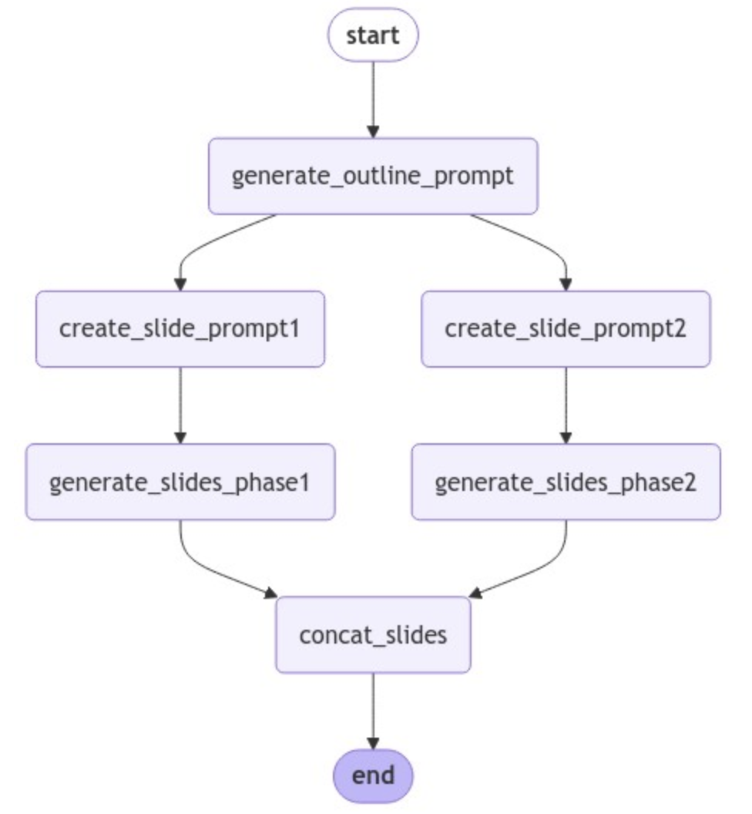
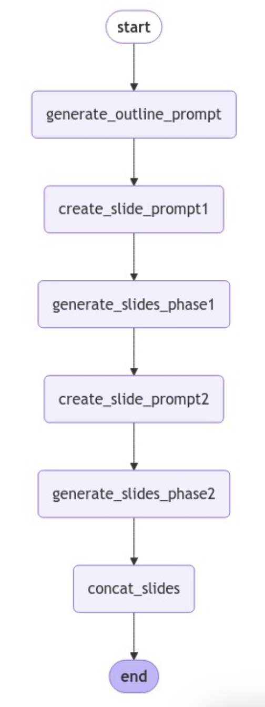
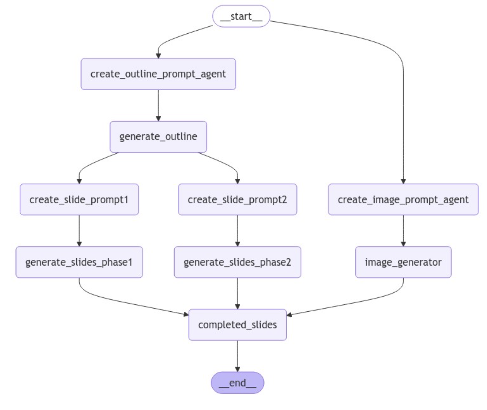

# AI-Powered 프레젠테이션 생성 with Prompt Chaining, LangGrpah

## 개요
이 저장소에는 Amazon Bedrock 런타임에서 Anthropic의 Claude 3 Haiku, Amazon의 Titan Image Generator v2 모델을 사용해 프레젠테이션의 내용과 대표 이미지를 자동으로 작성하는 Python 예제 코드가 포함되어 있습니다. 10장의 프레젠테이션의 내용을 만들 때, LLM의 최대 출력 토큰 한계를 해결하기 위해 Prompt Chaining 기법을 사용하여 두 번에 나누어(1-5장, 6-10장) 생성합니다.

## 주요 기능
- [Basic 버전](./01_basic_run_prompt.ipynb)에서는 Amazon Bedrock 런타임에서 Claude 3 Haiku 모델을 사용해 주어진 주제에 대한 프레젠테이션 내용을 생성합니다.
    - 10장의 프레젠테이션을 생성하기 위해 다음과 같은 단계를 거칩니다.
      1) 설정한 주제로 프레젠테이션의 개요를 생성하는 프롬프트 생성 
      2) 위에서 만든 프롬프트를 사용해 프레젠테이션 개요 생성
      3) 생성된 개요를 기반으로 프레젠테이션 내용 (1. 내용, 2. 추천 시각화 요소, 3. 발표자 노트)을 상세히 작성하는 프롬프트를 생성  생성하는 프롬프트 생성
      4) 위에서 만든 프롬프트를 사용해 프레젠테이션 내용 생성
      5) 위에서 만들어진 내용을 병합

    - 위 단계를 직렬로 실행한 결과와 3,4의 단계를 병렬로 동시에 실행한 결과를 비교합니다.
        - 테스트를 했을 때, 동일한 프레젠테이션 내용을 만들기 위해 걸린 시간을 계산했을 때 병렬로 실행했을 때 걸린 시간(44ms)이 직렬로 실행했을 때(57ms)보다 짧았습니다.
     

        |      병렬로 실행       |         직렬로 실행         |                                                                   
        | :-----------------------: | :--------------------------: |
        |  |  |
        | 44ms | 57ms |

- [Advanced 버전](./02_advanced_toolNode_run_prompt.ipynb)에서는 ToolNode를 활용하는 방법을 제공합니다.
    - 설정한 주제로 프레젠테이션을 대표하는 이미지도 Amazon의 Titan Image Generator v2 모델을 사용해 생성
    - 설정한 주제로 프레젠테이션의 개요를 생성하는 프롬프트와 대표 이미지를 생성하는 프롬프트를 LangChain의 tool로 정의하고, LangGraph에서는 이 tool들을 호출하기 위해 ToolNode를 사용

    

## 문제 상황
1. 복잡한 워크플로우: PPT 생성 과정에는 여러 단계(개요 생성, 슬라이드 내용 작성, 이미지 생성 등)가 포함되어 있어, 많은 function call이 필요합니다. 
2. 상태 관리의 어려움: 각 단계에서 생성된 데이터(개요 생성을 위한 프롬프트, 슬라이드 내용 작성을 위한 프롬프트, 생성된 개요 등)를 다음 단계로 전달하고 관리해야 합니다.
3. 오류 처리의 복잡성: 각 function call에서 발생할 수 있는 오류를 개별적으로 처리해야 하며, 이는 코드를 복잡하게 만들 수 있습니다.
4. 실행 순서 관리: 특정 작업(예:completed_slides)은 다른 작업들이 모두 완료된 후에만 실행되어야 하므로, 실행 순서를 명시적으로 관리해야 합니다.
5. 확장성 문제: 새로운 기능을 추가하거나 워크플로우를 수정할 때, 기존의 function call 구조를 크게 변경해야 할 수 있습니다.
6. 디버깅의 어려움: 많은 function call로 인해 오류가 발생했을 때 문제의 원인을 찾기 어려울 수 있습니다.

## 해결 방법
이러한 상황에서 LangGraph를 사용하면 워크플로우를 더 체계적으로 관리하고, 상태 전달을 간소화하며, 실행 순서를 명확하게 제어할 수 있어 위의 문제들을 효과적으로 해결할 수 있습니다. LangGraph는 Agentic LLM 애플리케이션의 핵심 요소를 구현하는데 이상적인 도구 중 하나입니다. LangGraph는 복잡한 워크플로우와 다중 단계 프로세스를 관리하는 데 유용하며, 다음과 같은 이점을 제공합니다.

- 상태 관리
- 워크 플로우 시각화
- 유연한 라우팅
- 재사용성
- 오류 처리
- 병렬 처리
- 인간-AI 상호 작용
- 확장성

따라서, function call이 많은 복잡한 시스템을 구축할 때 LangGraph를 사용하면 코드의 구조화, 관리, 디버깅, 그리고 최적화에 도움이 될 수 있습니다.

## 요구 사항
- Python 3.7 이상
- pydantic 2.7.0 이상
- AWS 계정 및 자격 증명
- AWS CLI 설치 및 구성

## 사용 방법
1. [00_setup.ipynb 실행](./00_setup.ipynb)
2. [01_basic_run_prompt.ipynb 실행](./01_basic_run_prompt.ipynb)
3. [02_advanced_toolNode_run_prompt.ipynb 실행](./02_advanced_toolNode_run_prompt.ipynb)
4. 02_advanced_toolNode_run_prompt.ipynb 에서 생성된 프레젠테이션 대표 이미지는 지정된 출력 디렉토리(img_output 폴더)에 저장됩니다.

## 추가 리소스
- [Anthropic Claude 설명서](https://docs.anthropic.com/claude/docs/intro-to-claude)
- [AWS Bedrock 런타임 설명서](https://docs.aws.amazon.com/ko_kr/bedrock/latest/userguide/service_code_examples_bedrock-runtime.html)
- [LangGraph 설명서](https://langchain-ai.github.io/langgraph/)
- [GenAI-driven Analytics using Amazon Bedrock](https://github.com/aws-samples/aws-ai-ml-workshop-kr/tree/master/genai/aws-gen-ai-kr/20_applications/09_genai_analytics)
- [LangGraph로 구현하는 Conversational Chatbot](https://github.com/kyopark2014/langgraph-agent)