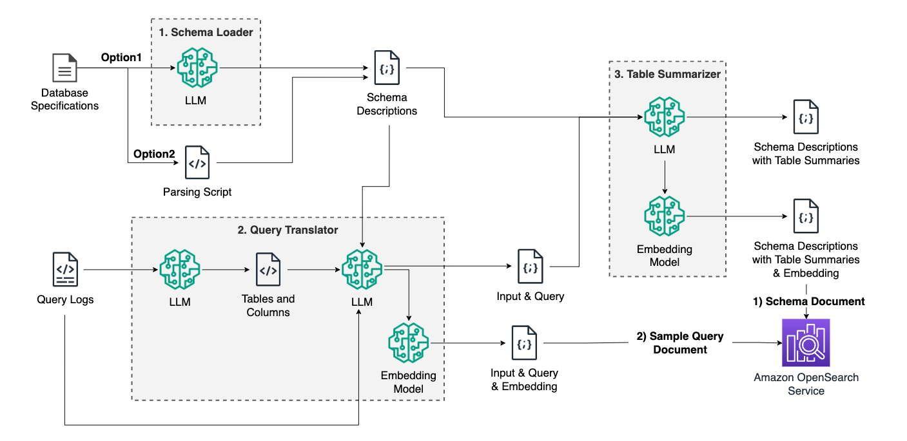
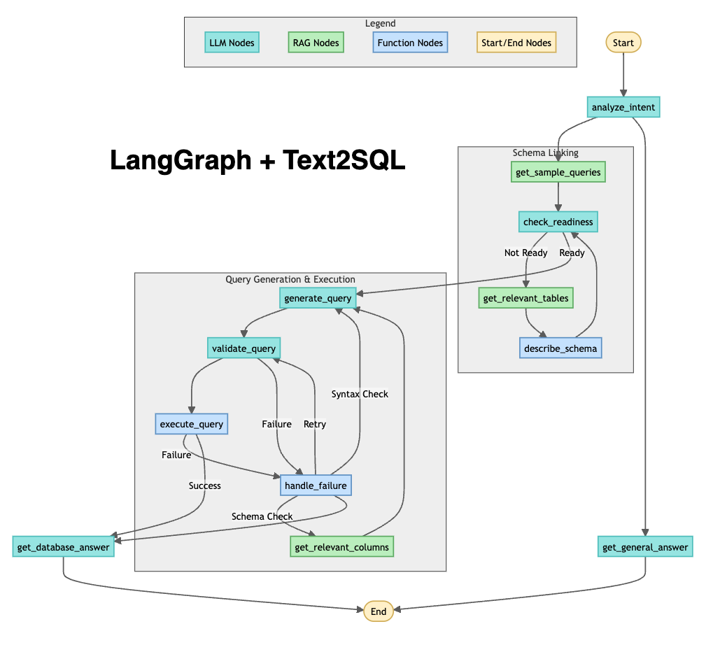

# Text-to-SQL Bedrock

This repository was based on the content from [here](https://github.com/kevmyung/text-to-sql-bedrock). This repository contains multiple labs focused on implementing Text-to-SQL using various tools and techniques. Below are the details for each lab included in this repository. 

## Lab 1: Text-to-SQL Schema Preparation

This lab involves preparing the schema documents for Text-to-SQL applications.

### Files
- `lab1_text2sql_schema_preparation/`
  - `1.sample_queries.ipynb`: Jupyter notebook for preparing the sample query documents.
  - `2.detailed_schema.ipynb`: Jupyter notebook for preparing the detailed schema documents.

## Lab 2: Workflow Composition using LangGraph

In this lab, you will build a cyclic workflow using LangGraph

### Files
- `lab2_text2sql_langgraph/`
  - `1.text2sql_langgraph.ipynb`: Jupyter notebook for developing the Text-to-SQL workflow using LangGraph.

## Setup Instructions

- `cloudformation/`: Directory containing CloudFormation templates for setting up resources.

