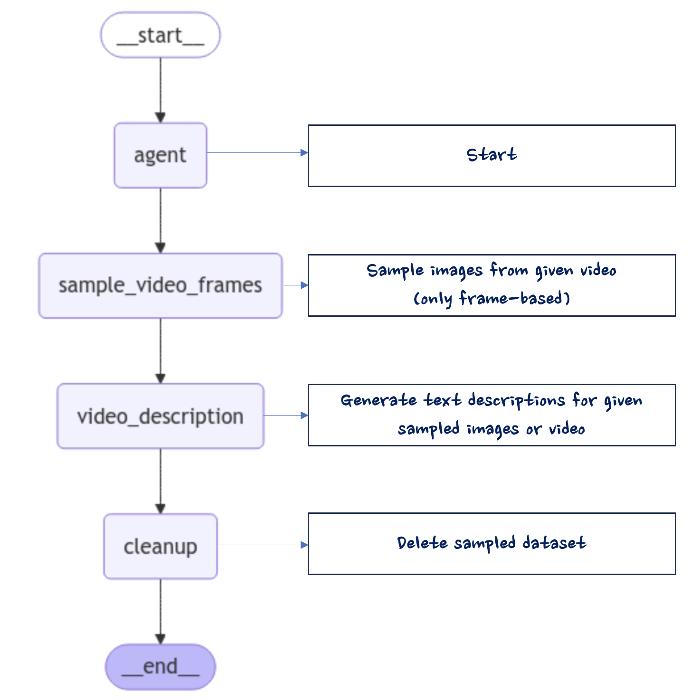
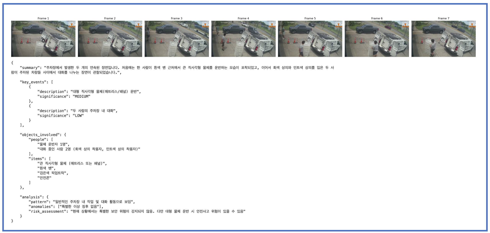

<h1 align="left"><b>Video Description Generator using Amazon Bedrock (Nova and Claude)</b></h1>

    
    
    

- - -

## 
**Workflow for Video Description**

- ####  [랭그래프(langgraph)](https://langchain-ai.github.io/langgraph/) 기반 workflow

- - -
## 
**Solution Strategies**

- ####  인풋 영상에 대한 자동 샘플링

- - -
## 
**Sample results**

- - -

## 
**Getting started**

- ####  [1. Git clone](https://github.com/aws-samples/aws-ai-ml-workshop-kr.git)
- ####  [2. Setup](./00_setup.ipynb)
- ####  3. Execution
  - #####  Using Nova Pro (sampled frame inputs), [Go to Here](./01_video_analysis_nova_frame_input.ipynb)
  - #####  Using Claude 3.5 Sonnet (sampled frame inputs), [Go to Here](./02_video_analysis_claude_frame.ipynb)
  - #####  Using Nova Pro(video inputs), [Go to Here](./03_video_analysis_nova_video.ipynb)
            
- - -

## 
**Citation**

-  If you find this repository useful, please consider giving a star ⭐ and citation
- - -

## 
**Contributors**

-  **Dongjin Jang, Ph.D.** (AWS AI/ML Specislist Solutions Architect) | [Mail](mailto:dongjinj@amazon.com) | [Linkedin](https://www.linkedin.com/in/dongjin-jang-kr/) | [Git](https://github.com/dongjin-ml) | [Hugging Face](https://huggingface.co/Dongjin-kr) |
- - -

## 
**License**

-  This is licensed under the [MIT License](https://github.com/aws-samples/aws-ai-ml-workshop-kr/blob/master/LICENSE). 