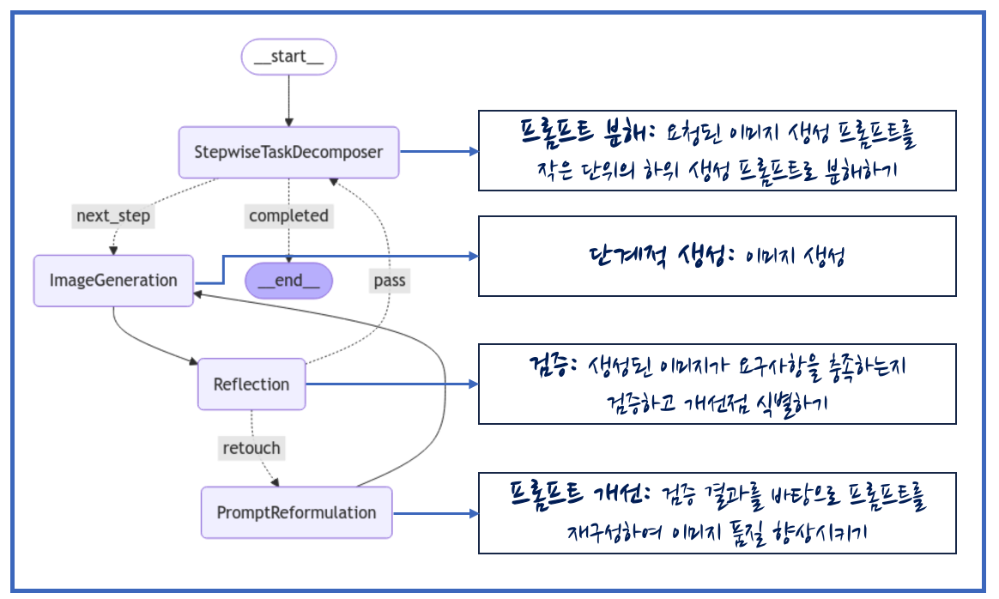
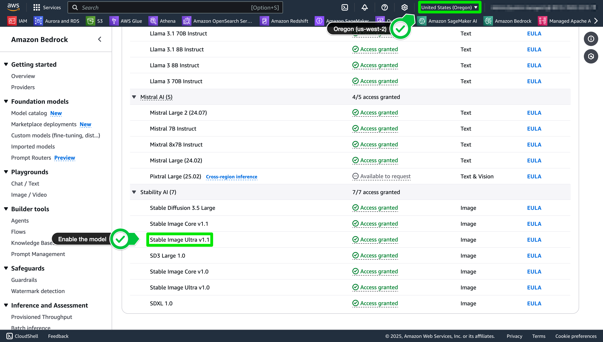
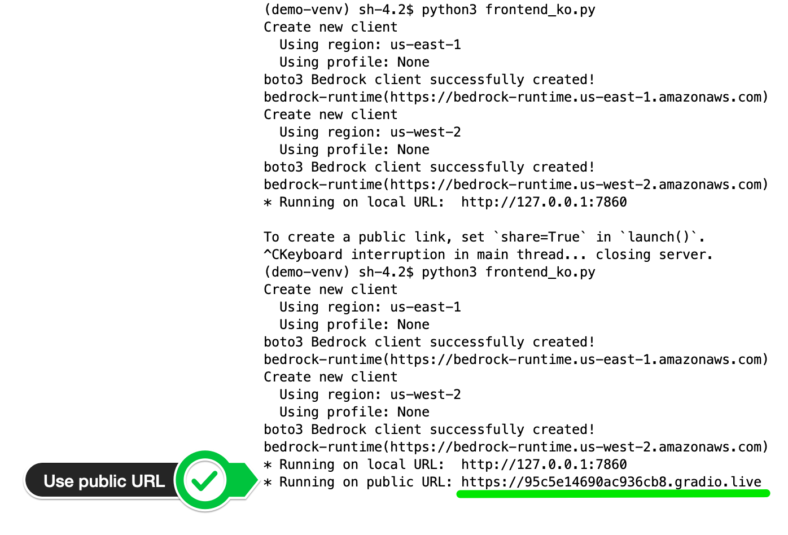

<h1 align="left"><b>Agentic Text-to-Image</b></h1>
<p align="center">
    <a href="https://github.com/aws-samples">
            
    </a>
    <a href="https://github.com/aws-samples/aws-ai-ml-workshop-kr/blob/master/LICENSE">
        
    </a>
</p>


- - -

## <div id="Main">**Workflow for Agentic Text-to-Image**</div>
- #### <span style="#FF69B4;"> [랭그래프(langgraph)](https://langchain-ai.github.io/langgraph/) 기반 workflow</span>


- - -
## <div id="Features">**Process**</div>
- #### <span style="#FF69B4;"> **복잡한 프롬프트 분해 (Decomposition)**</span>
    - ##### <span style="#FF69B4;"> 복잡한 이미지 생성 요청을 더 단순한 하위 태스크로 분해합니다.</span>
- #### <span style="#FF69B4;"> **단계적 이미지 생성 (Incremental Generation)** </span>
    - ##### <span style="#FF69B4;"> 분해된 각 하위 태스크에 따라 이미지를 점진적으로 생성합니다.</span>
- #### <span style="#FF69B4;"> **검증 및 반영 (Verification & Reflection)**</span>
    - ##### <span style="#FF69B4;"> 각 단계에서 생성된 이미지가 해당 단계의 요구사항을 충족하는지 검증합니다.</span>
- #### <span style="#FF69B4;"> **반복적 개선 (Recursive Improvement)**</span>
    - ##### <span style="#FF69B4;"> 검증 결과에 따라 필요시 프롬프트를 수정하고 이미지를 재생성하는 과정을 만족스러운 결과가 도출될 때까지 반복합니다.</span>
- #### <span style="#FF69B4;"> **도구 활용 (Tool Use)**</span>
    - ##### <span style="#FF69B4;"> 대규모 언어 모델(LLM)이 전체 이미지 생성 워크플로우를 관리하고 조율하는 중앙 에이전트 역할을 수행하며, 실제 이미지 렌더링은 전문화된 이미지 생성 모델을 도구로 활용합니다.</span>
- #### <span style="#FF69B4;"> **세부 커스터마이징 (Customization)**</span>
    - ##### <span style="#FF69B4;"> 이미지의 일부분만 선택적으로 수정할 수 있는 기능을 제공합니다. 이를 위해 인페인팅(inpainting)과 아웃페인팅(outpainting) 기술을 활용하여 전체 이미지를 다시 생성하지 않고도 특정 영역만 정교하게 수정할 수 있는 옵션을 제공합니다.</span>

- - -
## <div id="Demo">**Demo**</div>
- #### <span style="#FF69B4;"> [VOD - Demo](https://www.youtube.com/watch?v=tX0QxRTpC2o)</span>


## <div id="Started">**Getting started**</div>

**로컬 환경** 과 **Amazon SageMaker Studio 노트북 환경** 모두에서 실행할 수 있도록 구성되어 있습니다.

#### 실행 전 준비 사항
- **Amazon Bedrock 모델 접근 권한 필요**
      
  다음 리전에서 아래 모델들에 접근 가능해야 합니다:
  - **N.Virginia (us-east-1)**
    - [Amazon] Nova Canvas
    - [Anthropic] Claude 3.7 Sonnet
    <br>    
    

  - **Oregon (us-west-2)**
    - [Stability AI] Stable Image Ultra v1.1
    <br>    
    
            
- **로컬 환경에서 실행 시**
    - `aws configure` 커맨드를 사용하여 Bedrock 모델에 접근 가능한 IAM Role 또는 User의 자격 증명 (`AWS Access Key ID`, `AWS Secret Access Key`)을 설정해야 합니다.

- **Amazon SageMaker AI의 Notebook 환경에서 실행 시**
    - SageMaker AI의 Notebook이 사용하는 IAM Role에 Bedrock 모델 접근 권한이 부여되어 있어야 합니다.

#### 데모 실행 방법

1. GitHub 리포지토리 클론
2. 디렉토리 이동 및 가상환경 설정
    ```
    $ cd agentic-text2image/demo

    $ python3 -m venv demo-venv

    $ source demo-venv/bin/activate

    $ pip3 install -r requirements.txt
    ```
    
3. Gradio 앱 실행
    ```
    $ python3 frontend_ko.py
    ```
    
4. 데모 접속  
    Gradio 앱이 성공적으로 실행되면, 출력되는 URL을 통해 데모에 접속할 수 있습니다.
    - **로컬 환경에서 실행 시**  
        http://127.0.0.1:7860 (local URL) 접속 권장드립니다.

    - **Amazon SageMaker AI의 Notebook 환경에서 실행 시**  
        아래 이미지처럼 제공되는 public URL을 사용하세요.  

        

- - -

## <div id="Citation">**Citation**</div>
- <span style="#FF69B4;"> If you find this repository useful, please consider giving a star ⭐ and citation</span>
- - -

## <div id="Contributors">**Contributors**</div>
- <span style="#FF69B4;"> **Dongjin Jang, Ph.D.** (AWS AI/ML Specislist Solutions Architect) | [Mail](mailto:dongjinj@amazon.com) | [Linkedin](https://www.linkedin.com/in/dongjin-jang-kr/) | [Git](https://github.com/dongjin-ml) | [Hugging Face](https://huggingface.co/Dongjin-kr) |</span>
- <span style="#FF69B4;"> **Hasun Yu, Ph.D.** (AWS AI/ML Specislist Solutions Architect) | [Mail](mailto:hasunyu@amazon.com) | [Linkedin](https://www.linkedin.com/in/hasunyu/) |</span>
- <span style="#FF69B4;"> **Jiyu Kim** (AWS Analytics Specislist Solutions Architect) | [Mail](mailto:jiyukim@amazon.com) | [Linkedin](https://www.linkedin.com/in/jiyu-kim-0863a9212/) |</span>
- - -

## <div id="License">**License**</div>
- <span style="#FF69B4;"> This is licensed under the [MIT License](https://github.com/aws-samples/aws-ai-ml-workshop-kr/blob/master/LICENSE). </span>
