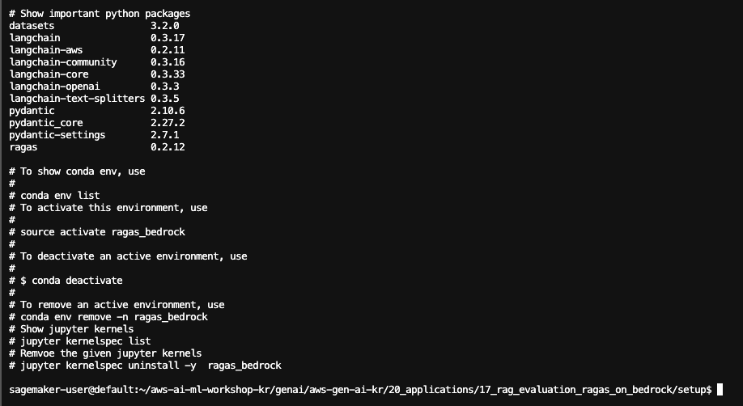
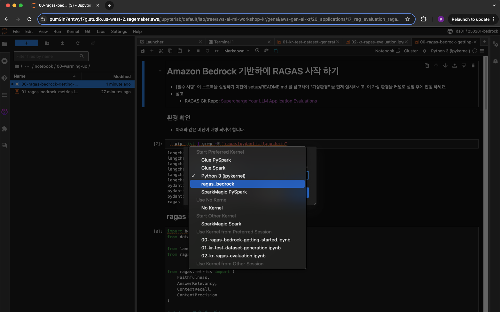

# 설치 가이드

## 1. 실습환경
- 이 노트북은 [SageMaker AI Studio Jupyterlab](https://docs.aws.amazon.com/ko_kr/sagemaker/latest/dg/studio-updated-jl.html) 에서 테스트 완료 되었습니다.
    - IAM role : SageMaker AI Studio 를 생성 및 생성 프로파일에는 아래와 같은 권한이 추가 되어 있어야 합니다.
        - 
    - 환경: ml.m5.xlarge 
    - Region : us-west-2
- Amazon Bedrock Model Access 가 필요 합니다.
    - Claude 3.5 Sonnet 
    - Claude 3.5 Haiku
    - Titan Embeddings G1 – Text
    - 참조: 이 블로그 [Amazon Bedrock Knowledge base로 30분 만에 멀티모달 RAG 챗봇 구축하기 실전 가이드](https://aws.amazon.com/ko/blogs/tech/practical-guide-for-bedrock-kb-multimodal-chatbot/) 에서 Model access 부분을 참조 히시면 됩니다. <br>    

## 2. 실습 환경 세팅
### 2.1. JupyerLab 을 열고 아래와 같이 터미널을 오픈 하세요.
- 
### 2.2. 아래와 같이 명령어를 넣고 Git 리포를 클로닝 합니다.
    ```
    pwd
    git clone https://github.com/aws-samples/aws-ai-ml-workshop-kr.git
    ```
- 
### 2.3. Conda Virtual Environment 생성 (약 1분 소요)
- 가상 환경을 구성 합니다.
- 터미널에서 아래 명령어를 실행하여 setup 폴더로 이동을 합니다. 
    ```
    cd /home/sagemaker-user/aws-ai-ml-workshop-kr/genai/aws-gen-ai-kr/20_applications/17_rag_evaluation_ragas_on_bedrock/setup
    ```
- shell 을 아래의 명령어를 넣어서 실행 합니다. 가상 환경 이름은 원하는 이름으로 하셔도 좋습니다. 여기서는 ragas_bedrock 으로 했습니다.
    ```
    ./create_conda_virtual_env.sh ragas_bedrock
    ```    
    -  아래 그림을 참조 하세요.
        - 

- 설치 확인을 합니다. 아래와 같은 화면이 나왔으면 성공입니다. 이렇게 나오지 않았으면 터미널에서 실행 내역에 "에러" 가 있는지 확인 하세요.
    - 

### 2.4. 00-ragas-bedrock-getting-started.ipynb 노트북 열고 커널 설정
- 왼쪽의 메뉴에서 aws-ai-ml-workshop-kr 를 더블 클릭해서 aws-ai-ml-workshop-kr/genai/aws-gen-ai-kr/20_applications/17_rag_evaluation_ragas_on_bedrock/notebook/00-warming-up/00-ragas-bedrock-getting-started.ipynb 을 더블 클릭합니다.
- 오른쪽 상단에 "Python 3 (ipykernel)" 를 클릭 합니다.
- Select Kernel 에서 리스트 박스를 클릭합니다.
- [00-ragas-bedrock-getting-started.ipynb](../notebook/00-warming-up/00-ragas-bedrock-getting-started.ipynb) 을 열고 위에서 만든 콘다 커널을 설정 합니다. 여기서는 rags_bedrock 커널을 클릭 합니다.
- 이후 모든 노트북에서는 위에서 만든 커널 (예: rags_bedrock) 을 사용합니다.
- 
- 셀을 한개씩 실행해서 모두 동작하는지 확인 합니다.


## 설치가 완료 되었습니다. 축하 드립니다. !
- [README 로 다시 이동하기](../README.md)


