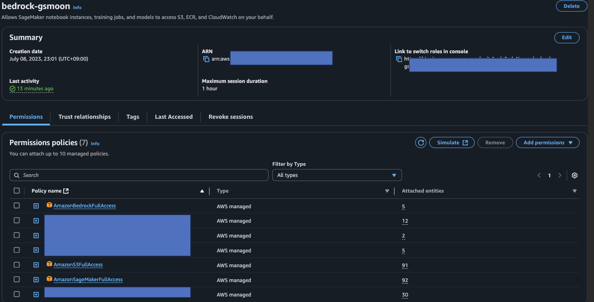

# 가상 환경 설치 가이드

## 1. 실습환경
- 이 노트북은 [SageMaker AI Studio Jupyterlab](https://docs.aws.amazon.com/ko_kr/sagemaker/latest/dg/studio-updated-jl.html) 에서 테스트 완료 되었습니다.
    - IAM role : SageMaker AI Studio 를 생성 및 생성 프로파일에는 아래와 같은 권한이 추가 되어 있어야 합니다.
        - 
    - 환경: ml.m5.xlarge 
    - Region : us-west-2
- Amazon Bedrock Model Access 가 필요 합니다.
    - Amazon Nova Pro
    - Amazon Nova lite
    - Amazon Nova micro
    - Claude 3.7 Sonnet 
    - Claude 3.5 Sonnet 
    - Claude 3.5 Haiku
    - Titan Embeddings G1 – Text
    

## 2. 실습 환경 세팅
### 2.1. JupyerLab 을 열고 아래와 같이 터미널을 오픈 하세요.
- 
### 2.2. 아래와 같이 명령어를 넣고 Git 리포를 클로닝 합니다.
```
pwd
git clone https://github.com/aws-samples/aws-ai-ml-workshop-kr.git
```
- 
### 2.3. Conda Virtual Environment 생성 (약 1분 소요)
- 가상 환경을 구성 합니다.
- 터미널에서 아래 명령어를 실행하여 setup 폴더로 이동을 합니다. 
    ```
    cd /home/sagemaker-user/aws-ai-ml-workshop-kr/genai/aws-gen-ai-kr/20_applications/19_agentic_rag/01_setup
    ```
- shell 을 아래의 명령어를 넣어서 실행 합니다. 가상 환경 이름은 원하는 이름으로 하셔도 좋습니다. 여기서는 ragas_bedrock 으로 했습니다.
    ```
    ./create_conda_virtual_env.sh agentic-rag
    ```    

- 설치 확인을 합니다. 에러가 발생했는지 확인 합니다.

## 설치가 완료 되었습니다. 축하 드립니다. !
- [README 로 다시 이동하기](../README.md)


