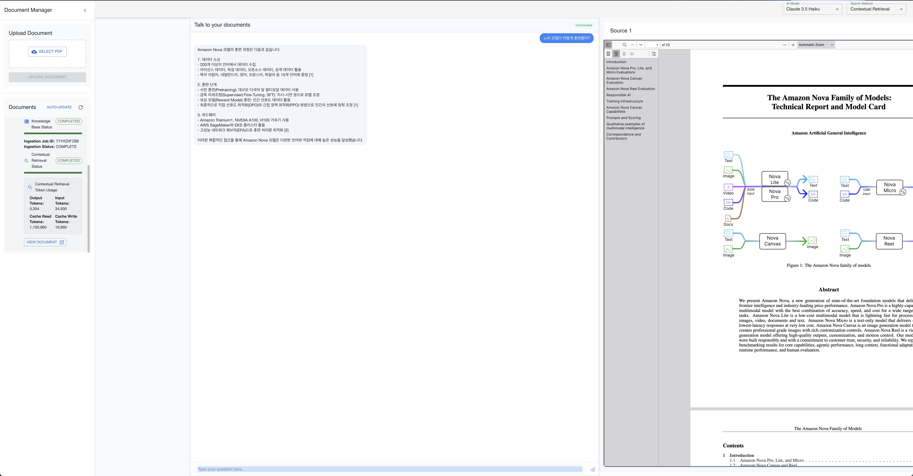

# Test out prompt caching with contextual retrieval and compare RAG search methods

A full-stack application that creates a chat interface for your PDF documents using AWS Bedrock, Amazon OpenSearch Serverless, and AWS CDK.
It displays the source PDF when providing answers.



## Features

- **Document Intelligence**: Automatically extracts, processes, and understands PDF documents
- **Compare Models**: Claude Haiku, Sonnet 3.5 v2, Sonnet 3.7, Amazon Nova Pro, and Lite
- **Compare Retrieval Methods**: Compare search methods using Bedrock Knowledge Bases and built-in contextual retrieval
- **Integrated Prompt Caching**: Prompt caching is used for contextual retrieval. You can see how many tokens you save during ingestion.
- **Document Viewer**: Integrated PDF viewer to reference source documents

## Architecture Overview

The application consists of two main stacks:

1. **Knowledge Base Stack** - Creates and manages:
   - OpenSearch Serverless Collection for vector search
   - AWS Bedrock Knowledge Base
   - PDF document storage and processing
   - Document CloudFront distribution

2. **Web Stack** - Builds and deploys:
   - WebSocket API for real-time communication
   - React web application
   - CloudFront distribution

## Prerequisites

- AWS Account with appropriate permissions
- AWS CLI configured with your credentials
- Node.js (version 14+) and npm installed
- Python 3.9+ installed
- AWS CDK installed (`npm install -g aws-cdk`)

## Setup Instructions

### Step 1: Clone the Repository and Install Dependencies

```bash
# Initialize Python virtual environment
python3 -m venv .venv
source .venv/bin/activate  # On Windows: .venv\Scripts\activate
pip install -r requirements.txt

# Install CDK dependencies
npm install -g aws-cdk
cdk --version  # Verify CDK installation
```

### Step 2: Build the React Web Application

The React application needs to be built before deployment:

```bash
# Navigate to the React app directory
cd document_chatbot_ui

# Install dependencies
npm install

# Build the application
npm run build

# Return to the project root
cd ..
```

### Step 3: Deploy the CDK Stacks

```bash
cdk deploy --all --require-approval never
```

Parallel processing uses SQS and multiple Lambda invocations to process documents in parallel, which is more efficient for larger document sets but adds complexity.

### Step 4: Monitor the Deployment

The deployment creates several resources and may take 10-15 minutes to complete. The CDK output will show you:

1. The CloudFront URL for your web application
2. The WebSocket URL for real-time communication
3. The Knowledge Base ID

You can monitor the document ingestion process in the AWS Bedrock console.

## Using the Application

1. Open the web application using the CloudFront URL provided in the CDK output.
2. Upload a PDF document and wait for ingestion.
3. Choose a model (e.g., Claude 3.5 Sonnet or Amazon Nova Pro) from the dropdown.
4. Select a search method:
   - Knowledge Base (OpenSearch): Uses AWS Bedrock Knowledge Bases
   - Contextual Retrieval: Uses direct search via OpenSearch, where each chunk is enhanced with context

5. Ask questions about your documents in the chat interface.
6. The application will display relevant document sources in the right panel.

## Clean Up

To avoid incurring charges, delete the stacks when you're done:

```bash
cdk destroy --all
```
