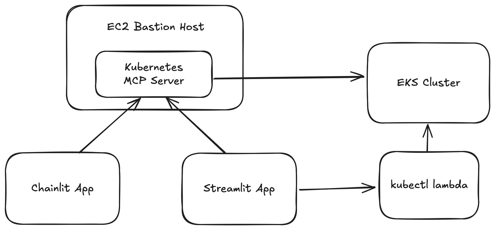
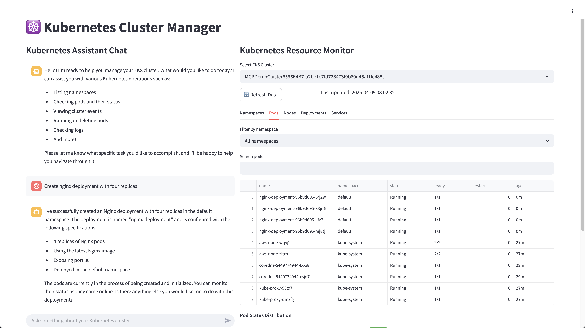

# EKS Natural Language Assistant

This project creates a natural language interface for managing Amazon EKS (Elastic Kubernetes Service) clusters. It allows users to interact with and manage their Kubernetes clusters using natural language commands powered by Amazon Bedrock and Claude.

## Overview



This application provides two different interfaces for interacting with your EKS cluster in natural language:

1. **Streamlit Interface**: A web dashboard with Kubernetes resource visualization capabilities and a chat interface
2. **Chainlit Interface**: A simpler chat-only interface for interacting with your cluster

Both interfaces connect to a Kubernetes MCP (Model Context Protocol) server running on a bastion host to execute kubectl commands and manage your EKS cluster.

## Features

- **Natural Language Interaction**: Use plain English to manage your Kubernetes cluster
- **Cluster Resource Visualization**: View pods, nodes, services, deployments, and namespaces
- **Intelligent Assistant**: Powered by Amazon Bedrock and Claude 3.5 Haiku
- **Secure Access**: Uses a bastion host for secure cluster access
- **CDK Deployment**: One-click infrastructure deployment with AWS CDK

## Architecture

The system architecture consists of:

1. **EKS Cluster**: Managed Kubernetes cluster running on AWS
2. **Bastion Host**: EC2 instance running the Kubernetes MCP server
3. **Amazon Bedrock**: Provides LLM capabilities through Claude 3.5 Haiku
4. **Web Interface**: Streamlit or Chainlit for user interaction
5. **Lambda Function**: For executing kubectl commands securely

## Prerequisites

- **AWS Account** with permissions to create EKS clusters, EC2 instances, IAM roles
- **AWS CLI** installed and configured with appropriate credentials
- **Python 3.11+** for running the application
- **AWS CDK** installed for deploying the infrastructure
- **Amazon Bedrock** access with foundation models enabled

## Installation

### 1. Install Dependencies

```bash
# Clone the repository
git clone https://github.com/cdanielsoh/mcp-on-eks-bastion.git
cd mcp-on-eks-bastion

python -m venv .venv
source .venv/bin/activate

# Install Amazon Bedrock Inline Agent SDK
git clone https://github.com/awslabs/amazon-bedrock-agent-samples.git
cd amazon-bedrock-agent-samples/src/InlineAgent
pip install -e .
cd ../../../

# Install Python dependencies
pip install -r requirements.txt

```

### 2. Deploy Infrastructure

```bash
# Deploy the AWS infrastructure using CDK
cdk deploy
```

After deployment, the CDK will output:
- EKS cluster name
- The bastion host URL
- SSH key retrieval command for the bastion host
- Environment variables for your application
- update-kubeconfig command

### 3. Configure Environment

Create a `.env` file with the DotEnvFileContent output from the CDK deployment:

```
BASTION_HOST=<bastion-public-dns>
MCP_PORT=8000
AWS_REGION=<your-aws-region>
EKS_CLUSTER=<eks-cluster-name>
LAMBDA_ARN=<kubectl-lambda-arn>
```

## Usage

### Streamlit Interface



```bash
streamlit run streamlit_app.py
```

### Chainlit Interface


```bash
chainlit run chainlit_app.py
```

## Example Commands

You can ask the assistant natural language questions like:

- "How many pods are running in my cluster?"
- "Show me all services in the default namespace"
- "Are there any failing deployments?"
- "Scale the nginx deployment to 3 replicas"
- "Create a new namespace called 'testing'"
- "Describe the pod named 'web-frontend'"

## Security Considerations

- The bastion host only allows connections from your IP address
- Proper IAM roles and policies restrict access to AWS resources
- The EKS cluster uses IAM authentication
- SSH keys are required to access the bastion host

## Credits

This project utilizes the [Kubernetes MCP Server](https://github.com/manusa/kubernetes-mcp-server) developed by Marc Nuri San Felix to provide MCP capabilities.
