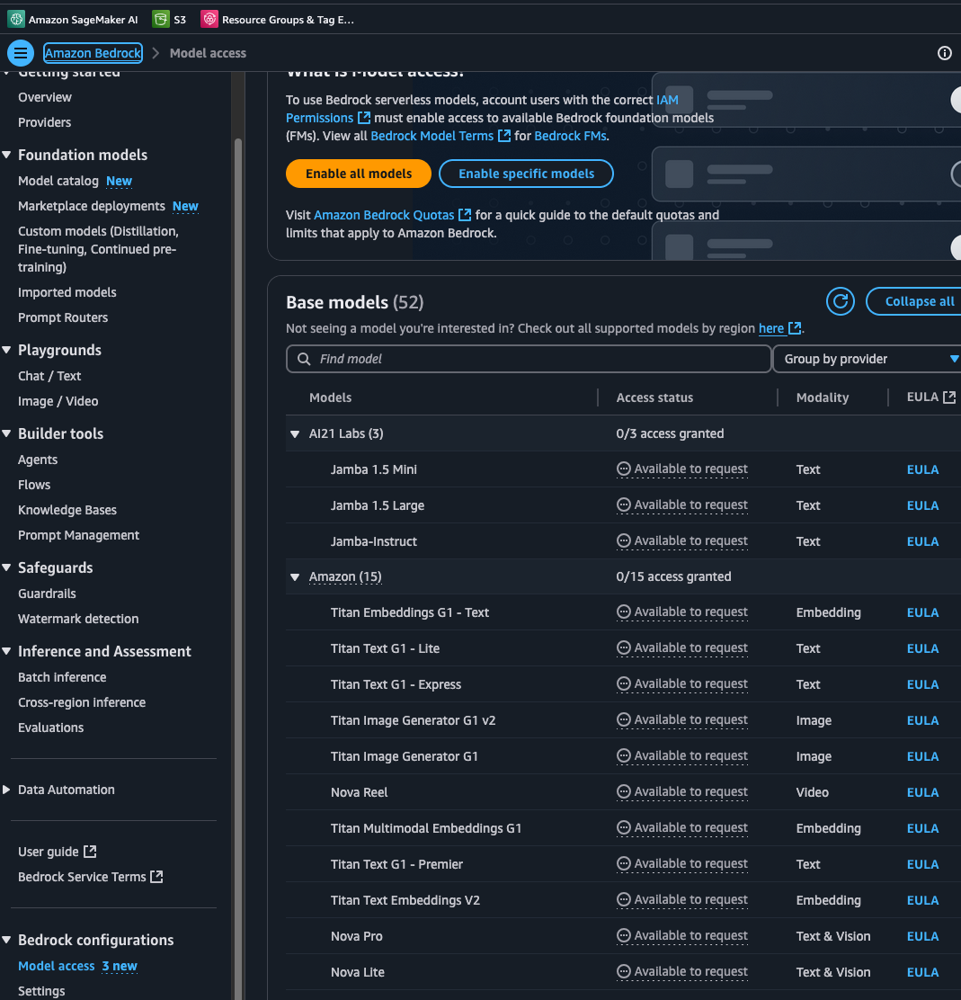
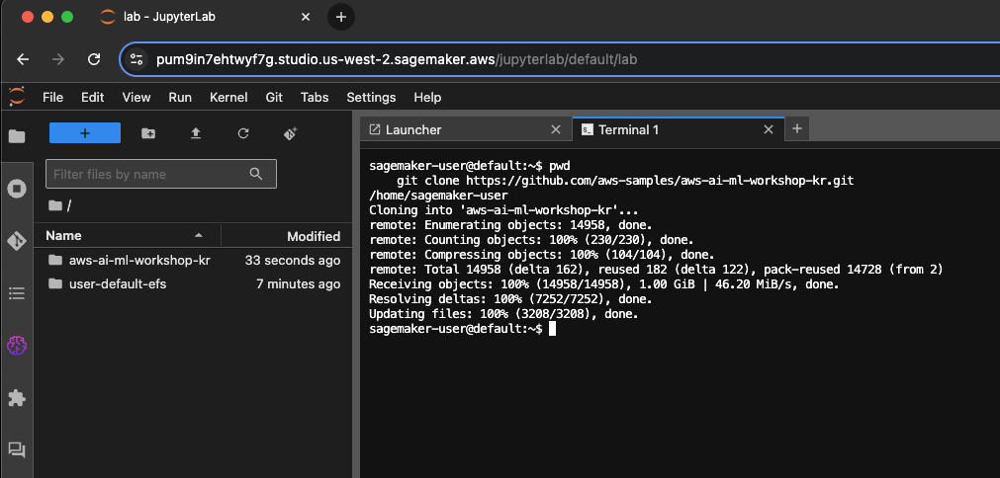
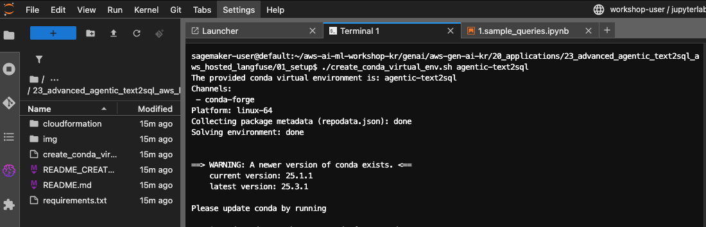
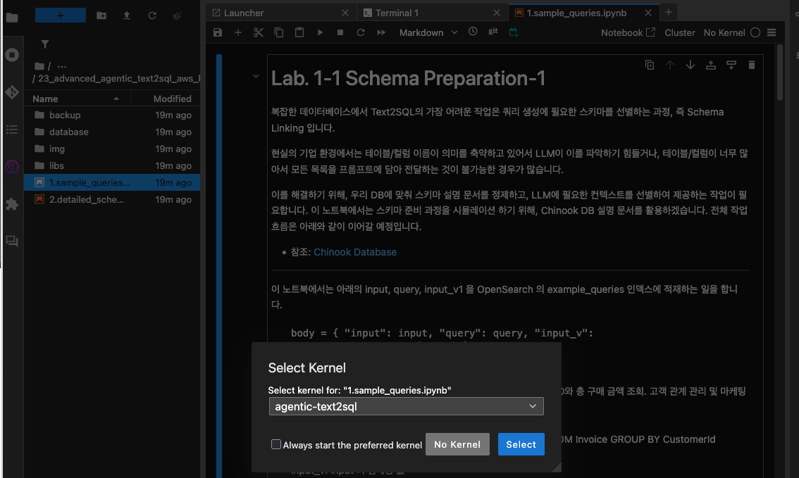

# 실습 환경 설치 가이드


## 1. Bedrock Model Access 얻기
- [Amazon Bedrock Model Access](https://docs.aws.amazon.com/bedrock/latest/userguide/model-access-modify.html) 가 필요 합니다.
    - Amazon Nova Pro
    - Amazon Nova lite
    - Amazon Nova micro
    - Claude 3.7 Sonnet 
    - Claude 3.5 Sonnet 
    - Claude 3.5 Haiku
    - Titan Embeddings G1 – Text
  아래 Bedrock Console 로 이동후에 오른쪽 상단의 "Enable all models" 버튼을 눌러서 진행하시면 됩니다.
    - 
    

## 2. 실습 환경 세팅
### 2.1. 기존에 열린 JupyerLab 에서 아래와 같이 터미널을 오픈 하세요.
- 
### 2.2. 아래와 같이 명령어를 넣고 Git 리포를 클로닝 합니다.
```
pwd
git clone https://github.com/aws-samples/aws-ai-ml-workshop-kr.git
```
- 
### 2.3. Conda Virtual Environment 생성 (약 1분 소요)
- 가상 환경을 구성 합니다.
- 터미널에서 아래 명령어를 실행하여 setup 폴더로 이동을 합니다. 
    ```
    cd aws-ai-ml-workshop-kr/genai/aws-gen-ai-kr/20_applications/23_advanced_agentic_text2sql_aws_hosted_langfuse/01_setup
    ```
- shell 을 아래의 명령어를 넣어서 실행 합니다. 가상 환경 이름은 원하는 이름으로 하셔도 좋습니다. 여기서는 agentic-text2sql 으로 했습니다.
    ```
    ./create_conda_virtual_env.sh agentic-text2sql
    ```
    - 아래와 같이 입력 하시고 엔터키 누르시면 됩니다.    
    -     
- 설치 확인을 합니다. 에러가 발생했는지 확인 합니다.

### 2.4. 커널 선택 및 Notebook 열기
아래의 경로의 노트북을 오픈하고, 커널을 agentic-text2sql 를 선택하시고 진행하시면 됩니다.
- aws-ai-ml-workshop-kr/genai/aws-gen-ai-kr/20_applications/23_advanced_agentic_text2sql_aws_hosted_langfuse/02_lab1_text2sql_schema_preparation/1.sample_queries.ipynb
- 

## 설치가 완료 되었습니다. 축하 드립니다. !
- [README 로 다시 이동하기](../README.md)


